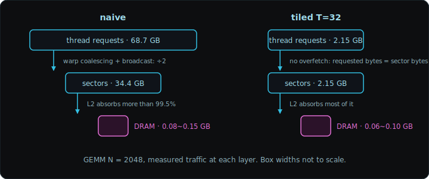
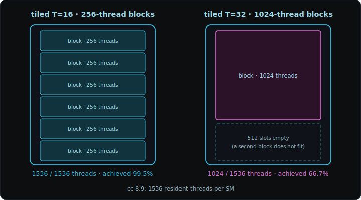
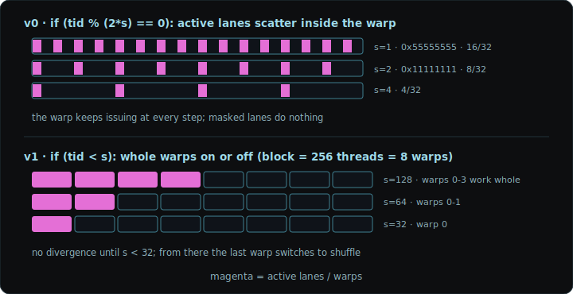

This post implements and measures three kernels that use shared memory: tiled GEMM, transpose, and reduction. Unlike a cache, shared memory leaves loading and replacement to the kernel. Each section checks what that buys (control over reuse) and what it newly breaks (barrier rules, bank conflicts, lower occupancy) with code and Nsight Compute counters. The roofline and occupancy formulas come straight from the [CUDA C post](../cuda-c-basics/). Full sources and reproduction commands are at the end.

## Measurement Setup

| Item | Value |
| --- | --- |
| GPU | RTX 4060 Ti 8GB (AD106, cc 8.9, 34 SMs) |
| L2 cache | 32MB |
| DRAM | GDDR6, 288 GB/s theoretical |
| FP32 peak | ~22 TFLOP/s (at the nominal 2.54GHz boost) |
| Toolchain | CUDA 13.0, `nvcc -O3 -arch=sm_89`, host MSVC 19.42 |
| Profiler | Nsight Compute 2025.3.1 |

Times come from `cudaEvent`, medians over repeated runs after warm-up (10 then 50 for reduction and transpose, 5 then 30 for GEMM), and cover the kernel section only. Validation: reduction against a CPU double reference sum, GEMM by recomputing 64 random elements, transpose by comparing 1000 random elements; the benchmarks exit non-zero on failure. Kernels run slower under ncu instrumentation, so every time in the tables is an uninstrumented median and ncu only supplies counters.

GB/s in the tables is effective bandwidth, logical bytes read and written divided by time, compared against the 288 GB/s theoretical peak. What DRAM actually moved is measured separately with `dram__bytes`. Absolute numbers drift a few percent with session clock state, so the conclusions rest on ratios between variants.

This card's ridge point is 22 TFLOP/s ÷ 288 GB/s ≈ 77 FLOP/B, far to the right of the A100's 9.75. Consumer cards are weak on bandwidth relative to FLOPs, so the same kernel starts deeper in memory-bound territory.

## Coalescing

On cc 6.0 and later, one warp access becomes as many transactions as the number of 32-byte sectors the active lanes touch. A full warp reading 32 consecutive, aligned `float`s spans 128 bytes, so 4 sectors cover it. Shift the start address by a single `float` and the range crosses one more sector boundary, making it 5; space the lanes 32 bytes or more apart and every lane lands in its own sector, up to 32.


The 4 is not a universal passing grade. It comes from the specific condition of 32 active lanes each reading one `float`. Change the lane count or the data width and the minimum sector count changes with it; the criterion is always the number of distinct 32-byte sectors actually touched. A pointer returned by `cudaMalloc` is aligned well enough, but a subview made by adding an offset to it may not be. Neighboring warps can also reuse a previous warp's leftover sectors through the cache, so sectors/request going from 4 to 5 does not make the kernel exactly 25% slower. The sectors/request value reads as ncu's `l1tex__t_sectors...sum ÷ l1tex__t_requests...sum`. In the transpose below it comes out as 32 and 4.

## Tiled GEMM

In C = A×B (N×N), one element of C needs a row of A and a column of B. The naive kernel gives each thread one C element and reads every value from global memory on demand.

```cpp
__global__ void matmul_naive(const float* A, const float* B, float* C, int N) {
    int row = blockIdx.y * blockDim.y + threadIdx.y;
    int col = blockIdx.x * blockDim.x + threadIdx.x;
    float acc = 0.0f;
    for (int k = 0; k < N; k++)
        acc += A[row * N + k] * B[k * N + col];
    C[row * N + col] = acc;
}
```

One trip through the inner loop has a thread requesting 8 bytes for 2 FLOPs. On that basis the arithmetic intensity is 0.25 FLOP/B, and ignoring caches the kernel issues 2N³ global read requests. Requests do not become transactions as-is. Within a warp, identical addresses collapse into a broadcast and consecutive addresses coalesce into sectors, and only some of those sectors get past L2 to DRAM. The tables below count these three layers (requests, sectors, DRAM) separately.

The same row of A is reused by all N computations in the same row of C. Naive leaves that reuse to the caches; tiling manages it explicitly in shared memory. The threads of a block cooperatively copy T×T tiles of A and B, accumulate every partial product the tiles can produce, and move on to the next tile.


```cpp
#define T 32

__global__ void matmul_tiled(const float* A, const float* B, float* C, int N) {
    __shared__ float As[T][T];
    __shared__ float Bs[T][T];

    int row = blockIdx.y * T + threadIdx.y;
    int col = blockIdx.x * T + threadIdx.x;
    float acc = 0.0f;

    for (int t = 0; t < N / T; t++) {
        As[threadIdx.y][threadIdx.x] = A[row * N + (t * T + threadIdx.x)];
        Bs[threadIdx.y][threadIdx.x] = B[(t * T + threadIdx.y) * N + col];
        __syncthreads();

        for (int k = 0; k < T; k++)
            acc += As[threadIdx.y][k] * Bs[k][threadIdx.x];
        __syncthreads();
    }
    C[row * N + col] = acc;
}
```

The first `__syncthreads()` keeps threads from reading a half-filled tile; the second keeps the next iteration from overwriting a tile still in use. Barriers come with a rule: if only part of a block reaches `__syncthreads()` because the rest took an early return, the execution is undefined. The code above assumes N is a multiple of T so every thread follows the same path. Code that takes arbitrary sizes keeps out-of-range threads in the loop and the barriers, fills their loads with zeros, and applies the bounds check only to the final C store. `__syncwarp` covers a single warp and cannot replace the block barrier here where multiple warps fill the tile.

Counting traffic at the request level, each tile element is reused in T partial products, so global read requests drop from 2N³ to 2N³/T. One block copies tile pairs N/T times, reading 8NT bytes, while its T² threads do 2N FLOPs each, so

$$
I_{\text{tiled}} = \frac{2NT^2}{8NT} = \frac{T}{4}\ \text{FLOP/B}
$$

At T = 32 that is 8 FLOP/B. Tile loads are fully coalesced, so requested bytes equal sector bytes with no overfetch, and under the worst-case assumption that every sector reaches DRAM the ceiling is 8 × 288 GB/s ≈ 2.3 TFLOP/s.

Measured at N = 2048 and 4096:

| N | Kernel | median | GFLOP/s | DRAM traffic (ncu) |
| --- | --- | --- | --- | --- |
| 2048 | naive | 11.556 ms | 1487 | 75~145 MB (unstable) |
| 2048 | tiled T=16 | 8.897 ms | 1931 | 70~150 MB (unstable) |
| 2048 | tiled T=32 | 9.044 ms | 1900 | 60~100 MB (unstable) |
| 4096 | naive | 119.921 ms | 1146 | 17.95 GB |
| 4096 | tiled T=16 | 85.891 ms | 1600 | 17.9 GB |
| 4096 | tiled T=32 | 82.993 ms | 1656 | 9.42 GB |

| Kernel (N=2048) | global load sectors | sector traffic | vs naive |
| --- | --- | --- | --- |
| naive | 1,073,741,824 | 34.4 GB | 1x |
| tiled T=16 | 134,217,728 | 4.29 GB | 8x |
| tiled T=32 | 67,108,864 | 2.15 GB | 16x |



The sector cut is 8x and 16x, half of the request-level calculation (32x at T=32). The block is `dim3(16,16)`, so a warp spans two rows, and B's address does not involve the row: the two half-warps read the same 16 addresses, and A's one address per row reaches the half-warp as a broadcast. Naive already saves 2x inside the warp. In sector terms naive's intensity is 0.5 FLOP/B over 34.4GB, and the 32x from 2N³/T is a request-level upper bound.

`dram__bytes` at N = 2048 swings from run to run, so the table shows ranges. The two input matrices total 32MB, sitting exactly at the 32MB L2, and C's writes plus profiler replay shift the cache state. In every run, less than 0.5% of the 34.4GB of sectors reached DRAM. At this size the cache hierarchy absorbs nearly all of naive's repeated reads, and tiling's time gain stays at 1.3x. Comparisons across kernels use the reproducible sector counts and times, not the wandering DRAM megabytes.

Past the L2, at N = 4096 (64MB per matrix), naive's DRAM jumps to 17.95GB, 1.9x the 9.42GB of tiled T=32. Tiled T=16's DRAM is 17.9GB, almost the same as naive's, yet it runs 1.4x faster. T=16 has twice the sector traffic of T=32, so twice as much leaks to DRAM, and that value happens to coincide with naive's. The reason it still beats naive is in the sector layer: naive's sector traffic is 8x that of tiled T=16. Same DRAM bytes, different traffic between L1 and L2, and that difference shows up as time.

Tiled's absolute performance is low. At N = 4096, tiled T=32 moves 9.42GB of DRAM for 2N³ FLOPs, a measured DRAM intensity of 14.6 FLOP/B with a 4.2 TFLOP/s roofline, but it reaches 1.66 TFLOP/s. Its DRAM throughput is 113 GB/s, 39% of peak. The bottleneck is not DRAM but inside the SM. Each thread produces one output and reads shared memory twice per FMA, which is the likely cause; a stall-level breakdown is out of scope here. The next step is register tiling, one thread accumulating several C elements in registers, and Boehm's worklog covers that path from naive to warptiling.

## Bank Conflict

Shared memory is split into 32 banks, with consecutive 4-byte words assigned round-robin to banks 0, 1, ..., 31, 0, 1, .... If the 32 lanes of a warp hit 32 different banks in a cycle, everything proceeds at once; different addresses in the same bank serialize. n overlapping lanes make an n-way conflict. Multiple lanes reading the same address is the exception, served as a broadcast. Writing to the same address at the same time is not a merged operation, and which lane's value survives is not defined.

The classic conflict site is column access into a 2D tile, and shared-memory transpose is the example.

```cpp
__shared__ float tile[32][32];

tile[threadIdx.y][threadIdx.x] = in[...];   // row-wise write: banks spread
__syncthreads();
out[...] = tile[threadIdx.x][threadIdx.y];  // column-wise read: 32-way conflict
```

In the column read, the lanes read `tile[0][c], tile[1][c], ...`, 32 words apart, all landing in bank c. There are two fixes.

Padding. With rows of 33, the column-direction bank becomes (r + c) mod 32, shifting by one per row.

```cpp
__shared__ float tile[32][33];
```

Generalized: reading at stride S, the conflict degree is gcd(S, 32). Stride 32 is 32-way, 33 is conflict-free, 2 and 4 give 2-way and 4-way. Padding forces the gcd of stride and bank count to 1 (for single `float` loads; 64-bit and vector accesses span several banks per lane). The cost is 4 wasted bytes per row.

Swizzle. XORing the column index with the row number at the store position gets the same effect without spending any memory.

```cpp
__shared__ float tile[32][32];

tile[threadIdx.y][threadIdx.x ^ threadIdx.y] = in[...];   // write: banks spread
__syncthreads();
out[...] = tile[threadIdx.x][threadIdx.y ^ threadIdx.x];  // read spreads too
```

With the columns permuted by XOR inside each row, both row-direction and column-direction accesses land on each of the 32 banks exactly once. The cost is the extra index computation and a power-of-two tile width. This is the technique CUTLASS generalizes at the layout level.


Changing the layout itself is also an option. Flipping the lane-to-row/column mapping can make the shared accesses consecutive, but in this transpose the global accesses turn strided the moment you do: the conflict on one side becomes uncoalesced access on the other, which is not a fix. If the exchange stays within one warp and each lane holds a few scalars, `__shfl_sync()` can pass register values between lanes directly and drop shared memory entirely, but shuffle cannot move values across warps and cannot hold a 32×32 tile, so it does not replace this block-wide cooperative transpose.

Four versions measured with a 4096×4096 float transpose. Naive skips shared memory: coalesced reads, strided writes. The rest go through a 32×32 tile to make both sides coalesced and differ only in conflict handling.

| Kernel | median | effective GB/s | store sectors/request | shared load conflicts |
| --- | --- | --- | --- | --- |
| naive (strided write) | 1.039 ms | 129.2 | 32.0 | 0 |
| tile[32][32] | 0.605 ms | 221.8 | 4.0 | 16,278,462 |
| tile[32][33] padded | 0.550 ms | 244.2 | 4.0 | 33,035 |
| tile[32][32] swizzled | 0.549 ms | 244.5 | 4.0 | 33,208 |

Naive's stores are worst-case at 32 sectors per request; through the tile they drop to 4 and the time improves 1.72x. The remaining gap is the bank conflict. The problem issues 524,288 shared load requests and tile[32][32] logs 16,278,462 conflicts, about 31 per request, so nearly every load splits 32 ways. Padding brings that to 33,035 and swizzling to 33,208. That is a 99.8% reduction, and the residue is small at about 0.063 per request, but this counter alone does not identify its cause. The two fixes are equal in both time and counters; they differ in cost, four bytes per row for padding versus one XOR and a power-of-two constraint for swizzling.

Why naive is only 1.72x slower while using 8x the sectors comes down to the layers. The DRAM traffic of the four versions is 122MB, 119MB, 123MB, and 124MB, essentially identical and close to the 128MB that logically has to move (64 read + 64 write). The sectors naive wastes get absorbed by L2 before they reach DRAM, and the cost shows up as transaction count and latency between L1 and L2, not as DRAM bandwidth. It is the same picture as GEMM's T=16 matching naive's DRAM while beating it. Removing the conflict buys 10% in time but sixteen million against thirty thousand in counters; the effective bandwidth was already near peak (244 GB/s, 85%), which is why the time difference looks small.

The GEMM tiled kernel above does not have this problem: `Bs[k][threadIdx.x]` spreads across banks row-wise and `As[threadIdx.y][k]` is a broadcast.

## Occupancy and Block Size

At N=2048, T=16 and T=32 perform similarly but have different SM residency constraints.

| Kernel (N=2048) | achieved occupancy | shared/block | registers/thread |
| --- | --- | --- | --- |
| tiled T=16 (256 threads) | 99.5% | 2.05 KB | 36 |
| tiled T=32 (1024 threads) | 66.7% | 8.19 KB | 36 |



T=32 runs 1024-thread blocks, and with cc 8.9's limit of 1536 resident threads per SM, only one block fits. 1024/1536 = 66.7%, matching the measurement. This is the thread-limit term of the occupancy formula in the [CUDA C post](../cuda-c-basics/) hitting bottom. Here it is the thread limit, but depending on the kernel the register or shared memory term bottoms out first, and forcing registers down can introduce spills. A bigger tile buys more reuse but a bigger block buys less resident parallelism. This is another reason the road to more reuse goes through more work per thread (register tiling) rather than bigger blocks.

| Kernel (N=2048) | achieved occupancy | eligible warps/cycle | issue active |
| --- | --- | --- | --- |
| tiled T=16 | 99.45% | 1.26 | 25.38% |
| tiled T=32 | 66.65% | 0.98 | 21.53% |

Occupancy dropped 33 points; the performance difference is much smaller. T=32 has half the sectors, which buys back part of the lost parallelism. Occupancy is an upper bound on how many warps the scheduler can choose from, not a share of runtime, and there is no universal target. The reduction v2 below has the lowest occupancy of its group at 76% and is the fastest. The tuning order is to look at eligible warps and issue slots first, and only then find what limits resident warps.

## Warp Divergence

A warp issues 32 lanes as one group. Let \(\ell \in \{0,\ldots,31\}\) be the lane index and \(p_\ell\) a branch predicate. The true and false lane sets are

$$
A = \{\ell \mid p_\ell = 1\}, \qquad
B = \{\ell \mid p_\ell = 0\}.
$$

Because \(B\) is the complement of \(A\) within the warp, the divergence condition is

$$
0 < |A| < 32
\quad\Longleftrightarrow\quad
A \neq \varnothing \ \land\ B \neq \varnothing.
$$

At the source level, this is a warp-nonuniform branch. If the branch remains in the machine code, the warp runs path A under A's active mask and path B under B's active mask.

```cpp
int lane = threadIdx.x & 31;

if (lane < 16)
    A();
else
    B();
```

In every warp, lanes 0--15 choose A and lanes 16--31 choose B. The active mask is `0x0000ffff` on A and `0xffff0000` on B.

Suppose paths A and B compile to \(n_A\) and \(n_B\) warp instructions, excluding branch and reconvergence instructions. A warp selecting one path issues \(n_A\) instructions in this region, while a warp selecting both paths issues

$$
I_{\text{diverged}} = n_A + n_B.
$$

This follows directly from the active masks. Since A is nonempty, each of its \(n_A\) instructions issues once; since B is nonempty, each of its \(n_B\) instructions also issues once. The lane count does not multiply the number of warp instructions. A 16:16 split and a 31:1 split therefore issue the same number of warp instructions when \(n_A\) and \(n_B\) are unchanged.

Let \(\eta\) be the fraction of issued lane slots that are active:

$$
\eta =
\frac{|A|n_A + |B|n_B}
     {32(n_A+n_B)}.
$$

For equal path lengths, \(n_A=n_B=n\), this becomes

$$
\eta =
\frac{(|A|+|B|)n}{64n}
= \frac{32n}{64n}
= \frac{1}{2}.
$$

The average lane utilization over this region is therefore 50% for either a 16:16 or a 31:1 split when the two paths have equal length.

Align the condition to warp boundaries and different warps may run different code without divergence.

```cpp
int warp = threadIdx.x >> 5;

if ((warp & 1) == 0)
    A();
else
    B();
```

Every lane in an even warp chooses A; every lane in an odd warp chooses B. The condition is uniform within each warp.

Let \(T_A\) and \(T_B\) denote the time during which each path's warp instruction sequence is issued. Ignoring latency hiding by other warps and memory overlap between paths, the two paths execute serially under different active masks, giving

$$
T_{\text{diverged}}
\approx T_{\text{branch}} + T_A + T_B + T_{\text{reconverge}}.
$$

For a warp in which every lane selects A,

$$
T_{\text{uniform}}
\approx T_{\text{branch}} + T_A.
$$

Relative to the same A path, the added time is

$$
\Delta T
= T_{\text{diverged}} - T_{\text{uniform}}
\approx T_B + T_{\text{reconverge}}.
$$

If an actual branch remains and both A and B are selected, the warp issues instructions from both paths. While one path runs, lanes belonging to the other path are absent from the active mask. The added cost is an increase in the warp's dynamic instruction count, not a fixed divergence penalty measured in cycles. Elapsed time depends on the instruction mix and dependencies on each path, memory stalls, and how much latency other warps hide.

A split source-level `if` does not guarantee an actual divergent branch either. The compiler may replace a short body with predicated instructions.

```cpp
float y = x;
if (lane < 16)
    y = 2.0f * x;
```

Its schematic SASS form is shown below. Exact opcodes and registers depend on the architecture and compiler version.

```text
ISETP.LT ... P0, lane, 16
@P0 FMUL  y, x, 2.0
```

The warp does not split into two program counters here. `FMUL` issues once and only lanes with a true predicate write a result. There is no control-flow divergence, but lanes with a false predicate do no useful work on that instruction. Divergent branches and predication can both reduce active-lane utilization, but they are not the same event.

For this `FMUL`, \(|A|=16\) and the predicated lane utilization is

$$
\eta_{\text{predicated}} = \frac{|A|}{32} = \frac{16}{32} = \frac{1}{2}.
$$

Determine which one occurred from generated SASS and instruction-level counters, not from the number of `if` statements in the source. Check whether lane-dependent branch targets remain in SASS, then inspect `Divergent Branches` (`smsp__branch_targets_threads_divergent`) and `Avg. Predicated-On Threads Executed` on the Nsight Compute Source page. A kernel-wide average can bury a short divergent region under the rest of the full-warp execution.

## Reduction

Reduction collapses N array elements into one value. Sums, maxima, means; it recurs inside ML kernels as softmax's max and denominator sum, or layernorm's mean and variance.

Folded as a tree, half the threads combine two values at each step and the critical path is log₂N deep. The total additions stay N-1. Parallelization cuts depth, not work. In exchange, every step needs a guarantee that the previous writes finished, and how far that synchronization cost can be pushed down is the difference between the four versions below.


The common structure is multi-pass. Each block builds a partial sum in shared memory, then the same kernel runs again over the partial sums. With 2²⁴ inputs (64MiB) and 256-thread blocks that is 65,536 → 256 → 1, three passes. The later two passes read 0.4% of the input, so effective bandwidth is computed against the original 64MiB.

Version 0, the tree transcribed directly.

```cpp
for (int s = 1; s < blockDim.x; s *= 2) {
    if (tid % (2 * s) == 0)
        buf[tid] += buf[tid + s];
    __syncthreads();
}
```

Two things make it slow. First, the active lanes are scattered. The condition produces `0x55555555` at s=1 and `0x11111111` at s=2; the working lanes shrink to 16, 8, 4, ... while the corresponding warp instructions still issue. If the compiler predicates this short body, there is no actual branch divergence, but the low lane utilization remains. Second, the `%` operation. The divisor `2 * s` changes every loop, so the compiler cannot fold it into a constant bit mask, and the sm_89 SASS keeps the full remainder sequence `IABS → I2F → MUFU.RCP → F2I → IMAD.HI` (checked with `cuobjdump --dump-sass`). Version 1's SASS has none of it.

Version 1, sequential addressing.

```cpp
for (int s = blockDim.x / 2; s > 0; s >>= 1) {
    if (tid < s)
        buf[tid] += buf[tid + s];
    __syncthreads();
}
```

Both versions reduce 256 elements in eight stages. At stage \(j \in \{0,\ldots,7\}\), the number of threads performing additions is

$$
a_j = \frac{256}{2^{j+1}},
$$

and the total number of additions is

$$
\sum_{j=0}^{7} a_j
= 128 + 64 + \cdots + 1
= 255.
$$

The arithmetic work is identical. The difference is how many warps contain those \(a_j\) active threads.

In v0, active threads are scattered across the block. The number of warps containing at least one true predicate is

$$
W_j^{(0)} = \min(8, a_j),
$$

so

$$
\left(W_j^{(0)}\right)_{j=0}^{7}
= (8,8,8,8,8,4,2,1),
\qquad
\sum_{j=0}^{7} W_j^{(0)} = 47.
$$

In v1, active threads are packed contiguously at the front of the block:

$$
W_j^{(1)} = \left\lceil \frac{a_j}{32} \right\rceil,
$$

and therefore

$$
\left(W_j^{(1)}\right)_{j=0}^{7}
= (4,2,1,1,1,1,1,1),
\qquad
\sum_{j=0}^{7} W_j^{(1)} = 12.
$$

If an actual branch remains and its body contains \(m\) warp instructions, the body accounts for \(47m\) and \(12m\) issued warp instructions, respectively. If the compiler uses predication, this derivation proves only the spatial distribution of active threads; the issued instruction count must be read from SASS.

In v1, the first four warps work whole at s=128, two at s=64, and one at s=32. The condition is warp-uniform for these stages. From s=16 it splits inside the first warp, but the active lanes stay contiguous from the front. `buf[tid]` and `buf[tid + s]` are consecutive too, so there are no bank conflicts and the `%` is gone. The barrier count matches v0 and the measured speedup is 1.63x. It is not \(47/12\) because global loads, loop guards, barriers, and the modulo sequence remain in the total, and the branch may be predicated.



Version 2, warp shuffle. From s=16 the condition splits inside the first warp and the active lane count halves at every step. From that boundary the fold can run in registers, without shared memory or `__syncthreads()`.

```cpp
if (tid < 32) {
    float x = buf[tid] + buf[tid + 32];
    for (int off = 16; off > 0; off >>= 1)
        x += __shfl_down_sync(0xffffffffu, x, off);
    if (tid == 0) out[blockIdx.x] = x;
}
```

`__shfl_down_sync` passes register values between lanes directly. The last six stages of shared round-trips and block barriers disappear. The full mask `0xffffffffu` is valid because the entire first warp satisfies `tid < 32`; code where only some lanes participate needs a mask built with `__ballot_sync`, with every participating lane executing the same intrinsic under the same mask. The return value is undefined if the source lane is outside the mask.

Version 3, one atomic per block. Instead of multi-pass, lane 0 of each block runs one `atomicAdd(out, x)`. Atomics serialize on the same address: one atomic per element would hit it 16,777,216 times, but after the block reduction it is 65,536 times, hidden behind the 64MiB load in this benchmark. Different input sizes, block counts, or atomic throughput could change that. Version 3 needs a 4-byte `cudaMemset` to zero the result scalar before each run. It sits outside the timed section, so v3's end-to-end cost includes this initialization while the table compares kernel time only. Float atomics add in a different order each run, so there is no bitwise reproducibility.

Summing 2²⁴ elements (64MB), with CUB's `DeviceReduce::Sum` as the baseline:

| Version | median | effective GB/s | vs theoretical peak | achieved occupancy |
| --- | --- | --- | --- | --- |
| v0 interleaved + modulo | 0.625 ms | 107.3 | 37% | 93.6% |
| v1 sequential | 0.383 ms | 175.2 | 61% | 88.9% |
| v2 + warp shuffle | 0.256 ms | 262.1 | 91% | 76.3% |
| v3 + one atomic per block | 0.252 ms | 266.4 | 92% | 78.1% |
| CUB DeviceReduce | 0.254 ms | 264.3 | 92% | - |

From v2 the effective bandwidth sits in the 90% range of theoretical peak and there is little left to cut. With one FLOP per element this is a pure bandwidth problem, and the ceiling for a good reduction is memcpy speed. v3 reaches the same band as CUB. CUB delivers that across arbitrary types and sizes while v3 is pinned to one float array and one block size, so read the table as: same conditions, same bandwidth band.

One counter caveat. `smsp__average_thread_inst_executed_per_inst_executed` reads v0 = 31.93 and v1 = 31.81, nearly identical. It counts executed thread instructions regardless of whether their predicate is true, so it does not establish actual branch divergence. Most of the run is also a full-warp global load, which buries the short tree phase in the kernel average. Separate actual branches with the instruction-level divergent-target counter and SASS described above; the v0 → v1 result here rests on time and removal of the `%` instruction sequence.

Kernel fusion across kernel boundaries and overlapping transfers with compute using streams come in the next post; Tensor Cores and CUTLASS in the one after.

## Source Code

The full sources of the three benchmarks are in the repository: [gemm_bench.cu](/code/cuda-03/gemm_bench.cu), [transpose_bench.cu](/code/cuda-03/transpose_bench.cu), [reduce_bench.cu](/code/cuda-03/reduce_bench.cu). They exit non-zero if result validation fails.

```bash
nvcc -O3 -arch=sm_89 -o gemm_bench gemm_bench.cu
nvcc -O3 -arch=sm_89 -o transpose_bench transpose_bench.cu
nvcc -O3 -arch=sm_89 -std=c++17 -o reduce_bench reduce_bench.cu   # uses CUB

./gemm_bench          # N=2048
./gemm_bench 4096
./transpose_bench
./reduce_bench
```

The counters in this post were collected with the Nsight Compute CLI. The full per-kernel ncu commands and the known measurement instability (the `dram__bytes` swing at N=2048) are in the [README](/code/cuda-03/README.md).

## References

- [CUDA C++ Best Practices Guide](https://docs.nvidia.com/cuda/cuda-c-best-practices-guide/): the reference document for coalescing, shared memory, bank conflicts, occupancy, and branch predication
- [CUDA C++ Programming Guide](https://docs.nvidia.com/cuda/cuda-c-programming-guide/): the precise meaning of SIMT divergence, synchronization, atomics, and warp intrinsics
- [Mark Harris, An Efficient Matrix Transpose in CUDA C/C++](https://developer.nvidia.com/blog/efficient-matrix-transpose-cuda-cc/): coalescing, shared tile, and padding in one experiment
- [Andreas Holt, Shared-Memory Tiled Matrix Multiplication](https://andreasholt.com/posts/shared-tiled-matmul/): tiled GEMM with diagrams and boundary handling
- [Lei Mao, CUDA Shared Memory Bank](https://leimao.github.io/blog/CUDA-Shared-Memory-Bank/): bank address mapping in detail
- [Lei Mao, CUDA Shared Memory Swizzling](https://leimao.github.io/blog/CUDA-Shared-Memory-Swizzling/): swizzle address mapping in detail
- [Fabian Schütze, Visualizing Bank Conflicts](https://fabianschuetze.github.io/bankconflictscuda.html): modern-architecture bank behavior
- [Mark Harris, Optimizing Parallel Reduction in CUDA](https://developer.download.nvidia.com/compute/cuda/1.1-Beta/x86_website/projects/reduction/doc/reduction.pdf): the classic seven-step reduction walkthrough. Old enough that its warp-synchronous code should not be copied as-is
- [Faster Parallel Reductions on Kepler](https://developer.nvidia.com/blog/faster-parallel-reductions-kepler/): shuffle and hierarchical atomics. Read the code with modern `__shfl_down_sync()`
- [Lei Mao, CUDA Reduction](https://leimao.github.io/blog/CUDA-Reduction/): batched reduction implementations with run results
- [CUTLASS: Efficient GEMM in CUDA](https://docs.nvidia.com/cutlass/latest/media/docs/cpp/efficient_gemm.html): the reference above this post, from threadblock/warp/thread tiling to register reuse and double buffering
- [Simon Boehm, How to Optimize a CUDA Matmul Kernel](https://siboehm.com/articles/22/CUDA-MMM): the worklog that continues where this post stops (register tiling) through warptiling
- [CUB](https://nvidia.github.io/cccl/cub/): the production implementation to compare against. `WarpReduce → BlockReduce → DeviceReduce`
- [Nsight Compute Profiling Guide](https://docs.nvidia.com/nsight-compute/ProfilingGuide/): what the counters in this post actually count
