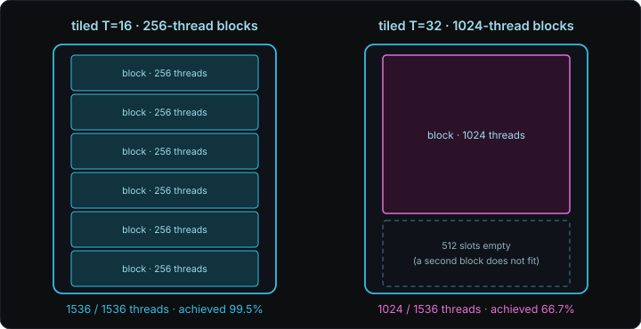
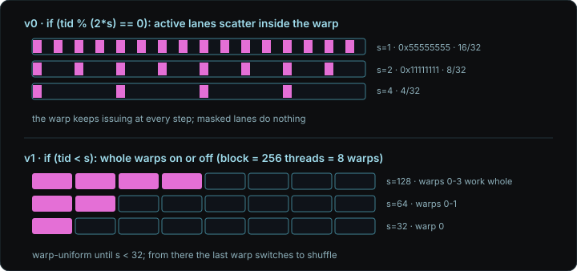

GPU에서 실행되는 함수를 kernel이라고 하고, kernel을 실행하는 작업 단위를 thread라고 한다. Thread는 block이라는 묶음으로 배치되고, 한 block은 GPU 안의 실행 장치인 SM(Streaming Multiprocessor) 하나 위에서 끝까지 실행된다. 이 block의 thread들이 읽고 쓰는 memory에는 두 종류가 있다. Global memory는 GPU에 달린 큰 memory로 모든 thread가 접근할 수 있고, shared memory는 SM 안에 있는 작은 memory로 같은 block의 thread끼리만 함께 쓴다. Shared memory는 global memory보다 훨씬 빠르지만, 어떤 데이터를 언제 올리고 언제 비울지를 kernel 코드가 직접 정한다는 점에서 hardware가 알아서 채우는 cache와 다르다.

Shared memory를 쓰면 global memory에서 한 번 읽은 데이터를 block 안에서 여러 번 재사용할 수 있다. 그 대신 block 안의 thread들이 같은 memory를 함께 쓰기 때문에 쓰기와 읽기의 순서를 맞추는 barrier, 여러 thread가 같은 저장 장치를 동시에 건드릴 때 생기는 bank conflict, 그리고 block이 커지면서 SM에 올릴 수 있는 thread 수가 줄어드는 occupancy 문제가 새로 생긴다. 행렬곱, transpose, reduction 세 kernel이 이 셋을 차례로 드러낸다. 그 출발점은 shared memory에 올릴 데이터를 global memory에서 읽는 방식이다.

## Global Memory와 Coalescing

GPU는 thread를 하나씩 실행하지 않고 32개씩 묶어 한 번에 같은 명령을 실행하는데, 이 32개 묶음을 warp라고 하고 warp 안의 각 thread 자리를 lane이라고 한다. 한 warp가 global memory를 읽는 명령을 실행하면 32개 lane이 각자의 주소를 내놓는다. 이때 global memory는 byte 하나씩 팔지 않고 sector라는 32바이트 덩어리 단위로만 데이터를 보낸다. Sector의 경계는 주소 0부터 32바이트 간격으로 미리 정해져 있어서, 그 안의 1바이트만 필요해도 sector 전체가 전송된다. 이렇게 여러 lane의 접근을 적은 수의 sector 전송으로 합치는 것을 coalescing이라고 한다. 그래서 global memory 접근 비용은 lane 수가 아니라 실제로 건드린 서로 다른 sector 수로 정해진다.

`float`는 4바이트이므로 32개 lane이 연속된 `float` 32개를 읽으면 128바이트 범위이고, 시작 주소가 sector 경계(32의 배수 주소)에 맞춰져 있으면 sector 4개로 끝난다. 이때 시작 주소가 `float` 하나만큼 어긋나면 같은 128바이트가 sector 경계를 하나 더 걸쳐 5개가 되고, lane 사이 간격이 32바이트 이상으로 벌어지면 lane마다 다른 sector를 건드려 32개까지 늘어난다. 세 경우 모두 쓸모 있는 데이터는 128바이트로 같지만 실제로 옮기는 양은 128, 160, 1024바이트로 달라진다.


`cudaMalloc`이 돌려준 pointer는 충분히 정렬돼 있지만, 거기에 offset을 더해 만든 부분 영역의 시작 주소는 어긋날 수 있다. 그리고 4라는 숫자는 "lane 32개가 `float` 하나씩"이라는 조건에서 나온 값이어서 lane 수나 데이터 폭이 바뀌면 최소 sector 수도 바뀐다.

## Shared Memory와 Tiling

행렬곱 $C = A \times B$에서 $C$의 원소 하나를 구하려면 $A$의 한 행과 $B$의 한 열이 필요하다. 가장 단순한 kernel은 thread 하나가 $C$의 원소 하나를 맡고, 필요한 값을 매번 global memory에서 읽는다.

```cpp
__global__ void matmul_naive(const float* A, const float* B, float* C, int N) {
    int row = blockIdx.y * blockDim.y + threadIdx.y;
    int col = blockIdx.x * blockDim.x + threadIdx.x;
    float acc = 0.0f;
    for (int k = 0; k < N; k++)
        acc += A[row * N + k] * B[k * N + col];
    C[row * N + col] = acc;
}
```

여기서 `threadIdx`는 block 안에서의 thread 번호이고 `blockIdx`는 grid 안에서의 block 번호이며, `blockDim`은 block 한 변의 thread 수다. 안쪽 반복문 한 바퀴마다 thread는 8바이트를 읽고 곱셈과 덧셈 두 번을 한다. 그런데 $A$의 같은 행은 $C$의 같은 행에 있는 $N$개 원소를 계산할 때 전부 다시 쓰이므로, 이 kernel은 같은 값을 global memory에서 여러 번 읽는다.

Tiling은 이 재사용을 shared memory에서 직접 관리하는 방법이다. Tile은 행렬을 $T \times T$ 크기의 정사각 조각으로 나눈 것이다. Block의 thread들이 $A$와 $B$의 tile 하나씩을 함께 shared memory로 복사하고, 그 tile 안에서 만들 수 있는 부분곱을 전부 누적한 뒤, 다음 tile로 넘어간다. 이렇게 하면 tile의 원소 하나가 global memory에서 한 번만 읽히고 shared memory에서 $T$번 재사용된다.


```cpp
#define T 32

__global__ void matmul_tiled(const float* A, const float* B, float* C, int N) {
    __shared__ float As[T][T];
    __shared__ float Bs[T][T];

    int row = blockIdx.y * T + threadIdx.y;
    int col = blockIdx.x * T + threadIdx.x;
    float acc = 0.0f;

    for (int t = 0; t < N / T; t++) {
        As[threadIdx.y][threadIdx.x] = A[row * N + (t * T + threadIdx.x)];
        Bs[threadIdx.y][threadIdx.x] = B[(t * T + threadIdx.y) * N + col];
        __syncthreads();

        for (int k = 0; k < T; k++)
            acc += As[threadIdx.y][k] * Bs[k][threadIdx.x];
        __syncthreads();
    }
    C[row * N + col] = acc;
}
```

`__shared__`는 변수를 shared memory에 둔다는 선언이다. `__syncthreads()`는 barrier로, block의 모든 thread가 이 줄에 도착할 때까지 먼저 온 thread를 기다리게 한다. 첫 번째 barrier는 다른 thread가 아직 채우지 않은 tile을 읽는 것을 막고, 두 번째 barrier는 아직 읽는 중인 tile을 다음 반복이 덮어쓰는 것을 막는다. 이때 barrier에는 규칙이 있다. Block의 일부 thread만 먼저 return한 채 나머지가 `__syncthreads()`에 도착하면 실행이 정의되지 않는다. 위 코드는 $N$이 $T$의 배수여서 모든 thread가 같은 흐름을 지나지만, 임의 크기를 받는 코드라면 경계 밖 thread를 return시키지 않고 반복문과 barrier에 그대로 참여시킨 뒤, 읽는 값만 0으로 채우고 마지막 `C` 저장에만 범위 검사를 건다.

재사용 효과는 arithmetic intensity로 드러난다. Arithmetic intensity는 global memory에서 읽은 바이트당 수행한 연산 수다. Block 하나는 tile 쌍을 $N/T$번 복사하며 $8NT$바이트를 읽고, $T^2$개 thread가 각각 $2N$번 연산하므로

$$
I_{\text{tiled}} = \frac{2NT^2}{8NT} = \frac{T}{4}\ \text{FLOP/B}
$$

가 된다. $T = 32$이면 8 FLOP/B이고, tile 없이 매번 읽을 때의 0.25 FLOP/B에 비해 32배다. Tile 복사는 행 방향으로 연속된 주소를 읽으므로 앞 절의 coalescing 조건도 만족한다.

## Bank Conflict

Shared memory는 32개의 bank로 나뉜다. Bank는 shared memory를 구성하는 독립된 저장 장치로, 연속된 4바이트 word가 bank 0, 1, ..., 31, 0, 1, ... 순서로 돌아가며 배정된다. 한 warp의 32개 lane이 서로 다른 bank를 건드리면 한 번에 처리되고, 같은 bank의 서로 다른 주소를 건드리면 차례로 처리된다. 이렇게 같은 bank에 $n$개 접근이 겹쳐 직렬화되는 것을 $n$-way bank conflict라고 한다. 여러 lane이 같은 주소를 읽는 경우는 값 하나를 모두에게 나눠 주는 broadcast여서 conflict가 아니다.

Conflict가 전형적으로 생기는 곳은 2차원 tile을 열 방향으로 읽을 때이고, shared memory를 거치는 transpose가 그 예다. Transpose는 행렬의 행과 열을 바꾸는 연산인데, global memory에서 행 방향으로 읽은 tile을 shared memory에 두고 열 방향으로 꺼내 쓰면 읽기와 쓰기 양쪽을 모두 coalescing할 수 있다.

```cpp
__shared__ float tile[32][32];

tile[threadIdx.y][threadIdx.x] = in[...];   // 행 방향 쓰기: bank 분산
__syncthreads();
out[...] = tile[threadIdx.x][threadIdx.y];  // 열 방향 읽기: 32-way conflict
```

열 방향 읽기에서 lane들이 읽는 `tile[0][c], tile[1][c], ...`는 32 word 간격이어서 전부 bank `c`에 떨어진다. 이를 푸는 방법은 둘이다.

첫 번째는 padding이다. 행 길이를 33으로 늘리면 열 방향으로 내려갈 때 bank 번호가 행마다 하나씩 어긋난다.

```cpp
__shared__ float tile[32][33];
```

일반화하면 stride $S$로 읽을 때 conflict 차수는 $\gcd(S, 32)$다. Stride 32는 32-way, 33은 conflict가 없고, 2와 4는 각각 2-way와 4-way다. 그래서 padding은 stride와 bank 수의 공약수를 1로 만드는 조작이고, 비용은 행당 4바이트의 낭비다.

두 번째는 swizzle이다. 저장할 열 번호를 행 번호와 XOR하면 memory를 더 쓰지 않고 같은 효과가 난다.

```cpp
__shared__ float tile[32][32];

tile[threadIdx.y][threadIdx.x ^ threadIdx.y] = in[...];   // 쓰기: bank 분산
__syncthreads();
out[...] = tile[threadIdx.x][threadIdx.y ^ threadIdx.x];  // 읽기도 분산
```

행 안에서 열들이 XOR로 재배열되면 행 방향 접근도 열 방향 접근도 32개 bank에 정확히 한 번씩 떨어진다. 비용은 index 계산 한 번과 tile 폭이 2의 거듭제곱이어야 한다는 제약이다.


Lane과 행·열의 대응을 뒤집어 shared memory 접근을 연속으로 만들 수도 있지만, 그러면 global memory 접근이 다시 strided가 된다. 한쪽의 conflict를 다른 쪽의 coalescing 실패로 옮기는 것이어서 해법이 아니다. 앞 절의 tiled 행렬곱에는 이 문제가 없다. `Bs[k][threadIdx.x]`는 행 방향이라 bank가 분산되고, `As[threadIdx.y][k]`는 warp 안의 lane들이 같은 주소를 읽는 broadcast다.

## Occupancy와 Block 크기

Occupancy는 SM에 실제로 올라간 warp 수를 SM이 동시에 올릴 수 있는 최대 warp 수로 나눈 값이다. 이 값이 중요한 이유는 GPU가 memory 지연을 숨기는 방식에 있다. 한 warp가 global memory 응답을 기다리는 동안 SM은 같은 SM에 올라와 있는 다른 warp를 실행하므로, 올라온 warp가 많을수록 기다리는 시간이 가려진다. SM에 올릴 수 있는 block 수는 thread 수, block 슬롯, register, shared memory 네 가지 한도 중 먼저 바닥나는 것이 정한다. Register는 thread가 계산 중인 값을 두는 SM 안의 가장 빠른 저장소다.

Tiled 행렬곱에서 $T = 32$이면 block 하나가 1024 thread다. Compute capability는 GPU가 지원하는 CUDA hardware 기능 세대를 나타내는 번호인데, compute capability 8.9인 GPU는 SM당 상주 thread 한도가 1536이어서 1024 thread block은 SM에 하나만 올라간다. 그래서 thread 슬롯 1536개 중 1024개만 차고 occupancy는 66.7%가 된다. 반면 $T = 16$이면 block이 256 thread이고 여섯 개가 올라가 1536개를 모두 채운다.



Tile을 키우면 재사용은 늘지만 block이 커져 SM에 올릴 수 있는 병렬성이 줄어든다. 이 때문에 재사용을 더 쌓는 길은 block을 더 키우는 것이 아니라 thread 하나가 $C$의 원소 여러 개를 register에 두고 누적하는 register tiling 쪽이 된다. 그리고 occupancy는 SM이 고를 수 있는 warp 수의 상한일 뿐 실행 시간의 비율이 아니어서, 낮은 occupancy로도 warp마다 하는 일이 많으면 빠를 수 있다.

## Warp Divergence

Warp는 32개 lane에 같은 명령을 한 번에 발행한다. 그런데 `if` 문의 조건이 lane마다 다르면 한 warp 안에서 일부 lane은 참 경로를, 나머지는 거짓 경로를 가야 한다. 이 상황을 warp divergence라고 한다. Lane 번호를 $\ell \in \{0,\ldots,31\}$, branch 조건을 $p_\ell$이라 하면 참인 lane의 집합 $A$와 거짓인 lane의 집합 $B$는

$$
A = \{\ell \mid p_\ell = 1\}, \qquad
B = \{\ell \mid p_\ell = 0\}
$$

이고, divergence는 두 집합이 모두 비어 있지 않을 때 생긴다.

```cpp
int lane = threadIdx.x & 31;

if (lane < 16)
    A();
else
    B();
```

이 코드에서는 모든 warp의 lane 0~15가 `A`, lane 16~31이 `B`를 고른다. Warp는 두 경로를 동시에 실행하지 못하므로, 먼저 `A` 경로를 lane 0~15만 켠 채 실행하고, 그다음 `B` 경로를 lane 16~31만 켠 채 실행한다. 이렇게 어떤 lane이 현재 명령의 결과를 쓰는지 나타내는 32비트 값을 active mask라고 한다.

`A`와 `B` 경로가 각각 $n_A$, $n_B$개의 warp 명령으로 컴파일됐다고 하자. 한 경로만 고르면 그 구간의 발행 수는 $n_A$이고, 두 경로가 모두 선택되면 $n_A + n_B$다. Lane 수는 발행 횟수를 곱하지 않으므로, 16:16으로 갈리든 31:1로 갈리든 두 경로 길이가 같다면 발행되는 명령 수는 같다. 발행된 lane 자리 중 실제로 켜진 비율을 $\eta$라 두면

$$
\eta =
\frac{|A|n_A + |B|n_B}
     {32(n_A+n_B)}
$$

이고, 두 경로 길이가 같아 $n_A = n_B$이면 $\eta = 1/2$다.

Divergence를 피하려면 조건을 warp 경계에 맞춘다.

```cpp
int warp = threadIdx.x >> 5;

if ((warp & 1) == 0)
    A();
else
    B();
```

짝수 warp는 32개 lane이 전부 `A`, 홀수 warp는 전부 `B`를 고르므로 각 warp 안에서는 조건이 같다. 서로 다른 warp가 다른 코드를 실행하는 것은 divergence가 아니다.

소스의 `if`가 갈린다고 실제 branch가 반드시 생기는 것도 아니다. 본문이 짧으면 compiler가 branch를 없애고 predicated instruction으로 바꾼다. Predication은 명령을 모든 lane에 한 번 발행하되 조건이 참인 lane만 결과를 쓰게 하는 방식이다.

```cpp
float y = x;
if (lane < 16)
    y = 2.0f * x;
```

GPU 기계어인 SASS로는 개념적으로 아래 형태가 된다. 정확한 명령 이름과 register는 architecture와 compiler 버전에 따라 다르다.

```text
ISETP.LT ... P0, lane, 16
@P0 FMUL  y, x, 2.0
```

이 경우 warp는 두 경로로 갈라지지 않는다. `FMUL`은 한 번 발행되고 predicate `P0`가 참인 lane만 결과를 쓴다. 그래서 branch divergence는 없지만 꺼진 lane은 그 명령에서 유효한 일을 하지 않는다. Divergent branch와 predication은 둘 다 켜진 lane의 비율을 낮출 수 있지만 같은 현상은 아니다.

## Reduction

Reduction은 배열 $N$개를 값 하나로 줄이는 연산이다. 합, 최댓값, 평균이 여기 속하고, softmax의 최댓값과 분모 합, layernorm의 평균과 분산으로 ML kernel 안에 계속 나온다.

트리로 접으면 매 단계 절반의 thread가 두 값을 합치고, 단계 수는 $\log_2 N$이다. 총 덧셈은 여전히 $N - 1$개여서 병렬화는 일의 양이 아니라 깊이를 줄인다. 그 대신 단계마다 이전 쓰기가 끝났다는 보장이 필요하고, 이 동기화 비용을 어디까지 줄이느냐가 아래 네 버전의 차이다.


공통 구조는 multi-pass다. 각 block이 shared memory에서 자기 몫의 부분합을 만들고, 그 부분합 배열에 같은 kernel을 다시 돌려 값 하나까지 줄인다. 예를 들어 $2^{24}$개 입력에 block 256이면 65,536개 → 256개 → 1개로 세 번 실행한다.

버전 0은 트리의 직역이다. `tid`는 block 안의 thread 번호, `buf`는 block이 shared memory에 올려 둔 입력이다.

```cpp
for (int s = 1; s < blockDim.x; s *= 2) {
    if (tid % (2 * s) == 0)
        buf[tid] += buf[tid + s];
    __syncthreads();
}
```

느린 요인이 둘이다. 첫째는 흩어진 active lane이다. 조건을 만족하는 lane은 `s = 1`에서 짝수 번호, `s = 2`에서 4의 배수로 듬성듬성해지는데, 일하는 lane이 16, 8, 4, ...개로 줄어도 그 warp의 명령은 그대로 발행된다. 둘째는 `%` 연산이다. 제수 `2 * s`가 반복마다 바뀌어 compiler가 비트 연산으로 바꾸지 못하고 나눗셈 명령 묶음이 남는다.

버전 1은 sequential addressing이다. 일하는 thread를 block 앞쪽에 연속으로 모은다.

```cpp
for (int s = blockDim.x / 2; s > 0; s >>= 1) {
    if (tid < s)
        buf[tid] += buf[tid + s];
    __syncthreads();
}
```

두 버전 모두 256개 원소를 여덟 단계로 줄이고, 단계 $j \in \{0,\ldots,7\}$에서 덧셈을 하는 thread 수는 $a_j = 256 / 2^{j+1}$로 같다. 차이는 그 $a_j$개를 몇 개 warp에 배치하느냐다. 버전 0은 active thread가 block 전체에 흩어지므로 참인 조건을 하나라도 가진 warp 수가 $\min(8, a_j)$이고, 여덟 단계를 더하면 47이다. 버전 1은 active thread를 앞에 모으므로 $\lceil a_j / 32 \rceil$이고, 더하면 12다. 그래서 `s = 128`에서는 앞 warp 4개가 통째로 일하고 `s = 64`에서 2개, `s = 32`에서 1개가 일하며, 이 세 단계의 조건은 warp 단위로 같다. `s = 16`부터는 첫 warp 안에서 조건이 갈리지만 active lane이 앞에서부터 연속된다. `buf[tid]`와 `buf[tid + s]`도 연속 주소여서 bank conflict가 없고 `%`도 사라진다.



버전 2는 warp shuffle이다. `s = 16`부터는 첫 warp 하나만 일하므로, 그 경계부터는 shared memory와 `__syncthreads()` 없이 register에서 접는다.

```cpp
if (tid < 32) {
    float x = buf[tid] + buf[tid + 32];
    for (int off = 16; off > 0; off >>= 1)
        x += __shfl_down_sync(0xffffffffu, x, off);
    if (tid == 0) out[blockIdx.x] = x;
}
```

`__shfl_down_sync`는 warp 안에서 register 값을 lane 사이에 직접 전달하는 함수로, 첫 인자는 참여하는 lane을 나타내는 mask이고 세 번째 인자는 몇 lane 뒤에서 값을 가져올지다. 이 덕분에 마지막 여섯 단계의 shared memory 왕복과 block barrier가 빠진다. Mask `0xffffffffu`는 첫 warp 전체가 `tid < 32`를 만족해서 유효한 것이고, 일부 lane만 참여하는 코드라면 참여 lane 전원이 같은 mask로 같은 함수를 실행해야 한다.

버전 3은 block당 atomic 한 번이다. Atomic은 여러 thread가 같은 주소를 동시에 고쳐도 한 번에 하나씩 적용되도록 보장하는 연산이다. Multi-pass 대신 각 block의 lane 0이 `atomicAdd(out, x)`를 한 번 실행해 block 부분합을 결과에 바로 더한다. 원소마다 atomic을 걸면 같은 주소에 $N$번 접근하지만, block reduction 뒤에는 block 수만큼만 접근한다. 이 버전은 실행 전에 결과 변수를 0으로 만드는 `cudaMemset`이 필요하고, `float` atomic은 덧셈 순서가 실행마다 달라 마지막 비트까지 같은 결과를 보장하지 않는다.

원소당 연산이 한 번뿐인 reduction은 순수하게 memory 대역폭에 묶이는 문제이므로, 잘 쓴 reduction의 상한은 같은 크기의 memcpy 속도다. CUDA에 딸린 library인 CUB의 `DeviceReduce::Sum`은 임의 타입과 크기에서 이 구간에 도달하는 구현이고, 위 버전 3은 `float` 배열 하나에 고정된 형태로 같은 구조를 보여 준다.

## 소스 코드

세 kernel의 전체 소스는 [gemm_bench.cu](/code/cuda-03/gemm_bench.cu), [transpose_bench.cu](/code/cuda-03/transpose_bench.cu), [reduce_bench.cu](/code/cuda-03/reduce_bench.cu)에 있다.

```bash
nvcc -O3 -arch=sm_89 -o gemm_bench gemm_bench.cu
nvcc -O3 -arch=sm_89 -o transpose_bench transpose_bench.cu
nvcc -O3 -arch=sm_89 -std=c++17 -o reduce_bench reduce_bench.cu
```

## 참고

- [CUDA C++ Best Practices Guide](https://docs.nvidia.com/cuda/cuda-c-best-practices-guide/): coalescing, shared memory, bank conflict, occupancy, branch predication의 기준 문서
- [CUDA C++ Programming Guide](https://docs.nvidia.com/cuda/cuda-c-programming-guide/): SIMT divergence, 동기화, atomics, warp intrinsic의 정확한 의미
- [Mark Harris, An Efficient Matrix Transpose in CUDA C/C++](https://developer.nvidia.com/blog/efficient-matrix-transpose-cuda-cc/): coalescing, shared tile, padding을 한 예제로 보여주는 표준 사례
- [Andreas Holt, Shared-Memory Tiled Matrix Multiplication](https://andreasholt.com/posts/shared-tiled-matmul/): tiled GEMM의 그림과 경계 처리까지 붙인 설명
- [Lei Mao, CUDA Shared Memory Bank](https://leimao.github.io/blog/CUDA-Shared-Memory-Bank/): bank 주소 매핑의 상세
- [Lei Mao, CUDA Shared Memory Swizzling](https://leimao.github.io/blog/CUDA-Shared-Memory-Swizzling/): swizzle 주소 매핑의 상세
- [Fabian Schütze, Visualizing Bank Conflicts](https://fabianschuetze.github.io/bankconflictscuda.html): 현대 아키텍처의 bank 동작 보충
- [Mark Harris, Optimizing Parallel Reduction in CUDA](https://developer.download.nvidia.com/compute/cuda/1.1-Beta/x86_website/projects/reduction/doc/reduction.pdf): reduction을 일곱 단계로 개선하는 고전. 오래된 자료라 warp-synchronous 코드를 그대로 복사하면 안 된다
- [Faster Parallel Reductions on Kepler](https://developer.nvidia.com/blog/faster-parallel-reductions-kepler/): shuffle과 계층적 atomic. 코드는 현대식 `__shfl_down_sync()`로 바꿔 읽어야 한다
- [Lei Mao, CUDA Reduction](https://leimao.github.io/blog/CUDA-Reduction/): batched reduction 구현 중심의 정리
- [CUTLASS: Efficient GEMM in CUDA](https://docs.nvidia.com/cutlass/latest/media/docs/cpp/efficient_gemm.html): threadblock/warp/thread tiling과 register 재사용, double buffering으로 이어지는 상위 레퍼런스
- [Simon Boehm, How to Optimize a CUDA Matmul Kernel](https://siboehm.com/articles/22/CUDA-MMM): register tiling부터 warptiling까지 가는 워크로그
- [CUB](https://nvidia.github.io/cccl/cub/): `WarpReduce → BlockReduce → DeviceReduce` 계층의 production 구현
