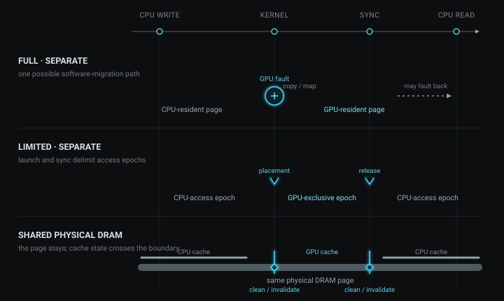

[Host-Device 데이터 흐름](#host-device-데이터-흐름)에서는 `h_x`와 `d_x`를 따로 만들고 H2D, D2H 복사를 직접 적었다. `cudaMallocManaged`를 쓰면 두 배열과 두 `cudaMemcpy`가 포인터 `x` 하나로 줄어든다.

코드는 짧아지지만 질문이 하나 생긴다. CPU가 쓴 값은 어떻게 GPU에 도착하고, GPU가 고친 값은 어떻게 CPU에 돌아오는가? 이 글은 정수 하나에 1을 더하는 코드로 그 과정을 따라간다.

## 최소 예제

```cpp
#include <cstdio>
#include <cuda_runtime.h>

#define CUDA_CHECK(call) do {                                   \
    cudaError_t err = (call);                                   \
    if (err != cudaSuccess) {                                   \
        std::fprintf(stderr, "%s:%d: %s\n",                   \
                     __FILE__, __LINE__,                         \
                     cudaGetErrorString(err));                   \
        return 1;                                                \
    }                                                            \
} while (0)

__global__ void add_one(int *x) {
    *x += 1;
}

int main() {
    int *x = nullptr;
    CUDA_CHECK(cudaMallocManaged(&x, sizeof(*x)));

    *x = 41;                                      // CPU write
    std::printf("before kernel: %d\n", *x);

    add_one<<<1, 1>>>(x);                         // GPU read/write
    CUDA_CHECK(cudaGetLastError());
    CUDA_CHECK(cudaDeviceSynchronize());

    std::printf("after kernel:  %d\n", *x);      // CPU read
    CUDA_CHECK(cudaFree(x));
}
```

전체 소스는 [managed_add.cu](/code/cuda-04/managed_add.cu)에 있다.

`<<<1, 1>>>`은 block 하나에 thread 하나만 실행한다. 성능을 재려는 코드가 아니라 CPU와 GPU가 같은 allocation을 차례로 읽고 쓰게 만드는 최소 예제다.

```bash
CCBIN="C:/Program Files/Microsoft Visual Studio/2022/Community/VC/Tools/MSVC/14.42.34433/bin/Hostx64/x64"
nvcc -O2 -arch=sm_89 -ccbin "$CCBIN" -Xcompiler -wd4819 \
  -o managed_add.exe managed_add.cu
./managed_add.exe
```

위 명령은 Visual Studio x64 Developer 환경을 먼저 초기화한 Windows Git Bash와 이 시리즈의 RTX 4060 Ti(`sm_89`) 기준이다. MSVC minor version이 다르면 `CCBIN`을 설치된 `Hostx64/x64` 경로로 바꾼다. 다른 GPU의 architecture와 Linux 명령은 [CUDA 04 README](/code/cuda-04/README.md)에 분리했다.

예상 출력은 다음과 같다. 아래 값은 장비별 실측치가 아니라 프로그램의 정답이다.

```text
before kernel: 41
after kernel:  42
```

`cudaDeviceSynchronize()`는 복사 함수가 아니다. CUDA kernel launch는 CPU에 대해 비동기이므로, 이 호출이 GPU의 `*x += 1`을 끝낸 뒤 CPU가 `x`를 읽도록 순서를 만든다. full model에서 이를 빼면 같은 위치의 CPU read와 GPU write가 data race가 된다. limited model에서는 GPU가 실행 중일 때 CPU가 기본 managed allocation에 접근하는 행위 자체가 허용되지 않는다. 이 예제는 synchronization 뒤에 읽으므로 두 경우 모두 안전하다.

42가 출력됐다는 사실은 CPU write → GPU write → CPU read의 순서와 값의 가시성이 맞았다는 것만 보여 준다. page fault가 났는지, 몇 바이트가 이동했는지, 이 방식이 빠른지는 아직 알 수 없다.

## Managed Allocation과 UVA

CPU 코드와 GPU kernel은 똑같은 포인터 값 `x`를 사용한다. `cudaMallocManaged`가 보장하는 것은 양쪽 코드가 같은 **managed allocation**을 가리키고, CUDA의 접근 규칙과 동기화 아래 최신 값을 볼 수 있다는 것이다.

그 allocation의 실제 데이터가 계속 같은 물리 메모리에 있다는 뜻은 아니다. `x`는 가상 주소이고, memory manager는 그 주소를 page 단위의 물리 메모리와 연결한다. CPU DRAM에 있던 page가 GPU memory로 옮겨질 수도 있고, 처음부터 양쪽이 공유하는 DRAM에 놓일 수도 있다.

한 processor가 쓴 최신 값이 다음 processor에게 보이도록 page mapping과 cache 상태를 맞추는 일을 **coherence**라고 한다. 데이터가 물리적으로 이동하는 migration과, 최신 값을 보이게 만드는 coherence는 겹칠 수 있지만 같은 개념은 아니다.

UVA(Unified Virtual Addressing)는 CPU memory와 각 GPU memory의 주소를 한 process의 가상 주소 체계에 배치하는 기반이다. UVA가 주소를 정리한다면 Unified Memory는 그 주소를 어느 processor가 접근할 수 있는지, 최신 데이터가 어디에 있는지를 관리한다. 둘은 같은 말이 아니다.

## Page Fault와 Migration

가장 이해하기 쉬운 경우부터 보자. CPU와 GPU에 물리적으로 분리된 memory가 있고, software-coherent full Unified Memory를 지원하며, prefetch 같은 hint를 주지 않은 환경이다.

`*x = 41`을 실행하면 CPU가 `x`의 page를 먼저 만진다. 그 page가 CPU 쪽에 놓인 상태에서 kernel이 `x`를 읽으려는데 GPU page table에 유효한 mapping이 없다면 GPU page fault가 발생한다. page fault는 “이 가상 주소의 load를 지금 완료할 수 없다”는 사건이다.

driver는 CPU 쪽 mapping과 접근 상태를 정리하고, GPU 쪽 물리 page를 준비해 최신 내용을 옮긴 다음 GPU mapping을 설치한다. 멈췄던 `*x += 1`은 그 뒤에 재개된다. 아래 그림은 가능한 software-managed migration 경로 하나를 시간 순서로 그린 것이다.


kernel이 끝난 뒤 CPU가 `x`를 다시 읽을 때도 반대 방향의 처리가 필요할 수 있다. 최신 page가 GPU memory에 있고 CPU mapping이 유효하지 않다면 CPU fault 뒤 host 쪽으로 migration이 일어난다. 포인터 값은 처음부터 끝까지 `x`지만, 그 주소에 연결된 물리 page와 접근 권한은 바뀐다.

fault와 migration은 동의어가 아니다. fault는 해결해야 할 접근 사건이고, migration은 해결 방법 중 하나다. prefetch는 fault 전에 page를 옮길 수 있다. 지원되는 system에서는 GPU가 CPU-resident page를 자기 page table에 매핑해 원격으로 읽거나, hardware coherence 아래 공유된 memory를 읽을 수도 있다. 따라서 42라는 결과만으로 위 경로가 실제로 실행됐다고 결론낼 수 없다.

CUDA 13.0에서는 `cudaMemPrefetchAsync`와 `cudaMemAdvise`의 unsuffixed API가 `int device` 대신 `cudaMemLocation`을 받도록 바뀌었다. `cudaMemPrefetchAsync`에는 현재 0이어야 하는 `flags` 인자도 추가됐다. 12.x 코드를 그대로 가져오면 여기서 컴파일 오류가 난다. GPU prefetch의 최소 차이는 다음과 같다.

```cpp
// CUDA 12.x
cudaMemPrefetchAsync(x, bytes, device, stream);

// CUDA 13.x
cudaMemLocation gpu{};
gpu.type = cudaMemLocationTypeDevice;
gpu.id = device;
cudaMemPrefetchAsync(x, bytes, gpu, /*flags=*/0, stream);
```

`cudaMemAdvise(x, bytes, advice, gpu)`도 같은 `cudaMemLocation`을 쓴다. GPU target prefetch는 destination GPU와 stream이 연결된 device 모두 `concurrentManagedAccess != 0`이어야 하며, GPU를 location으로 지정하는 `SetPreferredLocation`·`SetAccessedBy`도 target device에서 같은 조건을 요구한다. 두 CUDA 세대의 API 분기와 limited 환경의 실패를 확인하는 전체 코드는 [prefetch_demo.cu](/code/cuda-04/prefetch_demo.cu)에 있다.

## Unified Memory 실행 모델

방금 설명한 것은 **full support + separate memory**라는 조건의 한 경로였다. 같은 separate-memory system이라도 `concurrentManagedAccess == 0`인 **limited Unified Memory**에서는 동작이 다르다. GPU가 실행 중 필요한 page를 하나씩 가져오는 대신, runtime은 일반적으로 kernel launch 또는 실행 시작 경계에서 managed data를 GPU가 접근할 수 있는 상태로 전환한다. GPU work가 끝날 때까지 CPU의 managed-memory 접근은 허용되지 않고, synchronization 뒤에 CPU 접근 상태가 복구된다. GPU memory 용량보다 큰 working set을 host memory와 나눠 유지하는 **oversubscription**도 지원하지 않는다.

이 시리즈의 측정 환경인 RTX 4060 Ti + native Windows 조합은 compute capability 8.9여도 `concurrentManagedAccess == 0`, 즉 limited model에 속한다. compute capability가 새롭다는 사실은 Windows의 memory model을 full support로 바꾸지 않는다. WSL 2도 full managed-memory support와 concurrent CPU/GPU access를 제공하지 않으므로 이 분류에서는 limited다. 따라서 classifier가 `limited unified memory`를 출력한다면 GPU 세대가 낮아서가 아니라 현재 OS와 driver model까지 포함한 실행 환경의 결과다.

여기까지는 CPU DRAM과 GPU memory가 분리됐다고 가정했다. CPU와 integrated GPU가 같은 physical DRAM을 쓰는 system이라면 건너갈 별도 VRAM 자체가 없다. 그래도 page mapping과 coherence는 필요하다. driver-managed system에서는 launch와 synchronization 때 cache clean·invalidate가 일어날 수 있고, hardware-coherent system에서는 interconnect의 coherence protocol이 그 일을 맡는다. support model에 따라 fault로 physical page를 준비하는 과정도 남을 수 있다.



즉, support model과 physical topology는 서로 다른 축이다. `full`이라고 반드시 page migration을 하는 것도 아니고, `limited`라고 반드시 PCIe로 allocation 전체를 복사하는 것도 아니다. 실제 경로는 GPU 이름만으로 추측하지 않고 실행 환경의 capability를 확인해야 한다.

## Device Attributes

CUDA device attribute는 GPU, OS, driver, kernel과 interconnect가 함께 제공하는 **capability**다. benchmark 결과가 아니며, 이번 실행에서 fault가 몇 번 났는지도 알려 주지 않는다.

아래 코드를 `main` 앞에 두고 `cudaGetDeviceProperties`로 얻은 값을 넘기면, raw bit 대신 이 글에서 필요한 분류를 한 줄로 출력할 수 있다.

```cpp
static void print_um_support_class(const cudaDeviceProp& p) {
    if (!p.managedMemory) {
        std::puts("support class: cudaMallocManaged unavailable");
    } else if (!p.concurrentManagedAccess) {
        std::puts("support class: limited unified memory");
    } else if (!p.pageableMemoryAccess) {
        std::puts("support class: full, CUDA managed allocations");
    } else if (!p.pageableMemoryAccessUsesHostPageTables) {
        std::puts("support class: full, all allocations, software coherence");
    } else {
        std::puts("support class: full, all allocations, host page tables");
    }
}
```

`main`의 allocation 앞에는 다음 세 줄을 추가한다.

```cpp
cudaDeviceProp p{};
CUDA_CHECK(cudaGetDeviceProperties(&p, 0));
print_um_support_class(p);
```

판정 순서는 중요하다. `managedMemory`는 `cudaMallocManaged` 자체를 쓸 수 있는지 확인한다. 그 다음 `concurrentManagedAccess`가 0이면 limited, 1이면 full support다. full일 때만 `pageableMemoryAccess`로 CUDA가 만든 managed allocation에 한정되는지, `malloc` 같은 system allocation까지 포함하는지 나눈다. host page-table 값은 두 값이 모두 1일 때만 해석한다.

classifier를 붙이면 출력 첫 줄은 아래 네 class 중 하나가 되고, 그 뒤의 41과 42는 변하지 않는다. 첫 줄은 이 글에서 측정한 특정 장비 값이 아니라 실행할 system에 따라 달라지는 capability 결과다.

```text
support class: <limited 또는 세 full class 중 하나>
before kernel: 41
after kernel:  42
```

attribute는 가능한 모델의 범위를 좁힌다. Linux Workstation Edition의 Nsight Systems에서 실제 page fault를 확인하려면 다음처럼 Unified Memory fault trace를 켤 수 있다.

```bash
nsys profile \
  --trace=cuda \
  --cuda-um-cpu-page-faults=true \
  --cuda-um-gpu-page-faults=true \
  -o managed_add ./managed_add
```

이 명령은 이 글에서 실행한 실측 결과가 아니라 **검증 방법**이다. 두 fault 옵션은 CPU/GPU fault의 위치와 발생 시점을 기록하고, CUDA trace에서는 Unified Memory transfer event를 함께 확인할 수 있다. fault가 비었다고 이동이 없었다는 뜻은 아니다. prefetch나 limited model의 launch-time placement처럼 fault 없이 일어나는 이동도 있기 때문이다. 이 fault 옵션은 Embedded Platforms Edition에서 지원되지 않고 추적 overhead도 크므로, 성능 측정용 run과 원인 확인용 run을 분리해야 한다.

## HMM과 System Allocation

지금까지의 `x`는 `cudaMallocManaged`로 만들었다. 그런데 앞의 분류에서 `pageableMemoryAccess == 1`이면 `malloc`, `new`, `mmap` 같은 system allocation도 GPU가 Unified Memory로 접근할 수 있다. HMM은 이 경우의 software 경로를 설명하기 위해 등장한다.

HMM(Heterogeneous Memory Management)은 Linux kernel의 memory manager와 GPU driver가 CPU page-table 변경, GPU fault와 page migration을 함께 처리하도록 연결하는 기반이다. CUDA 관점에서 중요한 결과는 CUDA allocator 밖의 system allocation도 software-coherent Unified Memory의 관리 범위에 들어온다는 점이다.

HMM을 지원하는 환경에서는 앞의 예제에서 allocation과 해제만 다음처럼 바꿀 수 있다.

```diff
+#include <cstdlib>

- int *x = nullptr;
- CUDA_CHECK(cudaMallocManaged(&x, sizeof(*x)));
+ int *x = static_cast<int *>(std::malloc(sizeof(*x)));
+ if (x == nullptr) return 1;
  ...
- CUDA_CHECK(cudaFree(x));
+ std::free(x);
```

가능한 조건은 full support에서 `pageableMemoryAccess == 1`이고 `pageableMemoryAccessUsesHostPageTables == 0`인 경우다. 마지막 값이 1이면 HMM의 software page-table mirroring 대신 host page table을 사용하는 hardware-coherent 경로다. ATS(Address Translation Services)는 CUDA 문서가 설명하는 대표적인 구현이다.

HMM은 새로운 allocator의 이름도, migration을 없애는 기능도 아니다. Linux의 기존 allocation을 GPU memory-management 경로에 포함시키는 infrastructure다. 호환 kernel, driver, GPU와 NVIDIA open kernel module이 필요하므로 구체적인 요구사항은 [CUDA의 HMM 설명](https://docs.nvidia.com/cuda/cuda-programming-guide/02-basics/understanding-memory.html#hmm-full-unified-memory-with-software-coherency)에서 확인해야 한다.

## 선택 기준

| 상황 | 먼저 고려할 방식 | 이유 |
|---|---|---|
| pointer가 많은 자료구조, 점진적인 GPU porting | `cudaMallocManaged` | host/device allocation과 copy bookkeeping을 줄일 수 있다. |
| 큰 연속 buffer가 일정한 시점에 왕복 | explicit allocation과 copy | 이동 시점을 코드에서 직접 통제하기 쉽다. |
| working set이 GPU memory보다 큼 | full Unified Memory | oversubscription 지원을 먼저 확인하고 같은 page의 반복 왕복이 없는지 측정해야 한다. |
| 기존 `malloc` allocation을 kernel에서 사용 | HMM 또는 hardware-coherent full model | `pageableMemoryAccess == 1`인 환경에서만 가능한 경로다. |

이 표는 이 글에서 얻은 성능 순위가 아니라 일반적인 선택 기준이다. managed memory의 장점은 복사를 없애는 속도가 아니라 placement와 coherence를 runtime 쪽에 맡겨 프로그램을 단순화하는 데 있다. 처음의 42는 synchronization 뒤 최신 값이 보였다는 것만 증명한다. 어느 page가 언제 움직였는지는 support class로 가능한 범위를 좁힌 뒤 profiler trace로 확인해야 한다.

## 참고

- [CUDA Programming Guide: Programming Model — Unified Memory](https://docs.nvidia.com/cuda/cuda-programming-guide/01-introduction/programming-model.html#unified-memory): Unified Memory가 제공하는 프로그래밍 모델의 기본 정의.
- [CUDA Programming Guide: Unified and System Memory](https://docs.nvidia.com/cuda/cuda-programming-guide/02-basics/understanding-memory.html): device attribute에 따른 지원 model과 HMM/ATS.
- [CUDA Programming Guide: Unified Memory](https://docs.nvidia.com/cuda/cuda-programming-guide/04-special-topics/unified-memory.html): page migration, limited support, oversubscription과 performance tuning.
- [CUDA Runtime API 13.0: Memory Management](https://docs.nvidia.com/cuda/archive/13.0.0/cuda-runtime-api/group__CUDART__MEMORY.html): `cudaMemLocation`을 받는 prefetch와 memory-advice 원형.
- [CUDA on WSL User Guide](https://docs.nvidia.com/cuda/wsl-user-guide/index.html): WSL 2의 Unified Memory 제한.
- [Nsight Systems User Guide: Unified Memory page faults](https://docs.nvidia.com/nsight-systems/UserGuide/index.html#unified-memory-cpu-page-faults): CPU/GPU page-fault trace의 의미와 overhead.
- [Linux kernel HMM documentation](https://docs.kernel.org/mm/hmm.html): Linux HMM의 page-table mirroring과 device-memory integration.
