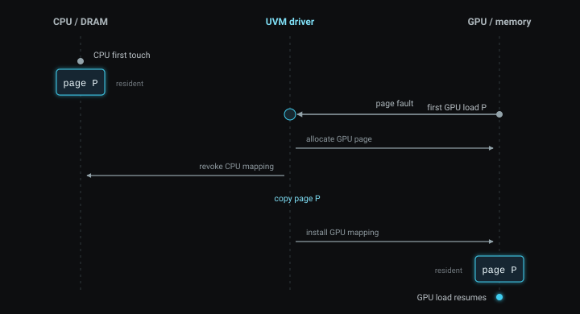
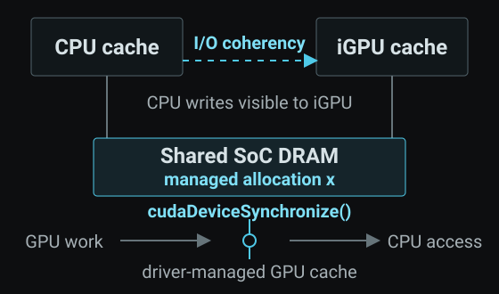

CUDA 프로그램은 CPU와 GPU라는 서로 다른 processor를 함께 사용한다. CPU를 **Host**, GPU를 **Device**라고 부른다. 두 processor는 명령을 실행하는 방식뿐 아니라 memory에 접근하는 방식도 다르다. 이런 구조를 **heterogeneous system**이라고 한다.

[Host-Device 데이터 흐름](#host-device-데이터-흐름)에서는 CPU용 `h_data`와 GPU용 `d_data`를 따로 만들고, 계산 전후에 `cudaMemcpy`를 호출했다. 위치와 이동 시점이 코드에 그대로 보이는 explicit memory management다. 대신 자료구조가 복잡해질수록 host pointer, device pointer, copy 방향, 수명을 모두 개발자가 맞춰야 한다.

Unified Memory는 이 관리 부담을 줄인다. 다만 이름의 “Unified”는 CPU DRAM과 GPU memory가 언제나 하나의 물리 memory가 된다는 뜻이 아니다. 이 글은 같은 pointer를 쓴다는 말이 무엇인지, 최신 값은 어떻게 전달되는지, 그리고 shared DRAM을 쓰는 Jetson AGX Orin이 왜 limited model인지 차례로 설명한다.

## CPU Memory와 GPU Memory

**Allocation**은 프로그램이 사용할 memory 공간을 확보하는 일이다. **Pointer**는 그 공간의 시작을 가리키는 address다. CPU에서 `malloc`으로 만든 allocation과 GPU에서 `cudaMalloc`으로 만든 allocation은 서로 다른 memory domain에 놓일 수 있다.

Discrete GPU가 달린 일반적인 PC에서는 CPU DRAM과 GPU 전용 memory(VRAM)가 물리적으로 분리돼 있다. CPU가 만든 데이터를 GPU가 계산하려면 H2D(Host to Device) copy가 필요하고, GPU 결과를 CPU가 읽으려면 D2H(Device to Host) copy가 필요하다.

Integrated GPU는 다르다. CPU와 GPU가 같은 DRAM chip을 공유할 수 있다. 그렇다고 CPU pointer를 GPU가 언제나 그대로 읽을 수 있는 것은 아니다. 같은 DRAM을 써도 두 processor가 memory를 찾아가는 주소 변환 방식과, 자주 쓰는 data의 임시 사본을 보관하는 cache는 서로 다를 수 있다. **Physical topology**와 **programming model**은 별개의 문제다.

Unified Memory는 모든 hardware를 같은 구조로 바꾸지 않는다. 서로 다른 구조에서도 CPU 코드와 GPU kernel이 같은 allocation을 다룰 수 있는 규칙을 제공한다.

## Virtual Address와 Physical Memory

프로그램의 pointer에 저장된 값은 **virtual address**다. 프로그램은 이 주소를 사용하지만, 실제 byte는 DRAM의 physical address에 저장된다. Operating system과 processor의 memory management unit은 virtual address를 physical memory에 연결한다.

Virtual memory는 보통 **page**라는 일정 크기의 단위로 관리된다. **Page table**은 virtual page가 어느 physical page에 연결되는지 기록한다. 이 연결을 **mapping**이라고 한다. 현재 data가 CPU memory나 GPU memory 중 어디에 놓여 있는지는 **placement** 또는 **residency**라고 부른다.

CUDA의 **Unified Virtual Addressing(UVA)**은 한 process 안의 CPU memory와 각 GPU memory를 하나의 virtual address space에 배치한다. Pointer 값으로 어느 memory range인지 구분하고 `cudaMemcpyDefault`가 copy 방향을 판단할 수 있다. 그러나 UVA 자체는 GPU-only allocation을 CPU가 역참조하게 만들지 않으며, data를 옮기거나 cache를 일관되게 유지하지도 않는다.

Unified Memory는 그 다음 층이다. Managed allocation을 CPU와 GPU에서 접근할 수 있게 하고, system이 지원하는 방식으로 mapping, placement, 최신 값의 visibility를 관리한다. 정리하면 UVA는 **주소 체계**, Unified Memory는 **접근과 관리 규칙**이다.

여기서 두 축을 분리해야 한다.

| 질문 | 가능한 구조 |
|---|---|
| CPU와 GPU의 physical memory가 분리됐는가 | CPU DRAM + GPU VRAM / shared SoC DRAM |
| Unified Memory를 어떤 방식으로 지원하는가 | limited / full |

Shared DRAM을 쓴다고 full Unified Memory인 것은 아니다. 반대로 physical memory가 분리된 discrete GPU도 operating system과 driver 조합에 따라 full Unified Memory를 지원할 수 있다.

## Unified Memory와 Managed Allocation

**Unified Memory**는 CPU와 GPU에서 모두 접근할 수 있는 **managed memory**를 제공하는 CUDA 기능이다. `cudaMallocManaged`는 managed allocation을 명시적으로 만드는 가장 기본적인 Runtime API다.

```cpp
int *x = nullptr;
cudaMallocManaged(&x, sizeof(*x));
```

`sizeof(*x)`만큼의 공간을 확보하고, 그 시작 주소를 pointer 변수 `x`에 기록한다. 함수가 `x`의 값을 바꿔야 하므로 첫 번째 인자는 `x`가 아니라 `&x`다. 이 allocation은 `cudaFree(x)`로 해제한다.

Explicit-copy 방식에서는 CPU용 `h_x`, GPU용 `d_x`, H2D, D2H가 필요했다. Managed 방식에서는 CPU와 GPU가 `x` 하나를 사용하며 소스에 두 copy를 적지 않는다. **CUDA Runtime**은 application이 호출하는 API를 제공하는 host library이고, **driver**는 GPU와 memory 상태를 제어하는 system software다. 둘이 현재 system의 지원 방식에 맞춰 접근 가능 상태와 최신 값을 관리한다.

여기까지가 `cudaMallocManaged`의 보장이다. 다음 내용은 보장하지 않는다.

- 데이터가 항상 CPU와 GPU에 동시에 존재한다.
- 물리적인 data copy가 전혀 없다.
- CPU와 GPU가 synchronization 없이 같은 위치를 동시에 읽고 쓸 수 있다.
- Explicit copy보다 항상 빠르다.

아래 코드는 같은 managed allocation을 CPU와 GPU가 차례로 사용하는 기본 형태다. `41`은 값이 바뀌었는지 확인하려고 고른 임의의 수다. GPU thread 하나가 한 번 `1`을 더하므로 예상 결과는 `42`다.

```cpp
#include <cstdio>
#include <cuda_runtime.h>

__global__ void add_one(int *x) {
    *x += 1;
}

int main() {
    int *x = nullptr;
    cudaMallocManaged(&x, sizeof(*x));

    *x = 41;
    std::printf("before kernel: %d\n", *x);

    add_one<<<1, 1>>>(x);
    cudaDeviceSynchronize();

    std::printf("after kernel:  %d\n", *x);
    cudaFree(x);
}
```

`__global__`은 GPU에서 실행되는 kernel을 선언한다. `<<<1, 1>>>`은 block 하나에 thread 하나를 배치한다. Kernel launch는 CPU에 대해 asynchronous하므로 GPU write와 CPU read 사이에 `cudaDeviceSynchronize()`를 뒀다. GPU가 끝나기를 기다리는 일과 CPU가 최신 값을 보는 일은 서로 다른 문제다.

## Synchronization과 Coherence

앞 코드는 두 문제를 함께 해결해야 한다. 첫째, GPU write가 끝난 뒤 CPU read가 시작돼야 한다. 둘째, CPU는 GPU가 쓴 최신 값 `42`를 읽어야 한다. 첫째가 synchronization이고 둘째가 coherence다.

**Synchronization**은 이 실행 순서를 만든다. `cudaDeviceSynchronize()`는 현재 device에 앞서 제출한 작업이 끝날 때까지 CPU thread를 기다리게 한다. 앞 예제에서는 GPU의 `*x += 1`이 끝난 뒤에만 CPU의 `printf`가 실행된다. 이 함수는 memory copy나 범용 cache-flush API가 아니다. 먼저 보장하는 것은 GPU completion과 CPU 후속 접근의 순서다.

`cudaDeviceSynchronize()`는 device 전체를 기다리는 넓은 경계다. 실제 pipeline에서는 stream이나 event로 필요한 작업 사이에만 dependency를 두면 불필요한 대기를 줄일 수 있다. GPU thread block 안에서 쓰는 `__syncthreads()`는 범위가 다르므로 CPU와 GPU 사이의 synchronization을 대신하지 못한다.

순서만 정했다고 cache라는 문제가 사라지지는 않는다. CPU와 GPU는 DRAM 접근을 줄이려고 최근 data의 사본을 각자의 **cache**에 둔다. Cache는 보통 **cache line**이라는 연속된 byte 묶음으로 data를 가져온다. Processor가 cache line을 고친 뒤 그 변경이 아직 아래 memory에 반영되지 않은 상태를 **dirty**라고 한다. 다른 processor의 cache에 예전 사본이 남아 있으면 그 사본은 **stale**하다.

CPU와 GPU가 같은 physical DRAM을 사용해도 cache는 서로 다를 수 있다. CPU가 `41`을 쓴 최신 사본이 CPU cache에만 있고 GPU가 stale한 사본을 읽으면 계산은 틀린다. GPU가 만든 `42`가 GPU cache에만 남아 있는데 CPU가 예전 `41`을 읽어도 마찬가지다. 같은 address와 같은 DRAM만으로 최신 값의 가시성이 자동으로 보장되지는 않는다.

**Cache coherence**는 같은 memory 위치의 여러 cached copy 가운데 최신 값을 다음 접근자가 보도록 유지하는 규칙이다. 한 processor의 변경을 memory에 반영하는 write-back, 다른 cache의 오래된 사본을 무효화하는 invalidation, coherent interconnect를 통한 cache-to-cache 전달 등이 가능한 방법이다. 정확히 어느 operation을 쓰는지는 hardware와 memory type에 따라 달라진다.

Unified Memory에서는 cache coherence와 placement도 구분해야 한다. Coherence는 최신 값이 보이는가의 문제다. Placement는 physical page가 CPU memory, GPU memory, shared DRAM 중 어디에 있는가의 문제다. Page가 shared DRAM에 그대로 있어도 cache 상태 정리는 필요할 수 있다. 반대로 page를 migration했어도 synchronization 없이 같은 위치를 동시에 수정하면 data race는 남는다.

Coherence가 data race까지 해결하는 것은 아니다. 일반 load와 store로 같은 위치를 동시에 갱신하면 full Unified Memory에서도 결과가 정의되지 않는다. 같은 위치를 공유하려면 실행 순서를 분리하거나 CPU와 GPU 범위를 모두 지원하는 atomic operation을 사용해야 한다. Coherence는 정해진 순서에서 최신 값을 보이게 할 뿐, 순서 자체를 만들거나 두 update를 하나로 합치지 않는다.

앞 예제에서는 세 단계가 차례로 일어난다. CPU가 `41`을 쓰고, GPU가 `1`을 더하고, `cudaDeviceSynchronize()` 뒤 CPU가 `42`를 읽는다. Synchronization이 producer와 consumer의 순서를 만들고, system의 coherence mechanism이 다음 processor가 최신 값을 보게 한다. `41 → 42`는 이 결과를 확인하지만 내부 cache operation의 종류와 비용까지 측정하지는 않는다.

## Limited와 Full Unified Memory

**Limited Unified Memory**에서는 CPU와 GPU의 접근 시점이 크게 나뉜다. 기본 `cudaMallocManaged` allocation은 GPU가 active한 동안 CPU가 접근하면 안 된다. Kernel launch와 synchronization이 접근 주체를 넘기는 경계가 된다. Physical memory가 분리된 system에서는 이 경계에서 managed data의 placement도 큰 단위로 바뀔 수 있다. GPU memory보다 많은 managed data를 올려 쓰는 oversubscription은 지원하지 않는다.

**Full Unified Memory**에서는 GPU가 실제 접근 시점에 필요한 managed page를 가져올 수 있고, CPU와 GPU가 서로 다른 managed 위치를 동시에 사용할 수 있다. **Oversubscription**도 허용한다. 이는 GPU physical memory 용량보다 큰 managed working set, 즉 일정 구간에 실제로 사용하는 data 집합을 유지할 수 있다는 뜻이다. 그래도 같은 위치를 동시에 수정하려면 synchronization이나 host-device 상호 운용을 지원하는 **system-scope atomic**이 필요하다. Atomic은 여러 processor가 공유하는 read-modify-write를 중간에 나뉘지 않는 하나의 operation으로 만든다. System scope는 그 atomicity가 CPU와 GPU 양쪽에 미치는 범위다.

현재 장치가 어느 model인지 GPU 이름이나 compute capability만으로 판단하면 안 된다. Operating system, kernel, driver, GPU, CPU-GPU interconnect의 조합이 결과를 바꾼다. CUDA는 `cudaDeviceGetAttribute`로 현재 환경을 직접 조회하게 한다.

`managedMemory`는 explicit managed allocation을 만들 수 있는지 알려 준다. 그다음 세 attribute는 아래 순서로 읽는다.

1. `concurrentManagedAccess`가 `0`이면 limited Unified Memory다.
2. 그 값이 `1`이면 full support이며, `pageableMemoryAccess`가 `0`일 때는 CUDA API로 명시적으로 만든 managed allocation만 full model을 사용한다.
3. 두 값이 모두 `1`이면 `malloc`, `new`, `mmap` 같은 system allocation까지 Unified Memory 범위에 들어간다. 이때만 `pageableMemoryAccessUsesHostPageTables`를 읽어 software coherence(`0`)와 hardware coherence(`1`)를 구분한다.

Limited도 `cudaMallocManaged`로 pointer 하나를 만들고 CPU → GPU → CPU 순서로 사용할 수 있다. “Limited”는 API가 동작하지 않는다는 뜻이 아니라, GPU 실행 중 허용되는 접근과 내부 placement 방식에 제한이 있다는 뜻이다.

## Page Fault와 Migration

Page fault와 migration은 full Unified Memory의 automatic placement를 이해하기 위해 필요한 개념이다. 다음 설명은 **CPU DRAM과 GPU memory가 분리된 software-coherent full model**의 한 경로다. 뒤에서 다룰 Orin의 실제 경로가 아니다.

CPU가 managed allocation을 먼저 쓰면 해당 page가 CPU memory에 놓일 수 있다. GPU가 그 virtual address를 처음 읽을 때 GPU page table에 유효한 mapping이 없거나 현재 residency로 접근을 처리할 수 없다면 **page fault**가 발생한다. 이 문맥의 fault는 program crash가 아니라 “현재 상태로 이 memory access를 바로 완료할 수 없다”는 event다.

Driver는 필요한 physical page를 GPU 쪽에 준비하고 최신 내용을 옮긴 뒤 GPU mapping을 설치한다. 멈췄던 GPU instruction은 그다음 재개된다. Page 내용을 한 memory domain에서 다른 곳으로 옮기는 작업이 **migration**이다. Pointer 값은 바뀌지 않는다.



Page fault와 migration은 동의어가 아니다. 그림의 경로에서는 fault가 처리를 시작하게 만든 event이고 migration이 그 해결 방법이다. 다른 full-support mechanism은 page를 copy하지 않고 유효한 mapping을 설치할 수 있으므로 두 단어를 같은 뜻으로 쓰면 안 된다.

CPU와 GPU가 같은 pages를 번갈아 수정하면 양방향 migration이 반복되는 **page ping-pong**이 생길 수 있다. 이때 managed code는 짧아도 data movement 비용은 커진다. Nsight Systems 같은 **profiler**, 즉 실행 중 발생한 CUDA event를 기록하는 도구의 Unified Memory trace와 실제 실행 시간을 함께 봐야 하는 이유다.

## Prefetch

다음 접근 주체를 미리 안다면 **prefetch**로 page fault가 발생하기 전에 placement를 준비하도록 driver에 hint를 줄 수 있다. Full model의 `cudaMemPrefetchAsync`는 특정 memory range를 CPU나 GPU 쪽으로 미리 옮기도록 요청한다. Correctness를 위한 함수가 아니라 demand migration의 지연을 줄이기 위한 performance hint다. 실제 이동 여부와 성능 이득은 system과 access pattern에 따라 달라진다.

Prefetch는 “다음 kernel이 이 range를 읽는다”는 정보를 application이 driver에 먼저 주는 최적화다. 실제로 적용할 때는 fault trace와 반복 측정으로 이득을 확인해야 한다.

## HMM과 System Allocation

**Software-coherent full Unified Memory**는 CPU와 GPU의 page table과 cache 상태를 hardware protocol 하나가 자동으로 맞추는 대신, Linux kernel과 NVIDIA driver가 page fault, mapping, migration을 처리해 최신 값을 보장하는 model이다.

**Heterogeneous Memory Management(HMM)**은 Linux kernel이 이 software coherence를 지원하는 infrastructure다. HMM은 CPU page-table의 변경을 device 쪽에 반영하고, device fault와 page migration을 Linux memory manager에 연결한다. CUDA에서 HMM이 활성화되면 `cudaMallocManaged`뿐 아니라 `malloc`, `new`, `mmap`으로 만든 **system allocation**도 별도 CUDA allocation 없이 managed memory 범위에 들어갈 수 있다.

HMM은 Unified Memory의 다른 이름이 아니다. Full Unified Memory를 구현하는 한 software 경로다. `concurrentManagedAccess=1`, `pageableMemoryAccess=1`, `pageableMemoryAccessUsesHostPageTables=0`인 branch가 여기에 해당한다. 마지막 값이 `1`이면 host page table을 사용하는 hardware-coherent full model이다.

## Jetson AGX Orin: Shared DRAM과 Limited Unified Memory

앞의 개념을 실제 장치에 적용했다. 환경은 Jetson AGX Orin Developer Kit, L4T R36.5.0, JetPack 6.2.2, CUDA 12.6이다. Orin은 CPU와 GPU를 하나의 chip에 넣은 **SoC(System on Chip)**다. Device 0은 compute capability 8.7인 **integrated GPU(iGPU)**였다.

```text
device=0 name=Orin cc=8.7 integrated=1
managedMemory=1
concurrentManagedAccess=0
pageableMemoryAccess=0
```

이 출력에서 `managedMemory=1`은 explicit managed allocation을 지원한다는 뜻이다. `concurrentManagedAccess=0`에서 support model은 limited로 판정된다. `pageableMemoryAccess=0`이므로 plain `malloc`이나 `new` allocation은 등록 없이 implicit managed memory가 되지 않는다. 앞 절의 HMM branch도 아니다. `pageableMemoryAccessUsesHostPageTables`는 앞의 두 조건이 모두 `1`일 때만 해석하므로 이 Orin 판정에는 사용하지 않는다.

NVIDIA의 Tegra 문서에 따르면 Tegra의 CPU와 iGPU는 SoC DRAM을 공유하며 device memory, host memory, unified memory가 같은 physical SoC DRAM에 할당된다. `integrated=1`이라는 실제 출력도 이 장치가 host memory system과 통합된 GPU임을 확인한다. 따라서 Orin의 managed allocation을 CPU DRAM에서 별도 VRAM으로 PCIe migration한다고 설명하면 틀린다.



Tegra에서 `concurrentManagedAccess=0`인 Unified Memory는 CPU와 iGPU 양쪽에서 cached된다. Orin에는 별도 VRAM copy가 없지만 CPU cache와 GPU cache가 하나로 합쳐진 것은 아니다. 같은 SoC DRAM 위의 cached copy가 어느 processor의 최신 값인지 맞추는 일이 남는다.

Orin은 **I/O coherency**, 즉 one-way coherency를 지원한다. GPU는 CPU cache의 최신 update를 읽을 수 있으므로 application이 CPU cache를 직접 clean할 필요가 없다. 반대 방향까지 hardware가 대칭으로 처리하는 full coherency는 아니다. GPU cache의 최신 값을 CPU가 읽게 만드는 데 필요한 GPU cache-management operation은 CUDA driver가 managed memory 내부에서 처리한다.

또한 Tegra 문서는 `concurrentManagedAccess=0`인 환경에서 kernel launch와 synchronization에 추가 coherency·cache-maintenance operation이 필요하다고 명시한다. 이 작업은 다른 GPU work와 동기적으로 수행될 수 있어 latency를 늘릴 수 있다. 정확히 어느 cache line이 write-back 또는 invalidation됐는지와 그 비용은 이번 실행에서 측정하지 않았다.

실제로 `managed_add.cu`를 `-arch=sm_87`로 빌드해 실행한 결과는 다음과 같았다.

```text
before kernel: 41
after kernel:  42
```

결론은 **shared physical DRAM + limited Unified Memory**다. CPU가 managed allocation에 41을 쓰고, GPU가 1을 더하고, synchronization 뒤 CPU가 42를 읽는 순차 access가 동작했다. 이 Orin에서는 `concurrentManagedAccess=0`이므로 `cudaMemPrefetchAsync` 자체가 지원되지 않는다.

실행 가능한 전체 코드는 [managed_add.cu](/code/cuda-04/managed_add.cu), 실제 환경과 attribute 출력은 [Orin observation](/code/cuda-04/orin-jetpack-6.2.2.txt)에 있다.

## 사용 기준

Unified Memory의 첫 번째 이점은 자동 성능 향상이 아니라 software 구조의 단순화다. Pointer가 많은 자료구조, CPU와 GPU가 일부만 건드리는 irregular workload, 기존 CPU code를 단계적으로 GPU로 옮기는 경우에는 별도 allocation과 copy bookkeeping을 크게 줄일 수 있다.

Access range와 시점을 정확히 아는 대용량 buffer는 explicit copy가 더 예측 가능하다. Programmer가 transfer 시점을 정하고 `cudaMemcpyAsync`로 computation과 겹칠 수 있기 때문이다. Managed memory에서 CPU와 GPU가 같은 pages를 자주 번갈아 수정하면 discrete system에서는 migration이 반복될 수 있다. Orin 같은 limited Tegra에서는 launch와 synchronization의 software-coherence 경계가 반복된다.

따라서 API 이름만으로 memory model을 선택하면 안 된다. 먼저 physical topology가 separate memory인지 shared DRAM인지 확인한다. 그다음 device attributes로 limited/full과 system allocation 지원 범위를 판정한다. 올바른 synchronization을 넣은 뒤 profiler와 반복 측정으로 실제 data movement와 latency를 확인한다.

이번 Orin 실행은 순차 접근의 correctness만 확인했다. Cache-maintenance 비용과 explicit copy 대비 성능은 측정하지 않았으므로 이 결과만으로 빠르다고 결론낼 수 없다. 실행 시간이 예측 가능해야 하는 실시간·안전 중요 system에서는 NVIDIA도 `concurrentManagedAccess=0`인 Tegra의 software-managed coherence를 권장하지 않는다.

Unified Memory가 통합하는 것은 physical memory chip이 아니다. CPU와 GPU가 같은 allocation을 다루는 address와 access contract다. Placement와 coherence가 어떻게 구현되는지는 system마다 다르며, Orin에서는 shared DRAM 위의 limited model로 구현된다.

## 참고

- [CUDA Programming Guide: Unified and System Memory](https://docs.nvidia.com/cuda/cuda-programming-guide/02-basics/understanding-memory.html): UVA, Unified Memory, limited/full model, device attributes, prefetch, HMM.
- [CUDA Programming Guide: Unified Memory](https://docs.nvidia.com/cuda/cuda-programming-guide/04-special-topics/unified-memory.html): page fault, migration, coherence, performance behavior의 상세 설명.
- [CUDA for Tegra: Memory Management](https://docs.nvidia.com/cuda/cuda-for-tegra-appnote/index.html#memory-management): Tegra의 shared SoC DRAM, cache coherence, limited Unified Memory 지침.
