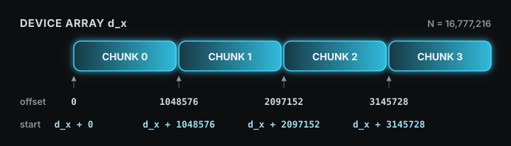

> Source: [07 Concurrency](https://www.youtube.com/watch?v=D3LU_Jz_ar8)

A CUDA program uses a CPU and a GPU together. The CPU side is called the host and the GPU side the device; host memory is the system RAM the CPU uses, and device memory is the memory attached to the GPU. The data to compute on starts out in host memory, so for the GPU to process it the data has to be moved into device memory. The [basic flow](#host-device-data-flow) of a CUDA program is therefore three steps: copy the input from host memory to device memory, run the computation on the GPU, and bring the result back to host memory. The total time differs between finishing these three steps one after another and running steps that belong to different data in the same time window, and the mechanism that decides that arrangement is the stream.

## Host Memory and Device Memory

Allocation is the act of reserving a memory region for the program to use and receiving its starting address as a pointer. A pointer is a variable that holds a memory address. Host memory is allocated with `malloc` and released with `free`. Device memory is then allocated with `cudaMalloc` and released with `cudaFree`, and the pointer returned points to a region the GPU accesses. Because the two pointers point to different memories, a value the CPU wrote into the `malloc` region has to be copied before the GPU can read it. In the code below, `N` is the number of `float` elements, `bytes` is their total size in bytes, and `size_t` is an integer type used for memory sizes. `h_x` is the input the CPU fills and `h_y` is the host memory that receives the result, while `d_x` and `d_y` are device memory of the same size. These four pointers keep the same meaning throughout this post.

```cpp
const size_t N = 1000;
const size_t bytes = N * sizeof(float);

float *h_x = (float *)malloc(bytes);   // host input
float *h_y = (float *)malloc(bytes);   // host output
float *d_x = nullptr;
float *d_y = nullptr;
cudaMalloc(&d_x, bytes);               // device input
cudaMalloc(&d_y, bytes);               // device output
```

## H2D Copy, Kernel Launch, D2H Copy

A copy from host memory to device memory is an H2D (Host to Device) copy, and the opposite direction is a D2H (Device to Host) copy. `cudaMemcpy` is the function that performs this copy, with the direction given in its last argument. Next, the function to run on the GPU, the kernel, is launched with the `<<<grid, block>>>` syntax, and this call is the kernel launch. Here a thread is the GPU's unit of work that executes the kernel, a block is a bundle of threads placed together, and grid is the number of blocks.

This post uses a single kernel throughout. `transform` multiplies each element of the input `x` by two and writes it to the same index of the output `y`.

```cpp
__global__ void transform(const float *x, float *y, size_t count) {
    const size_t i = blockIdx.x * blockDim.x + threadIdx.x;
    if (i < count) {
        y[i] = x[i] * 2.0f;
    }
}
```

`__global__` marks the function as a kernel that runs on the GPU. `blockIdx.x` is this block's index in the grid, `blockDim.x` is the number of threads in one block, and `threadIdx.x` is this thread's index inside the block. The `i` combined from those three is the element index this thread handles, and indices at or beyond `count` are skipped.

The `block` passed to a kernel launch is the number of threads in one block and `grid` is how many such blocks are needed. Threads execute in groups of 32 on the GPU, so the block size is a multiple of 32; this post uses 256. One thread handles one element, so processing `N` elements needs `N / 256` blocks, rounded up when the division is not exact. Once the kernel has written its result into device memory, a D2H copy brings the result back to host memory.

```cpp
const int block = 256;
const int grid = (N + block - 1) / block;

cudaMemcpy(d_x, h_x, bytes, cudaMemcpyHostToDevice);   // H2D copy
transform<<<grid, block>>>(d_x, d_y, N);                // kernel launch
cudaMemcpy(h_y, d_y, bytes, cudaMemcpyDeviceToHost);   // D2H copy
```

These three lines have a fixed order. The kernel must run after the input has arrived in device memory, and the D2H copy must start after the kernel has finished writing the result. So when one piece of data is processed whole, the H2D copy, kernel, and D2H copy line up one after another, and the total time is the sum of the H2D copy time $T_H$, the kernel time $T_K$, and the D2H copy time $T_D$.

$$
T_{\text{serial}} = T_H + T_K + T_D
$$

All three steps are necessary, but steps that belong to different data can overlap. For example, while a kernel processes the first input, the copy engine can perform the H2D copy of the second input, keeping the compute unit and copy unit busy at the same time. The copy engine must continue reading host memory after the CPU has moved on to subsequent code, so first we need to see how that memory is managed by the operating system.

## Page and Pageable Memory

The operating system manages host memory in fixed-size units called pages. A common page size is 4KB. Both the address space the program sees and the actual RAM are divided into this size, and the operating system keeps a table of which RAM location each page of the program is placed in. When `malloc` is called, only the pages of the program's address space are reserved at first, and RAM is attached when that address is first read or written. Host memory whose connection to RAM is made when needed, and may later change, is called pageable memory.

### Page Fault

When the program reads or writes a page that is not yet in RAM, a page fault occurs. A page fault is the signal for the operating system to step in and attach RAM to that page. If RAM is short at that point, the operating system writes the contents of a page that has not been used for a while out to disk and frees that spot; the disk area that holds these evicted pages is called swap or the page file. Reading an evicted page again raises another page fault, and the operating system brings it back from disk into RAM. Because of this, pageable memory can handle data larger than RAM, but which pages are in RAM changes from moment to moment, and the operating system has to step in every time one is missing.

### Pinned Memory

The GPU has hardware dedicated to copies between host memory and device memory, called a copy engine. In this section, it executes DMA (Direct Memory Access). DMA means that dedicated hardware moves data between memories instead of a CPU core moving each byte. When the CPU calls `cudaMemcpyAsync`, the CUDA runtime passes the request to the CUDA driver. The driver is software that submits work to the GPU, and sends the source address, destination address, and size as a copy command. The copy engine executes that command while the CPU runs subsequent code.

A discrete GPU is a separate card connected to the host system through PCIe. Data read from system RAM passes through the CPU's I/O path and the PCIe root complex, the host hardware that connects PCIe devices. After crossing PCIe, the data enters the GPU through PCIe I/O and its internal data path. The GPU memory subsystem contains the L2 cache, which temporarily keeps recently used data, and memory controllers, which handle reads and writes to GPU memory. The copy engine is inside the GPU and executes this H2D transfer. Exact internal placement differs by GPU architecture, so the diagram below shows only the public logical connections. The SM clusters in the diagram are groups of GPU compute units; they are separate from the copy engine.

The copy engine must keep reading the same RAM pages until the copy finishes. The operating system must therefore not move those pages to different page frames or write them out to disk during the transfer. Pageable memory gives no such guarantee. CUDA asks the operating system to leave those page frames in RAM, and host memory fixed this way is called pinned memory. Since its pages do not go out to disk, pinned memory is also called non-pageable memory.

Pinned memory is allocated with `cudaHostAlloc` and released with `cudaFreeHost`. `cudaHostAlloc` is an allocation function that returns host memory just like `malloc`, differing only in that the returned pointer points to pinned memory. It is not a function that copies data, and it does not replace `cudaMalloc`, which creates device memory. So even after switching host memory to pinned memory, device memory is still created separately with `cudaMalloc`.

| Function | Region created |
|---|---|
| `malloc` / `free` | pageable host memory |
| `cudaHostAlloc` / `cudaFreeHost` | pinned host memory |
| `cudaMalloc` / `cudaFree` | device memory |

```cpp
const int N = 1000;
const size_t bytes = N * sizeof(float);

float *h_x = nullptr;
float *h_y = nullptr;
cudaHostAlloc(&h_x, bytes, cudaHostAllocDefault);   // pinned input
cudaHostAlloc(&h_y, bytes, cudaHostAllocDefault);   // pinned output

float *d_x = nullptr;
float *d_y = nullptr;
cudaMalloc(&d_x, bytes);                            // device input
cudaMalloc(&d_y, bytes);                            // device output

// ... H2D copy, kernel, D2H copy ...

cudaFreeHost(h_x);
cudaFreeHost(h_y);
cudaFree(d_x);
cudaFree(d_y);
```

To pin a region that was already created with `malloc`, use `cudaHostRegister`; to unpin it while keeping the region, use `cudaHostUnregister`.

Pinned memory occupies that much real RAM, so no more of it can be created than the RAM size, and past that limit `cudaHostAlloc` returns an out-of-memory error. And pinning a large share of RAM leaves the operating system with less RAM to work with and slows down the host side, so only the regions that exchange data with the GPU are made pinned.


## Asynchronous Calls and cudaMemcpyAsync

An asynchronous call is a call where the CPU moves on to the next line without waiting for the GPU work to complete. A kernel launch is asynchronous to begin with, so the CPU runs the next code before the kernel finishes. To request a copy in the same way, use `cudaMemcpyAsync`. Its arguments are the same as `cudaMemcpy` with one stream appended at the end. To overlap CPU execution with an H2D or D2H copy as in this post, the host-side pointer must refer to pinned memory. With that condition satisfied, the CPU returns from the call before the copy finishes while the copy engine continues the transfer.

For example, if a D2H copy is requested asynchronously to bring the result in `d_y` back to `h_y`, the CPU can run other code before the copy finishes. That does not mean the result in `h_y` is ready yet.

```text
CPU: request D2H copy → CPU code unrelated to the copy → wait for stream → use h_y
GPU:                    D2H copy in progress
```

`cudaStreamSynchronize(stream)` makes the CPU wait until all work in that stream has finished. Therefore, `h_y` is read only after this wait completes.

An asynchronous call only means the CPU does not wait; it does not mean two GPU operations actually run at the same time. Even when the call returns early, the two operations may run one after another inside the GPU. Which operations run in which order is decided by the stream.

## Stream

A stream groups GPU operations whose submission order must be preserved.

Rule 1) Operations in the same stream keep their submission order. If an H2D copy, kernel, and D2H copy are placed in one stream, the kernel runs after the H2D copy finishes, and the D2H copy starts after the kernel finishes.

Rule 2) There is no prescribed order between different streams. CUDA does not guarantee which operation starts first, so either one may run first, at the same time, or later. Operations must be placed in different streams to run in the same time window. Even then, if the GPU cannot run the copy and computation together, the two operations run one after another.

A stream is declared as a variable of type `cudaStream_t` and created with `cudaStreamCreate`. The created stream goes into the last argument of `cudaMemcpyAsync` and the fourth argument of the kernel launch's `<<<>>>`. In `<<<grid, block, 0, stream>>>`, the third value is the number of bytes of [shared memory](), the small memory inside the GPU that the threads of a block use together, to reserve additionally at run time, and `0` means no extra space.

```cpp
cudaStream_t stream;
cudaStreamCreate(&stream);

cudaMemcpyAsync(d_x, h_x, bytes, cudaMemcpyHostToDevice, stream);
transform<<<grid, block, 0, stream>>>(d_x, d_y, N);
cudaMemcpyAsync(h_y, d_y, bytes, cudaMemcpyDeviceToHost, stream);

cudaStreamSynchronize(stream);
cudaStreamDestroy(stream);
```

None of the three calls holds the CPU, but because they enter the same stream, the kernel runs after the H2D copy finishes and the D2H copy starts after the kernel finishes. So the H2D copy → kernel → D2H copy order for the same data is kept by the stream. `cudaStreamSynchronize` is the function that makes the CPU wait until all work in that stream has finished, and `cudaStreamQuery` only reports whether the stream is empty without waiting. A stream that is no longer needed is removed with `cudaStreamDestroy`.

## Chunk

When a large array is processed in one piece, the kernel starts only after the entire input has been copied from host to device, and the result is copied back only after the entire kernel has finished. The array is divided into several ranges to reduce this waiting. One such piece of data is called a chunk.

For example, consider `y[i] = x[i] * 2` on an array of 8 elements, where `i` runs from 0 to 7. Dividing that array into two chunks of 4 elements makes `x[0]` through `x[3]` chunk 0 and `x[4]` through `x[7]` chunk 1. Each of `y[0]` through `y[3]` needs only the `x` value at the same index, so it can be computed without any value from chunk 1. The two chunks are therefore processed without waiting for each other.

Call the H2D copy, kernel, and D2H copy for chunk 0 H0, K0, and D0, and place all three in stream 0. Place H1, K1, and D1 for chunk 1 in stream 1. Each stream preserves H0 → K0 → D0 and H1 → K1 → D1. There is no prescribed order between the two streams, so when the GPU can run a copy and a kernel at the same time, H1 can be copied while K0 runs and D0 can be copied while K1 runs.

The loop submits all three operations of one chunk before moving to the next, and `chunk % streamCount` sends chunk 0 to stream 0, chunk 1 to stream 1, chunk 2 to stream 2, and chunk 3 to stream 3. The top row of the figure below is the order in which the CPU submits, and the four rows beneath it are the streams each operation went into.


Once submission is finished, the GPU executes those operations as shown below.


Both rows above use the same horizontal scale, and the dashed lines inside each serial bar mark where that bar divides into four chunks. One dashed division has the same width as one chunk below it, so both arrangements perform the same amount of work. What changes is only where that work is placed on the time axis.

To put this structure in code, several streams are created and rotated across chunks. Device memory is allocated once at the full array size, and only the start of each chunk is moved with `offset`. `offset` is the element index at which the current chunk begins, and `d_x + offset` is the address of the element `offset` positions after the one `d_x` points to. The loop increases `offset` by `chunkElements` each time, so every chunk points at a different range of the same array.



```cpp
constexpr int streamCount = 4;
constexpr size_t N = 1ULL << 24;          // 16,777,216 elements
constexpr size_t chunkElements = 1 << 20; // 1,048,576 elements
constexpr size_t bytes = N * sizeof(float);

float *h_x = nullptr;
float *h_y = nullptr;
float *d_x = nullptr;
float *d_y = nullptr;

cudaHostAlloc(&h_x, bytes, cudaHostAllocDefault);
cudaHostAlloc(&h_y, bytes, cudaHostAllocDefault);
cudaMalloc(&d_x, bytes);
cudaMalloc(&d_y, bytes);

for (size_t i = 0; i < N; ++i) {
    h_x[i] = static_cast<float>(i);
}

cudaStream_t streams[streamCount];
for (int i = 0; i < streamCount; ++i) {
    cudaStreamCreate(&streams[i]);
}

for (size_t chunk = 0, offset = 0; offset < N;
     ++chunk, offset += chunkElements) {
    const size_t count = (N - offset < chunkElements)
                       ? N - offset : chunkElements;
    const size_t chunkBytes = count * sizeof(float);
    cudaStream_t stream = streams[chunk % streamCount];

    cudaMemcpyAsync(d_x + offset, h_x + offset, chunkBytes,
                    cudaMemcpyHostToDevice, stream);

    const int block = 256;
    const int grid = static_cast<int>((count + block - 1) / block);
    transform<<<grid, block, 0, stream>>>(
        d_x + offset, d_y + offset, count);

    cudaMemcpyAsync(h_y + offset, d_y + offset, chunkBytes,
                    cudaMemcpyDeviceToHost, stream);
}

cudaDeviceSynchronize();

for (int i = 0; i < streamCount; ++i) {
    cudaStreamDestroy(streams[i]);
}

cudaFreeHost(h_x);
cudaFreeHost(h_y);
cudaFree(d_x);
cudaFree(d_y);
```

`transform` computes the `y[i] = x[i] * 2` operation used above. Both `h_x` and `h_y` are pinned memory because they are used for asynchronous H2D and D2H copies, while `d_x` and `d_y` are device memory. Each trip through the loop handles one chunk and submits its three operations to the same stream. After all chunks have been submitted, `cudaDeviceSynchronize` waits for all work on the device before the streams and memory are released.

For two chunks, compare the submission order of the loop above with an order that groups operations by kind:

```text
depth-first:   H0 → K0 → D0 → H1 → K1 → D1
breadth-first: H0 → H1 → K0 → K1 → D0 → D1
```

Both forms preserve H0 → K0 → D0 in stream 0 and H1 → K1 → D1 in stream 1. The code here uses depth-first order, submitting all three operations for one chunk first.

When a stream is reused, the new work attaches behind the earlier work in that stream. So chunk 4, which reuses `streams[0]`, runs after the D2H copy of chunk 0 has finished. Memory allocation and stream creation are setup steps that do not need to be repeated for every chunk, so they are completed once before the loop. The loop contains only the H2D copy, kernel launch, and D2H copy, and keeps using the memory and streams created in advance.

The actual shape of the overlap depends on how much data each chunk copies and how long the kernel runs. If the kernel is very short, overlapping a copy with the kernel saves little time. On a GPU whose copy-engine configuration can handle H2D and D2H at the same time, the overlap between the next chunk's H2D copy and the previous chunk's D2H copy can provide a larger gain.

## Default Stream

A kernel launch or `cudaMemcpy` with no stream specified goes into the default stream. The default stream in the standard configuration is called the legacy default stream. When it is used together with streams created by `cudaStreamCreate` above, a default-stream operation starts after all previously submitted work has finished, and the next operation starts only after the default-stream operation has finished.

Below, three chunks from the previous section are submitted, but the middle line is missing its stream argument. `c` is the number of elements in one chunk, and the three launches handle chunks 0, 1, and 2.

```cpp
const size_t c = chunkElements;

transform<<<grid, block, 0, streams[0]>>>(d_x,         d_y,         c);  // A: chunk 0
transform<<<grid, block>>>               (d_x + c,     d_y + c,     c);  // B: stream argument missing
transform<<<grid, block, 0, streams[1]>>>(d_x + 2 * c, d_y + 2 * c, c);  // C: chunk 2
```

B has no stream argument, so it goes into the legacy default stream. B therefore starts after A finishes and C starts after B finishes, and A and C, which were in different streams and could have overlapped, no longer do. For this reason, every copy and kernel launch in a region intended to overlap names a stream explicitly.

With the compiler option `nvcc --default-stream per-thread`, each CPU thread gets its own default stream, and B above does not automatically block between A and C. This option is used when code written to use the default stream is run together with explicitly created streams.


## Putting a Host Function into a Stream

`cudaLaunchHostFunc` inserts a function that runs on the CPU as an operation in a stream. The `stream` below is one created with `cudaStreamCreate`. If a CPU function named `process` must read the result of `transform`, the kernel, D2H copy, and host function are placed in the same stream in that order. `CUDART_CB` marks the function form CUDA uses to call this CPU function.

```cpp
void CUDART_CB process(void *data) {
    float *result = static_cast<float *>(data);
    // Process result on the CPU. Do not call a CUDA API here.
}

transform<<<grid, block, 0, stream>>>(d_x, d_y, N);
cudaMemcpyAsync(h_y, d_y, bytes, cudaMemcpyDeviceToHost, stream);
cudaLaunchHostFunc(stream, process, h_y);
```

`process` is called after the D2H copy has finished, so it can read the completed `h_y`. The stream does not advance to its next operation until `process` returns, and no CUDA API calls such as kernel launches or `cudaMalloc` are made inside `process`.

## CUDA Event

A CUDA event marks a position in a stream. Calling `cudaEventRecord` inserts the event into the stream, and the event completes when all preceding operations have finished and execution reaches that position. To measure a kernel's execution time, a start event, the kernel, and a stop event are placed in the same stream in that order.

```cpp
cudaEvent_t start;
cudaEvent_t stop;
cudaEventCreate(&start);
cudaEventCreate(&stop);

cudaEventRecord(start, stream);
transform<<<grid, block, 0, stream>>>(d_x, d_y, N);
cudaEventRecord(stop, stream);
cudaEventSynchronize(stop);

float milliseconds = 0.0f;
cudaEventElapsedTime(&milliseconds, start, stop);

cudaEventDestroy(start);
cudaEventDestroy(stop);
```

`cudaEventSynchronize(stop)` makes the CPU wait until the stop event completes. After that, `cudaEventElapsedTime` writes the GPU time between start and stop into `milliseconds`.

Events are also used to create an order between two streams. Below, `d_z` is device memory allocated with `cudaMalloc` at the same size as `d_x` and `d_y`, and `stream0` and `stream1` are streams created with `cudaStreamCreate`. The `transform` in stream 0 writes its result into `d_y`, and the `transform` in stream 1 reads that `d_y` as input and writes `d_z`. Because the two kernels are in different streams, rule 2 leaves their order undefined, so the kernel in stream 1 could start first. A `ready` event is therefore recorded after the kernel in stream 0, and stream 1 waits for that event before its kernel.

```cpp
cudaEvent_t ready;
cudaEventCreate(&ready);

transform<<<grid, block, 0, stream0>>>(d_x, d_y, N);
cudaEventRecord(ready, stream0);

cudaStreamWaitEvent(stream1, ready, 0);
transform<<<grid, block, 0, stream1>>>(d_y, d_z, N);

cudaStreamSynchronize(stream1);
cudaEventDestroy(ready);
```

In the code above, `cudaStreamWaitEvent` makes only the later work in stream 1 wait; it does not make the CPU wait. The final argument `0` specifies no additional behavior. This creates only the order between the two kernels without stopping the whole device.


## Running Several Kernels at Once

Two kernels that process different arrays do not need to wait for each other's results. All four pointers below are device memory allocated with `cudaMalloc` at `bytes` each: `d_x0` and `d_y0` are the input and output of the first computation, and `d_x1` and `d_y1` are the input and output of the second. Placing the two kernels in different streams creates the possibility that they run at the same time on the same GPU.

```cpp
transform<<<grid, block, 0, stream0>>>(d_x0, d_y0, N);
transform<<<grid, block, 0, stream1>>>(d_x1, d_y1, N);
```

An SM (Streaming Multiprocessor) is a GPU compute unit on which a kernel's blocks are actually placed. If the first kernel's blocks occupy every execution slot on every SM, the second kernel waits for a slot to open even though it is in another stream. If the first kernel uses only some of the slots, blocks from the second kernel can enter the remaining slots and execute in the same time window.

If a single kernel can fill the GPU, that one kernel is the fastest. Running several kernels at once is meaningful when work arrives in small units that are hard to merge into one kernel.

Stream priority is the priority the GPU consults when deciding which stream's kernel to take the next block from. For example, a long-running background kernel can be placed in a low-priority stream, while a short kernel that needs to start promptly can be placed in a high-priority stream. High priority does not interrupt a block that is already running. It only makes the GPU choose the next block from the high-priority stream first when a slot opens on an SM. Priority streams are created with `cudaStreamCreateWithPriority`, and the available priority range is read with `cudaDeviceGetStreamPriorityRange`.

## Streams on Multiple GPUs

The same stream rules carry over when there are several GPUs. `cudaGetDeviceCount` reads the number of GPUs, and `cudaSetDevice` selects the GPU that subsequent CUDA calls will target. The selected GPU is the current device. Device memory and streams are bound to the current device at the time they are created. In the example below, `d0_x`, `d0_y`, and `stream0` belong to GPU 0, while `d1_x`, `d1_y`, and `stream1` belong to GPU 1, and each GPU runs the `transform` defined earlier on its own arrays.

```cpp
float *d0_x = nullptr, *d0_y = nullptr;
float *d1_x = nullptr, *d1_y = nullptr;
cudaStream_t stream0;
cudaStream_t stream1;

cudaSetDevice(0);
cudaMalloc(&d0_x, bytes);
cudaMalloc(&d0_y, bytes);
cudaStreamCreate(&stream0);   // stream bound to GPU 0
transform<<<grid, block, 0, stream0>>>(d0_x, d0_y, N);

cudaSetDevice(1);
cudaMalloc(&d1_x, bytes);
cudaMalloc(&d1_y, bytes);
cudaStreamCreate(&stream1);   // stream bound to GPU 1
transform<<<grid, block, 0, stream1>>>(d1_x, d1_y, N);

cudaSetDevice(0);
cudaStreamSynchronize(stream0);
cudaStreamDestroy(stream0);
cudaFree(d0_x);
cudaFree(d0_y);

cudaSetDevice(1);
cudaStreamSynchronize(stream1);
cudaStreamDestroy(stream1);
cudaFree(d1_x);
cudaFree(d1_y);
```

Because kernel launches do not make the CPU wait, the CPU can submit `transform` to GPU 0 and then immediately submit it to GPU 1. At the end, each GPU is selected again and the CPU waits for its stream to finish. To move data between GPUs, peer access can be used. Peer access is the ability of one GPU to read and write another GPU's memory directly, and it requires the two GPUs to be on the same interconnect such as PCIe or NVLink. `cudaDeviceCanAccessPeer` checks whether it is supported; if copies go in both directions, `cudaDeviceEnablePeerAccess` is called on both sides, and then `cudaMemcpyPeerAsync` performs the copy. The data then moves straight from one GPU's memory to the other's without passing through host memory.


## Unified Memory and Prefetch

The stream rules are the same with [Unified Memory](#unified-memory-and-managed-allocation). `cudaMemPrefetchAsync` moves a region created with Unified Memory toward the CPU or a GPU in advance. In the code below, `x` and `y` are Unified Memory pointers allocated with `cudaMallocManaged` that both the CPU and the GPU access through the same pointer, and `device` is the number of the GPU that will run the kernel. `cudaCpuDeviceId` is the CUDA constant that names the CPU as the destination.

```cpp
const int device = 0;
cudaSetDevice(device);

float *x = nullptr;
float *y = nullptr;
cudaMallocManaged(&x, bytes);
cudaMallocManaged(&y, bytes);

cudaStream_t stream;
cudaStreamCreate(&stream);

cudaMemPrefetchAsync(x, bytes, device, stream);          // move input to GPU
transform<<<grid, block, 0, stream>>>(x, y, N);
cudaMemPrefetchAsync(y, bytes, cudaCpuDeviceId, stream); // move result to CPU
cudaStreamSynchronize(stream);

cudaStreamDestroy(stream);
cudaFree(x);
cudaFree(y);
```

Because all operations are in the same stream, the kernel starts after the prefetch toward the GPU finishes, and the prefetch toward the CPU starts after the kernel finishes. Once the final wait completes, the CPU can read `y`. This movement happens page by page and also updates page records on both the CPU and the GPU, which can leave empty gaps on the execution timeline.

## Checking in Nsight Systems

Whether concurrent execution actually happened is checked on the GPU execution timeline. Nsight Systems is a tool that records the CPU's CUDA calls and the GPU's copies and kernel executions on the same timeline while the program runs.

Compiling the chunk code above with `nvcc` produces an executable; calling it `overlap`, it is run as follows.

```bash
nsys profile --stats=true ./overlap
```

This command saves the run as a report file and prints a summary of CUDA calls, kernels, and copies. Opening the report file in the Nsight Systems window shows the CPU-side calls on top and the GPU-side copies and kernels below. In the serial code the H2D copy, kernel, and D2H copy appear in a single line; in the code with several streams the rows split per stream and the kernel of one chunk appears in the same time range as the copy of another chunk.

In the end, concurrency is not a technique for removing dependencies. The H2D copy → kernel → D2H copy order of the same data is kept with the same stream, and only independent chunks are split across different streams. Whether the times actually overlap is decided by the copy-engine configuration and by open execution slots on the SMs.

## References

1. [OLCF CUDA Training Series: CUDA Concurrency](https://www.olcf.ornl.gov/cuda-training-series/)
2. [CUDA Concurrency slides](https://www.olcf.ornl.gov/wp-content/uploads/2020/07/07_Concurrency.pdf)
3. [OLCF CUDA Training Series: HW7](https://github.com/olcf/cuda-training-series/tree/master/exercises/hw7)
4. [CUDA Programming Guide: Asynchronous Execution](https://docs.nvidia.com/cuda/cuda-programming-guide/02-basics/asynchronous-execution.html)
5. [CUDA C++ Best Practices Guide: Asynchronous and Overlapping Transfers with Computation](https://docs.nvidia.com/cuda/cuda-c-best-practices-guide/index.html#asynchronous-and-overlapping-transfers-with-computation)
6. [CUDA Runtime API: API Synchronization Behavior](https://docs.nvidia.com/cuda/cuda-runtime-api/api-sync-behavior.html)
7. [Nsight Systems User Guide](https://docs.nvidia.com/nsight-systems/UserGuide/index.html)
