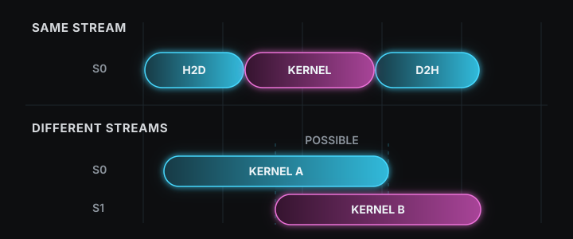

> Source: [07 Concurrency](https://www.youtube.com/watch?v=D3LU_Jz_ar8)

CUDA 프로그램은 CPU와 GPU를 함께 사용한다. 이때 CPU 쪽을 host, GPU 쪽을 device라고 부르며, host memory는 CPU가 사용하는 system RAM이고 device memory는 GPU에 달린 memory다. 계산에 쓸 데이터는 처음에 host memory에 있으므로, GPU가 그 데이터를 처리하려면 device memory로 옮겨야 한다. 그래서 CUDA 프로그램의 [기본 흐름](#host-device-데이터-흐름)은 host memory의 입력을 device memory로 복사하고, GPU에서 계산을 실행한 뒤, 결과를 host memory로 되돌리는 세 단계로 이루어진다. 이 세 단계를 차례로 끝낼 때와 서로 다른 데이터에 속한 단계를 같은 시간대에 실행할 때 전체 시간이 달라지는데, 그 배치를 정하는 장치가 stream이다.

## Host Memory와 Device Memory

할당(allocation)은 프로그램이 사용할 memory 영역을 확보하고 그 시작 주소를 pointer로 돌려받는 일이다. Pointer는 memory 주소를 담는 변수다. Host memory는 `malloc`으로 할당하고 `free`로 해제한다. 그다음 device memory는 `cudaMalloc`으로 할당하고 `cudaFree`로 해제하며, 돌려받은 pointer는 GPU가 접근하는 영역을 가리킨다. 두 pointer가 서로 다른 memory를 가리키기 때문에 CPU가 `malloc` 영역에 써 둔 값을 GPU가 읽으려면 복사가 필요하다. 아래 코드에서 `N`은 `float` 원소의 개수이고, `bytes`는 그 원소들이 차지하는 전체 byte 수다. `size_t`는 memory 크기를 담는 정수 타입이다.

```cpp
const int N = 1000;
const size_t bytes = N * sizeof(float);

float *h_x = (float *)malloc(bytes);   // host memory
float *d_x = nullptr;
cudaMalloc(&d_x, bytes);               // device memory
```

## H2D Copy, Kernel Launch, D2H Copy

Host memory에서 device memory로 옮기는 복사를 H2D(Host to Device) copy라고 하고, 반대 방향을 D2H(Device to Host) copy라고 한다. `cudaMemcpy`는 이 복사를 수행하는 함수로, 마지막 인자에 복사 방향을 적는다. 그다음 GPU에서 실행할 함수인 kernel을 `<<<grid, block>>>` 구문으로 실행하는데, 이 호출을 kernel launch라고 한다. 여기서 thread는 kernel을 실행하는 GPU의 작업 단위이고, block은 함께 배치되는 thread의 묶음이며, grid는 block의 개수다. Kernel이 결과를 device memory에 쓰고 나면 D2H copy로 결과를 host memory로 가져온다.

```cpp
cudaMemcpy(d_x, h_x, bytes, cudaMemcpyHostToDevice);   // H2D copy
transform<<<grid, block>>>(d_x, d_y, N);                // kernel launch
cudaMemcpy(h_y, d_y, bytes, cudaMemcpyDeviceToHost);   // D2H copy
```

이 세 줄에는 정해진 순서가 있다. Kernel은 입력이 device memory에 도착한 뒤에 실행돼야 하고, D2H copy는 kernel이 결과를 다 쓴 뒤에 시작돼야 한다. 그래서 데이터 하나를 통째로 처리하면 H2D copy, kernel, D2H copy는 한 줄로 이어지고, H2D copy 시간 $T_H$, kernel 시간 $T_K$, D2H copy 시간 $T_D$를 더한 값이 전체 시간이 된다.

$$
T_{\text{serial}} = T_H + T_K + T_D
$$

세 단계는 모두 필요하지만, 다른 데이터에 속한 단계를 그 사이에 끼워 넣으면 GPU의 복사 장치와 계산 장치가 같은 시간대에 일할 수 있다. 그 방법은 host memory가 운영체제 안에서 어떻게 관리되는지에서 출발한다.

## Page와 Pageable Memory

운영체제는 host memory를 page라는 일정한 크기의 단위로 나눠 관리한다. 흔한 page 크기는 4KB다. 프로그램이 보는 주소 공간과 실제 RAM이 둘 다 이 크기로 나뉘고, 운영체제는 프로그램의 각 page가 RAM의 어느 위치에 놓였는지 표로 기록한다. `malloc`으로 할당하면 우선 프로그램 주소 공간의 page만 잡히고, RAM은 그 주소를 처음 읽거나 쓸 때 붙는다. 이렇게 RAM과의 연결이 필요할 때 만들어지고 나중에 바뀔 수도 있는 host memory를 pageable memory라고 한다.

### Page Fault

프로그램이 아직 RAM에 없는 page를 읽거나 쓰면 page fault가 발생한다. Page fault는 운영체제가 개입해 그 page에 RAM을 붙이라는 신호다. 이때 RAM이 부족하면 운영체제는 한동안 쓰지 않은 page의 내용을 disk로 내보내고 그 자리를 비우는데, 이렇게 내보낸 page를 보관하는 disk 영역을 swap 또는 page file이라고 한다. 내보낸 page를 다시 읽으면 page fault가 한 번 더 일어나고, 운영체제가 disk에서 RAM으로 되가져온다. 이 때문에 pageable memory는 RAM보다 큰 데이터도 다룰 수 있지만, 어떤 page가 RAM에 있는지가 매 순간 달라지고, 없을 때마다 운영체제가 개입해야 한다.

### Pinned Memory

GPU에는 host memory와 device memory 사이의 복사를 전담하는 hardware인 copy engine이 있다. Copy engine은 CPU가 복사를 지시한 뒤에는 CPU와 상관없이 스스로 데이터를 옮기는데, 그러려면 옮기는 동안 host 쪽 데이터가 RAM의 어느 위치에 있는지가 바뀌지 않아야 한다. Pageable memory는 그 보장을 주지 못한다. 그래서 CUDA는 운영체제에 해당 page를 RAM에 그대로 두고 위치도 바꾸지 말라고 요청한 host memory를 따로 두며, 이렇게 RAM에 고정된 host memory를 pinned memory라고 한다. Pinned memory에서는 page가 disk로 나가지 않으므로 non-pageable memory라고도 부른다.

Pinned memory는 `cudaHostAlloc`으로 할당하고 `cudaFreeHost`로 해제한다. `cudaHostAlloc`은 `malloc`처럼 host memory를 돌려주는 할당 함수이고, 돌려준 pointer가 pinned memory를 가리킨다는 점만 다르다. 이 함수는 데이터를 복사하는 함수가 아니며, device memory를 만드는 `cudaMalloc`을 대신하지도 않는다. 그래서 host memory를 pinned memory로 바꾸더라도 device memory는 여전히 `cudaMalloc`으로 따로 만든다.

| 함수 | 만드는 영역 |
|---|---|
| `malloc` / `free` | pageable host memory |
| `cudaHostAlloc` / `cudaFreeHost` | pinned host memory |
| `cudaMalloc` / `cudaFree` | device memory |

```cpp
const int N = 1000;
const size_t bytes = N * sizeof(float);

float *h_x = nullptr;
cudaHostAlloc(&h_x, bytes, cudaHostAllocDefault);   // pinned host memory
float *d_x = nullptr;
cudaMalloc(&d_x, bytes);                            // device memory

// ... h_x와 d_x를 사용하는 작업 ...

cudaFreeHost(h_x);
cudaFree(d_x);
```

이미 `malloc`으로 만든 영역을 뒤늦게 고정할 때는 `cudaHostRegister`를 쓰고, 고정만 풀고 영역은 남길 때는 `cudaHostUnregister`를 쓴다.

Pinned memory는 실제 RAM을 그만큼 차지하므로 RAM 크기보다 많이 만들 수 없고, 그 한도를 넘기면 `cudaHostAlloc`이 memory 부족 오류를 돌려준다. 그리고 RAM의 큰 부분을 고정하면 운영체제가 쓸 RAM이 줄어 host 쪽 실행이 느려지므로, GPU와 데이터를 주고받는 영역만 pinned memory로 만든다.


## 비동기 호출과 cudaMemcpyAsync

비동기 호출은 CPU가 GPU 작업의 완료를 기다리지 않고 바로 다음 줄로 진행하는 호출이다. Kernel launch는 원래 비동기 호출이어서 CPU는 kernel이 끝나기 전에 다음 코드를 실행한다. 반면 `cudaMemcpy`는 앞서 제출한 GPU 작업이 모두 끝난 뒤에야 복사를 시작하고, 복사가 끝날 때까지 CPU를 멈춘다. 이 멈춤을 없앤 함수가 `cudaMemcpyAsync`다. 인자는 `cudaMemcpy`와 같고 마지막에 stream 하나가 더 붙는데, CPU는 호출 직후 돌아오고 복사는 copy engine이 나중에 수행한다. 이때 host 쪽 pointer는 pinned memory여야 한다. Copy engine이 언제든 시작할 수 있으려면 host 쪽 page가 움직이지 않아야 하기 때문이다.

비동기 호출은 CPU가 기다리지 않는다는 뜻일 뿐, 두 GPU 작업이 실제로 같은 시간에 실행된다는 뜻은 아니다. 호출이 일찍 돌아와도 GPU 안에서는 두 작업이 차례로 실행될 수 있다. 어떤 작업이 어떤 순서로 실행되는지는 stream이 정한다.

## Stream

Stream은 GPU에서 제출된 순서대로 실행되는 작업의 열이다. 규칙은 둘이다. 첫째, 같은 stream에 제출한 두 작업은 제출 순서대로 실행되며, 앞 작업이 끝나기 전에 뒤 작업이 시작하지 않는다. 둘째, 서로 다른 stream에 제출한 두 작업 사이에는 CUDA가 아무 순서도 정하지 않는다. 그래서 stream 1의 작업은 stream 2의 작업보다 먼저, 동시에, 또는 나중에 실행될 수 있다. 두 작업을 같은 시간대에 실행하려면 서로 다른 stream에 넣어야 하고, 같은 stream에 넣으면 겹칠 가능성이 없다. 서로 다른 stream에 넣는 것은 겹침의 필요조건이지 충분조건은 아니어서, GPU에 남는 자원이 없으면 다른 stream의 작업도 차례로 실행된다.

Stream은 `cudaStream_t` 타입의 변수로 선언하고 `cudaStreamCreate`로 만든다. 만든 stream은 `cudaMemcpyAsync`의 마지막 인자와 kernel launch의 `<<<>>>` 네 번째 인자에 넣는다. `<<<grid, block, 0, stream>>>`에서 세 번째 값은 block 안의 thread들이 함께 쓰는 GPU 안의 작은 memory인 [shared memory]()를 실행 중에 추가로 확보할 크기이고, `0`이면 추가 공간을 쓰지 않는다.

```cpp
cudaStream_t stream;
cudaStreamCreate(&stream);

cudaMemcpyAsync(d_x, h_x, bytes, cudaMemcpyHostToDevice, stream);
transform<<<grid, block, 0, stream>>>(d_x, d_y, N);
cudaMemcpyAsync(h_y, d_y, bytes, cudaMemcpyDeviceToHost, stream);

cudaStreamSynchronize(stream);
cudaStreamDestroy(stream);
```

세 호출은 모두 CPU를 기다리게 하지 않지만 같은 stream에 들어가므로, H2D copy가 끝난 뒤 kernel이 실행되고 kernel이 끝난 뒤 D2H copy가 시작된다. 그래서 같은 데이터의 H2D copy → kernel → D2H copy 순서는 stream이 지킨다. `cudaStreamSynchronize`는 그 stream의 작업이 모두 끝날 때까지 CPU를 기다리게 하는 함수이고, `cudaStreamQuery`는 기다리지 않고 stream이 비었는지만 알려 준다. 다 쓴 stream은 `cudaStreamDestroy`로 없앤다.



## Chunk

큰 배열을 한 번에 처리하면 H2D copy 전체가 끝나야 kernel이 시작하고, kernel 전체가 끝나야 D2H copy가 시작한다. 이 때문에 배열을 여러 구간으로 나누는데, 이렇게 나눈 한 조각을 chunk라고 한다. 출력 원소 하나가 같은 위치의 입력에만 의존하는 연산이라면 chunk끼리 서로 기다릴 이유가 없다. 이때 한 chunk의 H2D copy, kernel, D2H copy를 같은 stream에 넣어 첫째 규칙으로 순서를 지키고, 다음 chunk는 다른 stream에 넣어 둘째 규칙으로 겹칠 여지를 만든다. 그 결과 chunk 1의 kernel이 실행되는 동안 chunk 2의 H2D copy와 chunk 0의 D2H copy가 진행될 수 있다.

이 구조를 코드로 옮길 때는 stream을 여러 개 만들어 chunk마다 돌려 쓴다. Device memory는 배열 전체 크기로 한 번만 할당하고, 각 chunk의 시작 위치만 `offset`으로 옮긴다.

```cpp
constexpr int streamCount = 4;
constexpr size_t chunkElements = 1 << 20;

cudaStream_t streams[streamCount];
for (int i = 0; i < streamCount; ++i) {
    cudaStreamCreate(&streams[i]);
}

for (size_t chunk = 0, offset = 0; offset < N;
     ++chunk, offset += chunkElements) {
    const size_t count = std::min(chunkElements, N - offset);
    const size_t chunkBytes = count * sizeof(float);
    cudaStream_t stream = streams[chunk % streamCount];

    cudaMemcpyAsync(d_x + offset, h_x + offset, chunkBytes,
                    cudaMemcpyHostToDevice, stream);

    const int block = 256;
    const int grid = static_cast<int>((count + block - 1) / block);
    transform<<<grid, block, 0, stream>>>(
        d_x + offset, d_y + offset, count);

    cudaMemcpyAsync(h_y + offset, d_y + offset, chunkBytes,
                    cudaMemcpyDeviceToHost, stream);
}

cudaDeviceSynchronize();

for (int i = 0; i < streamCount; ++i) {
    cudaStreamDestroy(streams[i]);
}
```

반복문 한 바퀴가 chunk 하나를 맡고, 그 안에서 H2D copy, kernel, D2H copy를 연달아 같은 stream에 제출한 뒤 다음 chunk로 넘어간다. 이렇게 한 chunk의 세 단계를 먼저 끝까지 제출하는 순서를 depth-first issue order라고 한다. 반대로 모든 chunk의 H2D copy를 먼저 제출하고 kernel과 D2H copy를 종류별로 몰아 제출하면 breadth-first issue order다. 두 순서 모두 같은 겹침을 만들 수 있지만, 한 종류의 작업이 앞쪽에 길게 쌓이면 GPU가 받아 둘 수 있는 양을 넘겨 겹침이 줄어들 수 있으므로 depth-first issue order가 더 안정적이다.

같은 stream을 다시 쓰면 새 작업은 그 stream의 앞 작업 뒤에 붙는다. 그래서 `streams[0]`을 다시 쓰는 chunk 4는 chunk 0의 D2H copy가 끝난 뒤 실행되고, 이 순서는 첫째 규칙이 지키므로 별도의 제어가 필요 없다. 이와 달리 memory 할당과 stream 생성은 반복문 전에 마친다. `cudaMalloc`이나 `cudaStreamCreate`는 stream 인자를 받지 않아 반복문 안에 들어가면 앞뒤 작업의 겹침을 끊기 때문이다. 그래서 반복문 안에는 stream 인자를 받는 복사와 kernel launch만 남기고, 미리 만든 자원을 계속 사용한다.

실제 겹침의 모양은 chunk마다 복사하는 데이터 양과 kernel 실행 시간에 따라 달라진다. Kernel이 아주 짧은 연산이라면 kernel과의 겹침보다 H2D copy와 D2H copy끼리의 겹침이 주된 이득이 된다.


## Default Stream

Stream을 지정하지 않은 kernel launch와 `cudaMemcpy`는 default stream에 들어간다. 기본 설정의 default stream은 legacy default stream으로, 여기에 제출한 작업은 그보다 앞서 어느 stream에 제출됐든 모든 작업이 끝난 뒤에야 시작하고, 그 뒤에 제출되는 모든 작업은 이 작업이 끝나기를 기다린다. 그래서 chunk 반복문 중간에 default stream 작업이 하나라도 들어가면 앞뒤 stream의 겹침이 끊긴다. 이 때문에 겹침을 만드는 구간에서는 모든 복사와 kernel launch에 직접 만든 stream을 적는다.

컴파일 옵션 `nvcc --default-stream per-thread`를 주면 default stream이 이런 기다림 없이 보통 stream처럼 동작하고 CPU thread마다 따로 생긴다. 이 옵션은 default stream을 쓰도록 이미 작성된 코드를 고치지 않고 다른 stream과 섞을 때 쓰인다.


## Host 함수를 Stream에 넣기

`cudaLaunchHostFunc`는 CPU에서 실행할 함수를 stream에 제출하는 함수다. 제출된 함수는 stream의 실행이 그 위치에 도달했을 때 호출되므로, 같은 stream에 먼저 넣은 kernel이 끝난 뒤에 실행된다. 이 함수 안에서는 kernel launch나 `cudaMalloc` 같은 CUDA 호출을 하지 않는다. Kernel 결과를 CPU가 이어서 처리해야 할 때 `cudaDeviceSynchronize`로 전체를 멈추는 대신 이 함수로 순서를 맞출 수 있고, 이전에 같은 역할을 하던 `cudaStreamAddCallback`은 이 함수로 대체됐다.

## CUDA Event

CUDA event는 stream 안에 놓는 표시다. `cudaEventRecord`로 stream에 넣으면 기록(record)된 것이고, stream의 실행이 그 위치에 도달하면 완료(complete)된다. 그래서 `cudaEventSynchronize`로 특정 event가 완료될 때까지 CPU를 기다리게 하거나, 두 event 사이의 시간을 `cudaEventElapsedTime`으로 읽을 수 있다.

두 stream 사이에 순서를 만들 때도 event를 쓴다. `cudaStreamWaitEvent`는 한 stream의 이후 작업을 다른 stream에 기록한 event가 완료될 때까지 기다리게 한다. 이는 둘째 규칙을 프로그래머가 필요한 지점에서만 깨는 방법이므로, 기다림이 필요한 곳에만 쓴다.

```cpp
cudaEvent_t ready;
cudaEventCreate(&ready);

produce<<<grid, block, 0, stream0>>>(data);
cudaEventRecord(ready, stream0);

cudaStreamWaitEvent(stream1, ready, 0);
consume<<<grid, block, 0, stream1>>>(data);

cudaStreamSynchronize(stream1);
cudaEventDestroy(ready);
```

위 코드에서 `consume`은 `produce`가 끝난 뒤 실행된다. 그 결과 CPU나 device 전체를 멈추지 않고도 두 stream 사이에 필요한 순서만 만들 수 있다.


## 여러 Kernel의 동시 실행

Copy와 kernel뿐 아니라 서로 독립적인 kernel끼리도 다른 stream에 넣을 수 있고, 그러면 같은 GPU에서 동시에 실행될 가능성이 생긴다. 그러나 GPU는 block을 나눠 줄 때 먼저 제출된 kernel의 block부터 배치하므로, 먼저 제출한 kernel이 GPU의 계산 자원을 거의 다 채우면 다음 kernel은 빈자리가 날 때까지 기다린다. 그래서 동시 실행을 눈으로 확인하려면 자원을 적게 쓰면서 오래 실행되는 kernel이 필요하다.

하나의 kernel로 GPU를 충분히 채울 수 있다면 그 kernel 하나가 가장 빠르다. 여러 kernel의 동시 실행은 작업이 작은 단위로 들어와서 하나의 kernel로 합치기 어려울 때 의미가 있다.

Stream priority는 GPU가 다음 block을 어느 stream의 kernel에서 가져올지 정할 때 참고하는 우선순위다. `cudaStreamCreateWithPriority`로 우선순위를 지정한 stream을 만들 수 있고, 사용 가능한 범위는 `cudaDeviceGetStreamPriorityRange`로 읽는다. 이 우선순위는 이미 실행 중인 block을 중단시키지 않으며, 낮은 우선순위 kernel이 먼저 끝나 버리면 차이가 드러나지 않는다.

## 여러 GPU의 Stream

같은 stream 규칙은 GPU가 여러 개일 때도 이어진다. `cudaGetDeviceCount`로 GPU 개수를 읽고, `cudaSetDevice`로 이후 CUDA 호출의 대상이 될 GPU를 고른다. 이렇게 고른 GPU를 current device라고 한다. Stream과 event는 만들어질 때의 current device에 묶이므로, 다른 device가 선택된 상태에서 그 stream에 kernel을 제출하면 실패한다.

```cpp
cudaSetDevice(0);
cudaStreamCreate(&stream0);   // GPU 0에 묶인 stream

cudaSetDevice(1);
cudaStreamCreate(&stream1);   // GPU 1에 묶인 stream
```

CPU가 device를 바꿔 가며 각 GPU의 stream에 kernel을 제출하면 두 GPU의 kernel이 동시에 실행될 수 있다. 또한 GPU 사이에 데이터를 옮길 때는 peer access를 쓸 수 있다. Peer access는 한 GPU가 다른 GPU의 memory를 직접 읽고 쓰는 기능으로, 두 GPU가 PCIe나 NVLink 같은 같은 연결 통로에 있어야 한다. `cudaDeviceCanAccessPeer`로 지원 여부를 확인하고, 두 방향 모두 복사한다면 `cudaDeviceEnablePeerAccess`를 양쪽에서 호출한 뒤 `cudaMemcpyPeerAsync`로 복사한다. 이렇게 하면 데이터가 host memory를 거치지 않고 한 GPU의 memory에서 다른 GPU의 memory로 바로 이동한다.


## Unified Memory와 Prefetch

[Unified Memory](#unified-memory와-managed-allocation)를 쓸 때도 stream 규칙은 같다. 이 경우 `cudaMemcpyAsync` 대신 `cudaMemPrefetchAsync`로 managed allocation의 이동을 stream에 넣고, 같은 stream 안의 kernel은 이동이 끝난 뒤 실행된다. 이동은 page 단위로 일어나고 CPU와 GPU 양쪽의 page 기록을 고쳐야 하므로 `cudaMemcpyAsync`보다 할 일이 많고, 이 때문에 실행 시간축에 빈 구간이 생길 수 있다.

## Nsight Systems에서 확인하기

동시 실행이 실제로 일어났는지는 GPU 실행 시간축에서 확인한다. Nsight Systems는 프로그램이 실행되는 동안 CPU의 CUDA 호출과 GPU의 copy, kernel 실행을 같은 시간축에 기록해 보여 주는 도구다.

```bash
nsys profile --stats=true ./overlap
```

이 명령은 실행 결과를 report 파일로 저장하고 CUDA 호출과 kernel, 복사의 요약을 함께 출력한다. Report 파일을 Nsight Systems 화면에서 열면 위쪽에 CPU 관점의 호출이, 아래쪽에 GPU 관점의 복사와 kernel이 나온다. 직렬 코드에서는 H2D copy, kernel, D2H copy가 한 줄로 보이고, 여러 stream을 쓴 코드에서는 stream별 행이 나뉘어 한 chunk의 kernel과 다른 chunk의 copy가 같은 시간 구간에 나타난다.

결국 동시 실행은 의존 관계를 없애는 기술이 아니다. 같은 데이터의 H2D copy → kernel → D2H copy 순서는 같은 stream으로 지키고, 독립적인 chunk만 다른 stream으로 나눈다. 그 위에서 실제로 시간이 겹칠지는 pinned memory와 GPU에 남아 있는 자원이 정한다.

## 참고

1. [OLCF CUDA Training Series: CUDA Concurrency](https://www.olcf.ornl.gov/cuda-training-series/)
2. [CUDA Concurrency slides](https://www.olcf.ornl.gov/wp-content/uploads/2020/07/07_Concurrency.pdf)
3. [OLCF CUDA Training Series: HW7](https://github.com/olcf/cuda-training-series/tree/master/exercises/hw7)
4. [CUDA Programming Guide: Asynchronous Execution](https://docs.nvidia.com/cuda/cuda-programming-guide/02-basics/asynchronous-execution.html)
5. [CUDA C++ Best Practices Guide: Asynchronous and Overlapping Transfers with Computation](https://docs.nvidia.com/cuda/cuda-c-best-practices-guide/index.html#asynchronous-and-overlapping-transfers-with-computation)
6. [CUDA Runtime API: API Synchronization Behavior](https://docs.nvidia.com/cuda/cuda-runtime-api/api-sync-behavior.html)
7. [Nsight Systems User Guide](https://docs.nvidia.com/nsight-systems/UserGuide/index.html)
