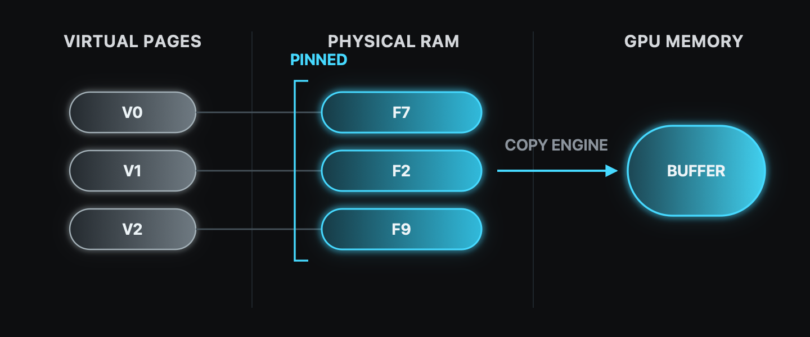
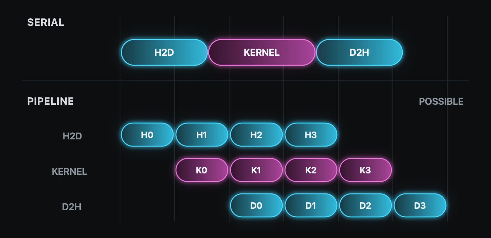
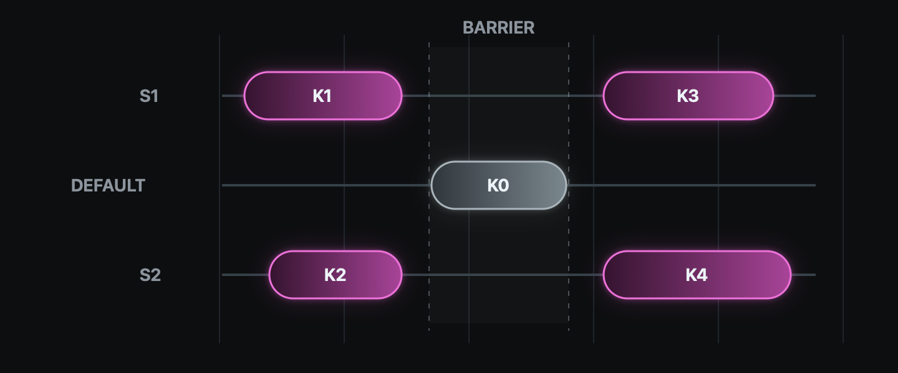
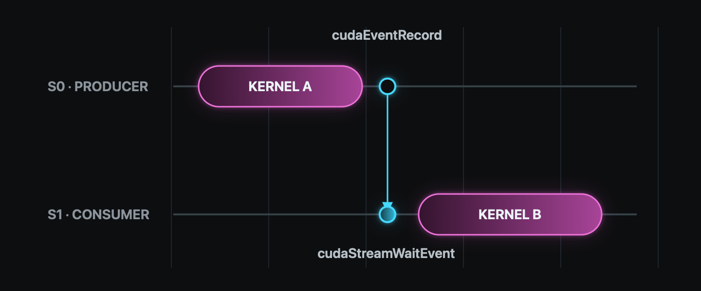
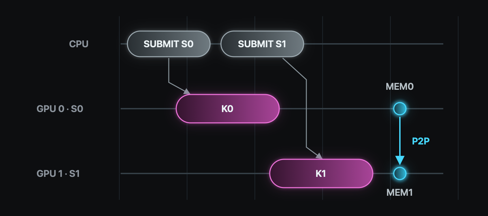

> Source: [07 Concurrency](https://www.youtube.com/watch?v=D3LU_Jz_ar8)

CUDA는 CPU를 host, GPU를 device라고 부른다. 이 둘 사이의 [기본 데이터 흐름](#host-device-데이터-흐름)은 세 단계다. 먼저 host memory의 입력을 device memory로 복사한다. 이어서 kernel을 실행하고, 마지막으로 결과를 host memory로 복사한다. 이 세 작업을 앞에서부터 Host to Device(H2D) copy, kernel, Device to Host(D2H) copy라고 부른다.

이 순서는 계산 결과를 올바르게 만든다. 다만 세 작업이 차례로 끝날 때까지 기다리면 GPU가 가진 여러 실행 자원을 한 번에 하나씩만 사용한다. CUDA에서는 서로 독립적인 작업을 같은 시간대에 실행해 이 빈 구간을 줄일 수 있다.

## 세 작업이 한 줄로 서는 이유

가장 익숙한 CUDA 코드는 아래 순서다.

```cpp
cudaMemcpy(d_x, h_x, bytes, cudaMemcpyHostToDevice);
transform<<<grid, block>>>(d_x, d_y, N);
cudaMemcpy(h_y, d_y, bytes, cudaMemcpyDeviceToHost);
```

Kernel은 입력이 GPU memory에 도착한 뒤 실행돼야 한다. 또 D2H copy는 kernel이 결과를 쓴 뒤 시작돼야 한다. 그래서 데이터 하나를 통째로 처리하면 세 작업은 직렬로 이어진다.

H2D copy 시간, kernel 시간, D2H copy 시간을 각각 $T_H$, $T_K$, $T_D$라고 두면 전체 시간은 다음과 같다.

$$
T_{\text{serial}} = T_H + T_K + T_D
$$

세 작업은 모두 필요하다. 대신 다른 데이터에 속한 작업을 그 사이에 제출하면 남는 실행 자원을 사용할 수 있다.

## 비동기 호출과 Stream

비동기 호출은 CPU가 GPU 작업의 완료를 기다리지 않고 다음 줄로 진행하는 호출이다. 대표적으로 kernel launch는 CPU에 대해 비동기다. H2D와 D2H copy도 `cudaMemcpyAsync`와 물리 RAM에 고정한 host memory인 pinned memory를 함께 사용하면 CPU와 비동기로 실행할 수 있다.

그러나 비동기 호출이 곧 동시 실행을 뜻하지는 않는다. 호출이 일찍 반환됐더라도 GPU의 자원이 부족하거나 두 작업 사이에 의존 관계가 있으면 실제 실행은 차례로 일어난다.

Stream은 CUDA에 제출한 작업의 실행 순서를 관리하는 단위다. 규칙은 두 개다.

1. 같은 stream에 제출한 작업은 제출한 순서대로 실행된다.
2. 서로 다른 stream에 제출한 작업 사이에는 CUDA가 실행 순서를 정하지 않는다.

이 규칙을 큰 배열에 적용할 때는 배열을 작은 구간으로 나눈다. 이렇게 나눈 한 조각을 chunk라고 한다. 같은 chunk의 H2D copy, kernel, D2H copy를 한 stream에 넣으면 앞 작업이 끝난 뒤 다음 작업이 시작된다. 반면 독립적인 chunk의 작업은 서로 다른 stream에 넣어야 실행 시간대를 겹칠 수 있다.

다만 GPU에 남는 실행 자원이 없으면 서로 다른 stream의 작업도 차례로 실행된다.

이를 코드로 옮기려면 stream을 먼저 만든 뒤 kernel launch와 비동기 copy의 마지막 인자로 전달한다.

```cpp
cudaStream_t stream;
cudaStreamCreate(&stream);

cudaMemcpyAsync(d_x, h_x, bytes,
                cudaMemcpyHostToDevice, stream);
transform<<<grid, block, 0, stream>>>(d_x, d_y, N);
cudaMemcpyAsync(h_y, d_y, bytes,
                cudaMemcpyDeviceToHost, stream);

cudaStreamSynchronize(stream);
cudaStreamDestroy(stream);
```

`<<<grid, block, 0, stream>>>`의 세 번째 값은 thread block이 함께 쓰는 shared memory를 실행 중에 추가로 확보할 크기다. `0`은 추가 공간을 쓰지 않는다는 뜻이며, 마지막 값에는 작업을 넣을 stream을 쓴다. 따라서 위 세 작업은 비동기로 제출되더라도 같은 stream 안에서 실행 순서를 유지한다.


## Pinned Memory

운영체제는 host memory를 page라는 일정한 크기의 단위로 관리한다. 이때 `malloc`으로 만든 일반 host memory의 page는 필요에 따라 물리 RAM에서 빠지거나 다시 배치될 수 있다.

Pinned memory는 운영체제가 물리 RAM에서 빼지 못하도록 page를 고정한 host memory다. 한편 copy engine은 host memory와 device memory 사이의 데이터 복사를 맡는 GPU hardware다. 이 엔진은 CPU 실행과 독립적으로 동작한다. 따라서 비동기 copy가 진행되는 동안 host memory의 물리 주소가 바뀌면 안 된다. 이를 위해 해당 page를 RAM에 고정한다.

이러한 pinned memory는 `cudaHostAlloc`으로 만들고 `cudaFreeHost`로 해제한다.

```cpp
float *h_x = nullptr;
cudaHostAlloc(&h_x, bytes, cudaHostAllocDefault);

// h_x를 사용하는 비동기 copy가 끝날 때까지 기다린다.
cudaStreamSynchronize(stream);
cudaFreeHost(h_x);
```

이때 `cudaFreeHost`는 해당 memory 영역을 사용하는 비동기 copy가 모두 끝난 뒤 호출한다.

반면 host memory가 pinned memory가 아니면 `cudaMemcpyAsync`를 호출해도 H2D copy나 D2H copy가 다른 GPU 작업과 겹치지 않을 수 있다. 즉 함수 이름의 `Async`만으로 실제 동시 실행이 보장되지는 않는다.

다만 pinned memory를 너무 많이 만들면 운영체제가 다른 프로그램에 내줄 수 있는 RAM이 줄어든다. 그러므로 필요한 memory 영역만 만들고, 반복 구간 밖에서 한 번 할당한 뒤 재사용한다.



## Chunk Pipeline

Pipeline은 여러 chunk의 H2D copy, kernel, D2H copy를 시차를 두고 겹치는 실행 구조다. 각 출력 원소가 다른 구간의 입력에 의존하지 않는 연산이라면 chunk끼리 서로 기다릴 이유가 없다. 이런 경우에는 chunk마다 세 작업을 따로 실행할 수 있다.

구체적으로 한 chunk 안의 세 작업은 같은 stream에 넣는다. 반면 다음 chunk는 다른 stream에 넣는다. 그 결과 각 chunk의 순서는 보존하면서 서로 다른 chunk의 copy와 kernel은 같은 시간대에 실행될 수 있다.

작업은 chunk 단위로 제출하는 편이 안전하다. 모든 H2D copy를 먼저 넣고 kernel과 D2H copy를 종류별로 몰아넣으면 앞쪽에 한 종류의 작업이 길게 쌓여 겹침이 줄어들 수 있다. 따라서 한 chunk의 H2D copy, kernel, D2H copy를 연달아 제출한 뒤 다음 chunk로 넘어간다.

이 구조를 코드로 옮길 때는 필요한 수만큼 stream을 만든 뒤 다시 사용한다. 아래 코드는 그림처럼 네 stream을 번갈아 사용한다. Device memory는 배열 전체 크기로 한 번만 할당하고, 각 chunk의 시작 위치만 `offset`으로 옮긴다.

```cpp
constexpr int streamCount = 4;
constexpr size_t chunkElements = 1 << 20;

cudaStream_t streams[streamCount];
for (int i = 0; i < streamCount; ++i) {
    cudaStreamCreate(&streams[i]);
}

for (size_t chunk = 0, offset = 0; offset < N;
     ++chunk, offset += chunkElements) {
    const size_t count = std::min(chunkElements, N - offset);
    const size_t chunkBytes = count * sizeof(float);
    cudaStream_t stream = streams[chunk % streamCount];

    cudaMemcpyAsync(d_x + offset, h_x + offset, chunkBytes,
                    cudaMemcpyHostToDevice, stream);

    const int block = 256;
    const int grid = static_cast<int>((count + block - 1) / block);
    transform<<<grid, block, 0, stream>>>(
        d_x + offset, d_y + offset, count);

    cudaMemcpyAsync(h_y + offset, d_y + offset, chunkBytes,
                    cudaMemcpyDeviceToHost, stream);
}

cudaDeviceSynchronize();

for (int i = 0; i < streamCount; ++i) {
    cudaStreamDestroy(streams[i]);
}
```

이때 같은 stream을 다시 사용하면 새 작업은 그 stream에 먼저 들어간 작업 뒤에 붙는다. 그래서 stream 0을 다시 사용하는 chunk 4는 stream 0의 chunk 0이 끝난 뒤 실행된다. 이 순서는 stream 자체가 보장하므로 별도의 수동 제어가 필요하지 않다.

또한 memory 할당과 stream 생성은 반복문 전에 마친다. 반복문 안에서는 chunk별 copy와 kernel만 제출하고, 미리 만든 자원을 계속 사용한다.



## Pipeline 시간

Chunk 하나의 H2D copy, kernel, D2H copy 시간을 $t_H$, $t_K$, $t_D$라고 하자. Chunk가 $n$개이고 동시 실행이 없다면 시간은 다음과 같다.

$$
T_{\text{serial}} = n(t_H + t_K + t_D)
$$

이와 달리 세 종류의 작업이 서로 다른 하드웨어 자원을 사용하고, 모든 chunk의 시간이 같으며, 필요한 동시 실행을 GPU가 지원한다고 가정하자. 또한 stream을 다시 사용하는 시점이 다음 chunk의 시작을 막지 않을 만큼 충분한 stream이 있어야 한다. 그러면 이상적인 pipeline 시간은 다음과 같다.

$$
T_{\text{pipeline}}^{\text{ideal}} = t_H + t_K + t_D + (n-1)\max(t_H, t_K, t_D)
$$

첫 결과가 나오려면 세 단계를 모두 거쳐야 한다. 그다음부터는 가장 느린 단계의 시간 간격으로 결과가 나온다.

예를 들어 $t_H=t_K=t_D=t$라면 직렬 시간은 $3nt$이고 이상적인 pipeline 시간은 $(n+2)t$다. 따라서 chunk 수가 충분히 많을 때 이 모델의 속도 향상은 3배에 가까워진다. 다만 실제 값은 kernel launch 비용, copy engine 수, chunk 크기, GPU 자원 경쟁 때문에 더 작다.

그렇다고 chunk를 작게 잡을수록 좋은 것은 아니다. Chunk가 너무 크면 pipeline을 채울 기회가 적고, 반대로 너무 작으면 launch와 API 호출 비용의 비중이 커진다. 그래서 고정된 정답을 따르기보다 GPU 실행 시간축을 보며 chunk 크기와 stream 수를 고른다.

## 동시 실행이 성립하는 조건

앞의 수식은 다음 조건이 함께 맞을 때만 실제 실행에 가까워진다.

1. 겹치려는 작업이 서로 다른 stream에 있어야 한다.
2. H2D copy와 D2H copy에 쓰는 host memory 영역은 pinned memory여야 한다.
3. GPU가 copy와 kernel의 동시 실행을 지원하고 필요한 copy engine을 갖춰야 한다.
4. Kernel이 GPU 계산 자원을 거의 다 사용하고 있다면 다른 kernel이 함께 실행될 자리가 없다.
5. 작업 사이의 데이터 의존 관계를 실행 순서에 반영해야 한다.
6. 반복 구간에 모든 GPU 작업을 기다리는 `cudaDeviceSynchronize`나 준비 작업을 넣지 않아야 한다.

이 가운데 hardware 지원은 device property로 확인할 수 있다. `cudaDeviceProp::asyncEngineCount`는 GPU의 비동기 copy engine 수를 알려 주고, `cudaDeviceProp::concurrentKernels`는 같은 GPU에서 여러 kernel을 동시에 실행할 수 있는지 알려 준다. 다만 두 값이 지원을 나타내더라도 실제 동시 실행은 당시 남아 있는 자원에 달려 있다.

### Default Stream

Stream을 지정하지 않은 작업은 default stream에 들어간다. 기본 설정에서는 CUDA가 오래전부터 사용한 legacy default stream 규칙이 적용된다. `cudaStreamCreate`로 만든 stream은 이 stream과 서로 기다린다. 그래서 반복 구간 중간에 default stream 작업이 들어가면 의도한 동시 실행이 끊길 수 있다.

컴파일 설정을 바꾸면 CPU thread마다 별도의 default stream을 둘 수도 있다. 다만 성능이 중요한 구간에서는 직접 만든 stream을 모든 copy와 kernel에 명시하는 편이 낫다. 그러면 실행 순서가 코드에 그대로 드러난다.



### CUDA Event

한편 device 전체가 아니라 두 stream 사이의 순서만 지정해야 할 때는 CUDA event를 사용한다. CUDA event는 stream 안의 한 지점을 표시하며, 그 지점 앞의 작업이 끝나면 완료 상태가 된다. 따라서 `cudaStreamWaitEvent`를 사용하면 다른 stream의 이후 작업만 그 시점까지 기다리게 할 수 있다.

```cpp
cudaEvent_t ready;
cudaEventCreate(&ready);

produce<<<grid, block, 0, stream0>>>(data);
cudaEventRecord(ready, stream0);

cudaStreamWaitEvent(stream1, ready, 0);
consume<<<grid, block, 0, stream1>>>(data);

cudaStreamSynchronize(stream1);
cudaEventDestroy(ready);
```

위 코드에서는 `consume`이 `produce`가 끝난 뒤 실행된다. 그 결과 CPU나 device 전체를 멈추지 않고도 두 stream 사이에 필요한 순서만 만들 수 있다.



## 여러 Kernel의 동시 실행

Copy와 kernel뿐 아니라 서로 독립적인 kernel끼리도 다른 stream에 넣을 수 있다. 그러면 같은 GPU에서 동시에 실행될 가능성이 생긴다. 그러나 먼저 제출한 kernel이 GPU 계산 자원을 거의 다 사용하면 다음 kernel은 기다린다.

따라서 하나의 큰 kernel로 GPU를 충분히 채울 수 있다면 그 kernel을 먼저 잘 구성하는 편이 낫다. 반면 여러 kernel의 동시 실행은 작업이 작은 단위로 들어오고, 이들을 하나의 kernel로 합치기 어려울 때 의미가 있다.

한편 stream priority는 GPU가 다음 thread block을 어느 stream에서 가져올지 정할 때 참고하는 우선순위다. 다만 이미 실행 중인 block을 중단시키는 기능은 아니며, 실행 순서를 보장하지도 않는다.

## 여러 GPU의 Stream

같은 stream 규칙은 GPU가 여러 개일 때도 이어진다. 먼저 CUDA 호출의 대상으로 선택된 GPU를 current device라고 한다. `cudaSetDevice`로 current device를 고르면 이후 만든 stream과 event는 그 device에 연결된다.

```cpp
cudaSetDevice(0);
cudaStreamCreate(&stream0);

cudaSetDevice(1);
cudaStreamCreate(&stream1);
```

이렇게 CPU에서 device를 바꿔 가며 각 GPU에 작업을 제출하면 두 GPU의 kernel이 동시에 실행될 수 있다. 또한 GPU 사이에 데이터를 옮길 때는 peer access를 사용할 수 있다. Peer access는 한 GPU가 다른 GPU의 memory에 직접 접근하는 기능이다. `cudaDeviceCanAccessPeer`로 지원 여부를 확인하고 `cudaDeviceEnablePeerAccess`로 연결을 활성화하면 `cudaMemcpyPeerAsync`로 host memory를 거치지 않고 device memory 사이를 복사할 수 있다.



### Unified Memory

[Unified Memory](#unified-memory와-managed-allocation)를 사용할 때도 stream 규칙은 같다. 다만 이 경우에는 명시적인 H2D copy와 D2H copy 대신 `cudaMemPrefetchAsync`로 Unified Memory로 할당한 영역의 이동을 stream에 넣는다. 이 영역이 이동하면 프로그램이 사용하는 virtual address가 새 memory 위치를 가리키도록 정보도 갱신해야 한다. 따라서 일반 비동기 copy와 같은 시간으로 가정하면 안 된다.

## Nsight Systems에서 확인하기

마지막으로 동시 실행 여부는 GPU 실행 시간축에서 확인한다. Nsight Systems는 CPU의 CUDA API 호출과 GPU의 copy, kernel 실행을 같은 시간축에 보여 주는 분석 도구다.

```bash
nsys profile --stats=true ./overlap
```

직렬 코드에서는 H2D copy, kernel, D2H copy가 한 줄로 보인다. 반면 여러 stream을 쓴 코드에서는 stream별 행이 나뉘고, 조건이 맞으면 한 chunk의 kernel과 다른 chunk의 copy가 같은 시간 구간에 나타날 수 있다.

결국 동시 실행은 의존 관계를 없애는 기술이 아니다. 따라서 같은 chunk의 순서는 같은 stream으로 지키고, 독립적인 chunk만 다른 stream으로 분리한다. 다만 실제 실행 시간이 겹칠지는 pinned memory와 GPU hardware, 남아 있는 실행 자원이 결정한다.

## 참고

1. [OLCF CUDA Training Series: CUDA Concurrency](https://www.olcf.ornl.gov/cuda-training-series/)
2. [CUDA Concurrency slides](https://www.olcf.ornl.gov/wp-content/uploads/2020/07/07_Concurrency.pdf)
3. [OLCF CUDA Training Series: HW7](https://github.com/olcf/cuda-training-series/tree/master/exercises/hw7)
4. [CUDA Programming Guide: Asynchronous Execution](https://docs.nvidia.com/cuda/cuda-programming-guide/02-basics/asynchronous-execution.html)
5. [CUDA C++ Best Practices Guide: Asynchronous and Overlapping Transfers with Computation](https://docs.nvidia.com/cuda/cuda-c-best-practices-guide/index.html#asynchronous-and-overlapping-transfers-with-computation)
6. [CUDA Runtime API: API Synchronization Behavior](https://docs.nvidia.com/cuda/cuda-runtime-api/api-sync-behavior.html)
7. [Nsight Systems User Guide](https://docs.nvidia.com/nsight-systems/UserGuide/index.html)
