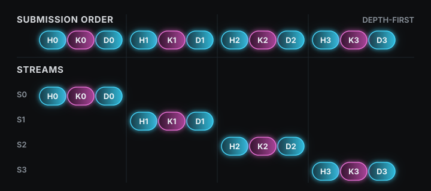
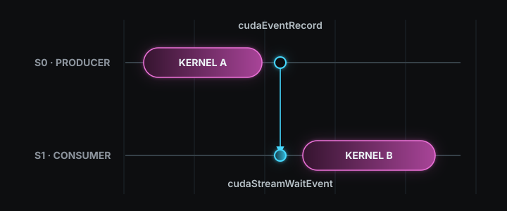
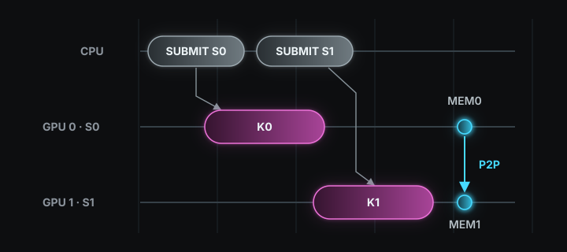

> Source: [07 Concurrency](https://www.youtube.com/watch?v=D3LU_Jz_ar8)

CUDA 프로그램은 CPU와 GPU를 함께 사용한다. 이때 CPU 쪽을 host, GPU 쪽을 device라고 부르며, host memory는 CPU가 사용하는 system RAM이고 device memory는 GPU에 달린 memory다. 계산에 쓸 데이터는 처음에 host memory에 있으므로, GPU가 그 데이터를 처리하려면 device memory로 옮겨야 한다. 그래서 CUDA 프로그램의 [기본 흐름](#host-device-데이터-흐름)은 host memory의 입력을 device memory로 복사하고, GPU에서 계산을 실행한 뒤, 결과를 host memory로 되돌리는 세 단계로 이루어진다. 이 세 단계를 차례로 끝낼 때와 서로 다른 데이터에 속한 단계를 같은 시간대에 실행할 때 전체 시간이 달라지는데, 그 배치를 정하는 장치가 stream이다.

## Host Memory와 Device Memory

할당(allocation)은 프로그램이 사용할 memory 영역을 확보하고 그 시작 주소를 pointer로 돌려받는 일이다. Pointer는 memory 주소를 담는 변수다. Host memory는 `malloc`으로 할당하고 `free`로 해제한다. 그다음 device memory는 `cudaMalloc`으로 할당하고 `cudaFree`로 해제하며, 돌려받은 pointer는 GPU가 접근하는 영역을 가리킨다. 두 pointer가 서로 다른 memory를 가리키기 때문에 CPU가 `malloc` 영역에 써 둔 값을 GPU가 읽으려면 복사가 필요하다.

아래 코드에서 `N`은 `float` 원소의 개수이고, `bytes`는 그 원소들이 차지하는 전체 byte 수다. `size_t`는 memory 크기를 담는 정수 타입이다. `h_x`는 CPU가 채울 입력이고 `h_y`는 결과를 받을 host memory이며, `d_x`와 `d_y`는 같은 크기의 device memory다. 이 네 pointer는 이 글 끝까지 같은 뜻으로 쓴다.

```cpp
const size_t N = 1000;
const size_t bytes = N * sizeof(float);

float *h_x = (float *)malloc(bytes);   // host memory 입력
float *h_y = (float *)malloc(bytes);   // host memory 출력
float *d_x = nullptr;
float *d_y = nullptr;
cudaMalloc(&d_x, bytes);               // device memory 입력
cudaMalloc(&d_y, bytes);               // device memory 출력
```

## H2D Copy, Kernel Launch, D2H Copy

Host memory에서 device memory로 옮기는 복사를 H2D(Host to Device) copy라고 하고, 반대 방향을 D2H(Device to Host) copy라고 한다. `cudaMemcpy`는 이 복사를 수행하는 함수로, 마지막 인자에 복사 방향을 적는다. 그다음 GPU에서 실행할 함수인 kernel을 `<<<grid, block>>>` 구문으로 실행하는데, 이 호출을 kernel launch라고 한다. 여기서 thread는 kernel을 실행하는 GPU의 작업 단위이고, block은 함께 배치되는 thread의 묶음이며, grid는 block의 개수다.

이 글은 아래 kernel 하나를 끝까지 사용한다. `transform`은 입력 `x`의 각 원소에 2를 곱해 출력 `y`의 같은 번호 자리에 쓴다.

```cpp
__global__ void transform(const float *x, float *y, size_t count) {
    const size_t i = blockIdx.x * blockDim.x + threadIdx.x;
    if (i < count) {
        y[i] = x[i] * 2.0f;
    }
}
```

`__global__`은 이 함수가 GPU에서 실행되는 kernel이라는 표시다. `blockIdx.x`는 grid 안에서 이 block의 번호, `blockDim.x`는 block 하나에 든 thread 수, `threadIdx.x`는 block 안에서 이 thread의 번호다. 세 값을 조합한 `i`가 이 thread가 맡을 원소 번호이고, `count`보다 크거나 같은 번호는 처리하지 않는다.

Kernel launch에 넘기는 `block`은 block 하나의 thread 수이고 `grid`는 그런 block이 몇 개 필요한지다. Block당 thread 수는 GPU가 thread를 32개 단위로 실행하므로 32의 배수로 정하며, 이 글은 256을 쓴다. Thread 하나가 원소 하나를 맡으므로 원소 `N`개를 처리하려면 block이 `N / 256`개 필요하고, 나누어떨어지지 않는 경우를 위해 올림한다. Kernel이 결과를 device memory에 쓰고 나면 D2H copy로 결과를 host memory로 가져온다.

```cpp
const int block = 256;
const int grid = (N + block - 1) / block;

cudaMemcpy(d_x, h_x, bytes, cudaMemcpyHostToDevice);   // H2D copy
transform<<<grid, block>>>(d_x, d_y, N);                // kernel launch
cudaMemcpy(h_y, d_y, bytes, cudaMemcpyDeviceToHost);   // D2H copy
```

이 세 줄에는 정해진 순서가 있다. Kernel은 입력이 device memory에 도착한 뒤에 실행돼야 하고, D2H copy는 kernel이 결과를 다 쓴 뒤에 시작돼야 한다. 그래서 데이터 하나를 통째로 처리하면 H2D copy, kernel, D2H copy는 한 줄로 이어지고, H2D copy 시간 $T_H$, kernel 시간 $T_K$, D2H copy 시간 $T_D$를 더한 값이 전체 시간이 된다.

$$
T_{\text{serial}} = T_H + T_K + T_D
$$

세 단계는 모두 필요하지만 서로 다른 데이터의 단계는 겹칠 수 있다. 예를 들어 첫 번째 입력을 kernel이 계산하는 동안 copy engine이 두 번째 입력을 H2D copy하면 계산 장치와 복사 장치가 함께 일한다. 이때 copy engine은 CPU가 다음 코드로 넘어간 뒤에도 host memory를 계속 읽어야 하므로, 먼저 그 memory가 운영체제에서 어떻게 관리되는지 알아야 한다.

## Page와 Pageable Memory

운영체제는 host memory를 page라는 일정한 크기의 단위로 나눠 관리한다. 흔한 page 크기는 4KB다. 프로그램이 보는 주소 공간의 조각을 virtual page라고 하고, 실제 RAM을 같은 크기로 나눈 자리를 page frame이라고 한다. 운영체제는 각 virtual page가 어느 page frame에 놓였는지 page table에 기록한다. `malloc`으로 할당하면 우선 프로그램 주소 공간의 page만 잡히고, RAM은 그 주소를 처음 읽거나 쓸 때 붙는다. 이렇게 RAM과의 연결이 필요할 때 만들어지고 나중에 바뀔 수도 있는 host memory를 pageable memory라고 한다.

### Page Fault

프로그램이 아직 RAM에 없는 page를 읽거나 쓰면 page fault가 발생한다. Page fault는 운영체제가 개입해 그 page에 RAM을 붙이라는 신호다. 이때 RAM이 부족하면 운영체제는 한동안 쓰지 않은 page의 내용을 disk로 내보내고 그 자리를 비우는데, 이렇게 내보낸 page를 보관하는 disk 영역을 swap 또는 page file이라고 한다. 내보낸 page를 다시 읽으면 page fault가 한 번 더 일어나고, 운영체제가 disk에서 RAM으로 되가져온다. 이 때문에 pageable memory는 RAM보다 큰 데이터도 다룰 수 있지만, 어떤 page가 RAM에 있는지가 매 순간 달라지고, 없을 때마다 운영체제가 개입해야 한다.

### Pinned Memory

GPU에는 host memory와 device memory 사이의 복사를 전담하는 hardware인 copy engine이 있다. 이 절에서는 copy engine을 사용하는 전형적인 pinned H2D 경로를 설명한다. Copy engine은 DMA(Direct Memory Access)를 실행한다. DMA는 CPU core가 byte를 하나씩 옮기는 대신 전용 hardware가 memory 사이의 데이터를 옮기는 방식이다. CPU가 `cudaMemcpyAsync`를 호출하면 CUDA runtime이 요청을 CUDA driver에 넘긴다. CUDA driver는 GPU에 작업을 제출하는 software이며, 원본 주소, 목적지 주소, 크기가 담긴 복사 명령을 GPU에 보낸다. Copy engine이 그 명령을 실행하는 동안 CPU는 다음 코드를 실행한다.

CPU와 별도 card에 장착된 discrete GPU는 host system과 PCIe로 연결된다. System DRAM에서 읽힌 데이터는 CPU의 I/O 경로와 PCIe root complex를 거쳐 PCIe로 나간다. Root complex는 CPU 쪽 PCIe 장치를 연결하는 hardware다. GPU에 도착한 데이터는 GPU의 PCIe I/O와 내부 데이터 경로를 거쳐 GPU memory subsystem으로 간다. 이 subsystem은 최근 사용한 데이터를 잠시 보관하는 L2 cache와 GPU memory의 읽기와 쓰기를 맡는 memory controller로 이루어진다. Copy engine은 GPU 안에서 이 H2D 전송을 실행한다. 정확한 내부 배치는 GPU architecture마다 다르므로, 아래 그림은 공개된 연결 관계만 나타낸다.

Copy engine이 복사하는 동안에는 같은 RAM page를 계속 읽을 수 있어야 한다. 따라서 복사가 끝나기 전에 운영체제가 그 page를 다른 frame으로 옮기거나 disk로 내보내면 안 된다. Pageable memory는 이 조건을 보장하지 못한다. 그래서 CUDA는 운영체제에 해당 page frame을 RAM에 그대로 두라고 요청하며, 이렇게 RAM에 고정된 host memory를 pinned memory라고 한다. Pinned memory에서는 page가 disk로 나가지 않으므로 non-pageable memory라고도 부른다.

Pinned memory는 `cudaHostAlloc`으로 할당하고 `cudaFreeHost`로 해제한다. `cudaHostAlloc`은 `malloc`처럼 host memory를 돌려주는 할당 함수이고, 돌려준 pointer가 pinned memory를 가리킨다는 점만 다르다. 이 함수는 데이터를 복사하는 함수가 아니며, device memory를 만드는 `cudaMalloc`을 대신하지도 않는다. 그래서 host memory를 pinned memory로 바꾸더라도 device memory는 여전히 `cudaMalloc`으로 따로 만든다.

| 함수 | 만드는 영역 |
|---|---|
| `malloc` / `free` | pageable host memory |
| `cudaHostAlloc` / `cudaFreeHost` | pinned host memory |
| `cudaMalloc` / `cudaFree` | device memory |

```cpp
const int N = 1000;
const size_t bytes = N * sizeof(float);

float *h_x = nullptr;
float *h_y = nullptr;
// 앞 절의 pageable 버전
// float *h_x = (float *)malloc(bytes);
// float *h_y = (float *)malloc(bytes);
cudaHostAlloc(&h_x, bytes, cudaHostAllocDefault);   // pinned input
cudaHostAlloc(&h_y, bytes, cudaHostAllocDefault);   // pinned output

float *d_x = nullptr;
float *d_y = nullptr;
cudaMalloc(&d_x, bytes);                            // device input
cudaMalloc(&d_y, bytes);                            // device output

// ... H2D copy, kernel, D2H copy ...

// 앞 절의 pageable 버전
// free(h_x);
// free(h_y);
cudaFreeHost(h_x);
cudaFreeHost(h_y);
cudaFree(d_x);
cudaFree(d_y);
```

이미 `malloc`으로 만든 영역을 뒤늦게 고정할 때는 `cudaHostRegister`를 쓰고, 고정만 풀고 영역은 남길 때는 `cudaHostUnregister`를 쓴다.

Pinned memory는 실제 RAM을 그만큼 차지하므로 RAM 크기보다 많이 만들 수 없고, 그 한도를 넘기면 `cudaHostAlloc`이 memory 부족 오류를 돌려준다. 그리고 RAM의 큰 부분을 고정하면 운영체제가 쓸 RAM이 줄어 host 쪽 실행이 느려지므로, GPU와 데이터를 주고받는 영역만 pinned memory로 만든다.


## 비동기 호출과 cudaMemcpyAsync

비동기 호출은 CPU가 GPU 작업의 완료를 기다리지 않고 바로 다음 줄로 진행하는 호출이다. Kernel launch는 원래 비동기 호출이어서 CPU는 kernel이 끝나기 전에 다음 코드를 실행한다. Copy도 이런 방식으로 요청할 때는 `cudaMemcpyAsync`를 쓴다. 인자는 `cudaMemcpy`와 같고 마지막에 stream 하나가 더 붙는다. 이 글처럼 CPU 실행과 H2D 또는 D2H copy를 겹치려면 host 쪽 pointer가 pinned memory여야 한다. 이 조건이 갖춰지면 CPU는 copy가 끝나기 전에 호출에서 돌아오고, copy engine은 복사를 계속한다.

예를 들어 `d_y`의 결과를 `h_y`로 가져오는 D2H copy를 비동기로 요청하면 CPU는 복사가 끝나기 전에 다른 코드를 실행할 수 있다. 그렇다고 `h_y`의 결과까지 이미 준비된 것은 아니다.

```text
CPU: D2H copy 요청 → 복사와 무관한 CPU 코드 → stream 대기 → h_y 사용
GPU:                 D2H copy 진행
```

`cudaStreamSynchronize(stream)`은 그 stream의 작업이 모두 끝날 때까지 CPU를 기다리게 한다. 따라서 `h_y`는 이 대기가 끝난 뒤에 읽는다.

비동기 호출은 CPU가 기다리지 않는다는 뜻일 뿐, 두 GPU 작업이 실제로 같은 시간에 실행된다는 뜻은 아니다. 호출이 일찍 돌아와도 GPU 안에서는 두 작업이 차례로 실행될 수 있다. 어떤 작업이 어떤 순서로 실행되는지는 stream이 정한다.

## Stream

Stream은 GPU에 보낸 작업의 순서를 묶어 두는 단위다.

규칙 1) 같은 stream 안에서는 제출 순서가 지켜진다. H2D copy, kernel, D2H copy를 한 stream에 넣으면 H2D copy가 끝난 뒤 kernel이 실행되고, kernel이 끝난 뒤 D2H copy가 시작된다.

규칙 2) 서로 다른 stream 사이에는 정해진 순서가 없다. CUDA는 어느 작업을 먼저 시작할지 보장하지 않으므로 먼저, 동시에, 또는 나중에 실행될 수 있다. 동시에 실행하려면 서로 다른 stream에 넣어야 한다. 그래도 GPU가 copy와 계산을 함께 실행할 여유가 없으면 그 copy와 계산은 차례로 실행된다.

Stream은 `cudaStream_t` 타입의 변수로 선언하고 `cudaStreamCreate`로 만든다. 만든 stream은 `cudaMemcpyAsync`의 마지막 인자와 kernel launch의 `<<<>>>` 네 번째 인자에 넣는다. `<<<grid, block, 0, stream>>>`에서 세 번째 값은 block 안의 thread들이 함께 쓰는 GPU 안의 작은 memory인 [shared memory]()를 실행 중에 추가로 확보할 byte 수이고, `0`이면 추가 공간을 쓰지 않는다.

```cpp
cudaStream_t stream;
cudaStreamCreate(&stream);

cudaMemcpyAsync(d_x, h_x, bytes, cudaMemcpyHostToDevice, stream);
transform<<<grid, block, 0, stream>>>(d_x, d_y, N);
cudaMemcpyAsync(h_y, d_y, bytes, cudaMemcpyDeviceToHost, stream);

cudaStreamSynchronize(stream);
cudaStreamDestroy(stream);
```

세 호출은 모두 CPU를 기다리게 하지 않지만 같은 stream에 들어가므로, H2D copy가 끝난 뒤 kernel이 실행되고 kernel이 끝난 뒤 D2H copy가 시작된다. 그래서 같은 데이터의 H2D copy → kernel → D2H copy 순서는 stream이 지킨다. `cudaStreamSynchronize`는 그 stream의 작업이 모두 끝날 때까지 CPU를 기다리게 하는 함수이고, `cudaStreamQuery`는 기다리지 않고 stream이 비었는지만 알려 준다. 다 쓴 stream은 `cudaStreamDestroy`로 없앤다.

## Chunk

큰 배열을 통째로 처리하면 입력 전체의 H2D copy가 끝난 뒤 kernel이 시작하고, kernel 전체가 끝난 뒤 결과의 D2H copy가 시작한다. 이 대기 시간을 줄이기 위해 배열을 여러 구간으로 나눈다. 이렇게 나눈 데이터 조각 하나가 chunk다.

예를 들어 원소가 8개인 배열에 `y[i] = x[i] * 2`를 계산한다고 하자. 이때 `i`는 0부터 7까지다. 이 배열을 원소 4개씩 두 chunk로 나누면 `x[0]`부터 `x[3]`까지가 chunk 0이고 `x[4]`부터 `x[7]`까지가 chunk 1이다. `y[0]`부터 `y[3]`까지는 각각 같은 번호의 `x` 값 하나만 필요하므로 chunk 1의 값 없이 계산할 수 있다. 그래서 두 chunk는 서로 기다리지 않고 처리할 수 있다.

Chunk 0의 H2D copy, kernel, D2H copy를 각각 H0, K0, D0이라고 하고 세 작업을 stream 0에 넣는다. Chunk 1의 H1, K1, D1은 stream 1에 넣는다. 각 stream 안에서는 H0 → K0 → D0와 H1 → K1 → D1 순서가 유지된다. 두 stream 사이에는 정해진 순서가 없으므로, GPU가 copy와 kernel을 동시에 실행할 수 있으면 K0이 실행되는 동안 H1을 복사하고 K1이 실행되는 동안 D0을 복사할 수 있다.

반복문은 chunk 하나의 세 작업을 모두 제출한 뒤 다음 chunk로 넘어가고, `chunk % streamCount`에 따라 chunk 0은 stream 0, chunk 1은 stream 1, chunk 2는 stream 2, chunk 3은 stream 3에 들어간다. 아래 그림의 위쪽 줄이 CPU가 제출하는 순서이고, 아래쪽 네 줄이 각 작업이 들어간 stream이다.




위 그림의 두 행은 가로 축척이 같고, 직렬 막대 안의 점선은 그 막대를 chunk 4개 몫으로 나눈 자리다. 점선으로 나뉜 한 칸의 가로 길이가 아래 chunk 하나의 가로 길이와 같으므로 두 방식이 처리하는 작업량은 같다. 달라지는 것은 작업을 시간축 어디에 놓느냐뿐이다. 그림 오른쪽의 시간은 NVIDIA A100에서 잰 값이다.[^bench]

이 구조를 코드로 옮길 때는 stream을 여러 개 만들어 chunk마다 돌려 쓴다. Device memory는 배열 전체 크기로 한 번만 할당하고, 각 chunk의 시작 위치만 `offset`으로 옮긴다. `offset`은 배열의 시작에서 몇 번째 원소부터가 이번 chunk인지를 나타내는 원소 번호이고, `d_x + offset`은 `d_x`가 가리키는 위치에서 `offset`개 뒤에 있는 원소의 주소다. 반복문이 `offset`을 `chunkElements`[^chunkelements]만큼씩 늘리므로 chunk마다 같은 배열의 다른 구간을 가리킨다.

```cpp
constexpr int streamCount = 4;
constexpr size_t N = 1ULL << 24;          // 16,777,216개
constexpr size_t chunkElements = 1 << 20; // 1,048,576개
constexpr size_t bytes = N * sizeof(float);

float *h_x = nullptr;
float *h_y = nullptr;
float *d_x = nullptr;
float *d_y = nullptr;

// pinned memory를 쓰기 전의 pageable 버전
// float *h_x = (float *)malloc(bytes);
// float *h_y = (float *)malloc(bytes);
cudaHostAlloc(&h_x, bytes, cudaHostAllocDefault);
cudaHostAlloc(&h_y, bytes, cudaHostAllocDefault);
cudaMalloc(&d_x, bytes);   // device memory는 두 버전이 같다
cudaMalloc(&d_y, bytes);

for (size_t i = 0; i < N; ++i) {   // host가 입력 값을 채운다
    h_x[i] = static_cast<float>(i);
}

cudaStream_t streams[streamCount];
for (int i = 0; i < streamCount; ++i) {
    cudaStreamCreate(&streams[i]);
}

constexpr size_t chunkBytes = chunkElements * sizeof(float);
constexpr int block = 256;
constexpr int grid = chunkElements / block;   // 4096

for (size_t chunk = 0, offset = 0; offset < N;
     ++chunk, offset += chunkElements) {
    cudaStream_t stream = streams[chunk % streamCount];

    // 동기 버전에는 stream 인자가 없다
    // cudaMemcpy(d_x + offset, h_x + offset, chunkBytes,
    //            cudaMemcpyHostToDevice);
    cudaMemcpyAsync(d_x + offset, h_x + offset, chunkBytes,
                    cudaMemcpyHostToDevice, stream);

    transform<<<grid, block, 0, stream>>>(
        d_x + offset, d_y + offset, chunkElements);

    cudaMemcpyAsync(h_y + offset, d_y + offset, chunkBytes,
                    cudaMemcpyDeviceToHost, stream);
}

cudaDeviceSynchronize();

for (int i = 0; i < streamCount; ++i) {
    cudaStreamDestroy(streams[i]);
}

// pinned memory를 쓰기 전의 pageable 버전
// free(h_x);
// free(h_y);
cudaFreeHost(h_x);
cudaFreeHost(h_y);
cudaFree(d_x);
cudaFree(d_y);
```

`N`은 원소 16,777,216개이고 `chunkElements`는 1,048,576개이므로 chunk는 16개가 나온다. Stream은 4개를 만들었으므로 `chunk % streamCount`에 따라 chunk 0, 4, 8, 12가 stream 0에 들어가고 chunk 1, 5, 9, 13이 stream 1에 들어간다. `h_x`와 `h_y`는 비동기 H2D와 D2H copy에 쓰이므로 둘 다 pinned memory이고, `d_x`와 `d_y`는 device memory다. 반복문 한 바퀴가 chunk 하나를 맡아 세 작업을 같은 stream에 제출한다. 마지막 chunk까지 제출한 뒤에는 `cudaDeviceSynchronize`[^sync]로 device의 전체 작업을 기다리고 나서 stream과 memory를 해제한다.

이렇게 한 chunk의 세 작업을 먼저 제출하고 다음 chunk로 넘어가는 순서를 depth-first[^depthfirst] 제출 순서라고 한다.

Stream이 4개이므로 chunk 4는 chunk 0이 쓴 stream 0에 다시 들어간다. 규칙 1에 따라 stream 0에서는 chunk 0의 D2H copy가 끝난 뒤에 chunk 4의 H2D copy가 시작한다. Memory 할당과 stream 생성은 chunk마다 반복할 일이 아닌 준비 작업이므로 반복문 전에 한 번만 마친다. 반복문 안에는 H2D copy, kernel launch, D2H copy만 두고 미리 만든 memory와 stream을 계속 사용한다.

실제 겹침의 모양은 chunk마다 복사하는 데이터 양과 kernel 실행 시간에 따라 달라진다. Kernel이 아주 짧다면 copy와 kernel이 겹쳐도 줄어드는 시간은 작다. GPU가 H2D와 D2H를 동시에 처리할 수 있는 copy engine 구성을 가졌을 때는 다음 chunk의 H2D와 이전 chunk의 D2H가 겹치는 구간이 더 큰 이득이 될 수 있다.

## Default Stream

Stream을 지정하지 않은 kernel launch와 `cudaMemcpy`는 default stream에 들어간다. 기본 설정의 default stream을 legacy default stream이라고 한다. 위에서 `cudaStreamCreate`로 만든 stream과 함께 쓸 때는, 다른 stream에 먼저 제출된 작업이 전부 끝나야 default stream 작업이 시작하고, default stream 작업이 끝나야 다른 stream에 그 뒤로 제출된 작업이 시작한다.

아래는 앞 절의 chunk 세 개를 제출하되 가운데 한 줄에만 stream 인자를 빠뜨린 경우다. `c`는 chunk 하나의 원소 수이고, 세 launch는 각각 chunk 0, 1, 2를 처리한다.

```cpp
const size_t c = chunkElements;

transform<<<grid, block, 0, streams[0]>>>(d_x,         d_y,         c);  // A: chunk 0
transform<<<grid, block>>>               (d_x + c,     d_y + c,     c);  // B: stream 인자 누락
transform<<<grid, block, 0, streams[1]>>>(d_x + 2 * c, d_y + 2 * c, c);  // C: chunk 2
```

B는 stream 인자가 없어 legacy default stream에 들어간다. 그래서 B는 A가 끝난 뒤에 시작하고 C는 B가 끝난 뒤에 시작하므로, 원래 서로 다른 stream에 있어 겹칠 수 있었던 A와 C가 겹치지 못한다. 이 때문에 겹침을 만드는 구간에서는 모든 copy와 kernel launch에 직접 만든 stream을 적는다.

컴파일 옵션 `nvcc --default-stream per-thread`를 주면 CPU thread마다 default stream이 따로 생기고, 위의 B가 A와 C 사이를 자동으로 막지 않는다. 이 옵션은 default stream을 쓰도록 이미 작성된 코드를 직접 만든 stream과 함께 사용할 때 쓴다.


## Host 함수를 Stream에 넣기

`cudaLaunchHostFunc`는 CPU에서 실행할 함수를 stream의 한 작업으로 넣는다. 아래 `stream`은 `cudaStreamCreate`로 만든 stream이다. `transform`의 결과를 CPU 함수 `process`가 읽어야 한다면 같은 stream에 kernel, D2H copy, host 함수를 이 순서로 넣는다. `CUDART_CB`는 CUDA가 이 CPU 함수를 호출할 때 필요한 함수 형태를 표시한다.

```cpp
void CUDART_CB process(void *data) {
    float *result = static_cast<float *>(data);
    // result를 CPU에서 처리한다. CUDA API는 호출하지 않는다.
}

transform<<<grid, block, 0, stream>>>(d_x, d_y, N);
cudaMemcpyAsync(h_y, d_y, bytes, cudaMemcpyDeviceToHost, stream);
cudaLaunchHostFunc(stream, process, h_y);
```

`process`는 D2H copy까지 끝난 뒤 호출되므로 완성된 `h_y`를 읽을 수 있다. Stream은 `process`가 반환될 때까지 다음 작업으로 넘어가지 않으며, `process` 안에서는 kernel launch나 `cudaMalloc` 같은 CUDA API를 호출하지 않는다.

## CUDA Event

CUDA event는 stream 안의 한 위치를 표시한다. `cudaEventRecord`를 호출하면 event가 stream에 들어가고, 앞선 작업이 모두 끝나 그 위치에 도달하면 event가 완료된다. Kernel 실행 시간을 잴 때는 시작 event, kernel, 종료 event를 같은 stream에 차례로 넣는다.

```cpp
cudaEvent_t start;
cudaEvent_t stop;
cudaEventCreate(&start);
cudaEventCreate(&stop);

cudaEventRecord(start, stream);
transform<<<grid, block, 0, stream>>>(d_x, d_y, N);
cudaEventRecord(stop, stream);
cudaEventSynchronize(stop);

float milliseconds = 0.0f;
cudaEventElapsedTime(&milliseconds, start, stop);

cudaEventDestroy(start);
cudaEventDestroy(stop);
```

`cudaEventSynchronize(stop)`은 stop event가 완료될 때까지 CPU를 기다린다. 그 뒤 `cudaEventElapsedTime`이 start와 stop 사이의 GPU 시간을 `milliseconds`에 기록한다.

두 stream 사이에 순서를 만들 때도 event를 쓴다. 아래 `d_z`는 `d_x`, `d_y`와 같은 크기로 `cudaMalloc`한 device memory이고, `stream0`과 `stream1`은 `cudaStreamCreate`로 만든 stream이다. Stream 0의 `transform`은 결과를 `d_y`에 쓰고, stream 1의 `transform`은 그 `d_y`를 입력으로 읽어 `d_z`에 쓴다. 두 kernel이 서로 다른 stream에 있어 규칙 2에 따라 순서가 정해지지 않으므로, stream 1의 kernel이 먼저 시작할 수도 있다. 그래서 stream 0의 kernel 뒤에 `ready` event를 기록하고, stream 1의 kernel 앞에서 그 event를 기다리게 한다.

```cpp
cudaEvent_t ready;
cudaEventCreate(&ready);

transform<<<grid, block, 0, stream0>>>(d_x, d_y, N);
cudaEventRecord(ready, stream0);

cudaStreamWaitEvent(stream1, ready, 0);
transform<<<grid, block, 0, stream1>>>(d_y, d_z, N);

cudaStreamSynchronize(stream1);
cudaEventDestroy(ready);
```

위 코드에서 `cudaStreamWaitEvent`는 stream 1의 이후 작업만 기다리게 하며 CPU는 기다리지 않는다. 마지막 인자 `0`은 별도 동작을 지정하지 않는다는 뜻이다. `cudaStreamWaitEvent`는 device 전체를 멈추지 않고 stream 0과 stream 1의 kernel 사이에만 순서를 만든다.



## 여러 Kernel의 동시 실행

서로 다른 배열을 처리하는 두 kernel은 한쪽 결과를 다른 쪽이 기다리지 않는다. 아래 네 pointer는 모두 `cudaMalloc`으로 `bytes` 크기씩 할당한 device memory다. `d_x0`과 `d_y0`은 첫 번째 계산의 입력과 출력이고, `d_x1`과 `d_y1`은 두 번째 계산의 입력과 출력이다. 두 kernel을 서로 다른 stream에 넣으면 같은 GPU에서 동시에 실행될 가능성이 생긴다.

```cpp
transform<<<grid, block, 0, stream0>>>(d_x0, d_y0, N);
transform<<<grid, block, 0, stream1>>>(d_x1, d_y1, N);
```

SM(Streaming Multiprocessor)은 kernel의 block이 실제로 배치되는 GPU 계산 장치다. 첫 kernel의 block들이 모든 SM의 실행 자리를 차지하면 두 번째 kernel은 다른 stream에 있어도 자리가 날 때까지 기다린다. 첫 kernel이 일부 자리만 사용하면 두 번째 kernel의 block이 남은 자리에 들어가 같은 시간대에 실행될 수 있다.

하나의 kernel로 GPU를 충분히 채울 수 있다면 그 kernel 하나가 가장 빠르다. 여러 kernel의 동시 실행은 작업이 작은 단위로 들어와서 하나의 kernel로 합치기 어려울 때 의미가 있다.

Stream priority는 GPU가 다음 block을 어느 stream의 kernel에서 가져올지 정할 때 참고하는 우선순위다. 예를 들어 오래 걸리는 background kernel은 낮은 priority stream에 넣고, 빨리 시작해야 하는 짧은 kernel은 높은 priority stream에 넣을 수 있다. 높은 priority는 이미 실행 중인 block을 중단시키지 않는다. SM에 자리가 생겼을 때 높은 priority stream의 다음 block을 먼저 고를 뿐이다. Stream은 `cudaStreamCreateWithPriority`로 만들고, 사용 가능한 priority 범위는 `cudaDeviceGetStreamPriorityRange`로 읽는다.

## 여러 GPU의 Stream

같은 stream 규칙은 GPU가 여러 개일 때도 이어진다. `cudaGetDeviceCount`로 GPU 개수를 읽고, `cudaSetDevice`로 이후 CUDA 호출의 대상이 될 GPU를 고른다. 이렇게 고른 GPU를 current device라고 한다. Device memory와 stream은 만들어질 때의 current device에 묶인다. 아래에서 `d0_x`, `d0_y`, `stream0`은 GPU 0의 것이고 `d1_x`, `d1_y`, `stream1`은 GPU 1의 것이며, 두 GPU가 앞에서 정의한 `transform`을 각자의 배열에 실행한다.

```cpp
float *d0_x = nullptr, *d0_y = nullptr;
float *d1_x = nullptr, *d1_y = nullptr;
cudaStream_t stream0;
cudaStream_t stream1;

cudaSetDevice(0);
cudaMalloc(&d0_x, bytes);
cudaMalloc(&d0_y, bytes);
cudaStreamCreate(&stream0);   // GPU 0에 묶인 stream
transform<<<grid, block, 0, stream0>>>(d0_x, d0_y, N);

cudaSetDevice(1);
cudaMalloc(&d1_x, bytes);
cudaMalloc(&d1_y, bytes);
cudaStreamCreate(&stream1);   // GPU 1에 묶인 stream
transform<<<grid, block, 0, stream1>>>(d1_x, d1_y, N);

cudaSetDevice(0);
cudaStreamSynchronize(stream0);
cudaStreamDestroy(stream0);
cudaFree(d0_x);
cudaFree(d0_y);

cudaSetDevice(1);
cudaStreamSynchronize(stream1);
cudaStreamDestroy(stream1);
cudaFree(d1_x);
cudaFree(d1_y);
```

Kernel launch는 CPU를 기다리게 하지 않으므로 CPU는 GPU 0에 `transform`을 제출한 뒤 GPU 1에도 바로 제출할 수 있다. 마지막에는 GPU를 다시 선택해 각 stream이 끝날 때까지 기다린다. 또한 GPU 사이에 데이터를 옮길 때는 peer access를 쓸 수 있다. Peer access는 한 GPU가 다른 GPU의 memory를 직접 읽고 쓰는 기능으로, 두 GPU가 PCIe나 NVLink 같은 같은 연결 통로에 있어야 한다. `cudaDeviceCanAccessPeer`로 지원 여부를 확인하고, 두 방향 모두 복사한다면 `cudaDeviceEnablePeerAccess`를 양쪽에서 호출한 뒤 `cudaMemcpyPeerAsync`로 복사한다. 이렇게 하면 데이터가 host memory를 거치지 않고 한 GPU의 memory에서 다른 GPU의 memory로 바로 이동한다.



## Unified Memory와 Prefetch

[Unified Memory](#unified-memory와-managed-allocation)를 쓸 때도 stream 규칙은 같다. `cudaMemPrefetchAsync`는 Unified Memory로 만든 영역을 CPU나 GPU 쪽으로 미리 옮기는 함수다. 아래에서 `x`와 `y`는 `cudaMallocManaged`로 할당한 Unified Memory pointer로 CPU와 GPU가 같은 pointer로 접근하며, `device`는 kernel을 실행할 GPU 번호다. `cudaCpuDeviceId`는 목적지가 CPU 쪽임을 나타내는 CUDA 상수다.

```cpp
const int device = 0;
cudaSetDevice(device);

float *x = nullptr;
float *y = nullptr;
cudaMallocManaged(&x, bytes);
cudaMallocManaged(&y, bytes);

cudaStream_t stream;
cudaStreamCreate(&stream);

cudaMemPrefetchAsync(x, bytes, device, stream);          // 입력을 GPU로 이동
transform<<<grid, block, 0, stream>>>(x, y, N);
cudaMemPrefetchAsync(y, bytes, cudaCpuDeviceId, stream); // 결과를 CPU로 이동
cudaStreamSynchronize(stream);

cudaStreamDestroy(stream);
cudaFree(x);
cudaFree(y);
```

같은 stream에 넣었으므로 GPU 방향 prefetch가 끝난 뒤 kernel이 시작하고, kernel이 끝난 뒤 CPU 방향 prefetch가 시작한다. 마지막 대기가 끝나면 CPU가 `y`를 읽을 수 있다. 이 이동은 page 단위로 일어나고 CPU와 GPU 양쪽의 page 기록도 고쳐야 하므로, 실행 시간축에 빈 구간이 생길 수 있다.

## Nsight Systems에서 확인하기

동시 실행이 실제로 일어났는지는 GPU 실행 시간축에서 확인한다. Nsight Systems는 프로그램이 실행되는 동안 CPU의 CUDA 호출과 GPU의 copy, kernel 실행을 같은 시간축에 기록해 보여 주는 도구다.

앞의 chunk 코드를 `nvcc`로 컴파일해 만든 실행 파일을 `overlap`이라고 하면 다음과 같이 실행한다.

```bash
nsys profile --stats=true ./overlap
```

이 명령은 실행 결과를 report 파일로 저장하고 CUDA 호출과 kernel, 복사의 요약을 함께 출력한다. Report 파일을 Nsight Systems 화면에서 열면 위쪽에 CPU 관점의 호출이, 아래쪽에 GPU 관점의 복사와 kernel이 나온다. 직렬 코드에서는 H2D copy, kernel, D2H copy가 한 줄로 보이고, 여러 stream을 쓴 코드에서는 stream별 행이 나뉘어 한 chunk의 kernel과 다른 chunk의 copy가 같은 시간 구간에 나타난다.

결국 동시 실행은 의존 관계를 없애는 기술이 아니다. 같은 데이터의 H2D copy → kernel → D2H copy 순서는 같은 stream으로 지키고, 독립적인 chunk만 다른 stream으로 나눈다. 실제로 시간이 겹칠지는 copy engine의 지원 방식과 SM의 빈 실행 자리가 정한다.

## 참고

1. [OLCF CUDA Training Series: CUDA Concurrency](https://www.olcf.ornl.gov/cuda-training-series/)
2. [CUDA Concurrency slides](https://www.olcf.ornl.gov/wp-content/uploads/2020/07/07_Concurrency.pdf)
3. [OLCF CUDA Training Series: HW7](https://github.com/olcf/cuda-training-series/tree/master/exercises/hw7)
4. [CUDA Programming Guide: Asynchronous Execution](https://docs.nvidia.com/cuda/cuda-programming-guide/02-basics/asynchronous-execution.html)
5. [CUDA C++ Best Practices Guide: Asynchronous and Overlapping Transfers with Computation](https://docs.nvidia.com/cuda/cuda-c-best-practices-guide/index.html#asynchronous-and-overlapping-transfers-with-computation)
6. [CUDA Runtime API: API Synchronization Behavior](https://docs.nvidia.com/cuda/cuda-runtime-api/api-sync-behavior.html)
7. [Nsight Systems User Guide](https://docs.nvidia.com/nsight-systems/UserGuide/index.html)

[^bench]: 장비는 NVIDIA A100-SXM4-80GB이고 환경은 RunPod 컨테이너, CUDA 12.4, driver 580.159.04이고 `nvcc -O3 -arch=sm_80`으로 빌드했다. 조건은 `N` 16,777,216개(64MB), chunk 16개, stream 4개이며 이 GPU의 `asyncEngineCount`는 3이다. `cudaEvent`로 warm-up 5회 뒤 30회를 재고 median을 썼다. 직렬은 5.230 ms(min 5.204, max 7.976), stream은 3.384 ms(min 3.340, max 3.681)였다. 측정 코드는 [overlap_bench.cu](/code/cuda-05/overlap_bench.cu)에 있다.

[^sync]: 반복문이 끝난 시점에 CPU는 작업을 제출만 했고 GPU는 아직 실행 중이다. 이 줄이 없으면 CPU가 곧바로 `cudaFreeHost`와 `cudaFree`로 넘어가서, GPU가 복사하거나 읽는 중인 memory를 해제한다. 같은 이유로 `h_y`의 결과를 읽는 코드도 이 줄 뒤에 와야 한다. `cudaMemcpy`를 쓰는 동기 버전에서는 그 함수가 끝날 때 복사도 끝나 있으므로 이 줄이 필요 없다.

[^depthfirst]: 반대쪽 순서는 같은 종류의 작업을 chunk 전체에 걸쳐 먼저 제출하는 breadth-first다.

    ```cpp
    // depth-first
    for (chunk 0..15) {
        H2D;  kernel;  D2H;
    }
    ```

    ```cpp
    // breadth-first
    for (chunk 0..15) { H2D; }
    for (chunk 0..15) { kernel; }
    for (chunk 0..15) { D2H; }
    ```

    두 순서 모두 stream 안의 실행 순서는 H → K → D로 같다.

[^chunkelements]: `chunkElements`는 chunk 하나에 넣을 원소 개수다. 아래 코드는 이 값을 `1 << 20`, 즉 1,048,576개로 두었고 `N`이 16,777,216개이므로 chunk가 16개 나온다. 값이 클수록 chunk 수가 줄어 겹칠 기회가 적어지고, 값이 작을수록 chunk 하나당 kernel launch와 copy 요청의 비중이 커진다.
