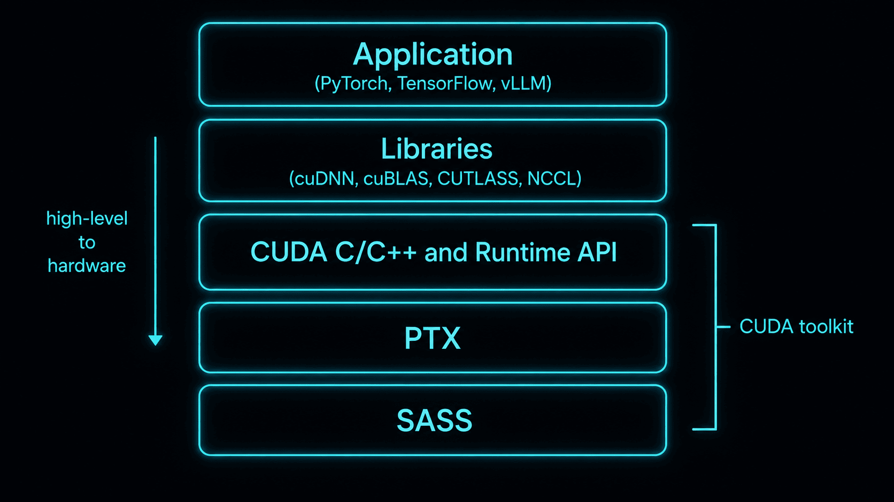
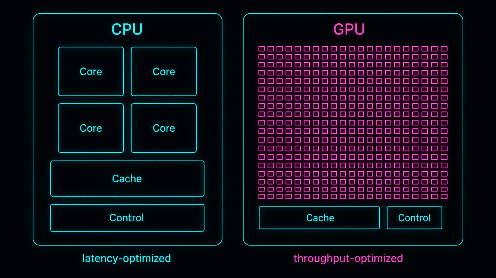
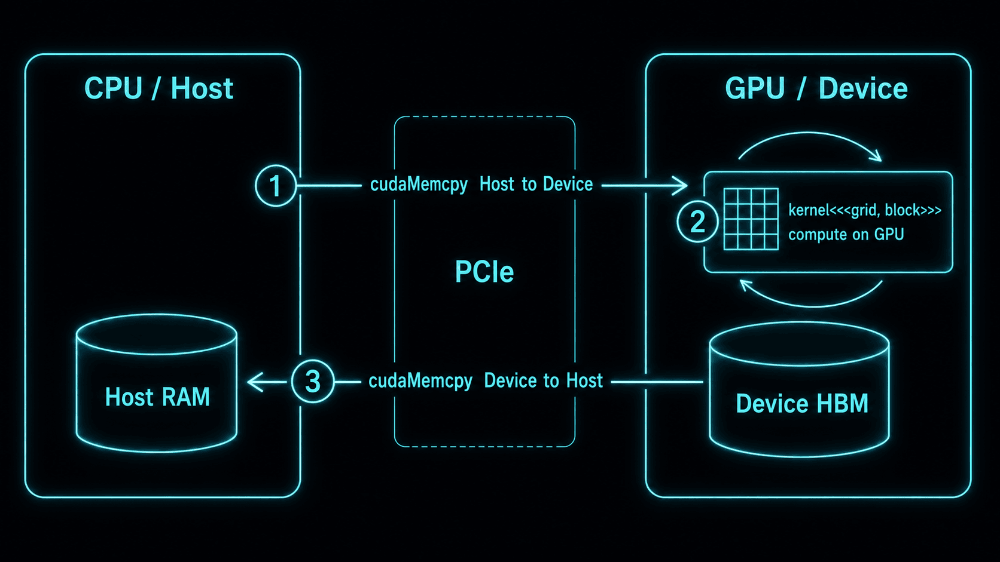
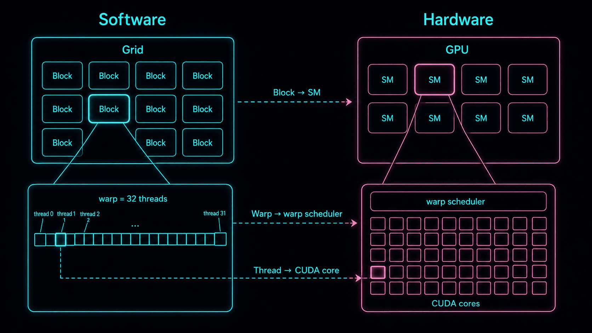
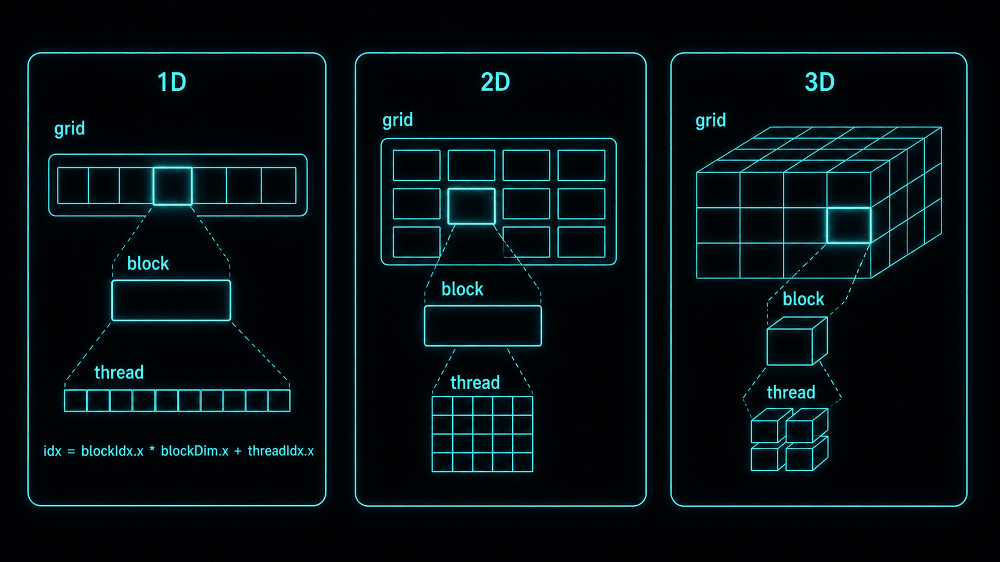

> Source: [01 CUDA C Basics](https://youtu.be/OsK8YFHTtNs)

## CUDA란 무엇인가

CUDA(Compute Unified Device Architecture)는 NVIDIA의 병렬 컴퓨팅 플랫폼이고, 단일한 무언가가 아니다. 프로그래밍 모델, 드라이버·런타임 API, 컴파일러 툴체인(`nvcc`, PTX를 거쳐 SASS로 낮춤), 라이브러리 스택(cuBLAS, cuDNN 등)을 모두 아우른다. 이 중 C++를 device 코드로 확장하는 특정 레이어가 *CUDA C++*이고, 이건 플랫폼의 한 부분이지 전부가 아니다. 2007년 공개 이후 CUDA는 딥러닝 인프라의 사실상 표준이 됐고, GPU를 그래픽 전용이 아니라 범용 연산 장치(GPGPU)로 쓸 수 있게 열었다.

그런데 "CUDA를 쓴다"고 할 때 정확히 무엇을 쓴다는 걸까? PyTorch로 모델을 돌리는 것도 CUDA고, `__global__` 커널을 직접 짜는 것도 CUDA다. 이 혼란은 CUDA가 단일 레이어가 아니라 스택이기 때문에 생긴다.



위 그림에서 흔히 CUDA라고 부르는 범위는 3\~5번 레이어(CUDA C/C++, PTX, SASS)를 묶은 것이다.

| 레이어 | 역할 |
| --- | --- |
| CUDA C/C++ | 개발자가 직접 쓰는 프로그래밍 모델. `__global__`, `threadIdx`, Grid/Block/Thread 추상화 |
| CUDA Runtime API | `cudaMalloc`, `cudaMemcpy`, 커널 launch 등 |
| nvcc | 위 코드를 `PTX`/`SASS`로 컴파일하는 NVIDIA 컴파일러 |
| PTX | 가상 ISA. 세대 간 forward 호환 담당 |
| SASS | 특정 GPU 세대로 컴파일된 실제 머신코드. 아키텍처마다 다름 |

---

## GPGPU

GPGPU(General-Purpose computing on GPU)는 말 그대로 GPU를 그래픽 외의 범용 연산에 쓴다는 뜻이다. 딥러닝이 뜨기 전까지 GPU는 주로 폴리곤을 그리는 그래픽 장치였지만, 지금은 대규모 병렬 수치 연산이면 무엇이든 GPU로 넘긴다.

영상 편집기(VEGAS Pro)나 NVIDIA 제어판에서 `CUDA - GPUs` 같은 옵션이 보이는 것도 이 때문이다. 특정 프로그램이 CUDA 연산을 어느 GPU에서 돌릴지 지정하는 설정으로, 게임이 아니라 영상 편집·머신러닝 같은 GPGPU 워크로드를 위한 것이다.

GPGPU가 위력을 발휘하는 워크로드는 공통점이 하나 있다. 같은 연산을 수많은 데이터에 독립적으로 반복한다는 것이다. 이 구조가 GPU의 SIMT(Single Instruction, Multiple Threads) 실행 모델과 정확히 맞아떨어진다.

| 워크로드 | 본질 |
| --- | --- |
| 영상 인코딩/필터 | 픽셀 행렬에 대한 병렬 수치 연산 |
| 딥러닝 학습/추론 | 텐서(다차원 행렬) MatMul |
| 암호화폐 채굴 | 해시 함수의 대규모 병렬 실행 |
| 과학 시뮬레이션 | 격자/입자 시스템의 병렬 업데이트 |
| 3D 렌더링 (Blender Cycles 등) | Ray 단위 병렬 계산 |

여담으로, GPU를 인공신경망 학습에 활용한 초기 사례 중 하나가 한국 연구진의 2004년 논문(Oh & Jung, *"GPU implementation of neural networks"*, Pattern Recognition)이다. CUDA도 없던 시절 셰이더로 신경망을 돌린 셈이다.

## CPU와 GPU의 분업

이기종 컴퓨팅(Heterogeneous Computing)은 서로 다른 아키텍처(CPU와 GPU)가 한 시스템 안에서 협력하는 방식이다. CUDA 프로그래밍의 핵심은 "모든 코드를 GPU에서 돌리는 것"이 아니다. 제어 흐름과 가벼운 로직은 CPU(Host)가 맡고, 연산이 무거운 부분(행렬·텐서 연산)만 GPU(Device)로 오프로드하는 것이다.

이 분업이 왜 필요한지는 두 칩의 설계 철학을 보면 나온다. CPU는 코어 몇 개에 큰 캐시와 강력한 분기 예측을 얹어 순차 실행 지연(latency)을 줄이도록 설계됐다. 반대로 GPU는 제어 로직과 캐시를 최소화한 작은 코어를 수천 개 박아 처리량(throughput)을 극대화한다. 그래서 분기 많고 순차적인 코드는 CPU가, 같은 연산을 수천 번 반복하는 코드는 GPU가 유리하다.


*CPU는 큰 코어 몇 개로 지연(latency)을, GPU는 작은 코어 수천 개로 처리량(throughput)을 최적화한다*

### 3단계 실행 흐름 (Data Flow)

이 글이 다루는 명시적 복사(explicit-copy) 모델에서, CPU(Host)와 GPU(Device)는 물리적으로 분리된 메모리를 갖는다. CPU에서 할당한 변수는 커널에서 보이지 않으므로 개발자가 직접 데이터를 옮겨야 한다. (UVA, Unified/managed memory, integrated GPU는 이걸 완화해서 주소 공간을 공유하거나 페이지를 자동 이주시키지만, 그건 별도 주제다. 명시적 모델을 먼저 이해하는 게 순서다.) 이 모델에서 모든 CUDA 프로그램은 메모리 단절을 극복하려고 아래 3단계를 거친다.

1. Host → Device (`cudaMemcpy`)

```cpp
cudaMemcpy(d_data, h_data, size, cudaMemcpyHostToDevice);
```

CPU 메모리의 원본 데이터를 host-device interconnect로 GPU 메모리에 복사한다. 개별 GPU에선 보통 PCIe이고, NVLink는 GH200 같은 특정 topology 시스템에서만이다.

2. Execute Kernel (`<<<...>>>`)

```cpp
kernel<<<gridDim, blockDim>>>(d_data);
```

GPU에서 병렬 커널을 실행해 실제 연산을 수행한다.

3. Device → Host (`cudaMemcpy`)

```cpp
cudaMemcpy(h_result, d_result, size, cudaMemcpyDeviceToHost);
```

계산이 끝난 GPU 메모리의 결과를 다시 CPU 메모리로 가져온다.



이 3단계가 왜 CUDA 최적화의 가장 큰 병목이냐면, 경로만 헷갈리지 않으면 대역폭 숫자에서 바로 나온다. 개별 GPU의 기본 host-to-device 경로는 PCIe다. PCIe Gen4 x16은 방향당 약 32 GB/s(이론치), Gen5 x16은 약 64 GB/s다. NVLink는 훨씬 빠르지만 topology에 의존한다. H100의 NVLink는 약 900 GB/s(양방향 합산)이고, 이건 NVLink/NVSwitch로 묶인 GPU-GPU나 GH200의 on-package NVLink-C2C(Grace-Hopper) 경로에 해당하지, 시스템 RAM에서의 평범한 `cudaMemcpy`에는 해당하지 않는다. 그건 여전히 PCIe를 탄다. 반면 GPU 안 HBM은 A100 SXM이 약 2.0 TB/s(HBM2e), H100 SXM이 약 3.35 TB/s(HBM3)다. 정리하면 온디바이스 메모리가 PCIe host link보다 대략 30\~100배 빠르고, 그 배율은 PCIe 세대와 GPU에 따라 달라진다.


host-device 왕복 한 번의 비용이 그만큼 크다는 뜻이고, 그래서 실전 최적화의 상당 부분이 "전송을 얼마나 줄이느냐"로 결정된다. pinned(page-locked) 메모리로 PCIe 전송 대역폭을 끌어올리고, `cudaMemcpyAsync`로 전송과 연산을 겹치고(overlap), kernel fusion으로 커널 사이의 *중간* global memory 트래픽과 launch overhead를 줄인다. fusion이 host 왕복을 없애는 건 중간 결과를 host로 되넘기던 파이프라인에서만 해당한다. 이건 다음 글에서 따로 판다.

---

## CUDA C 기본 문법과 커널(Kernel)

앞의 통신 병목을 감수하고서라도 GPU로 넘길 만큼 '무거운 연산'이란 뭘까? CUDA 입문에서 그 이점을 가장 직관적으로 보여주는 예제가 벡터 덧셈(Vector Addition)이다. `c[i] = a[i] + b[i]`는 각 인덱스가 서로 영향을 주지 않으니, thread 하나가 원소 하나씩만 맡으면 끝난다. 전형적인 embarrassingly parallel 문제다.

이 병렬 연산을 GPU에서 실행하려면, 먼저 코드가 어디서 실행되고 어디서 호출되는지를 명시해야 한다. CUDA C는 이를 위해 C/C++에 함수 한정자(Qualifier)를 추가한다.

| 한정자 | 실행 위치 | 호출 위치 | 특징 |
| --- | --- | --- | --- |
| `__global__` | Device (GPU) | Host (CPU) | GPU에서 실행되는 커널. 비동기 실행이라 반드시 `void` 반환 |
| `__device__` | Device (GPU) | Device (GPU) | GPU 내부에서만 호출되는 헬퍼 함수 |
| `__host__` | Host (CPU) | Host (CPU) | 일반 C/C++ 함수 (기본값, 생략 가능). 한정자 없는 함수는 전부 `__host__` |

`__global__` 커널이 `void`만 반환하는 건 실행 모델 때문이다. 커널 런치는 비동기라서, `kernel<<<...>>>()`를 호출한 CPU는 커널이 끝나기를 기다리지 않고 바로 다음 줄로 넘어간다. 반환값을 돌려받을 동기적 경로 자체가 없다. 결과가 필요하면 `cudaMemcpy`(암묵적 동기)나 `cudaDeviceSynchronize`로 완료를 기다린 뒤 device 메모리에서 꺼내와야 한다.

## nvcc가 코드를 나눠서 컴파일한다

`.cu` 파일 하나 안에 CPU 코드(`main`)와 GPU 코드(`__global__`)가 섞여 있어도 문제없다. NVIDIA 컴파일러 `nvcc`가 소스를 스캔해서 둘을 갈라 처리하기 때문이다.

파이프라인을 조금 파보면 이렇다. host 코드는 시스템 C++ 컴파일러(GCC, MSVC 등)로 그대로 넘긴다. device 코드는 두 단계로 낮춘다. 먼저 `cicc`(NVVM/LLVM 기반)가 C++를 `PTX`로 바꾸고, 그 다음 `ptxas`가 `PTX`를 특정 아키텍처의 `SASS`로 컴파일한다. 최종 바이너리(fatbin)에는 보통 몇 개 아키텍처의 SASS와 함께 forward-compatible한 PTX 하나가 embed된다. SASS는 같은 major compute capability 안에서는 forward 바이너리 호환이 된다. sm_80 코드는 sm_86, sm_89(전부 major 8)에서도 돌지만, major가 바뀌면(sm_80을 sm_90에서 돌리는 것) 안 된다. 그래서 major가 한 세대 위인 GPU에서 돌아가려면 forward-compatible한 PTX를 실어야 하고, 드라이버가 load 시점에 그걸 SASS로 JIT한다. PTX 없이 SASS만 구우면(`-arch=native`가 SASS만 뽑는 게 그 예), 다음 major 세대 GPU를 만나는 순간 로드가 실패한다. 이게 PTX를 "가상 ISA"라 부르는 이유이고, `-gencode arch=...,code=...` 플래그가 어느 아키텍처의 SASS를 미리 구울지와 PTX를 함께 실을지를 정하는 이유다.

말로만 설명하면 안 와닿으니 실제로 열어보자. 앞의 `add` 커널을 `nvcc -arch=sm_80 -ptx vector_add.cu`로 뽑으면 PTX의 핵심은 이렇다.

```ptx
mad.lo.s32    %r1, %r3, %r4, %r5;  // thread index i
setp.ge.s32   %p1, %r1, %r2;       // i >= N ?
@%p1 bra      $L__BB0_2;           // 범위 밖이면 건너뜀
...
ld.global.f32 %f1, [%rd8];         // b[i]
ld.global.f32 %f2, [%rd6];         // a[i]
add.f32       %f3, %f2, %f1;       // a[i] + b[i]
st.global.f32 [%rd10], %f3;        // c[i] = ...
```

C 한 줄(`c[i] = a[i] + b[i]`)이 어떻게 낮아지는지가 그대로 보인다. 인덱스 계산은 `mad.lo.s32` 하나로 접히는데, 이건 주소 계산용 32-bit *정수* 곱셈-덧셈이지 FP32 fused-multiply-add가 아니다. `if (i < N)`은 `setp` + 조건부 분기(`@%p1 bra`)가 되고, 실제 작업은 global load 2번 + FP32 `add` 1번 + global store 1번이다. 뒤에서 볼 roofline 분석의 "원소당 12바이트, 1 FLOP"이 바로 이 네 줄이다. 여기서 다시 `ptxas`가 이 PTX를 특정 아키텍처의 SASS로 낮추고, 그 실물은 `cuobjdump -sass`로 열어볼 수 있다.

## Thread와 Block, 몇 개까지 되나

- Block당 thread는 최대 1024개다. 차원 분배(`dim3`)는 자유지만 곱이 1024를 넘으면 커널 런치가 `cudaErrorInvalidConfiguration`으로 실패한다. `dim3(32, 32, 1)`(=1024)은 통과하지만 `dim3(32, 32, 2)`(=2048)는 죽는다. 여기에 z축은 따로 최대 64라는 제약도 있어 놓치기 쉽다.
- Grid는 훨씬 넉넉하다. x축 2³¹-1개, y·z 각 65535개까지 된다. 어지간한 데이터셋으로 이 한도에 부딪힐 일은 없다.
- Shared memory는 사람들이 뭉뚱그리는 숫자가 셋이다. *정적(static)* 할당의 Block당 상한은 48KB(호환용 기본값, 모든 아키텍처 동일)다. *opt-in 동적(dynamic)* 할당의 Block당 최대치는 더 높고 `cudaFuncSetAttribute(kernel, cudaFuncAttributeMaxDynamicSharedMemorySize, bytes)`로 요청한다. A100(cc 8.0) 약 163KB, H100(cc 9.0) 약 227KB다. 이 둘 다 SM의 *통합* L1/shared memory 용량(A100 192KB, H100 256KB)에서 잘라 쓰는 것으로, 하드웨어가 L1 캐시와 shared memory로 나눈다.

이 숫자들은 임의로 정한 게 아니라 [하드웨어](../cuda-0-gpu-architecture/)에서 나온다. Block 하나는 반드시 SM(Streaming Multiprocessor) 하나 위에서 끝까지 실행되며, 도중에 다른 SM으로 쪼개 옮기지 않는다. SM은 그 block을 warp 단위로 스케줄한다. 그래서 block당 thread 상한 1024는 warp로 치면 32개다. 게다가 SM의 레지스터 파일은 유한하다. 최근 아키텍처는 SM당 32-bit 레지스터가 65,536개인데, 이걸 그 SM에 올라간 모든 thread가 나눠 쓴다. thread 하나가 레지스터를 많이 잡아먹으면 SM에 동시에 올릴 수 있는 thread 수가 줄어든다. 이게 바로 다음 절의 occupancy 얘기다.

## Warp와 32의 배수

GPU는 thread를 warp 단위로 묶어 실행한다. warp는 32개 thread이며, 이 숫자는 NVIDIA GPU 전 세대에서 고정이고 개발자가 바꿀 수 없다.

warp가 왜 성능에 직결되냐면, warp가 스케줄러의 issue 단위이기 때문이다. 한 사이클에 warp scheduler는 32 lane의 *active mask*에 대해 명령 하나를 issue한다(SIMT). warp 안에서 lane들이 `if/else`로 갈리면(warp divergence) 그 경로들이 직렬화된다. 하드웨어가 한 경로를 나머지 lane을 마스킹한 채 실행하고, 그다음 다른 경로를 실행한다. Volta(cc 7.0)부터는 independent thread scheduling으로 thread마다 자기 program counter를 갖게 돼서, 갈린 lane들이 서로 끼어들 수 있고 분기의 post-dominator에서 *즉시* reconverge된다는 보장이 없다. 다시 발맞춰야 하면 `__syncwarp()`를 쓴다. 어느 쪽이든 덜 찬 마지막 warp도 32-lane issue 슬롯을 통째로 차지하므로, thread 수를 32의 배수로 안 맞추면 lane이 낭비된다.

예를 들어 Block당 thread를 100개로 잡으면 GPU는 warp 4개(128 thread) 분량의 스케줄링 슬롯을 잡아놓고 실제로는 100개만 일한다. 나머지 28 슬롯이 놀게 되어 활용률이 100/128 ≈ 78%로 떨어진다. 시작부터 약 22%를 버리는 셈이다.

그래서 Block 크기는 보통 128·256·512 중에서 고르는데, 실제 판단 기준은 occupancy다. occupancy는 SM에 올라간 활성 warp 수를 SM당 최대 warp 수로 나눈 값인데, 이 최대치부터 아키텍처 의존이다. A100(cc 8.0)과 H100(cc 9.0)은 64, 소비자용 Ampere(cc 8.6)와 Ada(cc 8.9)는 48이다. 나머지 SM당 자원도 마찬가지로 정해져 있다. cc 8.0 기준 상주 thread 최대 2048개, 상주 block 최대 32개, 레지스터 65,536개, shared memory 최대 164KB(H100은 228KB). 이 중 가장 먼저 바닥나는 자원이 occupancy를 결정한다.

여기서 occupancy가 왜 중요한지를 짚어야 한다. GPU의 성능 모델은 근본적으로 latency hiding이다. global memory 접근은 수백 사이클(대략 400\~800)이 걸리는 반면, FP 연산은 4\~6 사이클이면 끝난다. 한 warp가 global load에서 멈추면 SM의 warp scheduler는 같은 사이클에 실행 준비된 다른 warp로 즉시 갈아탄다. 이 전환에 비용이 없는 이유는, 그 SM에 상주하는 모든 warp의 레지스터가 레지스터 파일에 동시에 올라가 있어서 CPU처럼 컨텍스트를 저장하고 복원할 필요가 없기 때문이다. 그래서 상주 warp가 많을수록 누군가 메모리를 기다리는 동안 굴릴 warp가 남아 있을 확률이 높다. occupancy를 올린다는 건 코어를 바쁘게 만드는 게 아니라 메모리 지연을 숨기는 것이다.

한 SM에 *상주(resident)*할 수 있는 block 수는 네 가지 독립 제약(thread, 하드웨어 block 슬롯, 레지스터, shared memory) 중 최소값이고, occupancy는 거기서 따라 나온다.

$$
B_{\text{res}} = \min\!\left(
\left\lfloor \tfrac{T_{\text{SM}}}{T_{\text{block}}} \right\rfloor,\;
B_{\text{SM}}^{\max},\;
\left\lfloor \tfrac{R_{\text{SM}}}{R_{\text{thread}}\, T_{\text{block}}} \right\rfloor,\;
\left\lfloor \tfrac{S_{\text{SM}}}{S_{\text{block}}} \right\rfloor
\right)
$$

$$
\text{active warps} = B_{\text{res}} \left\lceil \tfrac{T_{\text{block}}}{32} \right\rceil,
\qquad
\text{occupancy} = \frac{\text{active warps}}{W_{\text{SM}}^{\max}}
$$

이 per-SM 한도들은 compute capability로 정해진다. cc 8.0(A100) 기준: $T_{\text{SM}}=2048$, $B_{\text{SM}}^{\max}=32$, $R_{\text{SM}}=65536$, $W_{\text{SM}}^{\max}=64$. $T_{\text{block}}=256$이면 thread 한도만으로 $\lfloor 2048/256 \rfloor = 8$개 block이고, 레지스터도 이걸 묶는다. 8개 block이 상주하려면 $8 \cdot 256 \cdot R_{\text{thread}} \le 65536$, 즉 $R_{\text{thread}} \le 32$이어야 한다. thread당 32개를 넘으면 block이 덜 올라가고 occupancy가 떨어진다. (실제 하드웨어는 레지스터를 warp 단위 고정 granularity로 할당하므로 진짜 컷오프는 이 bound보다 조금 거칠다.) 공식이 챙겨야 할 edge case 하나: shared memory를 안 쓰는 커널은 $S_{\text{block}} = 0$이라 그 항을 빼야 한다($+\infty$로 읽으면 된다). 절대 병목이 안 된다. 벡터 덧셈이 딱 이 경우다.

occupancy가 높은 것 자체가 목표는 아니다. 메모리 지연을 숨기는 여러 레버 중 하나일 뿐이다. 지연이 이미 숨겨진 뒤로는 occupancy를 더 올려도 소용없고, thread당 레지스터 예산을 깎아서 오히려 해가 되기도 한다. instruction-level parallelism, 실측 DRAM 대역폭, 캐시 거동이 다 같이 걸린다. 가정하지 말고 재라. Nsight Compute의 `sm__warps_active.avg.pct_of_peak_sustained_active`가 *achieved* occupancy를 보여주고, 실제로 중요한 건 그 값이다.

## 메모리 접근은 warp 단위로 합쳐진다 (coalescing)

global memory(HBM)를 커널 안에서 어떻게 읽느냐도 host-device 전송만큼 성능을 가른다. GPU는 warp의 32개 thread가 낸 global memory 요청을 하드웨어가 합쳐서(coalesce) 처리하기 때문이다.

compute capability 6.0 이상(Pascal 이후, A100·H100 포함)에서 global memory 트랜잭션 단위는 32바이트 *sector*다. warp가 연속된 4바이트 워드 32개를 읽으면 128바이트 구간을 건드리는데, 그게 정확히 sector 4개다. warp가 global load를 실행하면 하드웨어가 32개 lane 주소를 그걸 덮는 sector들로 매핑하고, 그 sector들을 통째로 가져온다. warp가 한 번의 load에서 건드리는 서로 다른 32바이트 sector의 개수를 $S$라 하자. 버스 효율은 요청한 바이트를 실제 옮긴 바이트로 나눈 값이다.

$$
S = \bigl|\{\, \lfloor \text{addr}_{\text{lane}}/32 \rfloor \,\}\bigr|,
\qquad
\eta = \frac{\text{requested bytes}}{32\,S}
$$

warp가 float 32개를 읽는 두 극단을 계산해 보자(요청 $= 32 \times 4 = 128$ B):

- **연속·정렬:** 128 B가 정확히 sector 4개에 걸쳐 $S = 4$, 그래서 $\eta = 128 / (32 \cdot 4) = 1$. 정확한 표현은 "*32바이트 sector 4개(= 128바이트 연속 구간)를 꽉 채워 씀*"이지 "트랜잭션 1번"이 아니다.
- **완전 산개:** lane마다 각자의 sector에 떨어져 $S = 32$, 그래서 128 B 요청에 $32 \cdot 32 = 1024$ B가 오가고 $\eta = 128/1024 = 1/8$. 4바이트 원소 기준 바닥은 $1/32$가 아니라 $1/8$이다. 옛날 "$1/32$"는 128바이트 트랜잭션을 가정한 건데, sector 접근은 그렇게 동작하지 않는다.

벡터 덧셈이 빠른 진짜 이유가 이거다. `i = blockIdx.x * blockDim.x + threadIdx.x`로 인덱싱하면 이웃 lane이 이웃 주소(a[0], a[1], a[2] …)를 읽어서 warp가 연속된 sector 4개를 건드리고 $\eta = 1$이 된다. `a[i * stride]`처럼 성기게 읽으면 $\eta$가 $1/8$ 쪽으로 떨어지고 커널도 그만큼 느려진다. Nsight Compute가 바로 재준다. `l1tex__t_sectors_pipe_lsu_mem_global_op_ld.sum`이 옮긴 sector 수, `l1tex__t_requests_pipe_lsu_mem_global_op_ld.sum`이 load request 수이고, 둘의 비(sector ÷ request)가 request당 평균 sector(full-warp 32-bit load면 이상 4, 최악 32) = coalescing 품질이다. "thread를 가장 빠르게 변하는 차원(x)에 매핑하라"는 규칙은 이 비율을 바닥에 붙여두는 것일 뿐이다.

## Block끼리는 통신할 수 없다

같은 Block 안의 thread끼리는 shared memory를 공유하고 `__syncthreads()`로 동기화할 수 있다. 물리적으로 같은 SM 안에 있기 때문이다.

다른 Block끼리는 다르다. CUDA가 보장하는 건, 일반 커널의 thread block들이 서로 독립적으로 아무 순서로나 실행될 수 있어야 한다는 것이고, *임의의 block 사이엔 커널 안에서의 일반적 barrier나 순서 보장이 없다*. Block 0보다 Block 7이 먼저 끝날 수 있다. 그래도 block들은 global memory와 atomic으로 *간접* 통신은 가능하다. 다만 니가 강제하지 않는 한 순서·가시성 보장은 없다. device 전체 barrier가 정말 필요하면 정식 방법은 커널을 두 번 launch하거나, Cooperative Groups `grid.sync()`로 cooperative launch를 쓰거나, (Hopper에선) distributed shared memory를 쓰는 thread block cluster다.

이유는 Block↔SM 매핑이 하드웨어 제약이라서다. 같은 Block의 thread가 shared memory를 공유하는 건 물리적으로 같은 SM의 SRAM에 얹혀 있기 때문이고, 다른 Block과 통신 못 하는 건 다른 SM이라 SRAM이 분리돼 있기 때문이다.

그런데 이 제약이 사실 CUDA의 가장 중요한 설계다. Block이 서로 독립적이기 때문에, 런타임은 block을 노는 SM에 아무 순서로나 뿌릴 수 있다. SM이 20개짜리 노트북 GPU든 132개짜리 H100이든, 같은 커널 바이너리가 SM 수만큼 자동으로 병렬화된다. 코드를 한 줄도 안 고쳤는데 GPU가 커지면 그만큼 빨라진다는 뜻이다. NVIDIA는 이걸 transparent scalability라고 부른다. block 간 통신을 포기한 대가로 얻은 게 이 확장성이고, 그래서 Grid/Block/Thread 소프트웨어 계층이 SM/warp/lane 하드웨어와 맞아떨어진다. 다만 아래 그림이 단순화하듯, 그 대응은 *스케줄링*의 대응이지 고정된 1:1 결속이 아니다. block은 한 SM에 배치돼 거기 머물고, SM은 그 block의 thread를 32개씩 warp로 issue하며, "CUDA core"는 자기 warp가 issue되는 사이클에 한 lane의 연산을 실행하는 scalar 실행 유닛(ALU/FP lane)이다. thread는 소프트웨어 실행 컨텍스트이지 자기가 소유한 물리 코어가 아니다.


*Grid/Block/Thread(소프트웨어)가 GPU/SM/warp scheduler/실행 유닛(하드웨어)에 스케줄된다. block은 SM에 배치되고 thread는 32개씩 warp로 issue되며 CUDA core는 한 lane의 연산을 실행한다. 고정된 thread↔core 결속이 아니라 스케줄링 대응이다.*

아래는 이 계층 구조를 차원별로 도식화한 것이다.


*차원별 구성. 1D `kernel<<<4, 8>>>` (32 thread), 2D `kernel<<<dim3(2,2), dim3(4,4)>>>`, 3D `kernel<<<dim3(2,2,2), dim3(2,2,2)>>>` (64 thread). 전역 인덱스는 `blockIdx.x * blockDim.x + threadIdx.x`*

## `<<< >>>` 로 커널 실행하기

`__global__` 함수는 일반 함수처럼 호출하면 컴파일 에러가 난다. 반드시 triple chevron 문법을 써야 한다.

```cpp
mykernel<<<gridDim, blockDim>>>(args);
//        ^^^^^^^  ^^^^^^^^
//        Block 개수, Block당 thread 개수
```

- `gridDim`: Grid 안의 Block 개수
- `blockDim`: Block 안의 thread 개수
- 총 thread 수 = `gridDim × blockDim`

가장 단순한 예:

```cpp
mykernel<<<1, 1>>>();   // Block 1개, thread 1개 → 사실상 순차 실행
```

벡터 덧셈처럼 N개 원소를 처리하려면 N개의 thread가 필요하다. 원본 영상은 단순화를 위해 `<<<N, 1>>>`로 호출하지만, 앞서 본 warp 효율 때문에 실제로는 Block당 thread를 128\~512개로 잡는 것이 효율적이다. N을 blockSize로 올림 나눗셈해서 grid를 잡으면 된다.

```cpp
int N = 10000;
int blockSize = 256;
int gridSize = (N + blockSize - 1) / blockSize;  // 올림 나눗셈
add<<<gridSize, blockSize>>>(a, b, c, N);
```

한 가지 관용구를 더 짚자면, grid를 데이터 크기에 딱 맞추는 대신 grid를 고정하고 각 thread가 여러 원소를 처리하는 grid-stride loop가 있다. thread가 `blockDim.x * gridDim.x`만큼 건너뛰며 도는 방식이라, launch 설정을 데이터 크기와 분리할 수 있고 N이 grid 용량을 넘어도 안전하다.

```cpp
__global__ void add(float* a, float* b, float* c, int N) {
    int stride = blockDim.x * gridDim.x;
    int i = blockIdx.x * blockDim.x + threadIdx.x;
    for (; i < N; i += stride)
        c[i] = a[i] + b[i];
}
```

## 전체 예제: 컴파일되는 벡터 덧셈

지금까지 조각으로 본 것들(3단계 전송, 한정자, 런치 설정)을 하나로 합치면 이렇게 된다. 아래를 그대로 `vector_add.cu`로 저장하면 컴파일되고 실행된다.

```cpp
#include <cstdio>
#include <cstdlib>
#include <cmath>
#include <cuda_runtime.h>

__global__ void add(const float* a, const float* b,
                    float* c, int N) {
    int i = blockIdx.x * blockDim.x + threadIdx.x;
    if (i < N) c[i] = a[i] + b[i];   // 경계 밖 thread는 건너뛴다
}

int main() {
    const int N = 1 << 20;                 // 원소 약 100만 개
    const size_t bytes = N * sizeof(float);

    // 1) Host 할당 + 초기화
    float *h_a = (float*)malloc(bytes);
    float *h_b = (float*)malloc(bytes);
    float *h_c = (float*)malloc(bytes);
    for (int i = 0; i < N; i++) { h_a[i] = 1.0f; h_b[i] = 2.0f; }

    // 2) Device 할당
    float *d_a, *d_b, *d_c;
    cudaMalloc(&d_a, bytes);
    cudaMalloc(&d_b, bytes);
    cudaMalloc(&d_c, bytes);

    // 3) Host -> Device 전송
    cudaMemcpy(d_a, h_a, bytes, cudaMemcpyHostToDevice);
    cudaMemcpy(d_b, h_b, bytes, cudaMemcpyHostToDevice);

    // 4) 커널 실행 (block당 256 thread, grid는 올림 나눗셈)
    int blockSize = 256;
    int gridSize = (N + blockSize - 1) / blockSize;
    add<<<gridSize, blockSize>>>(d_a, d_b, d_c, N);

    // 5) Device -> Host 전송 (cudaMemcpy가 커널 완료까지 암묵 동기화)
    cudaMemcpy(h_c, d_c, bytes, cudaMemcpyDeviceToHost);

    // 6) 검증: 1.0 + 2.0 = 3.0 이어야 함
    float maxErr = 0.0f;
    for (int i = 0; i < N; i++)
        maxErr = fmaxf(maxErr, fabsf(h_c[i] - 3.0f));
    printf("max error: %f\n", maxErr);

    // 7) 정리
    cudaFree(d_a); cudaFree(d_b); cudaFree(d_c);
    free(h_a); free(h_b); free(h_c);
    return 0;
}
```

컴파일하고 실행하면:

```bash
$ nvcc vector_add.cu -o vector_add
$ ./vector_add
max error: 0.000000
```

이 한 파일에 앞 절들이 전부 들어 있다. 한정자(`__global__`), 3단계 전송(`cudaMemcpy` 세 번), 런치 설정(`<<<gridSize, blockSize>>>`), 경계 검사(`if (i < N)`)까지. 참고로 이 코드는 간결함을 위해 에러 체크를 생략했는데, 실전에선 모든 CUDA 호출의 반환값과 커널 런치 직후의 `cudaGetLastError()`를 확인해야 한다. 커널 런치 실패는 조용히 넘어가기 때문이다.

## 이 커널은 연산이 아니라 대역폭에 묶여 있다

벡터 덧셈을 "GPU로 빨라지는 연산"의 예로 들었지만, 전문가 시각에선 정반대로 읽어야 한다. 이 커널은 FLOP를 거의 쓰지 않는다. 원소 하나당 load 2번(a, b)과 store 1번(c), 곧 12바이트를 옮기고 실제 연산은 덧셈 1번뿐이다. 이 비율을 arithmetic intensity라 부른다.

$$
\begin{aligned}
Q &= 2 \times 4\,\text{B} \;+\; 1 \times 4\,\text{B} = 12\,\text{B} \quad(\text{load } a,b\text{; store } c) \\
I &= \frac{W}{Q} = \frac{1\ \text{FLOP}}{12\ \text{B}} \approx 0.083\ \text{FLOP/B}
\end{aligned}
$$

이 값이 커널이 연산 병목인지 메모리 병목인지를 가른다. 판단 틀은 roofline 모델이다. 어떤 커널이 낼 수 있는 성능은 연산 상한과 대역폭 상한 중 낮은 쪽에 걸린다.

$$P = \min\!\bigl(P_{\text{peak}},\ I \cdot \beta\bigr)$$

두 상한이 만나는 지점(ridge point) $I^{*} = P_{\text{peak}} / \beta$를 기준으로, $I$가 그보다 왼쪽이면 메모리 병목, 오른쪽이면 연산 병목이다. A100(FP32 피크 $P_{\text{peak}} \approx 19.5$ TFLOP/s, HBM $\beta \approx 2.0$ TB/s)이면 ridge point는

$$I^{*} = \frac{19.5 \times 10^{12}}{2.0 \times 10^{12}} \approx 9.75 \ \text{FLOP/byte}$$

벡터 덧셈의 $I = 0.083$은 이보다 100배 넘게 왼쪽에 있다. 완전한 메모리 병목이라는 뜻이고, 이 커널의 성능 상한은

$$
\begin{aligned}
P_{\text{vadd}} = I \cdot \beta
&= \frac{1\ \text{FLOP}}{12\ \text{B}} \times 2.0\times10^{12}\ \text{B/s} \\
&= 1.67\times10^{11}\ \text{FLOP/s} \\
&\approx 166\ \text{GFLOP/s} \quad(0.85\%\ \text{of peak})
\end{aligned}
$$

A100 FP32 피크의 1%에도 못 미친다. 즉 벡터 덧셈은 GPU의 연산력이 아니라 대역폭과 병렬 인덱싱을 보여주는 예제다. GPU로 진짜 이득을 보는 연산은 arithmetic intensity가 높은 쪽, 예컨대 행렬 곱처럼 한 번 읽은 데이터를 여러 번 재사용하는 연산이다. 딥러닝 커널 최적화의 상당 부분이 데이터 재사용을 늘려 $I$를 ridge point 오른쪽으로 밀어붙이는 작업인 것도 같은 이유다.

이 memory-bound 판정은 대수 말고 실측으로 확인할 수 있다. `cudaEvent`로 커널 시간을 재서 옮긴 바이트를 나누면 실효 대역폭이 나오고, Nsight Compute의 `dram__bytes.sum.per_second`(또는 DRAM Throughput %)가 $\beta$에 얼마나 근접했는지 보여준다. 잘 튜닝한 벡터 덧셈은 HBM 피크 대역폭의 상당 비율에 근접할 수 있고(정확한 수치는 니 GPU에서 직접 재라) FLOP/s 피크 근처엔 얼씬도 못 한다. roofline이 예측한 그대로다.

이 `<<< >>>` 안의 숫자가 곧 GPU의 물리적 구조(SM, warp, block)를 그대로 드러낸다. 다른 언어가 하드웨어를 숨기는 것과 반대로, CUDA는 하드웨어를 드러내서 성능을 개발자 손에 쥐여준다. 이게 CUDA를 배우는 이유이자, 어렵게 만드는 이유다.

## 참고

- [CUDA C++ Programming Guide](https://docs.nvidia.com/cuda/cuda-c-programming-guide/): 프로그래밍 모델, occupancy, 메모리 계층의 1차 출처
- [CUDA Compiler Driver NVCC](https://docs.nvidia.com/cuda/cuda-compiler-driver-nvcc/): 컴파일 파이프라인과 `-gencode`
- [Nsight Compute](https://docs.nvidia.com/nsight-compute/): occupancy·병목 자원 진단
