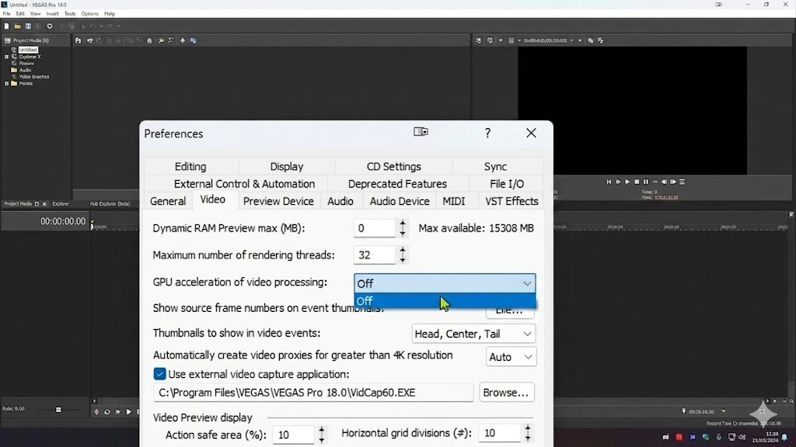
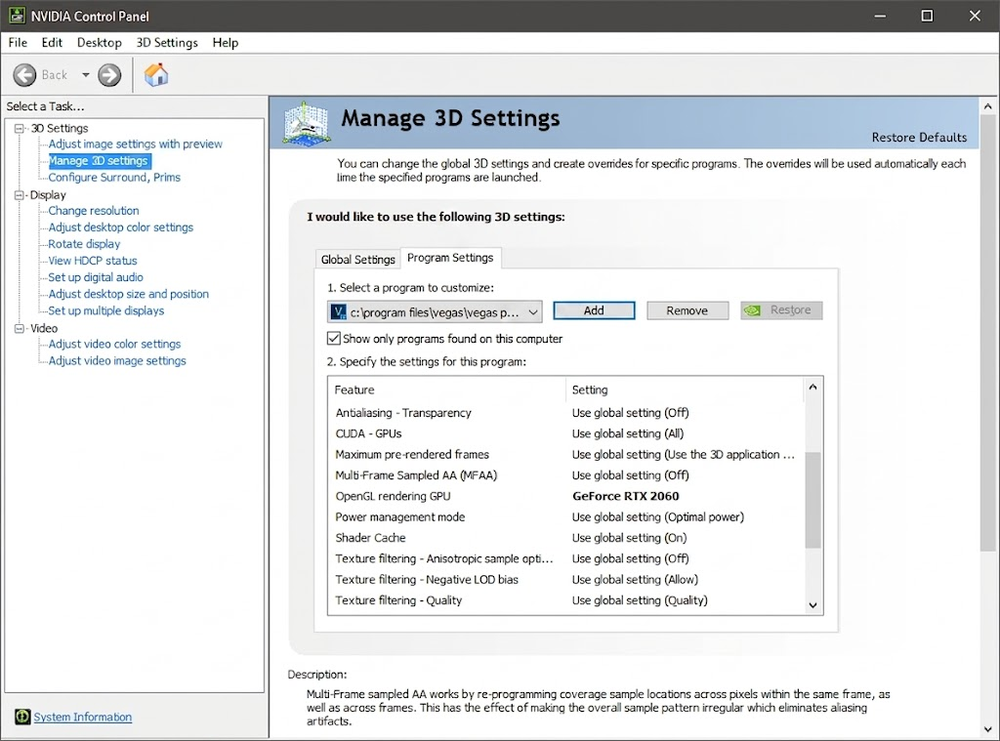
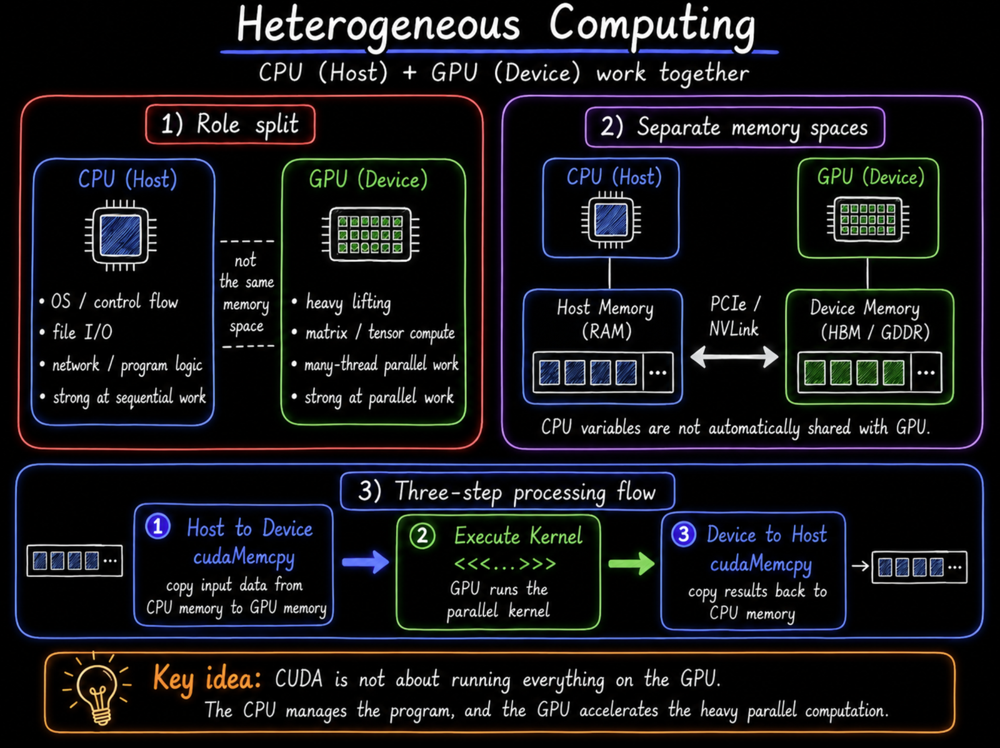
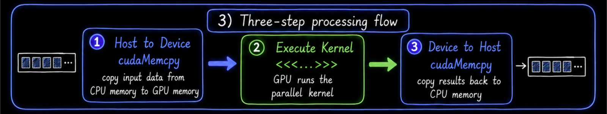
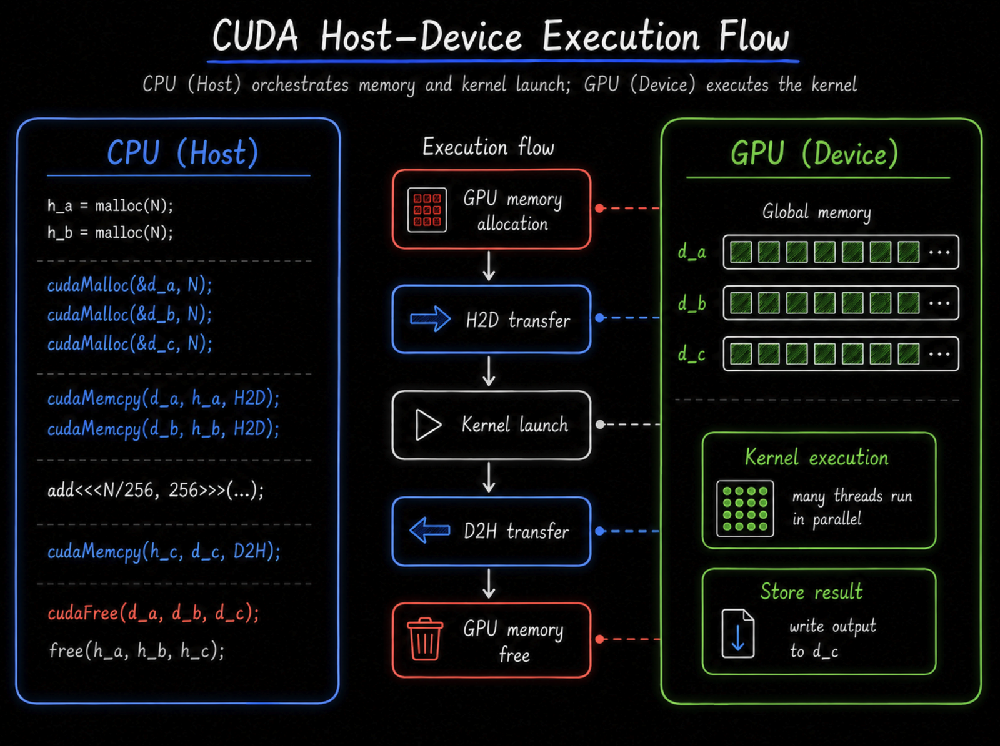

> Source: [01 CUDA C Basics](https://youtu.be/OsK8YFHTtNs)

# CUDA란 무엇인가

**CUDA**(Compute Unified Device Architecture)는 NVIDIA의 병렬 컴퓨팅 플랫폼이자 프로그래밍 모델이다. GPU를 그래픽 전용 장치가 아니라 범용 연산 장치(**GPGPU**)로 쓸 수 있게 열어준 C/C++ 확장이며, 2007년 공개된 이후 딥러닝 인프라의 사실상 표준이 됐다.

그런데 "CUDA를 쓴다"고 할 때 정확히 무엇을 쓴다는 걸까? PyTorch로 모델을 돌리는 것도 CUDA고, `__global__` 커널을 직접 짜는 것도 CUDA다. 이 혼란은 CUDA가 **단일 레이어가 아니라 스택**이기 때문에 생긴다.


위 그림에서 흔히 CUDA라고 부르는 범위는 보통 **3~5번 레이어(CUDA C/C++ · PTX · SASS)**를 묶은 것이다.

| 레이어 | 역할 |
| --- | --- |
| **CUDA C/C++** | 개발자가 직접 쓰는 프로그래밍 모델. `__global__`, `threadIdx`, Grid/Block/Thread 추상화 |
| **CUDA Runtime API** | `cudaMalloc`, `cudaMemcpy`, 커널 launch 등 |
| **nvcc** | 위 코드를 `PTX`로 컴파일하는 NVIDIA 컴파일러 |
| **PTX** | 가상 ISA. 세대 간 forward 호환 담당 (예전 아키텍처 코드를 최신 GPU에서도 JIT으로 돌게) |
| **SASS** | `PTX`를 GPU 세대별로 컴파일한 실제 머신코드. 아키텍처마다 다름 |

---

## GPGPU: GPU를 범용 연산에 쓴다

**GPGPU**(General-Purpose computing on GPU)는 말 그대로 GPU를 그래픽 외의 범용 연산에 쓴다는 뜻이다. 딥러닝이 뜨기 전까지 GPU는 주로 폴리곤을 그리는 그래픽 장치였지만, 지금은 대규모 병렬 수치 연산이면 무엇이든 GPU로 넘긴다.




영상 편집기(VEGAS Pro)나 NVIDIA 제어판에서 `CUDA - GPUs` 같은 옵션이 보이는 것도 이 때문이다. 특정 프로그램이 CUDA 연산을 어느 GPU에서 돌릴지 지정하는 설정으로, 게임이 아니라 영상 편집·머신러닝 같은 **GPGPU 워크로드**를 위한 것이다.

GPGPU가 위력을 발휘하는 대표적인 워크로드는 다음과 같다. 공통점은 전부 **"같은 연산을 수많은 데이터에 독립적으로 반복"**한다는 것이다.

| 워크로드 | 본질 |
| --- | --- |
| 영상 인코딩/필터 | 픽셀 행렬에 대한 병렬 수치 연산 |
| 딥러닝 학습/추론 | 텐서(다차원 행렬) MatMul |
| 암호화폐 채굴 | 해시 함수의 대규모 병렬 실행 |
| 과학 시뮬레이션 | 격자/입자 시스템의 병렬 업데이트 |
| 3D 렌더링 (Blender Cycles 등) | Ray 단위 병렬 계산 |

> 여담으로, GPU를 인공신경망 학습에 활용한 초기 사례 중 하나가 한국 연구진의 2004년 논문(Oh & Jung, *"GPU implementation of neural networks"*, Pattern Recognition)이다. CUDA도 없던 시절 셰이더로 신경망을 돌린 셈이다.

## Heterogeneous Computing: CPU와 GPU의 분업

**이기종 컴퓨팅**(Heterogeneous Computing)은 서로 다른 아키텍처(CPU와 GPU)가 한 시스템 안에서 협력하는 방식이다. CUDA 프로그래밍의 핵심은 *"모든 코드를 GPU에서 돌리는 것"*이 아니다. 제어 흐름과 가벼운 로직은 CPU(Host)가 맡고, **연산이 무거운 부분(행렬·텐서 연산)만 GPU(Device)로 오프로드(Offload)**하는 것이다.



### 3단계 실행 흐름 (Data Flow)

CPU(Host)와 GPU(Device)는 **각자 독립적인 메모리 공간**을 갖는다. CPU에서 만든 변수는 GPU 메모리에 자동으로 공유되지 않으므로, 개발자가 데이터를 직접 넘겨줘야 한다. 그래서 모든 CUDA 프로그램은 이 **메모리 단절**을 극복하기 위해 아래 3단계를 거친다.



**1. Host → Device** — `cudaMemcpy`

```cpp
cudaMemcpy(d_data, h_data, size, cudaMemcpyHostToDevice);
```

CPU 메모리의 원본 데이터를 고속 버스(PCIe, NVLink 등)로 GPU 메모리에 복사한다.

**2. Execute Kernel** — `<<<...>>>`

```cpp
kernel<<<gridDim, blockDim>>>(d_data);
```

GPU에서 병렬 커널을 실행해 실제 연산을 수행한다.

**3. Device → Host** — `cudaMemcpy`

```cpp
cudaMemcpy(h_result, d_result, size, cudaMemcpyDeviceToHost);
```

계산이 끝난 GPU 메모리의 결과를 다시 CPU 메모리로 가져온다.



> **Key Takeaway** — CPU와 GPU 메모리는 물리적으로 분리되어 있어 자동 공유가 안 된다. 이 3단계는 모든 CUDA 프로그램의 뼈대이며, 동시에 **Host↔Device 전송이 CUDA 최적화의 가장 큰 병목**이다. (이 병목을 어떻게 줄이는지는 다음 글에서 다룬다.)

---

# CUDA C 기본 문법과 커널(Kernel)

앞의 통신 병목을 감수하고서라도 GPU로 넘길 만큼 '무거운 연산'이란 뭘까? CUDA 입문에서 그 이점을 가장 직관적으로 보여주는 예제가 **벡터 덧셈(Vector Addition)**이다. `c[i] = a[i] + b[i]`는 각 인덱스가 서로 영향을 주지 않으니, thread 하나가 원소 하나씩만 맡으면 끝난다. 전형적인 embarrassingly parallel 문제다.

이 병렬 연산을 GPU에서 실행하려면, 먼저 코드가 **어디서 실행되고 어디서 호출되는지**를 명시해야 한다. CUDA C는 이를 위해 C/C++에 **함수 한정자(Qualifier)**를 추가한다.

| 한정자 | 실행 위치 | 호출 위치 | 특징 |
| --- | --- | --- | --- |
| `__global__` | Device (GPU) | Host (CPU) | GPU에서 실행되는 **커널(Kernel)**. 비동기 실행 구조 때문에 반드시 `void` 반환 |
| `__device__` | Device (GPU) | Device (GPU) | GPU 내부에서만 호출되는 헬퍼 함수 |
| `__host__` | Host (CPU) | Host (CPU) | 일반 C/C++ 함수 (기본값, 생략 가능). 한정자 없는 함수는 전부 `__host__` |

## 한 파일에 CPU·GPU 코드가 공존하는 법: `nvcc`

`.cu` 파일 하나 안에 CPU 코드(`main`)와 GPU 코드(`__global__`)가 섞여 있어도 문제없다. NVIDIA 전용 컴파일러 **`nvcc`**가 소스를 스캔해서, 일반 코드는 표준 C 컴파일러(GCC, MSVC 등)에 넘기고 `__global__` 커널만 따로 빼내어 GPU 머신코드로 컴파일하기 때문이다.

## Thread와 Block, 몇 개까지 되나

- **Block당 thread**는 최대 **1024개**다. 차원 분배(`dim3`)는 자유지만 곱이 1024를 넘으면 커널 런치가 `cudaErrorInvalidConfiguration`으로 실패한다. `dim3(32, 32, 1)`(=1024)은 통과하지만 `dim3(32, 32, 2)`(=2048)는 죽는다. 여기에 **z축은 따로 최대 64**라는 제약도 있어 놓치기 쉽다.
- **Grid**는 훨씬 넉넉하다. x축 2³¹−1개, y·z 각 65535개까지 된다. 어지간한 데이터셋으로 이 한도에 부딪힐 일은 없다.
- **Shared memory**는 정적(static) 할당 기준 Block당 **48KB**가 상한이다. 이 값은 하위 호환을 위한 기본 제한이라 아키텍처와 무관하게 동일하다. 더 쓰려면 `cudaFuncSetAttribute`로 동적(dynamic) 할당을 opt-in 해야 하고, 이때 최대치는 GPU마다 다르다 (A100 ~163KB, H100·B200 ~227KB). 입문자가 자주 놓치는 부분이다.

## Warp: thread 수는 32의 배수로

GPU는 thread를 **warp** 단위로 묶어 실행한다. warp는 **32개 thread**이며, 이 숫자는 NVIDIA GPU 전 세대에서 고정이고 개발자가 바꿀 수 없다.

그래서 Block당 thread를 어중간하게 잡으면 손해다. 예를 들어 **100개**로 잡으면 GPU는 warp 4개(128 thread) 분량의 스케줄링 슬롯을 잡아놓고 실제로는 100개만 일한다. 나머지 **28 슬롯이 놀게 되어 활용률이 100/128 ≈ 78%**로 떨어진다 — 시작부터 약 22%를 버리는 셈이다.

그래서 Block 크기는 보통 **128·256·512** 중에서 고르고 **256**이 무난한 기본값으로 통한다. 다만 무작정 키운다고 좋은 건 아니다. Block이 커질수록 thread당 레지스터·shared memory 요구량이 SM 한도에 걸려 **occupancy**(하나의 SM에 동시에 올릴 수 있는 block/warp 수)가 떨어질 수 있다. 반대로 너무 작으면 스케줄링 오버헤드가 커진다. 결국 **레지스터·shared memory 사용량과 occupancy의 균형** 문제다.

## Block끼리는 통신할 수 없다

같은 Block 안의 thread끼리는 shared memory를 공유하고 `__syncthreads()`로 동기화할 수 있다. 물리적으로 같은 SM 안에 있기 때문이다.

하지만 **다른 Block끼리는 그게 안 된다.** 통신도 못 하고 실행 순서 보장도 없다. Block 0이 끝나기 전에 Block 7이 먼저 끝날 수도 있다. Block 간 동기화가 필요하면 커널을 두 번 나눠 launch해야 한다. (Hopper의 Thread Block Cluster로 일부 우회할 수 있지만 여기선 넘어간다.)

이유는 **Block↔SM 매핑이 하드웨어 제약**이라서다. 같은 Block의 thread가 shared memory를 공유하는 건 물리적으로 같은 SM의 SRAM에 얹혀 있기 때문이고, 다른 Block과 통신 못 하는 건 다른 SM이라 SRAM이 분리돼 있기 때문이다. 즉 **Grid/Block/Thread라는 소프트웨어 계층이 SM/warp/core라는 하드웨어 구조를 그대로 노출**한 결과다.

아래는 이 계층 구조를 차원별로 도식화한 것이다.


*1차원 구성: `kernel<<<4, 8>>>` — Block 4개 × thread 8개 = 총 32 thread*


*2차원 구성: `kernel<<<dim3(2,2), dim3(4,4)>>>`*


*3차원 구성*

## Triple Chevron `<<< >>>`: 커널 런치 문법

`__global__` 함수는 일반 함수처럼 호출하면 컴파일 에러가 난다. 반드시 **triple chevron** 문법을 써야 한다.

```cpp
mykernel<<<gridDim, blockDim>>>(args);
//        ^^^^^^^  ^^^^^^^^
//        Block 개수, Block당 thread 개수
```

- **`gridDim`** — Grid 안의 Block 개수
- **`blockDim`** — Block 안의 thread 개수
- 총 thread 수 = `gridDim × blockDim`

가장 단순한 예:

```cpp
mykernel<<<1, 1>>>();   // Block 1개, thread 1개 → 사실상 순차 실행
```

벡터 덧셈처럼 N개 원소를 처리하려면 N개의 thread가 필요하다. 원본 영상은 단순화를 위해 `<<<N, 1>>>`로 호출하지만, 앞서 본 warp 효율 때문에 **실제로는 Block당 thread를 128~512개로 잡는 것이 효율적**이다.

```cpp
int N = 10000;
int blockSize = 256;
int gridSize = (N + blockSize - 1) / blockSize;  // 올림 나눗셈
add<<<gridSize, blockSize>>>(a, b, c, N);
```

이 `<<< >>>` 안의 숫자가 곧 GPU의 물리적 구조(SM·warp·core)를 그대로 드러낸다. 다른 언어가 하드웨어를 숨기는 것과 반대로, **CUDA는 하드웨어를 드러내서 성능을 개발자 손에 쥐여준다.** 이게 CUDA를 배우는 이유이자, 어렵게 만드는 이유다.
