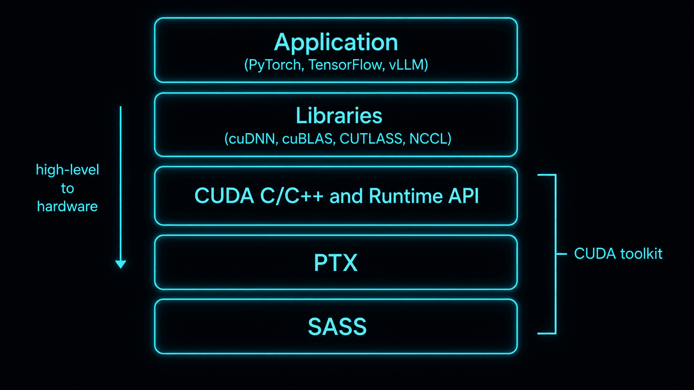
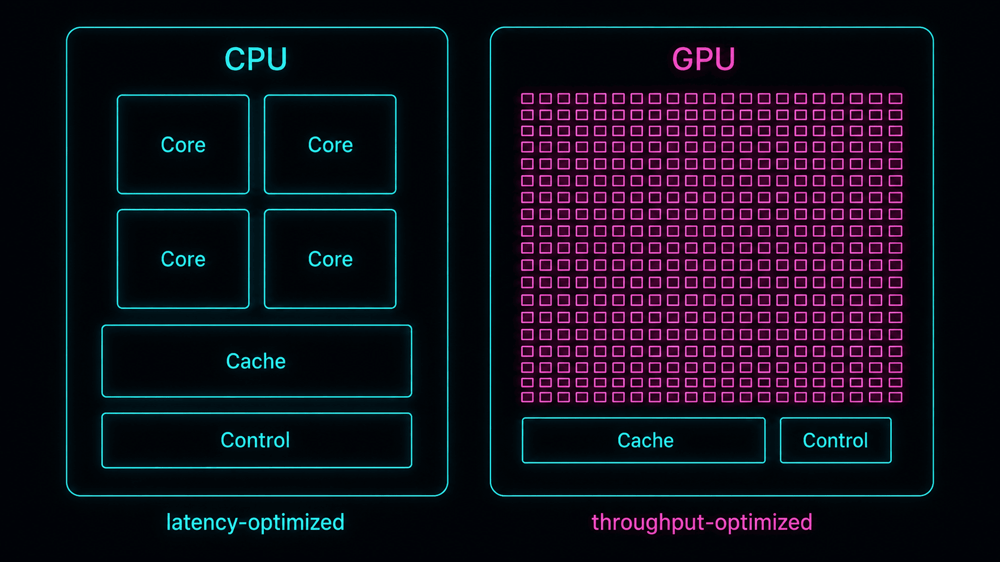
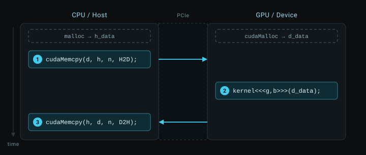
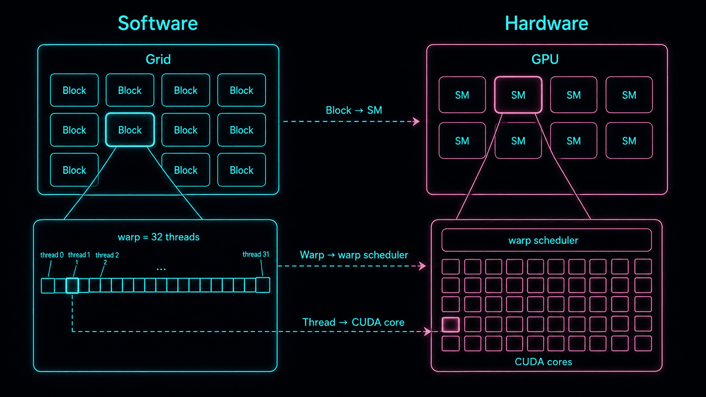
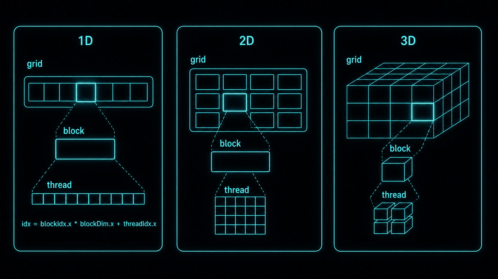

> Source: [01 CUDA C Basics](https://youtu.be/OsK8YFHTtNs)

## CUDA 스택

CUDA(Compute Unified Device Architecture)는 NVIDIA GPU로 계산하기 위한 기술 전체를 가리킨다. GPU 작업을 thread에 나누고 실행하는 규칙인 programming model이 그 출발점이다.

여기에 프로그램이 GPU에 작업을 요청할 때 호출하는 API, 소스 코드를 GPU 명령으로 바꾸는 compiler, 자주 쓰는 연산을 미리 구현한 library가 더해진다.

API는 프로그램에서 호출하는 함수들의 규칙이다. Compiler는 사람이 쓴 코드를 hardware가 실행할 코드로 번역하는 프로그램이고, library는 자주 쓰는 기능을 미리 구현해 둔 코드다.

GPU driver는 운영체제와 GPU 사이에서 명령 전달과 hardware 자원을 관리하는 software다. CUDA Driver API는 이 driver를 직접 다루는 낮은 수준의 함수 모음이다. CUDA Runtime API는 그 위에서 `cudaMalloc`과 `cudaMemcpy`처럼 CUDA C++에서 바로 쓰는 함수를 제공한다.

cuBLAS는 matrix와 vector 연산 library이고, cuDNN은 deep neural network 연산 library다. CUDA는 2007년에 공개된 뒤 GPU를 그래픽 이외의 계산에 사용하는 기반이 되었고, 현재 딥러닝 software가 GPU를 사용하는 표준 경로로 자리 잡았다.

CUDA C++는 이 가운데 C++로 GPU 코드를 작성하는 방법이다. PyTorch가 내부에서 CUDA library를 사용하는 경우와 개발자가 GPU에서 실행되는 함수인 `__global__` kernel을 직접 작성하는 경우는 서로 다른 layer를 사용한다. Layer는 기능을 단계별로 나눈 층을 뜻한다.

두 경우 모두 CUDA 위에서 동작한다. CUDA를 하나의 기능이 아니라 여러 layer가 쌓인 stack으로 설명하는 이유다.



위 그림에서 CUDA C++로 작성한 코드는 PTX를 거쳐 SASS로 바뀐다. PTX는 여러 NVIDIA GPU 세대가 공통으로 받아들이는 중간 명령어이고, SASS는 특정 GPU가 실제로 실행하는 명령어다.

| 레이어 | 역할 |
| --- | --- |
| CUDA C/C++ | 개발자가 GPU 작업을 작성하는 C++ 확장. 실행 단위인 thread, thread 묶음인 block, 모든 block을 묶은 grid가 여기에 속한다. |
| CUDA Runtime API | `cudaMalloc`, `cudaMemcpy`, kernel launch처럼 host 코드가 CUDA에 요청할 때 쓰는 함수와 문법 |
| `nvcc` | CUDA C++를 host 코드와 device 코드로 나누어 컴파일하는 프로그램 |
| PTX | 실제 GPU가 아니라 가상의 NVIDIA GPU를 대상으로 한 중간 명령어 |
| SASS | 특정 GPU 세대가 직접 실행하는 최종 명령어 |

---

## GPGPU

GPGPU(General-Purpose computing on GPU)는 말 그대로 GPU를 그래픽 외의 범용 연산에 쓴다는 뜻이다. 딥러닝이 뜨기 전까지 GPU는 주로 폴리곤을 그리는 그래픽 장치였지만, 지금은 대규모 병렬 수치 연산이면 무엇이든 GPU로 넘긴다.

Workload는 컴퓨터가 처리할 작업의 종류와 양을 뜻한다. 영상 편집기(VEGAS Pro)나 NVIDIA 제어판에서 `CUDA - GPUs` 같은 option은 영상 편집과 machine learning 같은 GPGPU workload를 어느 GPU에서 실행할지 정한다.

GPGPU가 잘 처리하는 workload는 같은 연산을 많은 data에 독립적으로 반복한다.

GPU는 하나의 명령을 여러 thread가 각자의 data에 적용하는 SIMT(Single Instruction, Multiple Threads) 방식으로 실행한다. Thread는 같은 코드를 서로 다른 data에 적용하는 실행 단위다.

| 워크로드 | 본질 |
| --- | --- |
| 영상 인코딩/필터 | 픽셀 행렬에 대한 병렬 수치 연산 |
| 딥러닝 학습/추론 | 여러 차원의 숫자 배열인 tensor의 행렬곱(matrix multiplication, MatMul) |
| 암호화폐 채굴 | 입력을 고정된 길이의 값으로 바꾸는 hash 계산의 반복 |
| 과학 시뮬레이션 | 공간 격자 또는 particle의 상태를 반복해서 갱신 |
| 3D 렌더링 (Blender Cycles 등) | 빛의 진행 경로를 나타내는 ray별 계산 |

이런 계산 방식은 CUDA가 나오기 전에도 사용됐다. 한국 연구진의 2004년 논문(Oh & Jung, *"GPU implementation of neural networks"*, Pattern Recognition)은 GPU로 인공신경망을 학습한 초기 사례다.

당시에는 범용 GPU API가 없었다. 그래서 그래픽 효과를 계산하는 프로그램인 shader로 신경망 연산을 표현했다.

## 이기종 컴퓨팅

이기종 컴퓨팅(Heterogeneous Computing)은 구조가 다른 CPU와 GPU가 한 프로그램을 나누어 실행하는 방식이다. CUDA에서는 CPU와 CPU memory를 host, GPU와 GPU memory를 device라고 부른다.

조건 판단과 실행 순서 관리는 host가 맡고, 행렬곱처럼 같은 계산이 많이 반복되는 부분은 device에 넘긴다. CPU가 하던 계산을 GPU에 넘기는 일을 offload라고 한다.

CPU는 적은 수의 강한 core, 자주 쓰는 data를 가까이 두는 cache, 조건문의 다음 경로를 미리 추측하는 branch prediction을 사용한다. 이런 구조는 작업 하나를 끝내는 데 걸리는 시간인 latency를 줄이는 데 유리하다.

반면 GPU는 훨씬 많은 연산 장치를 두어 일정 시간에 처리하는 작업량인 throughput을 높인다. 그래서 분기가 많고 순차적인 코드는 CPU에, 같은 연산을 많은 data에 적용하는 코드는 GPU에 배치한다.



이 역할 분담이 실제 CUDA code에서는 memory 이동으로 이어진다. CPU가 준비한 입력을 GPU가 사용하려면 먼저 두 장치 사이에서 data를 옮겨야 한다.

### Host-Device 데이터 흐름

Memory allocation은 프로그램이 사용할 memory 영역을 확보하는 일이고, pointer는 그 영역의 주소를 저장하는 변수다. 명시적 복사(explicit-copy)는 개발자가 host memory와 device memory를 각각 allocation하고 두 공간 사이의 복사도 직접 요청하는 방식이다.

CPU에서 allocation한 일반 pointer는 device memory를 가리키지 않으므로 kernel이 그대로 사용할 수 없다. 그래서 입력을 device memory로 옮긴 뒤 kernel을 실행하고, 결과를 다시 host memory로 가져온다.

CUDA에는 하나의 pointer로 CPU와 GPU가 함께 사용할 영역을 만드는 [`cudaMallocManaged`와 Unified Memory](#unified-memory와-managed-allocation)도 있다. Integrated GPU는 CPU와 GPU가 같은 RAM을 사용하는 구조라서 memory 배치가 다르다.

먼저 별도 GPU에서 가장 기본이 되는 명시적 복사 방식부터 보자.

1. Host → Device (`cudaMemcpy`)

```cpp
cudaMemcpy(d_data, h_data, size, cudaMemcpyHostToDevice);
```

`cudaMemcpy(destination, source, size, direction)`은 source에서 size bytes를 읽어 destination으로 복사한다. 위 코드의 `h_data`는 host pointer, `d_data`는 device pointer이며 `cudaMemcpyHostToDevice`가 H2D 방향을 지정한다.

Data는 host와 device를 잇는 연결 통로인 interconnect를 통해 이동한다. 별도 그래픽 카드에서는 주변 장치를 CPU system에 연결하는 표준 bus인 PCIe(PCI Express)를 주로 사용한다.

NVLink는 NVIDIA가 만든 고속 interconnect로, GPU 사이 또는 GH200처럼 CPU와 GPU를 직접 연결한 구성에서 사용된다. 어떤 장치가 어떤 통로로 연결되어 있는지를 나타내는 구성을 topology라고 한다.

2. Execute Kernel (`<<<...>>>`)

```cpp
kernel<<<gridDim, blockDim>>>(d_data);
```

Kernel은 GPU에서 실행되는 함수다. `<<<gridDim, blockDim>>>`은 kernel을 실행할 block 수와 block마다 둘 thread 수를 지정한다. Block과 thread는 아래에서 배열 원소를 나누는 과정과 함께 정의한다.

3. Device → Host (`cudaMemcpy`)

```cpp
cudaMemcpy(h_result, d_result, size, cudaMemcpyDeviceToHost);
```

이번에는 host pointer `h_result`가 destination이고 device pointer `d_result`가 source다. `cudaMemcpyDeviceToHost`가 D2H 방향을 지정하며, 계산이 끝난 결과를 CPU memory로 가져온다.



Host와 device 사이의 복사가 비싼 이유는 bandwidth 차이에 있다. Bandwidth는 1초에 옮길 수 있는 데이터의 양이다. 별도 GPU가 host와 통신할 때 주로 사용하는 PCIe Gen4 x16의 이론 bandwidth는 방향당 약 32 GB/s이고, Gen5 x16은 약 64 GB/s다.

NVLink는 PCIe보다 빠르지만 모든 host-device 복사에 사용되지는 않는다. H100의 NVLink 900 GB/s는 양방향을 합친 수치이며, NVLink 또는 여러 NVLink 장치를 이어 주는 switch인 NVSwitch로 연결된 GPU 사이에서 적용된다.

GH200은 CPU와 GPU를 하나의 hardware 묶음인 package 안에서 NVLink-C2C로 연결한 별도 구성이다. 일반적인 별도 GPU와 system RAM 사이의 `cudaMemcpy`는 PCIe를 사용한다.

GPU가 내부에서 사용하는 HBM(High Bandwidth Memory)은 A100 SXM에서 약 2.0 TB/s, H100 SXM에서 약 3.35 TB/s다. SXM은 GPU와 HBM을 board에 장착하는 data center용 module 형태다.

GPU 내부 memory의 bandwidth는 PCIe host link보다 약 30배에서 100배 높다. 따라서 같은 data를 host와 device 사이에서 자주 왕복시키면 GPU 계산이 빨라도 전체 실행 시간은 복사에 묶일 수 있다.


그래서 CUDA 최적화에서는 복사 횟수와 양을 줄이는 일이 중요하다. 보통 `malloc`으로 만든 host memory는 운영체제가 필요할 때 RAM 밖으로 옮길 수 있는 pageable memory다. 반면 pinned memory는 GPU 전송 중에 RAM의 같은 위치에 머물도록 고정한 host memory다.

`cudaHostAlloc`은 pinned host memory를 만들고 `cudaFreeHost`는 이를 해제한다. Device memory를 만드는 함수는 여전히 `cudaMalloc`이다. Pageable memory와 page fault, 물리 RAM 한도, 비동기 복사에 pinned memory가 필요한 이유는 [05 CUDA Concurrency의 Pinned Memory](#pinned-memory)에서 이어진다.

Kernel fusion은 연속된 여러 kernel을 하나로 합치는 방법이다. Global memory는 `cudaMalloc`으로 만든 배열이 놓이는 device의 큰 DRAM 영역이다.

Fusion은 kernel 사이의 중간값을 global memory에 저장하고 다시 읽는 횟수와 kernel을 시작하는 비용인 launch overhead를 줄인다. 중간 결과를 매번 host로 가져오던 프로그램이라면 host-device 왕복도 줄어든다.

전송과 연산을 같은 시간대에 배치하는 방법은 05 CUDA Concurrency에서, fusion은 이후 최적화 글에서 이어진다.

---

## CUDA C 기본 문법과 커널(Kernel)

CUDA C 문법은 vector addition으로 연결할 수 있다. Vector addition은 두 배열의 같은 위치에 있는 값을 더해 세 번째 배열을 만드는 계산이다. `c[i] = a[i] + b[i]`에서 각 index의 계산은 다른 index의 결과를 사용하지 않는다.

이렇게 작업 사이에 의존 관계가 없어 바로 나누어 실행할 수 있는 문제를 embarrassingly parallel이라고 한다. Thread 하나가 원소 하나를 맡으면 각 원소를 다른 원소와 독립적으로 계산할 수 있다.

이 계산을 GPU에서 실행하려면 함수가 실행되는 위치와 그 함수를 호출하는 위치를 표시해야 한다. CUDA C는 함수 앞에 붙이는 qualifier로 이를 구분한다. Qualifier는 함수의 성질을 컴파일러에 알려 주는 표시다.

| 한정자 | 실행 위치 | 호출 위치 | 특징 |
| --- | --- | --- | --- |
| `__global__` | Device (GPU) | Host (CPU) | GPU에서 실행되는 kernel. 반환형은 `void`이며 결과는 device memory에 기록 |
| `__device__` | Device (GPU) | Device (GPU) | kernel이나 다른 device 함수가 GPU 내부에서 호출하는 보조 함수 |
| `__host__` | Host (CPU) | Host (CPU) | 일반 C/C++ 함수 (기본값, 생략 가능). 한정자 없는 함수는 전부 `__host__` |

`__global__` kernel의 반환형은 CUDA C++ 문법상 `void`다. 계산 결과는 반환값이 아니라 device memory에 기록한다.

Host가 요청하는 kernel launch는 비동기 호출이다. CPU는 `kernel<<<...>>>()`를 요청한 뒤 kernel 완료를 기다리지 않고 다음 줄로 진행한다. 비동기는 호출한 쪽이 작업 완료를 기다리지 않는다는 뜻이다.

CPU가 결과를 사용하려면 D2H `cudaMemcpy`를 호출하거나, 모든 앞선 device 작업이 끝날 때까지 CPU를 기다리게 하는 `cudaDeviceSynchronize`를 호출한다.

한 source file에 섞여 있는 host 코드와 device 코드는 compile 과정에서 다시 나뉜다.

## nvcc 컴파일 파이프라인

`.cu` 파일 하나에는 CPU에서 실행할 host 코드와 GPU에서 실행할 device 코드가 함께 들어갈 수 있다. NVIDIA의 CUDA compiler인 `nvcc`가 두 종류의 코드를 구분해 처리한다.

Host 코드는 `nvcc`가 GCC나 MSVC 같은 system C++ compiler로 넘긴다. Device 코드는 NVIDIA의 device code compiler인 `cicc`가 PTX로 바꾼다. PTX는 특정 GPU 하나에 묶이지 않은 중간 명령어다.

그다음 `ptxas`라는 assembler가 PTX를 특정 GPU architecture의 SASS로 바꾼다. Assembler는 중간 명령어를 machine code로 바꾸는 프로그램이고, SASS는 GPU가 직접 실행하는 최종 machine code다.

완성된 실행 파일에는 GPU 코드 묶음인 fatbin이 들어간다. Fatbin에는 보통 몇 GPU architecture용 SASS와 PTX가 함께 저장된다.

Compute capability는 CUDA가 GPU 기능 세대를 구분하는 version이며 `sm_80`, `sm_86`, `sm_90` 같은 번호로 나타낸다. 앞 숫자를 major version이라고 한다.

`sm_80`, `sm_86`, `sm_89`는 major version 8의 SASS 호환 범위를 공유한다. `sm_90`처럼 major version이 달라지면 기존 SASS를 그대로 실행할 수 없다.

이때 실행 파일에 PTX가 있으면 driver가 프로그램을 불러오는 시점에 새 GPU용 SASS를 만든다. 실행 직전에 필요한 코드를 만드는 과정을 JIT(Just-In-Time) compilation이라고 한다.

`-arch=native`처럼 현재 GPU용 SASS만 넣고 PTX를 제외하면 다음 major 세대에서는 실행 파일을 다시 컴파일해야 한다. `-gencode arch=...,code=...` option은 실행 파일에 넣을 SASS 대상과 PTX 포함 여부를 정한다.

앞의 `add` kernel을 `nvcc -arch=sm_80 -ptx vector_add.cu`로 변환하면 다음과 같은 PTX가 나온다. `%r`, `%f`, `%rd`로 시작하는 이름은 PTX가 계산 중인 값을 잠시 보관하는 register다.

```ptx
mad.lo.s32    %r1, %r3, %r4, %r5;  // thread index i
setp.ge.s32   %p1, %r1, %r2;       // i >= N ?
@%p1 bra      $L__BB0_2;           // 범위 밖이면 건너뜀
...
ld.global.f32 %f1, [%rd8];         // b[i]
ld.global.f32 %f2, [%rd6];         // a[i]
add.f32       %f3, %f2, %f1;       // a[i] + b[i]
st.global.f32 [%rd10], %f3;        // c[i] = ...
```

C의 `c[i] = a[i] + b[i]` 한 줄은 여러 GPU 명령으로 나뉜다. `mad.lo.s32`는 index 주소를 계산하는 32-bit 정수 곱셈과 덧셈이다. FMA(Fused Multiply-Add)는 실수 곱셈과 덧셈을 한 명령으로 처리하는 연산인데, 여기의 `mad.lo.s32`는 FP32 FMA가 아니다.

이어서 `setp`와 `bra`는 `i < N`인지 검사하고 범위를 벗어난 thread를 건너뛴다. `ld.global.f32` 두 줄은 device의 global memory에서 `a[i]`와 `b[i]`를 읽는다. `add.f32`가 두 값을 더하고 `st.global.f32`가 결과를 `c[i]`에 쓴다.

따라서 원소 하나에는 4-byte 값 두 개를 읽고 하나를 쓰는 12 bytes의 memory 이동과 실수 덧셈 한 번이 필요하다. FLOP은 실수 연산 횟수를 세는 단위이므로 여기서는 1 FLOP이다. 뒤의 roofline 절은 이 비율로 vector addition의 병목을 설명한다.

CUDA binary의 내용을 읽는 도구인 `cuobjdump`에 `-sass` option을 주면 최종 SASS를 볼 수 있다.

명령어로 바뀐 kernel을 실제로 몇 개의 thread가 실행할지는 launch 구성이 정한다.

## Thread와 Block 한계

Kernel을 실행하면 같은 함수를 수행하는 thread가 여러 개 만들어진다. CUDA는 이 thread들을 block으로 묶고, 한 번의 kernel launch에 포함된 모든 block을 grid로 묶는다. `dim3(x, y, z)`는 block이나 grid의 크기를 1차원, 2차원, 3차원으로 나타내는 CUDA 자료형이다.

- Block 하나에는 thread를 최대 1024개까지 둘 수 있다. `dim3`의 x, y, z 크기를 곱한 값이 1024를 넘으면 kernel launch가 `cudaErrorInvalidConfiguration` 오류로 실패한다. `dim3(32, 32, 1)`은 1024개라서 가능하지만 `dim3(32, 32, 2)`는 2048개라서 불가능하다. z축 크기에는 별도로 64라는 상한도 있다.
- Grid의 크기 상한은 block보다 훨씬 크다. x축에는 최대 2³¹-1개 block, y축과 z축에는 각각 65535개 block을 둘 수 있다.
- Shared memory는 같은 block의 thread가 함께 사용하는 GPU 내부 memory다. 크기를 compile할 때 정하는 static allocation은 block당 기본 상한이 48KB다.

Dynamic allocation의 크기는 `kernel<<<grid, block, sharedMemoryBytes>>>`의 세 번째 값으로 정한다. 기본 상한보다 큰 용량이 필요하면 `cudaFuncSetAttribute(kernel, cudaFuncAttributeMaxDynamicSharedMemorySize, bytes)`로 opt-in을 요청한다.

Opt-in은 프로그램이 더 큰 dynamic shared memory 한도를 명시적으로 선택하는 방식이다. 그 최대치는 A100에서 약 163KB, H100에서 약 227KB다. 이 공간은 block을 실행하는 GPU processor인 SM 내부에서 L1 cache와 shared memory가 함께 사용하는 전체 용량에서 나뉜다.

이 상한은 [GPU 하드웨어]()의 구조에서 나온다. SM의 정식 이름은 Streaming Multiprocessor다.

Block 하나는 SM 하나에 배치된 뒤 완료될 때까지 다른 SM으로 이동하지 않는다. SM은 block의 thread를 32개씩 warp로 묶어 실행하므로 thread 1024개는 warp 32개가 된다.

각 thread가 계산 중인 값을 보관하는 가장 가까운 memory를 register라고 하고, SM이 가진 register 전체를 register file이라고 한다. 최근 GPU의 SM 하나에는 보통 32-bit register 65,536개가 있다.

한 thread가 많은 register를 사용하면 같은 SM에 동시에 배치할 수 있는 thread 수가 줄어든다. 이처럼 SM의 한정된 자원이 동시에 머무를 수 있는 thread와 warp의 수를 정하며, 그 비율을 occupancy라고 한다.

## Warp와 SIMT 실행

GPU는 thread를 warp 단위로 묶어 실행한다. Warp 하나는 32개 thread로 이루어지며 개발자가 이 크기를 바꿀 수 없다. Warp 안에서 thread 하나가 차지하는 자리를 lane이라고 한다. 따라서 warp 하나에는 lane 0부터 lane 31까지가 있다.

Warp scheduler는 실행할 warp를 고르는 hardware다. Scheduler가 warp에 명령 하나를 보내는 일을 issue라고 한다. 이때 active mask는 32개 lane 가운데 이번 명령을 실행할 lane을 표시한다. 같은 명령을 active lane들이 각자의 데이터에 적용하는 실행 방식이 SIMT다.

Warp 안의 thread가 `if/else`에서 서로 다른 경로를 선택하면 warp divergence가 생긴다. 하나의 warp는 두 경로의 명령을 동시에 issue할 수 없으므로, 먼저 한쪽 lane만 활성화해 실행하고 다음에 다른 쪽 lane을 실행한다. 분기 때문에 두 경로가 차례로 실행되는 것이다.

Volta부터는 independent thread scheduling이 도입됐다. Program counter는 thread가 다음에 실행할 명령의 위치이며, Volta 이후에는 thread마다 이 값을 따로 가진다.

갈라진 thread가 다시 합쳐지는 지점을 post-dominator라고 한다. 이 지점에 도착했다고 해서 모든 lane이 즉시 같은 명령으로 돌아왔다고 가정할 수 없다. `__syncwarp()`는 참여하는 warp thread가 모두 해당 위치에 도착할 때까지 기다려 실행 시점을 다시 맞춘다.

Block의 thread 수가 32의 배수가 아니어도 마지막 warp는 만들어진다. 예를 들어 block당 thread가 100개면 warp 4개, 즉 lane 128개가 필요하다. 실제로 일하는 lane은 100개이고 나머지 28개는 비활성 상태이므로 lane 활용률은 $100/128 \approx 78\%$다.

Block 크기는 보통 128, 256, 512 가운데 고르며, 이 선택은 occupancy에도 영향을 준다. Occupancy는 SM에서 현재 실행 가능한 active warp 수를 그 SM이 허용하는 최대 warp 수로 나눈 비율이다.

최대 warp 수는 A100과 H100에서 64개, 소비자용 Ampere와 Ada에서 48개다. SM의 thread 자리, block 자리, register, shared memory 가운데 먼저 부족해지는 자원이 active warp 수를 제한한다.

Cycle은 GPU clock이 한 번 진행되는 시간 단위다. Global memory에서 값을 읽는 global load는 대략 400회에서 800회 cycle을 기다릴 수 있지만 floating-point, 즉 실수 연산인 FP 연산은 대략 4회에서 6회 cycle이면 끝난다.

Occupancy가 필요한 이유는 이 memory latency를 숨기기 위해서다. 한 warp가 global load를 기다리는 동안 warp scheduler는 실행할 준비가 된 다른 warp를 선택한다.

이 전환에는 CPU의 thread 전환처럼 register를 저장하고 복원하는 과정이 없다. SM에 배치된 warp의 register가 register file에 계속 남아 있기 때문이다.

따라서 SM에 준비된 warp가 많으면 한 warp가 memory를 기다릴 때 다른 warp를 실행할 가능성이 커진다. Occupancy는 memory 대기 시간을 다른 작업으로 채울 여유를 나타낸다.

SM에 배치되어 아직 실행을 마치지 않은 block을 resident block이라고 한다. Resident block 수는 thread 자리, hardware block 자리, register, shared memory가 각각 허용하는 block 수 가운데 가장 작은 값으로 결정된다.

아래 식에서 각 기호는 다음 값을 뜻한다. `floor` 기호 $\lfloor x\rfloor$는 내림, `ceil` 기호 $\lceil x\rceil$는 올림이다.

| 기호 | 의미 |
| --- | --- |
| $B_{\text{res}}$ | SM 하나에 resident 상태로 들어가는 block 수 |
| $T_{\text{SM}}$ | SM 하나가 수용하는 최대 thread 수 |
| $T_{\text{block}}$ | block 하나의 thread 수 |
| $B_{\text{SM}}^{\max}$ | SM 하나가 수용하는 최대 block 수 |
| $R_{\text{SM}}$ | SM 하나의 전체 register 수 |
| $R_{\text{thread}}$ | thread 하나가 사용하는 register 수 |
| $S_{\text{SM}}$ | SM 하나가 제공하는 shared memory 크기 |
| $S_{\text{block}}$ | block 하나가 사용하는 shared memory 크기 |
| $W_{\text{SM}}^{\max}$ | SM 하나가 수용하는 최대 warp 수 |
| $B_{\text{shared}}$ | shared memory 용량이 허용하는 block 수 |
| $B_{\text{warp}}$ | warp 자리 수가 허용하는 block 수 |

$$
B_{\text{shared}} =
\begin{cases}
\infty, & S_{\text{block}}=0 \\
\left\lfloor \dfrac{S_{\text{SM}}}{S_{\text{block}}} \right\rfloor, & S_{\text{block}}>0
\end{cases}
$$

$$
B_{\text{warp}} =
\left\lfloor
\dfrac{W_{\text{SM}}^{\max}}
{\left\lceil T_{\text{block}}/32 \right\rceil}
\right\rfloor
$$

$$
B_{\text{res}} = \min\!\left(
\left\lfloor \tfrac{T_{\text{SM}}}{T_{\text{block}}} \right\rfloor,\;
B_{\text{SM}}^{\max},\;
\left\lfloor \tfrac{R_{\text{SM}}}{R_{\text{thread}}\, T_{\text{block}}} \right\rfloor,\;
B_{\text{shared}},\;
B_{\text{warp}}
\right)
$$

$$
\text{active warps} = B_{\text{res}} \left\lceil \tfrac{T_{\text{block}}}{32} \right\rceil,
\qquad
\text{occupancy} = \frac{\text{active warps}}{W_{\text{SM}}^{\max}}
$$

이 한도들은 compute capability마다 다르다. A100의 cc 8.0에서는 $T_{\text{SM}}=2048$, $B_{\text{SM}}^{\max}=32$, $R_{\text{SM}}=65536$, $W_{\text{SM}}^{\max}=64$다.

$T_{\text{block}}=256$이면 thread 자리에는 $\lfloor 2048/256 \rfloor=8$개 block이 들어간다. Register도 8개 block을 수용하려면 $8\cdot256\cdot R_{\text{thread}}\le65536$을 만족해야 하므로 thread당 register 수는 32개 이하여야 한다.

이 식은 각 자원 한도를 연결한 1차 계산이다. 실제 GPU는 register를 warp마다 정해진 묶음 크기로 할당한다. 이 묶음 크기를 allocation granularity라고 하므로 resident block 수가 바뀌는 경계는 위 계산보다 계단처럼 나타난다.

Shared memory를 사용하지 않는 vector addition에서는 $S_{\text{block}}=0$이다. 이때 $B_{\text{shared}}=\infty$로 두므로 shared memory 항은 block 수를 제한하지 않는다.

높은 occupancy 자체가 성능의 목표는 아니다. Memory 대기 시간이 이미 충분히 가려졌다면 occupancy를 더 높여도 이득이 없고, 이를 위해 thread당 register 수를 억지로 줄이면 오히려 계산이 느려질 수 있다.

한 thread가 서로 독립적인 여러 명령을 함께 준비하는 성질인 instruction-level parallelism, DRAM bandwidth, cache 동작도 성능에 영향을 준다.

Nsight Compute는 NVIDIA의 CUDA kernel 분석 도구다. Counter는 실행 중 hardware 상태를 세는 측정 항목이다. `sm__warps_active.avg.pct_of_peak_sustained_active` counter는 실제로 resident 상태였던 warp 비율인 achieved occupancy를 보여 준다.

Occupancy가 충분해도 각 warp가 불필요한 memory 구간을 읽으면 bandwidth는 낭비된다. 이제 active warp 수가 아니라 warp가 실제로 옮기는 data 양을 보자.

## 메모리 병합 (Coalescing)

Global memory는 GPU에 달린 DRAM이며 `cudaMalloc`으로 allocation한 배열이 놓이는 공간이다. Warp의 32개 thread가 global memory를 읽으면 GPU는 가까운 주소 요청을 묶어 처리한다. 여러 lane의 인접한 memory 요청을 가능한 적은 전송으로 합치는 동작을 coalescing이라고 한다.

Compute capability 6.0 이상에서 global memory 전송은 32-byte sector 단위로 이루어진다. Sector는 memory system이 한꺼번에 가져오는 32-byte 주소 구간이다. Warp가 연속된 4-byte 값 32개를 읽으면 총 128 bytes가 필요하므로 sector 4개를 가져온다. 반대로 lane마다 멀리 떨어진 주소를 읽으면 더 많은 sector가 필요하다.

Warp가 한 번의 load에서 건드린 서로 다른 sector 수를 $S$라고 하자. Bus efficiency $\eta$는 kernel이 요청한 byte 수를 global memory system이 sector 단위로 실제 전송한 byte 수로 나눈 값이다.

$$
S = \bigl|\{\, \lfloor \text{addr}_{\text{lane}}/32 \rfloor \,\}\bigr|,
\qquad
\eta = \frac{\text{requested bytes}}{32\,S}
$$

`addr`는 각 lane이 요청한 byte 주소다. $\lfloor\text{addr}_{\text{lane}}/32\rfloor$는 그 주소가 속한 sector 번호이고, 바깥의 집합 크기가 서로 다른 sector의 개수 $S$를 센다.

Warp가 float 32개를 읽을 때 요청한 양은 $32\times4=128$ bytes다. 주소 배치에 따라 실제 전송량은 다음처럼 달라진다.

- 연속되고 32-byte 경계에 맞춰진 주소라면 sector 4개로 충분하다. $S=4$이므로 $\eta=128/(32\cdot4)=1$이다. 이는 128-byte 전송 한 번이 아니라 32-byte sector 네 개를 모두 사용한 경우다.
- Lane마다 서로 다른 sector에 접근하면 sector 32개가 필요하다. 128 bytes를 요청했지만 $32\cdot32=1024$ bytes가 이동하므로 $\eta=128/1024=1/8$이다. Compute capability 6.0 이후의 sector 방식을 기준으로 하면 4-byte 원소의 최저 효율은 $1/8$이다.


Vector addition에서 `i = blockIdx.x * blockDim.x + threadIdx.x`를 사용하면 이웃 lane이 `a[0]`, `a[1]`, `a[2]`처럼 이웃 주소를 읽는다. 이 경우 warp는 연속된 sector 4개를 사용하므로 $\eta=1$이 된다.

반대로 `a[i * stride]`처럼 index 사이를 일정 간격으로 건너뛰면 `stride`가 커질수록 더 많은 sector가 필요하고 효율은 $1/8$에 가까워진다.

Nsight Compute의 `l1tex__t_sectors_pipe_lsu_mem_global_op_ld.sum`은 global load가 가져온 sector 수를 나타내고, `l1tex__t_requests_pipe_lsu_mem_global_op_ld.sum`은 load 명령 요청 수를 나타낸다. 두 값을 나누면 요청 하나당 평균 sector 수가 나온다.

Warp 전체가 32-bit 값을 읽는 경우 이상적인 값은 4이고 가장 흩어진 경우는 32다. Thread를 x축의 연속된 주소에 배치하는 이유는 이 값을 4에 가깝게 유지하기 위해서다.

Warp 내부의 memory 접근을 이해한 다음에는 여러 thread가 협력할 수 있는 범위를 구분해야 한다. CUDA에서 그 기본 범위는 block이다.

## Block 독립성

같은 block의 thread는 shared memory를 함께 사용하고 `__syncthreads()`로 실행 시점을 맞출 수 있다. `__syncthreads()`는 block의 모든 thread가 해당 위치에 도착할 때까지 기다리는 barrier다. Barrier는 참여자가 모두 도착해야 다음 명령으로 진행하는 동기화 지점이다.

이 barrier는 서로 다른 block에는 적용되지 않는다. 일반 kernel의 block은 서로 독립적이어야 하며 실행 순서도 정해져 있지 않다. Block 7이 block 0보다 먼저 끝날 수 있고, kernel 안에는 임의의 두 block을 모두 기다리게 하는 일반적인 barrier가 없다.

서로 다른 block도 global memory를 통해 값을 전달할 수는 있다. Atomic operation은 다른 thread의 연산이 중간에 끼어들지 못하도록 memory 연산을 한 단위로 처리한다.

Memory order는 여러 thread의 읽기와 쓰기가 다른 thread에 관찰되는 순서다. 프로그램이 동기화와 memory order를 지정하지 않으면 한 block이 쓴 값이 다른 block에 언제 보이는지를 뜻하는 memory visibility와 실행 순서는 보장되지 않는다.

Grid 전체가 기다리는 지점이 필요하면 kernel을 두 번 launch해 첫 kernel의 완료 뒤에 다음 kernel을 실행할 수 있다. Cooperative Groups는 여러 thread의 협력 범위를 표현하는 CUDA API다. Grid 전체 동기화를 허용하는 cooperative launch를 사용하면 `grid.sync()`로 모든 block의 실행 시점을 맞출 수 있다.

Hopper의 thread block cluster는 여러 block을 한 묶음으로 배치하는 실행 단위다. Cluster 안의 block은 서로 연결된 shared memory 영역인 distributed shared memory를 사용할 수 있다.

Block 사이의 제약은 physical memory 구조에서 나온다. 같은 block의 thread는 한 SM에 배치되므로 그 SM 안의 빠른 정적 memory인 SRAM으로 구현된 shared memory를 함께 쓸 수 있다. 서로 다른 SM의 SRAM은 분리되어 있으므로 일반 block끼리는 shared memory를 공유하지 못한다.

Block이 독립적이면 CUDA Runtime은 준비된 block을 사용 가능한 SM에 순서와 관계없이 배치할 수 있다.

SM이 적은 GPU에서는 여러 차례 나누어 실행하고, SM이 많은 GPU에서는 더 많은 block을 동시에 실행한다. 같은 kernel이 GPU의 SM 수에 맞춰 확장되는 성질을 NVIDIA는 transparent scalability라고 부른다.

Grid, block, thread는 software가 만드는 실행 구조이고 SM, warp, lane은 이를 실행하는 hardware 구조다. 둘의 관계는 고정된 1대1 연결이 아니라 scheduling 관계다.

Block은 SM 하나에 배치되고, SM은 그 block의 thread를 warp 단위로 issue한다. CUDA core는 lane 하나의 수치 연산을 처리하는 연산 장치다. Thread는 program counter와 register 상태를 가진 논리적 실행 단위이며 특정 CUDA core 하나를 소유하지 않는다.



이제 software 쪽의 grid와 block이 배열 좌표를 어떻게 표현하는지 보자.

배열, image, volume data의 좌표를 자연스럽게 표현할 수 있도록 grid와 block은 1차원, 2차원, 3차원 구성을 지원한다. 1차원 `kernel<<<4, 8>>>`은 block 4개에 thread를 8개씩 두어 총 32개 thread를 만든다. 2차원과 3차원에서는 앞에서 정의한 `dim3`로 각 축의 크기를 지정한다.



이 차원과 크기를 kernel launch에 전달하는 문법이 `<<<...>>>`다.

## 실행 구성: `<<<>>>`

`__global__` 함수는 일반 함수 호출 문법으로 시작할 수 없다. CUDA kernel의 실행 구성을 지정하는 세 겹 꺾쇠 문법인 triple chevron을 사용한다.

```cpp
mykernel<<<gridSize, blockSize>>>(args);
//        ^^^^^^^^  ^^^^^^^^^
//        Block 개수, Block당 thread 개수
```

- `gridSize`: grid 안의 block 개수
- `blockSize`: block 안의 thread 개수
- `args`: kernel에 전달할 값이나 pointer
- 총 thread 수 = `gridSize × blockSize`

`<<<...>>>`에 전달한 첫째 값과 둘째 값이 grid와 block의 크기를 정한다. Built-in 변수는 CUDA가 kernel마다 자동으로 제공하는 변수다. Kernel 안에서는 `gridDim`과 `blockDim`으로 그 크기를 읽고, `blockIdx`와 `threadIdx`로 현재 block과 thread의 번호를 읽는다.

`<<<gridSize, blockSize>>>`는 software 실행 구조를 정할 뿐 SM이나 warp를 직접 지정하지 않는다. CUDA Runtime이 block을 SM에 배치하면 SM이 그 안의 thread를 32개씩 warp로 묶어 실행한다.

가장 단순한 예:

```cpp
mykernel<<<1, 1>>>();   // Block 1개, thread 1개
```

Vector addition에서 원소 하나마다 thread 하나를 배치하면 N개 원소에 N개 thread가 필요하다. `<<<N, 1>>>`도 총 N개 thread를 만들지만 block마다 thread가 하나라서 각 warp의 lane 하나만 사용한다.

그래서 block마다 thread를 128개에서 512개 정도로 묶고, N을 block 크기로 올림 나눗셈해 grid 크기를 정한다.

```cpp
int N = 10000;
int blockSize = 256;
int gridSize = (N + blockSize - 1) / blockSize;  // 올림 나눗셈
add<<<gridSize, blockSize>>>(a, b, c, N);
```

앞의 방식은 thread 하나가 원소 하나를 처리한다. Grid 크기를 data 크기와 분리하려면 각 thread가 여러 원소를 처리하는 grid-stride loop를 사용할 수 있다.

여기서 stride는 한 번의 launch가 만든 전체 thread 수인 `blockDim.x * gridDim.x`다. 각 thread가 이 간격만큼 index를 늘리면 N이 전체 thread 수보다 커도 모든 원소를 처리할 수 있다.

```cpp
__global__ void add(float* a, float* b, float* c, int N) {
    int stride = blockDim.x * gridDim.x;
    int i = blockIdx.x * blockDim.x + threadIdx.x;
    for (; i < N; i += stride)
        c[i] = a[i] + b[i];
}
```

## 전체 예제: 벡터 덧셈

지금까지 나온 host-device 복사, qualifier, kernel launch를 한 파일로 연결하면 다음과 같다.

```cpp
#include <cstdlib>
#include <cuda_runtime.h>

__global__ void add(const float* a, const float* b,
                    float* c, int N) {
    int i = blockIdx.x * blockDim.x + threadIdx.x;
    if (i < N) c[i] = a[i] + b[i];   // 경계 밖 thread는 건너뛴다
}

int main() {
    const int N = 1 << 20;                 // 원소 약 100만 개
    const size_t bytes = N * sizeof(float);

    // 1) Host 할당 + 초기화
    float *h_a = (float*)malloc(bytes);
    float *h_b = (float*)malloc(bytes);
    float *h_c = (float*)malloc(bytes);
    for (int i = 0; i < N; i++) { h_a[i] = 1.0f; h_b[i] = 2.0f; }

    // 2) Device 할당
    float *d_a, *d_b, *d_c;
    cudaMalloc(&d_a, bytes);
    cudaMalloc(&d_b, bytes);
    cudaMalloc(&d_c, bytes);

    // 3) Host -> Device 전송
    cudaMemcpy(d_a, h_a, bytes, cudaMemcpyHostToDevice);
    cudaMemcpy(d_b, h_b, bytes, cudaMemcpyHostToDevice);

    // 4) 커널 실행 (block당 256 thread, grid는 올림 나눗셈)
    int blockSize = 256;
    int gridSize = (N + blockSize - 1) / blockSize;
    add<<<gridSize, blockSize>>>(d_a, d_b, d_c, N);

    // 5) Device -> Host 전송 (kernel 결과가 준비된 뒤 복사)
    cudaMemcpy(h_c, d_c, bytes, cudaMemcpyDeviceToHost);

    // 6) 정리
    cudaFree(d_a); cudaFree(d_b); cudaFree(d_c);
    free(h_a); free(h_b); free(h_c);
    return 0;
}
```

`__global__`은 `add`가 device에서 실행되는 kernel임을 표시한다. 변수 이름의 `h_`와 `d_`는 각각 host memory와 device memory를 가리키는 pointer라는 관례다. `N = 1 << 20`은 1을 왼쪽으로 20 bit 이동한 값인 $2^{20}=1,048,576$이고, `bytes`는 float 원소 N개가 차지하는 전체 byte 수다.

`malloc`은 host 배열을 만들고, `cudaMalloc(&d_a, bytes)`는 device memory를 만든 뒤 시작 주소를 `d_a`에 기록한다. 그래서 `cudaMalloc`에는 `d_a` 자체가 아니라 `d_a`의 주소인 `&d_a`를 전달한다. Host에서 `h_a`와 `h_b`를 초기화한 뒤 H2D `cudaMemcpy` 두 번으로 입력 배열을 device에 옮긴다.

`gridSize`는 N을 `blockSize`로 올림 나눗셈한 값이다. 마지막 block에는 N의 범위를 벗어나는 thread가 생길 수 있으므로 kernel의 `if (i < N)`이 그 thread의 memory 접근을 막는다.

Kernel이 `d_c`에 결과를 쓰고 나면 D2H `cudaMemcpy`가 `h_c`로 결과를 가져온다. 마지막의 `cudaFree`와 `free`는 각각 device memory와 host memory를 해제한다.

컴파일 명령은 다음과 같다.

```bash
nvcc vector_add.cu -o vector_add
```

코드의 실행 흐름을 드러내기 위해 오류 검사는 생략했다. CUDA Runtime 함수는 성공 여부를 상태값으로 반환하므로 실제 프로그램에서는 반환값을 확인하고, kernel launch 직후에는 `cudaGetLastError()`로 launch 오류를 확인한다.

## Roofline으로 보는 Memory 병목

Vector addition은 GPU의 산술 처리량보다 memory bandwidth의 영향을 크게 받는다. Float 원소 하나를 계산할 때 `a`와 `b`에서 각각 4 bytes를 읽고 `c`에 4 bytes를 쓰므로 총 12 bytes를 옮긴다. 실제 계산은 실수 덧셈 한 번, 즉 1 FLOP이다.

연산량을 $W$, memory에서 옮긴 data 양을 $Q$라고 하자. Arithmetic intensity $I=W/Q$는 1 byte를 옮기는 동안 몇 번의 실수 연산을 수행하는지를 나타낸다.

$$
\begin{aligned}
Q &= 2 \times 4\,\text{B} \;+\; 1 \times 4\,\text{B} = 12\,\text{B} \quad(\text{load } a,b\text{; store } c) \\
I &= \frac{W}{Q} = \frac{1\ \text{FLOP}}{12\ \text{B}} \approx 0.083\ \text{FLOP/B}
\end{aligned}
$$

Roofline model은 kernel이 낼 수 있는 처리량의 상한을 연산 능력과 memory 공급 능력으로 나누어 설명한다. 달성 가능한 처리량을 $P$, GPU의 최대 연산 처리량을 $P_{\text{peak}}$, memory bandwidth를 $\beta$라고 하자.

Memory가 초당 $\beta$ bytes를 공급하고 byte마다 $I$번 계산한다면 memory가 허용하는 상한은 $I\beta$ FLOP/s다. 실제 상한은 $P_{\text{peak}}$와 $I\beta$ 가운데 작은 값이다.

$$P = \min\!\bigl(P_{\text{peak}},\ I \cdot \beta\bigr)$$

Roofline graph는 가로축에 arithmetic intensity $I$, 세로축에 처리량 $P$를 둔다. $I\beta$는 오른쪽으로 갈수록 올라가는 선이고 $P_{\text{peak}}$는 수평선이다.

두 선이 만나는 지점을 ridge point라고 하며 $I^{*}=P_{\text{peak}}/\beta$로 계산한다. Ridge point보다 왼쪽은 memory 공급이 상한을 정하고, 오른쪽은 GPU의 연산 능력이 상한을 정한다.


A100의 32-bit 실수 연산인 FP32 peak는 약 19.5 TFLOP/s이고 HBM bandwidth는 약 2.0 TB/s다. TFLOP/s는 1초에 $10^{12}$번의 실수 연산, TB/s는 1초에 $10^{12}$ bytes 전송을 뜻한다. 이 값을 사용한 ridge point는 다음과 같다.

$$I^{*} = \frac{19.5 \times 10^{12}}{2.0 \times 10^{12}} \approx 9.75 \ \text{FLOP/byte}$$

Vector addition의 $I=0.083$ FLOP/byte는 ridge point인 9.75 FLOP/byte보다 100배 이상 작다. 따라서 이 kernel은 연산 장치보다 memory bandwidth가 먼저 한계에 도달한다. Memory bandwidth로 계산한 처리량 상한은 다음과 같다.

$$
\begin{aligned}
P_{\text{vadd}} = I \cdot \beta
&= \frac{1\ \text{FLOP}}{12\ \text{B}} \times 2.0\times10^{12}\ \text{B/s} \\
&= 1.67\times10^{11}\ \text{FLOP/s} \\
&\approx 166\ \text{GFLOP/s} \quad(0.85\%\ \text{of peak})
\end{aligned}
$$

166 GFLOP/s는 A100 FP32 peak의 약 0.85%다. GFLOP/s는 1초에 $10^9$번의 실수 연산을 뜻한다.

Vector addition은 GPU의 전체 산술 능력을 사용하는 예제가 아니라 memory bandwidth와 병렬 index 배치를 설명하는 예제다. Matrix multiplication처럼 한 번 읽은 값을 여러 계산에서 재사용하면 arithmetic intensity가 높아지고, roofline graph에서 ridge point의 오른쪽으로 이동할 수 있다.


## 참고

- [CUDA C++ Programming Guide](https://docs.nvidia.com/cuda/cuda-c-programming-guide/): 프로그래밍 모델, occupancy, 메모리 계층의 1차 출처
- [CUDA Compiler Driver NVCC](https://docs.nvidia.com/cuda/cuda-compiler-driver-nvcc/): 컴파일 파이프라인과 `-gencode`
- [Nsight Compute](https://docs.nvidia.com/nsight-compute/): occupancy·병목 자원 진단
