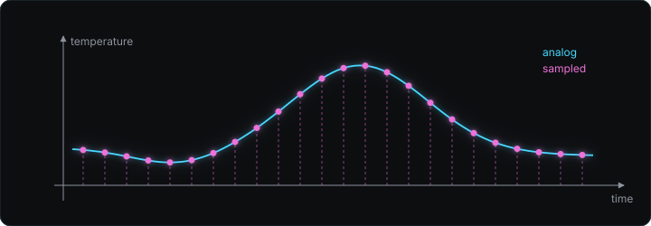
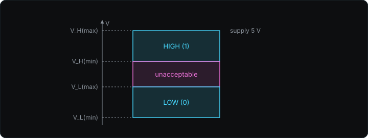
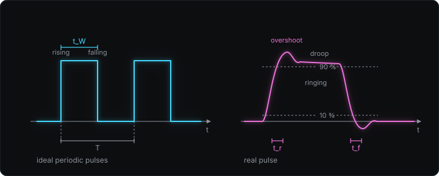
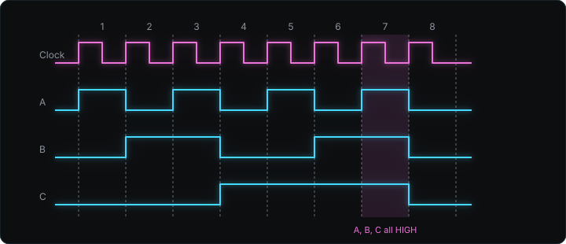
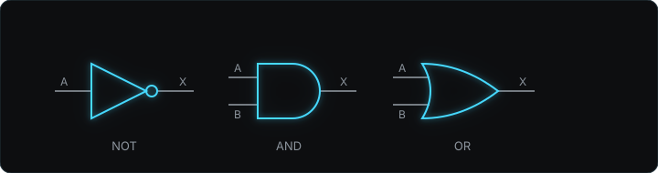
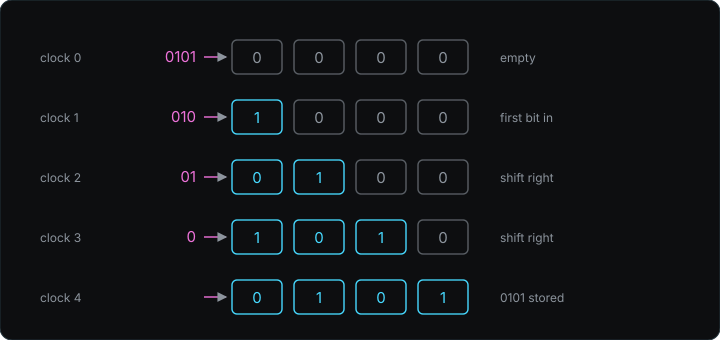
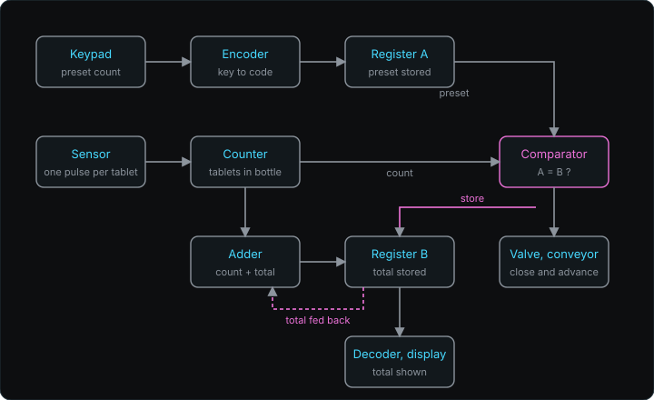

> 기준 자료: Thomas L. Floyd, *Digital Fundamentals*, Pearson. 1장 Introductory Concepts.

이 과목은 0과 1 두 값으로 표현되는 신호를 처리하는 회로를 다룬다. 앞부분은 진법, 논리 게이트, 불 대수처럼 수와 논리의 규칙이고, 뒷부분은 래치, 플립플롭, 레지스터, 카운터처럼 그 규칙을 구현하는 최소 단위 회로다[^scope]. 아래는 교재 1.1절부터 1.4절, 강의 슬라이드[^slides] 2번부터 26번에 해당한다. 1장은 각 블록의 입력과 출력만 정의하고, 내부 회로는 뒤 장에서 만든다.

## 아날로그 양과 디지털 양

아날로그(analog) 양은 연속된 값을 갖는 양이다. 하루 동안의 기온은 어느 두 시각 사이에서도 중간값을 거치며 변하므로 아날로그 양이다. 디지털(digital) 양은 서로 구분되는 이산값만 갖는 양이고, 디지털 회로에서 그 값은 0과 1 둘이다[^digital].

아날로그 양을 디지털 회로에 넣으려면 일정한 시간 간격마다 값을 읽는다. 이 동작이 샘플링(sampling)이고, 읽은 값을 정해진 단계 중 하나로 맞추는 동작이 양자화(quantization)다. 아래 그림에서 cyan 곡선이 연속으로 변하는 기온이고, magenta 점이 매시간 읽은 샘플값이다.

교재는 세 가지 시스템으로 두 양의 쓰임을 대비한다.

| 시스템 | 신호 처리 |
|---|---|
| 확성 장치(마이크, 증폭기, 스피커) | 음성 파형을 그대로 키운다. 처음부터 끝까지 아날로그다 |
| CD 플레이어 | 디지털로 저장한 데이터를 읽어 DAC[^dac]로 아날로그 음성 파형을 다시 만든다 |
| 메카트로닉스(로봇 팔) | 전자 제어부가 디지털로 판단하고 전기기계 인터페이스가 모터를 움직인다 |

음성을 전송할 때도 같은 순서를 밟는다. 아날로그 음성을 샘플링해서 데이터로 바꾸고, 데이터를 보내고, 받는 쪽이 다시 아날로그 파형으로 복원한다[^transmit]. 전기자동차의 충전기, 배터리, 모터 사이에서 AC와 DC를 오가는 변환기[^inverter]도 두 형태의 신호가 한 장치 안에서 번갈아 쓰이는 예다.

## 논리 준위

디지털 회로에서 1과 0은 전압 범위로 정한다. HIGH(1)는 $V_{H(min)}$부터 $V_{H(max)}$까지, LOW(0)는 $V_{L(min)}$부터 $V_{L(max)}$까지이고, 두 범위 사이는 어느 쪽으로도 판정하지 않는 구간이다. 전압이 이 구간에 있으면 회로는 값을 보장하지 않는다.

HIGH의 상한은 회로에 넣는 전원 전압이다. 실험에서 쓰는 74 계열 IC[^vcc]는 14번 핀 $V_{CC}$에 5 V를 넣어 동작시킨다.

## 펄스

펄스(pulse)는 한 준위에서 다른 준위로 갔다가 돌아오는 한 번의 변화다. LOW에서 HIGH로 올라가는 순간이 상승 에지(rising edge, leading edge), HIGH에서 LOW로 내려오는 순간이 하강 에지(falling edge, trailing edge)다. LOW에서 출발하는 펄스를 positive-going, HIGH에서 출발하는 펄스를 negative-going이라 한다.

이상 펄스는 두 에지에서 전압이 순간적으로 바뀐다. 실제 펄스는 에지마다 시간이 걸리고, 교재는 그 특성을 다섯 항으로 적는다.

| 항 | 정의 |
|---|---|
| 상승 시간 $t_r$ | 진폭의 10 %에서 90 %까지 올라가는 데 걸리는 시간 |
| 하강 시간 $t_f$ | 진폭의 90 %에서 10 %까지 내려가는 데 걸리는 시간 |
| 펄스 폭 $t_W$ | 상승 에지와 하강 에지의 50 % 지점 사이의 시간 |
| overshoot, ringing | 에지 직후 목표 준위를 넘었다가 진동하며 가라앉는 현상 |
| droop | HIGH 구간에서 전압이 서서히 내려앉는 현상 |

주기가 1 s 수준이면 $t_r$과 $t_f$는 주기에 비해 무시할 만큼 짧다. 클럭이 GHz로 올라가 주기가 ns 수준이 되면 $t_r$이 주기의 상당 부분을 차지하고, 파형은 사각파에서 멀어져 삼각파에 가까워진다[^risetime]. 교재의 이론 전개는 이상 펄스를 가정한다.

## 주기 파형, 주파수, 듀티 사이클

주기(periodic) 파형은 같은 모양이 고정된 시간 간격마다 반복되는 파형이고, 그 간격이 주기 $T$다. 비주기(nonperiodic) 파형은 고정된 반복 간격이 없다. 주파수 $f$는 1초 동안의 반복 횟수이고 단위는 Hz다.

$$
f = \frac{1}{T}, \qquad T = \frac{1}{f}
$$

$T = 0.1\ \mathrm{s}$이면 $f = 10\ \mathrm{Hz}$이고, $f = 1\ \mathrm{GHz}$이면 $T = 1\ \mathrm{ns}$다[^period]. 듀티 사이클(duty cycle)은 한 주기 중 HIGH인 시간 $t_W$의 비율이다.

$$
\text{duty cycle} = \frac{t_W}{T} \times 100\ \%
$$

아래 그림의 왼쪽이 이상 펄스로 이루어진 주기 파형이고, $T$와 $t_W$의 위치를 표시했다. 오른쪽이 실제 펄스 하나이고, $t_r$과 $t_f$를 재는 10 %와 90 % 선을 표시했다.

## 클럭과 타이밍 다이어그램

클럭(clock)은 주기가 일정한 펄스 파형이고, 회로의 다른 신호가 값을 바꿀 수 있는 시점을 정한다. 클럭 한 주기를 비트 시간(bit time)이라 하고, 데이터 파형은 비트 시간마다 한 비트를 나타내며 비트 시간 안에서는 값을 바꾸지 않는다[^bittime]. 실험에서는 함수 발생기(function generator, 주파수와 진폭을 지정하면 그 파형을 출력하는 장비)로 클럭을 만든다[^fg].

타이밍 다이어그램(timing diagram)은 여러 디지털 신호를 하나의 시간 축 위에 나란히 그려 각 신호의 상태와 전이 시점의 상대 관계를 보이는 그림이다. 아래 그림은 클럭과 세 입력 A, B, C를 클럭 주기 1부터 8까지 그린 것이고, 세 입력이 모두 HIGH인 주기 7을 음영으로 표시했다.

클럭 주기마다 (A, B, C)를 읽으면 다음 표가 된다. C를 최상위 비트로 두면 주기 1부터 7까지 이진수 1에서 7까지 증가하는 순서다.

| 주기 | 1 | 2 | 3 | 4 | 5 | 6 | 7 | 8 |
|---|---|---|---|---|---|---|---|---|
| A | 1 | 0 | 1 | 0 | 1 | 0 | 1 | 0 |
| B | 0 | 1 | 1 | 0 | 0 | 1 | 1 | 0 |
| C | 0 | 0 | 0 | 1 | 1 | 1 | 1 | 0 |

이 표의 각 열이 논리 게이트의 입력 조합이다. 게이트는 열마다 정해진 출력을 내므로, 출력 파형도 클럭과 같은 주기로 갱신된다[^sampleclk].

## 직렬 전송과 병렬 전송

직렬(serial) 전송은 데이터 선 하나로 비트를 비트 시간마다 하나씩 보낸다. 8비트를 보내면 8 비트 시간이 걸린다. 병렬(parallel) 전송은 비트 수만큼 선을 두고 모든 비트를 한 비트 시간에 동시에 보낸다[^serial].

## 기본 논리 함수

논리 게이트(logic gate)는 입력 비트의 조합에 따라 정해진 출력 비트를 내는 회로다. NOT, AND, OR 세 함수가 기본이고, 뒤 장의 모든 디지털 연산은 이 셋의 조합이다. 입력을 $A$, $B$, 출력을 $X$로 쓴다.

| 함수 | 동작 | 진리표 ($A\,B \to X$) |
|---|---|---|
| NOT | 입력을 반전한다 | $0 \to 1$, $1 \to 0$ |
| AND | 모든 입력이 1일 때만 1 | $00 \to 0$, $01 \to 0$, $10 \to 0$, $11 \to 1$ |
| OR | 입력 중 하나라도 1이면 1 | $00 \to 0$, $01 \to 1$, $10 \to 1$, $11 \to 1$ |

진리표(truth table)는 가능한 입력 조합 전부와 각 조합의 출력을 나열한 표이고, 입력이 $n$개면 행이 $2^n$개다. 기호 끝의 작은 원은 반전을 뜻한다[^bubble]. AND와 OR는 두 입력이 서로 다를 때만 출력이 갈리고, 그때만 1을 내는 함수가 XOR[^xor](exclusive OR)다.

## 논리 기능 블록

교재 1.4절은 게이트 여러 개를 묶어 하나의 기능을 수행하는 블록을 입력과 출력으로만 소개한다[^blocks].

| 블록 | 입력 | 출력 |
|---|---|---|
| 비교기(comparator) | 이진수 $A$, $B$ | $A > B$, $A = B$, $A < B$ 세 선 중 조건이 맞는 하나만 HIGH |
| 가산기(adder) | 이진수 $A$, $B$, 자리올림 입력 $C_{in}$ | 합 $\Sigma$, 자리올림 출력 $C_{out}$ |
| 인코더(encoder) | 여러 입력선 중 HIGH인 하나 | 그 입력 번호의 이진 코드 |
| 디코더(decoder) | 이진 코드 | 코드에 대응하는 출력 패턴 |

비교기에 $A = 2$, $B = 5$를 넣으면 $A < B$ 선만 HIGH다. 가산기의 $C_{out}$은 합이 한 자리를 넘칠 때의 1이고, $C_{in}$은 아래 자리에서 올라온 1이다[^adder]. 인코더는 계산기 키패드에서 누른 키 하나를 이진 코드로 바꾸어 저장하고, 디코더는 그 코드를 받아 7세그먼트 표시기[^sevenseg]의 켤 막대를 고른다. 키가 10개면 $2^3 = 8 < 10 \le 16 = 2^4$이므로 인코더 출력선은 4개가 필요하다.

## 클럭에 맞춰 동작하는 블록

레지스터와 카운터는 클럭 펄스가 올 때마다 저장된 값이 바뀌는 회로다. 값을 넣는 즉시 결과가 나오는 앞 절의 블록과 달리 시간 순서가 개입한다[^sequential].

| 블록 | 하는 일 |
|---|---|
| 멀티플렉서(multiplexer, MUX) | 선택 신호가 고른 입력선 하나를 출력선 하나에 연결한다 |
| 디멀티플렉서(demultiplexer, DEMUX) | 받은 데이터를 선택 신호가 고른 출력선 하나로 보낸다 |
| 직렬 시프트 레지스터(serial shift register) | 클럭 펄스마다 새 비트를 첫 칸에 넣고 기존 비트를 한 칸씩 옆으로 민다 |
| 병렬 레지스터(parallel register) | 클럭 펄스 한 번에 여러 비트를 동시에 저장한다 |
| 카운터(counter) | 펄스가 들어올 때마다 다음 이진수로 넘어간다 |

MUX와 DEMUX를 선 하나로 이으면 A, B, C 세 데이터가 시간 구간 $\Delta t_1$, $\Delta t_2$, $\Delta t_3$을 번갈아 쓰며 지나가고, 받는 쪽이 같은 순서로 D, E, F에 나눈다. 아래 그림은 4비트 직렬 시프트 레지스터에 0101이 들어가는 과정이다. 4비트를 넣는 데 클럭 4번이 필요하고, 병렬 레지스터는 같은 4비트를 클럭 1번에 받는다.

카운터는 펄스 1, 2, 3, 4, 5가 들어올 때 출력이 1, 2, 3, 4, 5의 이진 코드로 바뀐다. 펄스 6개가 들어가면 출력은 110이다.

## 알약 병 포장 시스템

교재 그림 1-28은 위 블록을 전부 이어 병 하나에 정해진 개수의 알약을 넣고 총 개수를 누적하는 시스템이다[^system].

1. 키패드에 목표 개수를 누르면 인코더가 이진 코드로 바꾸고 레지스터 A가 저장한다.
2. 알약이 하나 떨어질 때마다 센서가 펄스 하나를 내고 카운터가 1 늘어난다.
3. 비교기가 레지스터 A의 목표 개수와 카운터의 현재 개수를 비교한다. 같아지면 $A = B$ 출력이 HIGH가 된다.
4. 그 HIGH가 두 곳으로 간다. 밸브를 닫고 컨베이어를 움직이며, 동시에 레지스터 B에 새 합을 저장하라고 알린다.
5. 가산기는 카운터 값과 레지스터 B의 누적 합을 더하고, 레지스터 B가 그 합을 새 누적 합으로 저장한다. 디코더가 표시기에 보여 주고 MUX가 컴퓨터로 보낸다.
6. 다음 병이 놓이면 리셋 펄스가 카운터를 0으로 되돌린다.

카운터 자체에는 상한이 없다. 카운터가 목표 개수에서 멈추는 이유는 밸브가 닫혀 센서 펄스가 끊기기 때문이다. 리셋 펄스가 없으면 두 번째 병에서 카운터가 목표 개수를 지나쳐 올라가고, $A = B$가 다시 HIGH가 되지 않아 밸브가 닫히지 않는다. 레지스터 B의 출력이 가산기 입력으로 되돌아가는 연결이 되먹임(feedback)[^feedback]이고, 목표 개수 8로 병 세 개를 채우면 레지스터 B는 8, 16, 24로 갱신된다.

## 주기, 사이클, 펄스, 비트 시간의 구분

| 이름 | 뜻 | 길이 |
|---|---|---|
| 주기 $T$ | 파형이 한 번 반복하는 시간 | $T$ |
| 클럭 사이클 | 클럭 파형이 한 번 반복하는 구간 | $T$ |
| 비트 시간 | 데이터 1비트가 유지되는 시간 | $T$ |
| 펄스 | 사이클 중 HIGH 구간 | $t_W$ |
| 주파수 $f$ | 1초 안의 사이클 개수 | $1/T$, 단위 Hz |

앞의 셋은 같은 구간을 다른 이름으로 부른 것이다. 사이클 하나에 펄스가 하나 들어 있으므로 개수는 같고 길이는 $t_W \le T$로 다르다. 시간을 물으면 초 단위, 1초당 횟수를 물으면 Hz, 비율을 물으면 듀티 사이클이다.

## 연습 문제

클럭 주파수가 2.5 GHz이고 듀티 사이클이 25 %인 시스템에 대해 다음을 구한다.

(a) 클럭 주기와 펄스 폭 $t_W$
(b) 이 클럭으로 8비트를 직렬 전송할 때 걸리는 시간
(c) 위 타이밍 다이어그램의 주기 5에서 $\mathrm{AND}(A, C)$와 $\mathrm{OR}(B, C)$의 출력
(d) 키 16개짜리 키패드를 인코딩할 때 필요한 최소 출력선 수
(e) 병 포장 시스템에서 목표 개수 8로 병 세 개를 채운 직후 레지스터 B의 값과, 그 값을 담는 데 필요한 최소 비트 수

풀이. (a) $T = 1/(2.5 \times 10^9) = 0.4\ \mathrm{ns} = 400\ \mathrm{ps}$이고, $t_W = 0.25\,T = 100\ \mathrm{ps}$다. (b) 비트 시간이 $T$이므로 $8T = 3.2\ \mathrm{ns}$다. (c) 주기 5의 $(A, B, C) = (1, 0, 1)$이므로 $\mathrm{AND}(A, C) = 1$, $\mathrm{OR}(B, C) = 1$이다. (d) $2^4 = 16$이므로 4개다. (e) $8 + 8 + 8 = 24$이고, $2^4 = 16 \le 24 < 32 = 2^5$이므로 5비트다.

[^scope]: 오리엔테이션 `[19:44]`, `[20:19]`. 교수는 강의 계획서의 키워드를 "수에 관한 개념과 논리, 계산식"과 "그것을 구현하는 회로"로 나누었다. 교재 1장부터 9장까지 다루고, 시험은 중간과 기말 각 1회, 숙제는 연습 문제 위주로 약 4회다.

[^slides]: 슬라이드 번호는 강의 슬라이드 "Ch. 1. Introductory Concepts"(김광은, 홍익대학교 전자전기공학부)의 하단 인쇄 번호다. 타임스탬프 `[MM:SS]`는 2026-09-02 강의 녹음 전사문 기준이고, "오리엔테이션"으로 표시한 것은 2026-09-01 첫 수업 전사문 기준이다.

[^digital]: 강의 `[27:07]`. 교수는 디지털을 "0과 1로 구분되는 값", 아날로그를 "연속된 값"으로 풀고, 시간에 따른 온도 변화를 샘플링해 디지털화하는 예를 들었다.

[^dac]: Digital-to-Analog Converter, 디지털 코드를 아날로그 전압으로 바꾸는 회로. 슬라이드 5의 CD 플레이어 블록도에서 디지털 데이터가 DAC를 거쳐 스피커로 간다.

[^transmit]: 강의 `[28:52]`. 신호처리와 통신 과목에서 이 과정을 샘플링과 변조로 다룬다고 했다.

[^inverter]: 강의 `[31:25]`. 충전기는 AC로 받고 배터리는 DC로 저장하므로 중간에 컨버터가 들어가고, 모터를 돌릴 때는 인버터가 DC를 다시 AC로 바꾼다.

[^vcc]: 오리엔테이션 `[29:54]`, 강의 `[07:06]`. 오리엔테이션에서 나눠 준 칩은 SN74HC86N이고, 14번 핀이 $V_{CC}$, 7번 핀이 GND다. 파워 서플라이가 이 핀에 5 V를 계속 공급한다.

[^risetime]: 강의 `[34:53]`, `[35:54]`. CPU 클럭이 GHz 단위가 되면 주기가 ns이고 상승 시간이 1 ns보다 짧은 값이라 무시할 수 없다. 교수는 이것을 "디지털 신호도 시간 축을 잘게 보면 아날로그가 된다"고 표현했고, 실제 구현에서 중요한 항목이라고 했다.

[^period]: 강의 `[37:08]`. 교수는 주기와 주파수를 역수 관계로 설명하며 0.1 s와 10 Hz, 1 GHz와 1 ns를 예로 들었다.

[^bittime]: 슬라이드 11은 클럭 한 주기 폭에 "Bit time"을 표시한다. 클럭 한 주기에 비트 하나를 싣는 경우의 정의이고, 이 과목 1장에서는 항상 그렇게 둔다.

[^fg]: 강의 `[09:39]`, `[25:25]`. 함수 발생기는 사인파와 사각파를 만들며, 사각파는 주기와 ON 시간, 듀티 사이클을 입력한다. 클럭은 주기가 일정하므로 실험에서 함수 발생기로 만든다.

[^sampleclk]: 강의 `[24:41]`, `[26:03]`, `[38:26]`. 클럭이 겹치는 시점에서만 값을 읽고, 출력도 같은 주기를 따라간다. A, B, C는 시간에 따라 각각 변하는 데이터이고 클럭이 일정한 간격으로 세 값의 조합을 잘라낸다.

[^serial]: 슬라이드 13. 전사문에 대응하는 발언이 없다.

[^bubble]: 오리엔테이션 `[43:09]`. 게이트 기호의 동그라미를 NOT 개념이라고 짚었다.

[^xor]: 오리엔테이션 `[31:53]`, `[36:40]`. 나눠 준 74HC86은 2입력 XOR 게이트 4개를 담은 IC이고, 논리회로 실험에서 AND, OR, XOR 칩으로 진리표를 직접 확인한다.

[^blocks]: 강의 `[40:58]`. 게이트 목록 뒤에 블록이 한 장씩 나온다고 위치를 짚었다.

[^adder]: 슬라이드 19는 $3 + 9 = 12$를 합 자리 2와 자리올림 1로 나누어 읽는다. 이진수로 직접 더하면 $0011 + 1001 = 1100$이고, 자리마다 $\Sigma$ 한 비트와 자리올림 한 비트를 낸다. 이진 덧셈 규칙은 2장에서 다룬다.

[^sevenseg]: 막대 7개로 숫자 하나를 표시하는 부품. 강의 `[41:53]`에서 7개 중 켜는 막대를 골라 숫자가 된다고 설명했다.

[^sequential]: 오리엔테이션 `[24:08]`. 래치, 플립플롭, 레지스터, 카운터는 "시간에 따라 데이터가 변할 때 그것에 반응해서 결과에 영향을 주는 회로"라고 구분했다.

[^system]: 강의 `[42:47]`, `[43:09]`. 개별 블록이 하나씩만 쓰이는 일은 없고 목적을 위해 묶인다고 했다. 이어서 공학을 "어딘가에 쓰이기 위한 필요성을 가지고 개발하는 것"으로 정의하고, 전기자동차와 항공기처럼 사람이 타는 장치는 안전 요건이 더해진다고 했다.

[^feedback]: 출력이 자기 입력으로 되돌아가는 연결. 7장 이후 래치, 플립플롭, 카운터가 이 구조로 값을 유지한다.
