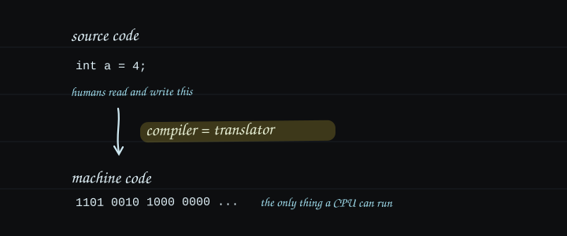

A compiler is a program that translates source code, which humans read and write, into the machine code a CPU executes. A CPU executes only machine code, so code written in a language like C goes through this translation before it runs.



The same structure appeared with nvcc in [CUDA C Basics](#the-nvcc-compilation-pipeline): nvcc lowers device code to PTX, an intermediate instruction set, and then to SASS, the GPU's machine code. CPU-side compilers step down through intermediate stages the same way, and LLVM is the representative one.

LLVM is an ahead-of-time compiler for native languages like C and C++. A native language is one that compiles to machine code the CPU executes directly, without a virtual machine. Ahead-of-time (AOT) means translating everything to machine code before the program runs, as opposed to JIT, which translates during execution, and interpreters, which never translate and re-interpret every time.

## The Pipeline


IR (intermediate representation) is the language that sits between source and machine code. One IR flows between every stage. Most compilers keep their IR as an in-memory object structure that cannot be written down. LLVM IR is a text format with a published grammar, so it can be saved to a file, edited by hand, and fed back to the compiler.

## Setup

The stock macOS clang ships without `llc` and `opt`, so LLVM comes from Homebrew.

```bash
brew install llvm
echo 'export PATH="/opt/homebrew/opt/llvm/bin:$PATH"' >> ~/.zshrc
```

LLVM is keg-only, so the PATH is registered manually. That is Homebrew's policy for avoiding clashes with the system clang.

## From C to IR

The example is a two-function C file.

```c
// Test.c
int func1(void) { int a = 4; return a; }
int main(void)  { return 0; }
```

```bash
clang -emit-llvm -S Test.c   # → Test.ll
```

`-emit-llvm -S` tells clang to stop at human-readable IR instead of going all the way to machine code. func1 in the resulting `Test.ll` reads as follows; the meaning of each line is in the comments.

```llvm
define i32 @func1() #0 {          ; function func1 returning i32 (32-bit int). #0 refers to an attribute group
  %1 = alloca i32, align 4        ; reserve one i32 slot on the stack; its address is named %1
  store i32 4, ptr %1, align 4    ; store 4 at that address            ← int a = 4;
  %2 = load i32, ptr %1, align 4  ; load from that address into %2     ← reading a in "return a"
  ret i32 %2                      ; return %2
}
```

Four symbols are enough to read the body.

| Symbol | Meaning |
|---|---|
| `i32` | 32-bit integer type. i1, i8, i64 also exist |
| `%name` | local name. A virtual register, so there is no limit on how many |
| `@name` | global name. Functions live here |
| `;` | comment |

The `target triple` at the top and the `attributes` and `!` metadata at the bottom are environment configuration, not needed for decoding the body. Older LLVM (before 15) wrote typed pointers like `i32*` instead of `ptr`; opaque pointers unified this in LLVM 15. Different generation of syntax, same meaning.

## From IR to Assembly

```bash
llc Test.ll -o Test.s
```

`llc` is the backend. It lowers IR to the target CPU's assembly, which on Apple Silicon is ARM64. The mapping for func1:

| Test.ll (virtual) | Test.s (ARM, physical) | What happens |
|---|---|---|
| `%1 = alloca i32` | `sub sp, sp, #16` | reserve the stack frame; `%1` becomes the slot at `sp+12` |
| `store i32 4, ptr %1` | `mov w8, #4` → `str w8, [sp, #12]` | put 4 in a register, store it to the stack |
| `%2 = load i32, ptr %1` | `ldr w0, [sp, #12]` | load from the stack into w0; `%2` becomes w0 |
| `ret i32 %2` | `add sp, sp, #16` → `ret` | release the frame and return; w0 carries the return value |

Assigning virtual names (%N) to physical places (registers, stack slots) is the backend's job. An assembly file has three kinds of lines: lines starting with `.` are assembler directives and can be skipped, `name:` lines are labels, and only the indented lines are actual CPU instructions.

Change `store i32 4` to `store i32 9` in `Test.ll`, run `llc` again, and the output shows `mov w8, #9`. The IR text itself is the compiler input, so editing the IR alone changes the program without going through the frontend.

## Watching Optimization as a Diff

The payoff of readable IR shows up when comparing before and after optimization.

```bash
clang -O1 -emit-llvm -S Test.c -o Test_O1.ll
```

At `-O0` (the default), func1 is four lines: alloca → store → load → ret. At `-O1` it is one.

```llvm
define noundef i32 @func1() local_unnamed_addr #0 {
  ret i32 4
}
```

The optimization passes proved that this function stores 4 to memory and immediately loads it back, so the answer is always 4, and erased the variable's existence. The C code did not change, the program went from four lines to one, and the whole event is captured in a text diff.

A pass is a unit of work in which the compiler sweeps over the entire program (IR) once, performing one predetermined analysis or transformation. `-O1` is a clang option that runs many passes in a fixed order; `opt` is the tool that runs a single pass of your choosing.

## optnone

mem2reg is the pass that promotes local variables from memory to registers, and `opt` can apply this single pass on its own.

```bash
opt -passes=mem2reg Test.ll -S -o Test_m2r.ll
```

Applied to IR emitted at `-O0`, however, the output comes back identical to the input. The cause is in the attributes. When clang emits IR at `-O0`, it stamps every function with `optnone`, a do-not-optimize marker, and `opt` respects it by skipping the function entirely. Attributes control whether passes run at all.

Emitting without the marker restores normal behavior.

```bash
clang -Xclang -disable-O0-optnone -emit-llvm -S Test.c -o Test_noopt.ll
opt -passes=mem2reg Test_noopt.ll -S
```

func1 folds to a single `ret i32 4`. This option is the standard way to emit IR for pass experiments.

## References

- [LLVM for Grad Students](https://www.cs.cornell.edu/~asampson/blog/llvm.html): the What is LLVM? / The Pieces / Understanding LLVM IR chapters.
- [LLVM Language Reference](https://llvm.org/docs/LangRef.html): the official definition of IR syntax.
- [The Architecture of Open Source Applications: LLVM](https://aosabook.org/en/v1/llvm.html): Chris Lattner on the design background of LLVM.
