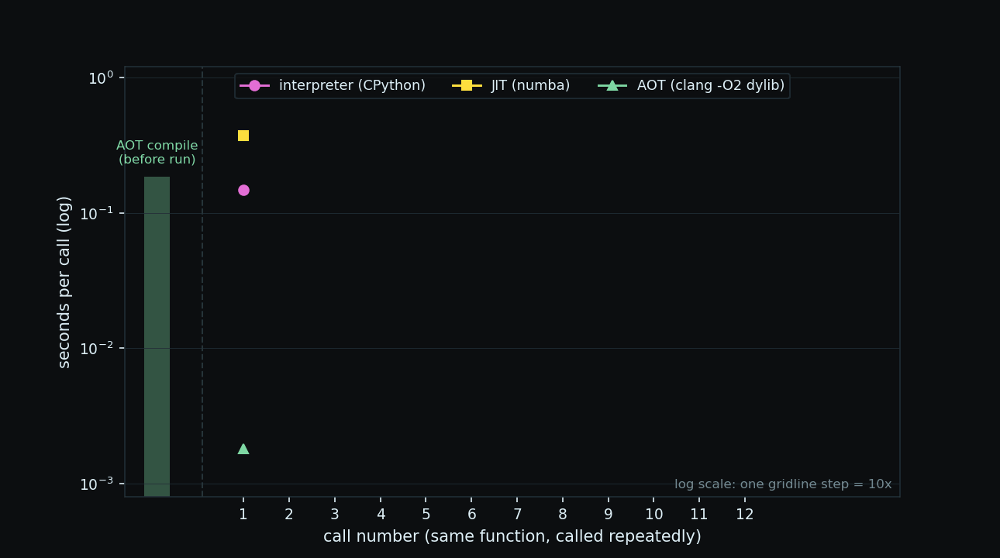
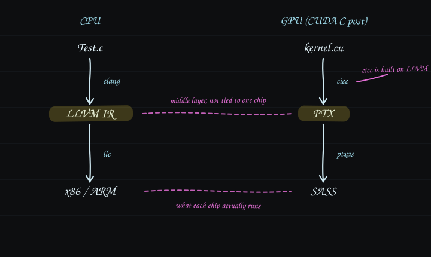
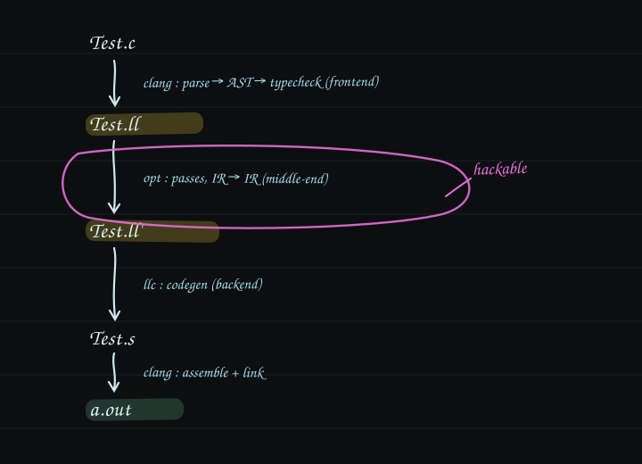

컴파일러는 사람이 읽고 쓰는 소스 코드를 CPU가 실행하는 기계어로 번역하는 프로그램이다. CPU는 기계어만 실행하므로, C처럼 기계어로 번역되는 언어로 쓴 코드는 실행 전에 이 번역을 거친다.

번역을 언제 하느냐에 따라 프로그램을 실행하는 방식이 셋으로 갈린다.

| 방식 | 번역 시점 | 실행 사이에 남는 것 | 예 |
|---|---|---|---|
| 인터프리터 | 번역하지 않고 실행할 때마다 소스를 해석 | 없음 | CPython |
| JIT(just-in-time) | 실행 중에, 자주 실행되는 부분만 | 메모리에 둔 기계어 | Java JVM, 브라우저의 V8 |
| AOT(ahead-of-time) | 실행 전에 전부 | 실행 파일 | clang, GCC |

이 차이는 같은 함수를 반복 호출하면 시간으로 드러난다. 아래는 동일한 정수 반복 계산을 CPython(인터프리터), numba(JIT), `clang -O2`로 미리 컴파일한 C 라이브러리(AOT)로 12번씩 호출해 기록한 호출별 시간이다. 반환값은 셋 다 같다.



인터프리터는 호출마다 같은 해석을 되풀이해 매번 같은 비용을 낸다. JIT는 첫 호출에 컴파일 비용을 몰아 내고(warmup) 그다음부터 번역된 기계어를 재사용하며, AOT는 그 비용을 실행 전에 내서 첫 호출부터 빠르다.

LLVM은 C/C++ 같은 native 언어를 위한 AOT 컴파일러다. native 언어는 가상 머신 없이 CPU가 직접 실행하는 기계어로 번역되는 언어를 말한다.

같은 구조가 [CUDA C 기초](#nvcc-컴파일-파이프라인)에 이미 나왔다. NVIDIA의 CUDA 컴파일러인 nvcc는 `.cu` 파일을 CPU에서 실행할 host 코드와 GPU에서 실행할 device 코드로 나누어 처리하는데, device 코드를 PTX라는 중간 명령어로 바꾸고, PTX를 GPU 기계어인 SASS로 내린다. CPU 쪽 컴파일러도 같은 방식으로 중간 단계를 거쳐 내려가며, 그 대표가 LLVM이다. 실제로 nvcc의 device 코드 컴파일러인 cicc가 LLVM 위에서 만들어져 있어서, 두 스택은 층별로 그대로 대응한다.



## 파이프라인



IR(intermediate representation)는 소스와 기계어 사이의 중간 언어다. 모든 단계 사이를 흐르는 것은 IR 하나다. 다른 컴파일러의 IR은 실행 중인 컴파일러의 메모리 안에만 존재하는 객체 구조라 파일로 적을 수 없다. LLVM IR은 문법이 공개된 텍스트 규격이라 파일로 저장하고, 손으로 고치고, 다시 컴파일러에 입력할 수 있다.

## 준비

macOS 기본 clang에는 `llc`와 `opt`가 없어 Homebrew로 LLVM을 설치한다.

```bash
brew install llvm
echo 'export PATH="/opt/homebrew/opt/llvm/bin:$PATH"' >> ~/.zshrc
```

LLVM은 keg-only라 PATH를 직접 등록한다. 시스템 clang과의 충돌을 피하기 위한 Homebrew의 정책이다.

## C에서 IR로

예제는 두 함수짜리 C 파일이다.

```c
// Test.c
int func1(void) { int a = 4; return a; }
int main(void)  { return 0; }
```

```bash
clang -emit-llvm -S Test.c   # → Test.ll
```

`-emit-llvm -S`는 기계어까지 가지 않고 사람이 읽을 수 있는 IR에서 멈추라는 옵션이다. 나온 `Test.ll`의 func1은 다음과 같다. 각 줄의 뜻은 주석과 같다.

```llvm
define i32 @func1() #0 {          ; i32(32비트 정수)를 반환하는 함수 func1. #0은 attributes 묶음 참조
  %1 = alloca i32, align 4        ; 스택에 i32 한 칸 확보. 그 주소에 %1이라는 이름표
  store i32 4, ptr %1, align 4    ; 그 주소에 4 저장            ← int a = 4;
  %2 = load i32, ptr %1, align 4  ; 그 주소에서 읽어 %2에 담기   ← return a의 a 읽기
  ret i32 %2                      ; %2 반환
}
```

기호는 네 개만 알면 본문이 읽힌다.

| 기호 | 뜻 |
|---|---|
| `i32` | 32비트 정수 타입. i1, i8, i64도 있다 |
| `%이름` | 지역 이름표. 가상 레지스터라 개수 제한이 없다 |
| `@이름` | 전역 이름표. 함수 이름이 여기 속한다 |
| `;` | 주석 |

파일 머리의 `target triple`과 꼬리의 `attributes`, `!` 메타데이터는 환경 설정이라 본문 해독에는 필요 없다. 그리고 옛 LLVM(14 이전)은 `ptr` 대신 `i32*`로 타입까지 표기했는데, LLVM 15부터 opaque pointer로 통일됐다. 문법 세대가 다를 뿐 뜻은 같다.

## IR에서 어셈블리로

```bash
llc Test.ll -o Test.s
```

`llc`는 백엔드다. IR을 타겟 CPU의 어셈블리로 내린다. Apple Silicon에서는 ARM64 어셈블리가 나온다. func1의 대응은 다음과 같다.

| Test.ll (가상) | Test.s (ARM 실물) | 뜻 |
|---|---|---|
| `%1 = alloca i32` | `sub sp, sp, #16` | 스택 프레임 확보. `%1`의 실체는 `sp+12` 칸 |
| `store i32 4, ptr %1` | `mov w8, #4` → `str w8, [sp, #12]` | 4를 레지스터에 담아 스택에 저장 |
| `%2 = load i32, ptr %1` | `ldr w0, [sp, #12]` | 스택에서 읽어 w0에. `%2`의 실체는 w0 |
| `ret i32 %2` | `add sp, sp, #16` → `ret` | 프레임 반납 후 복귀. w0가 반환값 |

가상 이름표(%N)를 실물 장소(레지스터, 스택 칸)에 배정하는 것이 백엔드의 일이다. 어셈블리 파일의 줄은 세 종류로 나뉜다. `.`으로 시작하는 줄은 어셈블러 지시자라 건너뛰고, `이름:`은 라벨, 들여쓰인 줄만 실제 CPU 명령이다.

`Test.ll`의 `store i32 4`를 `store i32 9`로 바꾸고 `llc`를 다시 돌리면 `mov w8, #9`가 나온다. IR 텍스트 자체가 컴파일러의 입력이라, 프런트엔드를 거치지 않고 IR을 고치는 것만으로 프로그램이 바뀐다.

## 최적화를 diff로 관찰하기

읽을 수 있는 IR의 장점은 최적화 전후를 비교할 때 나온다.

```bash
clang -O1 -emit-llvm -S Test.c -o Test_O1.ll
```

`-O0`(기본값)의 func1은 alloca → store → load → ret 네 줄이다. `-O1`은 한 줄이다.

```llvm
define noundef i32 @func1() local_unnamed_addr #0 {
  ret i32 4
}
```

최적화 pass가 이 함수는 4를 메모리에 넣었다가 곧바로 꺼내 반환하므로 답이 항상 4라는 것을 증명하고 변수의 존재 자체를 지웠다. C 코드는 그대로인데 프로그램이 네 줄에서 한 줄이 됐고, 그 과정이 텍스트 diff로 남는다.

pass는 컴파일러가 프로그램 전체(IR)를 한 차례 훑으면서 정해진 한 가지 분석 또는 변환을 수행하는 작업 단위다. `-O1`은 pass 여러 개를 정해진 순서로 묶어 돌리는 clang 옵션이고, `opt`는 pass를 낱개로 골라 돌리는 도구다.

## optnone

mem2reg는 지역 변수를 메모리에서 레지스터로 승격시키는 pass다. `opt`로 이 pass 하나만 적용할 수 있다.

```bash
opt -passes=mem2reg Test.ll -S -o Test_m2r.ll
```

그런데 `-O0`로 뽑은 IR에 적용하면 출력이 입력과 똑같이 나온다. 원인은 attributes에 있다. `-O0`로 IR을 뽑으면 clang이 모든 함수에 `optnone`이라는 최적화 금지 표식을 붙이고, `opt`는 그 표식을 존중해 pass를 건너뛴다. attributes가 pass의 실행 여부까지 제어하는 것이다.

표식 없이 뽑으면 정상 동작한다.

```bash
clang -Xclang -disable-O0-optnone -emit-llvm -S Test.c -o Test_noopt.ll
opt -passes=mem2reg Test_noopt.ll -S
```

func1이 `ret i32 4` 한 줄로 접힌다. IR로 pass 실험을 할 때는 이 옵션으로 뽑는다.

## 참고

- [LLVM for Grad Students](https://www.cs.cornell.edu/~asampson/blog/llvm.html): What is LLVM? / The Pieces / Understanding LLVM IR 세 챕터.
- [LLVM Language Reference](https://llvm.org/docs/LangRef.html): IR 문법의 공식 정의.
- [The Architecture of Open Source Applications: LLVM](https://aosabook.org/en/v1/llvm.html): Chris Lattner가 쓴 LLVM 설계 배경.
