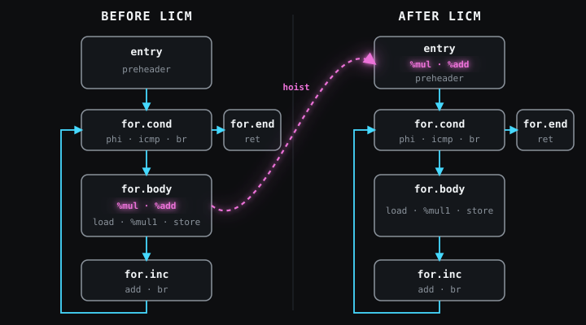

LICM (loop-invariant code motion) is an LLVM [optimization pass](#passes-and-optimization-levels) that moves a loop-invariant instruction out of its loop. A loop-invariant instruction produces the same result on every iteration. LLVM applies LICM only when it can prove that program behavior remains unchanged.

Moving an instruction to a point before its loop is called hoisting. In the following `transform` function, the multiplication and addition that produce `factor` are hoisting candidates.

## The Same Computation on Every Iteration

`unsigned` is a C integer type that represents nonnegative values. `input` and `output` each point to `count` elements of that type, and `count` is nonnegative. When `count` is positive, the loop variable `i` ranges from 0 through `count - 1`. `scale` and `offset` are function arguments, and `factor` is the result of `scale * scale + offset`.

```c
// licm.c
void transform(const unsigned *input, unsigned *output,
               int count, unsigned scale, unsigned offset) {
  for (int i = 0; i < count; ++i) {
    unsigned factor = scale * scale + offset;
    output[i] = input[i] * factor;
  }
}
```

An operand is a value consumed by an instruction. Neither `scale` nor `offset` changes inside the loop. The expressions `scale * scale` and `scale * scale + offset` are therefore loop invariant.

`i` increases on every iteration. The addresses of `input[i]` and `output[i]` change with it. In the unoptimized IR, the `factor` computation sits in the loop body and repeats once for every executed iteration.

## IR Immediately Before LICM

`clang` is the frontend that [translates C to LLVM IR](#from-c-to-ir), and `opt` is the optimizer that runs passes on IR. Both tools come from Homebrew LLVM 22.1.8[^version]. In the commands, `LLVM_BIN` is the directory containing those LLVM executables. `-fno-discard-value-names` preserves C identifiers in IR names, and `-Xclang` passes the following option to clang's internal frontend. `-disable-O0-optnone` suppresses the [optnone](#optnone) attribute.

Local names in LLVM IR follow SSA (static single assignment) form. SSA defines each virtual register once. A `phi` instruction selects a value according to the preceding basic block from which control arrived. A basic block is a sequence of IR instructions that executes from top to bottom with no branch in the middle.

The header is the first basic block reached when control enters a loop from outside. The preheader is the single entry block outside the loop that leads only to the header. A backedge is control flow from inside the loop back to its header, and the latch is the block from which the backedge starts. An exit block is reached after control leaves the loop.

Before LICM, the IR passes through `mem2reg`, `loop-simplify`, and `lcssa`.

| Pass | Role |
|---|---|
| `mem2reg` | promotes eligible local variables created by `alloca` into SSA value flow |
| `loop-simplify` | ensures Loop Simplify Form, with a preheader, one backedge, and dedicated exit blocks reached only from inside the loop |
| `lcssa` (loop-closed SSA) | routes values defined inside the loop and used outside it through `phi` nodes in exit blocks |

A loop pass processes one loop at a time. LLVM automatically runs `loop-simplify` and `lcssa` before a loop pass. `raw.ll` is the IR emitted by clang, and `before.ll` is the IR after the three preparation passes. The preparation makes `before.ll` readable and leaves only LICM's changes in the later comparison.

```bash
LLVM_BIN=/opt/homebrew/opt/llvm/bin

"$LLVM_BIN/clang" -O0 -Xclang -disable-O0-optnone \
  -fno-discard-value-names \
  -S -emit-llvm licm.c -o raw.ll

"$LLVM_BIN/opt" -S \
  -passes='mem2reg,loop-simplify,lcssa' \
  raw.ll -o before.ll
```

`transform` uses no loop-defined result outside the loop, so `lcssa` adds no new `phi` node to `before.ll`.

With file-level settings, parameter and function attributes, and metadata removed, `transform` reads as follows.

The target triple in `before.ll` is `arm64-apple-macosx15.0.0`. On `arm64-apple-macosx15.0.0`, pointers are 64 bits and both `int` and `unsigned` are 32 bits.

```llvm
define void @transform(ptr %input, ptr %output,
                       i32 %count, i32 %scale, i32 %offset) {
entry:
  br label %for.cond

for.cond:
  %i.0 = phi i32 [ 0, %entry ], [ %inc, %for.inc ]
  %cmp = icmp slt i32 %i.0, %count
  br i1 %cmp, label %for.body, label %for.end

for.body:
  %mul = mul i32 %scale, %scale
  %add = add i32 %mul, %offset
  %idxprom = sext i32 %i.0 to i64
  %arrayidx = getelementptr inbounds i32, ptr %input, i64 %idxprom
  %0 = load i32, ptr %arrayidx, align 4
  %mul1 = mul i32 %0, %add
  %idxprom2 = sext i32 %i.0 to i64
  %arrayidx3 = getelementptr inbounds i32, ptr %output, i64 %idxprom2
  store i32 %mul1, ptr %arrayidx3, align 4
  br label %for.inc

for.inc:
  %inc = add nsw i32 %i.0, 1
  br label %for.cond

for.end:
  ret void
}
```

The five basic blocks have the following roles.

| Basic block | Role |
|---|---|
| `entry` | function entry and preheader, the only block outside the loop that enters `for.cond` |
| `for.cond` | header, checks `i < count` and branches to `for.body` or `for.end` |
| `for.body` | loads an array element, multiplies it by `factor`, and stores the result |
| `for.inc` | latch, increments `i` and follows the backedge to `for.cond` |
| `for.end` | exit block reached after control leaves the loop |

The IR instructions split the C loop as follows.

| IR | Meaning |
|---|---|
| `ptr`, `i1`, `i32`, `i64` | pointer, one-bit integer, 32-bit integer, and 64-bit integer types, respectively |
| `br label`, `br i1` | branch unconditionally to another basic block or branch according to an `i1` condition |
| `%i.0 = phi ...` | select 0 on the first iteration and `%inc` on later iterations |
| `%cmp = icmp slt ...` | compute `i < count` with a signed less-than comparison |
| `%mul`, `%add`, `%mul1` | compute `scale * scale`, `%mul + offset`, and `input[i] * factor`, respectively |
| `%idxprom`, `%idxprom2` | sign-extend `i` from `i32` to `i64` with `sext` for the `input` and `output` addresses, respectively |
| `%arrayidx`, `%arrayidx3` | compute the addresses of `input[i]` and `output[i]` with `getelementptr inbounds`; `inbounds` promises that each address stays within the permitted range of the same allocated object |
| `%0 = load`, `store`, `align 4` | load `input[i]` from `%arrayidx` into `%0` and store `%mul1` through `%arrayidx3`; the addresses of 32-bit `unsigned` elements are aligned to a four-byte boundary |
| `%inc = add nsw ...` | compute `i + 1`; `nsw` promises no signed overflow, which follows from nonnegative `count` and `i < count` |

## Running LICM

`-passes='licm'` selects LICM as the transforming pass. LLVM 22 opt automatically prepares Loop Simplify Form, LCSSA, and MemorySSA[^mssa]. MemorySSA records use-def relations from each memory use to its reaching definition and which writes may change a loaded value.

`after.ll` is the result of running LICM on `before.ll`. `diff -u` compares two text files line by line. `-I '^; ModuleID'` excludes the `ModuleID` comment, which contains only the input filename.

```bash
"$LLVM_BIN/opt" -S \
  -passes='licm' \
  before.ll -o after.ll

diff -u -I '^; ModuleID' before.ll after.ll
```

The function body changes by four lines. A `-` marks a line removed from `before.ll`, and a `+` marks a line added to `after.ll`.

```diff
 entry:
+  %mul = mul i32 %scale, %scale
+  %add = add i32 %mul, %offset
   br label %for.cond

 for.body:
-  %mul = mul i32 %scale, %scale
-  %add = add i32 %mul, %offset
   %idxprom = sext i32 %i.0 to i64
```

`%mul` and `%add` move from `for.body` to `entry`. Every path from function entry to `for.body` passes through `entry`. This relation is called dominance: `entry` dominates `for.body`. The moved definition of `%add` therefore executes before `%mul1` uses `%add`.



When `count` is zero, `for.body` does not execute, but the hoisted `%mul` and `%add` execute once in `entry`. Both instructions keep the low 32 bits of their results and neither reads nor writes memory. LLVM IR defines their result for every `scale` and `offset`, so speculative execution (running them before they are known to be needed) is safe.

This LICM path checks three conditions before moving an instruction unchanged into the preheader.

1. Every operand of the instruction must be loop invariant.
2. Memory reads, memory writes, calls, and other externally visible behavior must remain unchanged.
3. Speculative execution on paths that did not execute the original instruction must be safe.

`%mul` and `%add` satisfy all three conditions.

## Why an Invariant Division Stays in the Loop

`transform_div` multiplies each array element by `numerator / denominator`. `numerator` is the dividend, and `denominator` is the divisor. `input` and `output` each point to `count` unsigned elements, and `count` is nonnegative. When `count` is positive, the range of `i` is 0 through `count - 1`.

```c
// licm_div.c
void transform_div(const unsigned *input, unsigned *output,
                   int count, unsigned numerator,
                   unsigned denominator) {
  for (int i = 0; i < count; ++i) {
    unsigned factor = numerator / denominator;
    output[i] = input[i] * factor;
  }
}
```

`transform_div` goes through `mem2reg`, `loop-simplify`, `lcssa`, and `licm` in that order. `%div` remains in `for.body` after LICM. `udiv` is the IR instruction that divides two unsigned integers and defines the quotient as `%div`.

```llvm
for.body:
  %div = udiv i32 %numerator, %denominator
  ; instructions that load input[i], multiply by %div, and store to output[i]
```

When `count` is zero, `for.body` does not execute. The original function performs no division on that path even when `denominator` is zero. Moving `%div` into `entry` could introduce a division by zero. LLVM IR defines division by zero as undefined behavior, an execution for which LLVM specifies no result or subsequent behavior. Both operands are invariant, but speculative execution is unsafe, so LICM leaves `%div` in place.

Memory instructions need proofs beyond the address itself. Aliasing is the possibility that different pointers refer to the same memory location. Even a `load` from a loop-invariant address can change when a `store` or call in the loop modifies an aliased location. LLVM uses alias analysis and MemorySSA to find conflicting writes, then separately checks whether reading the address is safe on a path where the loop executes zero times.

A volatile access is a memory access that the compiler may not omit or merge. It cannot be hoisted because its execution count is externally observable. For an ordinary call, call semantics, attributes, and analyses must first prove that its memory effects and other side effects permit movement. LICM then checks the remaining conditions.

## References

- [LLVM's Analysis and Transform Passes: LICM](https://releases.llvm.org/22.1.0/docs/Passes.html#licm-loop-invariant-code-motion): LICM behavior and conditions for moving memory instructions.
- [LLVM Loop Terminology](https://releases.llvm.org/22.1.0/docs/LoopTerminology.html#loop-simplify-form): definitions of headers, preheaders, latches, exits, and Loop Simplify Form.
- [Using the New Pass Manager](https://releases.llvm.org/22.1.0/docs/NewPassManager.html#invoking-opt): `opt -passes` syntax and automatically selected pass scope.
- [MemorySSA](https://releases.llvm.org/22.1.0/docs/MemorySSA.html): memory use-def relations and conflict queries using alias analysis.
- [LLVM Language Reference: `udiv`](https://releases.llvm.org/22.1.0/docs/LangRef.html#udiv-instruction): unsigned division and the semantics of a zero divisor.
- [LLVM 22.1.0 LICM implementation](https://github.com/llvm/llvm-project/blob/llvmorg-22.1.0/llvm/lib/Transforms/Scalar/LICM.cpp): the implemented hoisting checks and use of MemorySSA.

[^version]: The commands and IR use Homebrew LLVM 22.1.8 from `/opt/homebrew/opt/llvm/bin`. IR spelling and pass-manager structure can change in other LLVM versions.

[^mssa]: On LLVM 22.1.8, `-passes='licm' -print-pipeline-passes` prints `function(loop-mssa(licm<allowspeculation>)),verify`. `loop-mssa` provides MemorySSA to LICM, and `function(...)` applies the loop pass to each function in a module. A module is the contents of one IR file. `allowspeculation` permits speculative execution after the safety checks pass, while `verify` checks the structure of the transformed IR.
