## Ilya Sutskever의 한 마디 (L01-3)

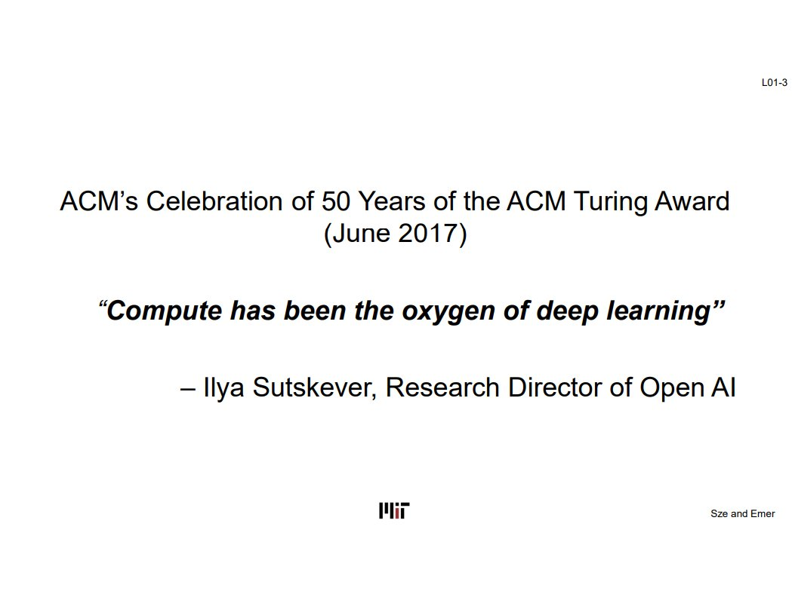

시작 전 이 강의를 왜 들어야 하는지 Ilya Sutskever(OAI 공동창업자)의 말을 인용하겠다.

2017년 ACM 튜링상 50주년 행사에서 한 말로, **"Compute has been the oxygen of deep learning"** 이다. 알고리즘이 아무리 좋아도 Compute 없이는 돌릴 수가 없다는 뜻이다. 역으로 읽으면 Compute를 더 효율적으로 만드는 사람이 딥러닝 발전의 병목을 해결한다는 말과도 일맥상통한다.

이는 곧 MLSys가 **AI-resistant한 커리어**인 이유이기도 하다. AI 모델이 아무리 바뀌어도 (CNN → Transformer → MoE → Mamba...) 결국 Compute는 필연적인 존재다. 모델을 만드는 사람은 새 아키텍처가 나올 때마다 리셋되지만, 그 모델을 효율적으로 돌리는 하드웨어/시스템 인프라를 다루는 사람은 계속 수요가 있다.

---

## AI Ingredients — AI 폭발의 3대 요소 (L01-2)

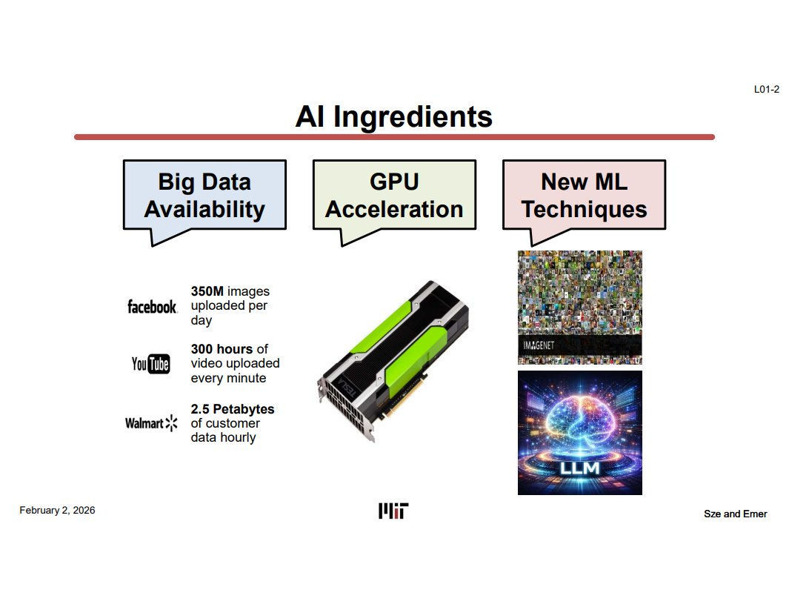

1) **Big Data** — Facebook 하루 3.5억 장 이미지, Youtube 분당 300시간 영상, Walmart 시간당 2.5PB. 이런 데이터가 존재하므로 LLM 같은 모델을 학습시킬 수 있다.

2) **GPU Acceleration** — Tesla T4 같은 GPU는 CPU로는 빠르게 못 돌리는 MatMul을 가능케 한다. 수백~수천 개의 코어로 병렬 연산을 진행하므로 이전에는 비현실적이던 딥러닝 학습이 현실적 시간 안에 가능해졌다.

3) **New ML Techniques** — AlexNet이 CNN 시대를 열었고 지금은 LLM/Transformer가 대세가 되었듯이, 알고리즘이 발전하면서 하드웨어의 요구사항도 꾸준히 변한다.

---

## GPU가 DNN 전용으로 진화하는 과정 (L01-4)

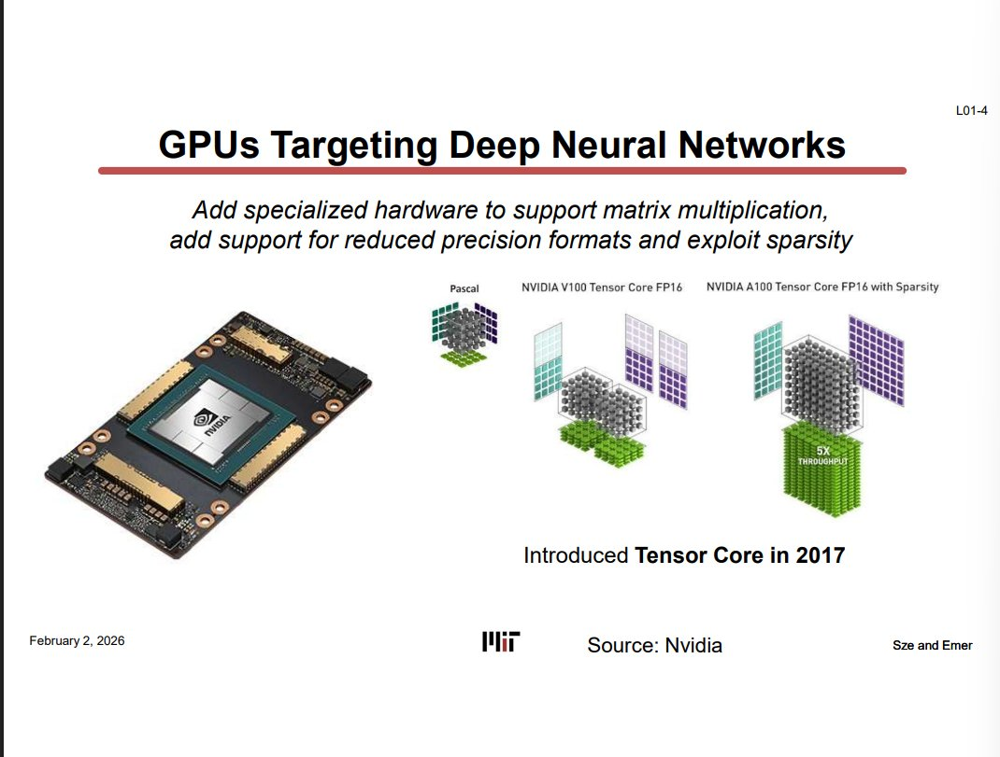

2016년 Pascal 아키텍처 탄생 이후, 범용 CUDA 코어로 MatMul(FLOP)을 진행할 수 있게 되었고, 1년 후 2017년에 **V100 Tensor Core**가 탄생했다 (FMA 같은 assembly instruction에 친화적인 유닛). 범용 CUDA 코어 대비 같은 칩 면적에서 throughput이 몇 배 단위로 뛰었고, FP16 정밀도 지원으로 연산 속도가 비약적으로 상승했다.

2020년에는 **A100 Tensor Core** 탄생으로 Sparsity 지원이 추가되었다. 가중치의 50%가 0이면 건너뛰고 유효한 값만 연산하여 throughput을 올리는 테크닉이다.

> **Note**: A100의 sparsity는 아무 sparse matrix나 되는 게 아니라 **2:4 structured sparsity** (연속 4개 원소 중 정확히 2개가 0)만 하드웨어가 인식하고 가속함. 이 제약 때문에 pruning 알고리즘과 하드웨어 sparsity 패턴이 같이 맞아야 하는데, 이것이 **algorithm-hardware co-design**의 핵심이다.

---

## Software Companies Building HW (L01-5)

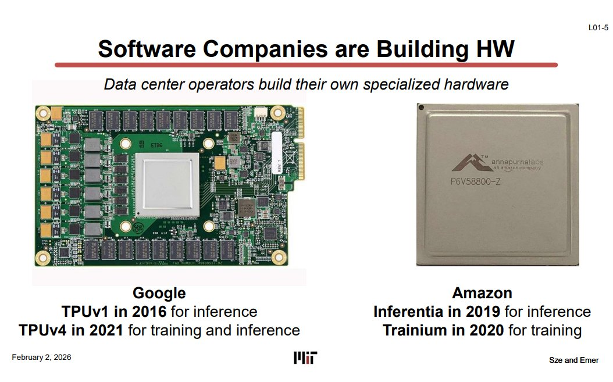

지금까지 언급된 디바이스들은 대부분 NVIDIA 제품이다. 그런데 왜 Google, Amazon이 직접 칩을 만들까?

결론부터 말하면 **비용 + 최적화**이다. NVIDIA GPU는 범용이라 DNN 이외의 것도 다 돌릴 수 있게 설계되었지만, Google 입장에선 데이터센터 작업의 대부분이 DNN Inference/Training이니까, 거기에 딱 맞는 칩을 만들면 전력/면적 대비(TOPS/W, TOPS/mm²) 성능이 훨씬 나온다.

- **Google TPU** — v1(2016)은 Inference 전용, 256×256 systolic array로 행렬곱 특화. v4는 Training도 지원.
- **Amazon Inferentia/Trainium** — AWS에서 돌리는 모델들의 inference/training 비용을 줄이려고 만든 것.
- 국내에서도 FuriosaAI, Rebellions 등이 같은 방향으로 설계하고 있다.

---

## Cerebras WSE (L01-6)

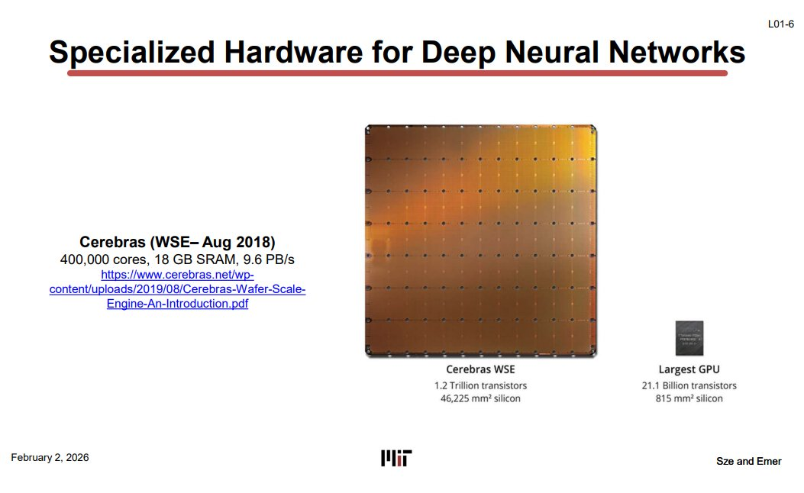

재미있는 극단적 사례로 Cerebras WSE가 있다. 보통 칩은 웨이퍼에서 잘라낸 작은 die 하나인데, Cerebras는 **웨이퍼 전체를 하나의 칩으로** 사용한다. 덕분에 무려 **18GB SRAM**을 자랑한다 (A100은 20MB 안팎, TPU도 32MB 이내).

다만 현실적으로는 수율, 냉각, 가격 문제가 심해서 널리 쓰이진 않고, domain-specific 설계가 어디까지 갈 수 있는지 보여주는 사례 정도로 이해하면 된다.

---

## Mobile SoCs for DNNs (L01-7)

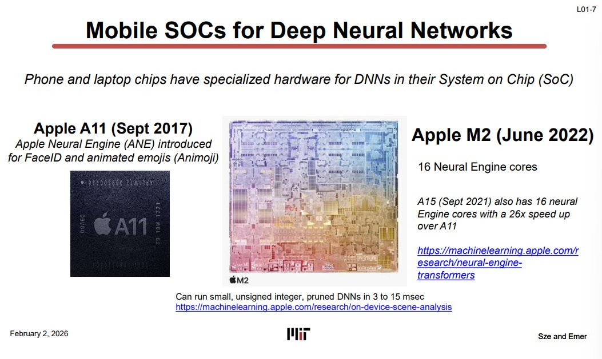

데이터센터뿐 아니라 폰/노트북 칩에서도 DNN 전용 유닛이 들어간다. Edge Device AI의 시대가 도래하고 있음을 시사한다.

- **Apple A11 (2017)** — 처음으로 ANE(Apple Neural Engine) 탑재. FaceID, Animoji 같은 on-device inference용.
- **Apple M2 (2022)** — 16 Neural Engine 코어. A11 대비 26배 속도 향상. 코어 수는 같은데 속도가 26배라는 건 코어 아키텍처 자체가 세대마다 크게 개선되었다는 뜻.
- ANE가 잘 돌리는 조건: **작고, 정수 양자화되어 있고, pruning된 모델** → on-device inference의 현실적 제약.

---

## 컴퓨팅 에너지 소비의 폭발적 증가 (L01-8)

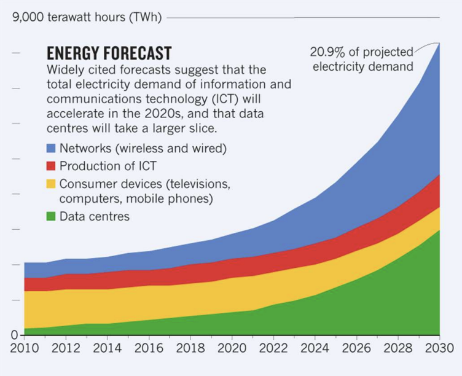

데이터센터가 미국 전체 전력의 3%(2022) → 8%(2030 예상)을 차지하게 될 것이라는 전망이다 [Goldman Sachs, April 2024]. ICT 전체가 전 세계 전력의 20.9%를 차지할 것이라는 예측도 있다.

모델 크기는 꾸준히 커지는데 전력은 무한하지 않으므로, **같은 연산을 더 적은 에너지로 하는 것**이 핵심 과제가 되었다.

여기서 중요한 사실: **data movement가 computation보다 에너지를 훨씬 많이 먹는다.** DRAM 접근은 ALU 연산 대비 약 200배의 에너지를 소모한다. 즉 accelerator 설계의 핵심은 연산을 빠르게 하는 것이 아니라 **데이터를 얼마나 덜 움직이느냐**에 있다.

이 문제를 해결하는 접근법들:
- **On-chip SRAM 확대** — Cerebras WSE가 18GB SRAM을 박은 것도 DRAM 접근을 줄이기 위함
- **FlashAttention** — HBM에서 전체 attention matrix를 만들지 않고, SRAM에 올라가는 크기로 tiling해서 SM 내부에서 연산을 완료. 정확도 손실 없이 메모리 접근을 줄여 속도를 올리는 방식
- **Memory hierarchy 설계** — register file → local buffer → global buffer → DRAM 순으로 가까운 메모리에서 최대한 데이터를 재사용 (이 수업 후반부에서 자세히 다룸)

결국 공통 원리는 하나다: **데이터를 가능한 한 compute 가까이에 두고, 멀리 있는 메모리에 접근하는 횟수를 최소화한다.**

---

## Computing Cost of ChatGPT (L01-12)

GPT-3는 96개 레이어, 175B 파라미터, 학습에 필요한 부동소수점 연산은 총 3.14×10²³ FLOPS.
- V100 한 장으로 돌리면 **355년** 소요
- 클라우드로 돌려도 **약 $4.6M(한화 ~60억 원)** 소요
- GPT-4는 **$100M+(한화 ~1,300억 원 이상)** 추정

---

## Changing Trends — DeepSeek (L01-13)

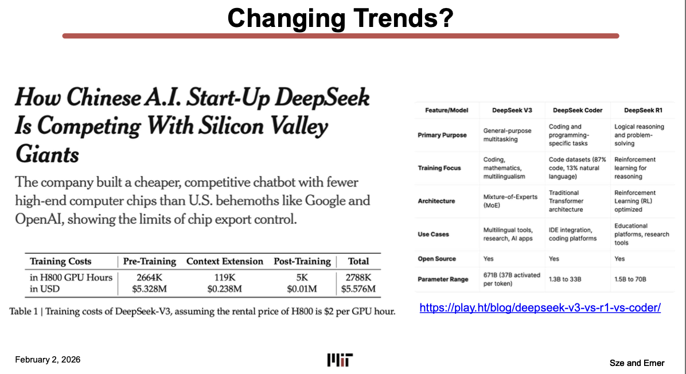

GPT-4가 1,300억 이상 소요한 학습을, DeepSeek는 **약 80억 원**으로 해냈다. 이로 인해 기존 모델들을 훨씬 싸게 경쟁력 있게 만드는 데 시장 경쟁이 붙고 있다.

DeepSeek의 핵심 기법: **MoE(Mixture of Experts)** 아키텍처 — 671B 파라미터지만 토큰당 37B만 활성화. 전체 파라미터를 다 돌리는 게 아니라 필요한 Expert만 선택적으로 돌려서 Compute 효율을 극적으로 올렸다.

---

## Training vs Inference (L01-15)

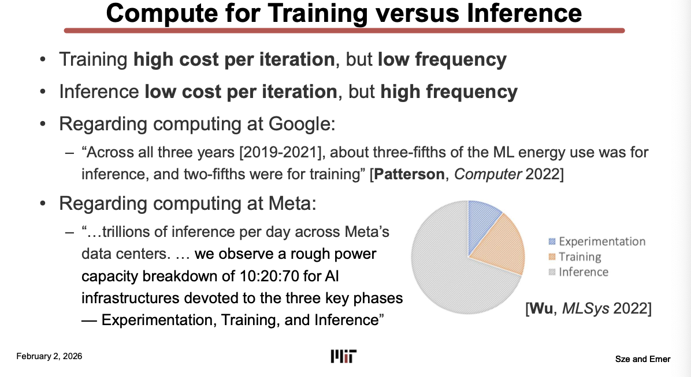

DNN의 연산은 크게 두 가지로 나뉜다:

- **Training** — 한 번에 비용 크지만 가끔 진행 (모델을 한 번 학습해 적절한 가중치를 구하면 끝)
- **Inference** — 한 번에 비용 적지만 매일 수조 번씩 돌아감 (Agent에게 Q를 날려 A를 얻으면 Single-turn Inference 한 번 발생)

즉 Training보다 Inference의 누적 비용이 압도적으로 크다. 이 때문에 **LLM Inference Optimizing** 직군이 각광받고 있다.

---

## On-Device의 장점 (L01-18)

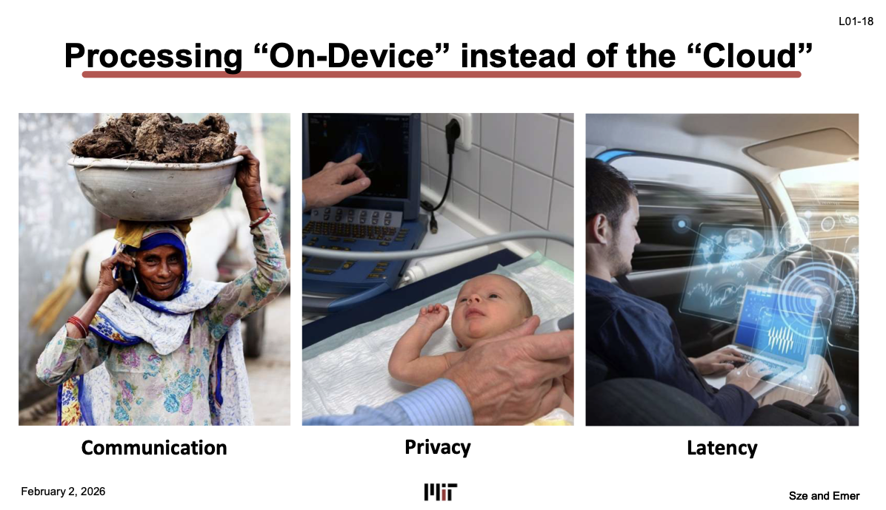

On-Device는 Cloud 대비 세 가지 장점이 존재한다:

1) **Communication** — 네트워크가 없거나 불안정한 환경(개발도상국, 오지 등). 클라우드에 연결 못 하면 AI를 쓸 수 없음.
2) **Privacy** — 의료(EMR, EHR), 국방(Palantir) 데이터 같은 민감한 정보를 클라우드로 보내면 안 됨. 디바이스에서 직접 처리하면 데이터가 밖으로 leak될 일 없음.
3) **Latency** — 자율주행처럼 실시간 반응이 필요한 경우. 클라우드 왕복 지연(수십~수백ms)이 치명적. 말단 디바이스에서 바로 처리해야 함.

---

## Self-Driving Cars (L01-19)

자율주행은 Edge Inference의 대표 사례다:

- 카메라 + 레이더가 약 30초마다 ~6GB의 데이터를 생성
- 자율주행 자동차 1대 = DNN × 60Hz × 10개 카메라 = **시간당 21.6M 번의 Inference**
- 100만 대 기준 = **시간당 21.6조 번의 Inference**
- 프로토타입 컴퓨팅에만 2,500W 소모 → 공랭 불가, 수냉/액침냉각 필요
- 클라우드로 보내면 Latency 때문에 사고 위험

---

## Moore's Law 둔화와 Domain-Specific HW의 필요성 (L01-22)

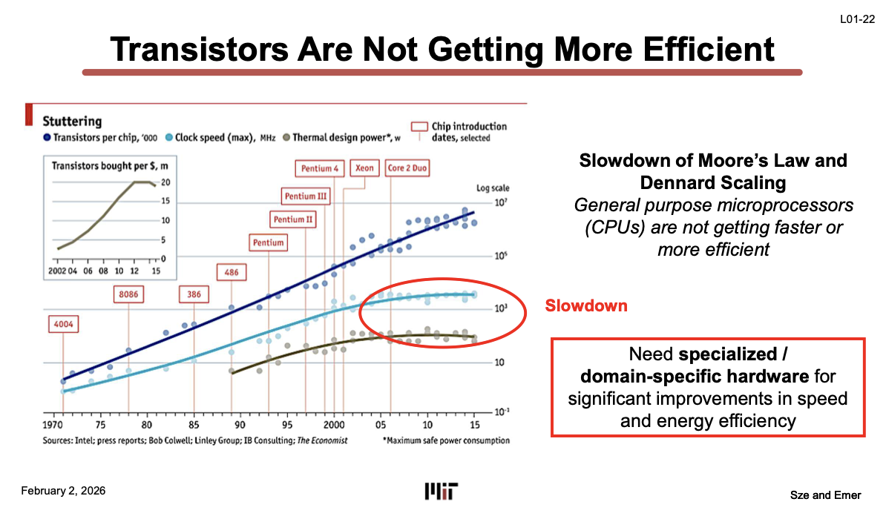

**MLSys가 근본적으로 존재하는 이유:**

- **Moore's Law 둔화** — 트랜지스터 수는 여전히 늘어나지만 속도는 느려짐. 달러당 트랜지스터 수도 정체.
- **Dennard Scaling 종료** — 예전에는 트랜지스터가 작아지면 전력도 비례해서 줄었음. 2005년쯤부터 이게 깨짐. 그래프에서 clock speed(파란색)와 TDP(회색)가 flat해진 게 보임.

→ 더 이상 범용 프로세서의 성능/효율이 자동으로 올라가지 않음 → **Domain-specific hardware가 필요**

범용(General Purpose, e.g. CPU)은 워드, 게임, 웹브라우저, DNN 등 모든 작업이 가능하지만 어느 작업에도 특화되어 있지 않음. Domain-specific hardware는 특정 도메인에 최적화된다:

- NVIDIA Tensor Core — 행렬곱 전용
- Google TPU — DNN Inference/Training
- Apple ANE — On-device DNN Inference
- FuriosaAI NPU — AI Inference

---

## L01-23 ~ L01-25: CPU Pipeline의 진화

CPU(General Purpose Hardware)가 어떻게 작동하는지 보여주는 파이프라인 다이어그램들이다. 이 슬라이드들이 나오는 이유는 **"범용 CPU가 utilization을 올리려면 이렇게 복잡해져야 하는데, DNN에는 이 복잡도가 전부 낭비"**라는 걸 깔기 위함이다.

### Simple In-Order Pipeline (L01-23)

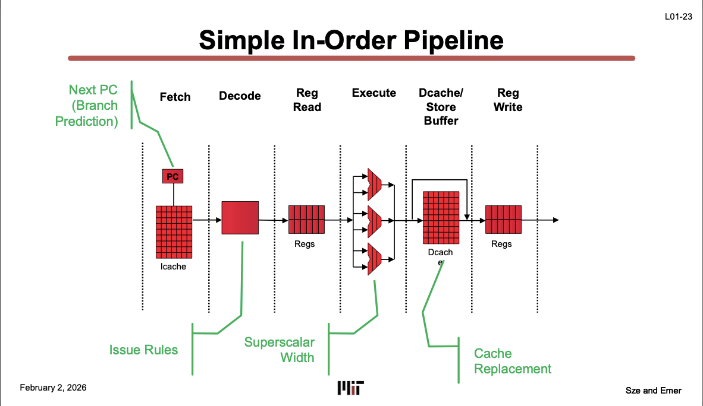

5-stage pipeline(IF→ID→EX→MEM→WB)의 ID 단계를 Decode와 Reg Read로 분리하여 **6단계**로 만든 구조다. 스테이지당 작업량이 줄어 클럭 주파수를 높일 수 있다. Width가 1보다 크므로 **Superscalar**라고 부를 수 있다.

각 스테이지:

**Fetch** — PC가 가리키는 주소로 Icache(명령어 캐시)에서 명령어를 가져옴. 다음 PC는 Branch Prediction으로 결정 — 분기 결과를 미리 예측해서 stall 없이 계속 fetch.

**Decode** — 가져온 명령어를 해석하여 opcode, rs, rd, immediate 값을 파싱.

**Reg Read** — 레지스터 파일(Regs)에서 소스 오퍼랜드 값을 읽어옴. Superscalar Width만큼 동시에 여러 오퍼랜드를 읽음.

**Execute** — ALU(그림에서 빨간색 chevron 기호)에서 실제 연산을 수행. chevron이 3개 = functional unit 3개 (예: Integer ALU, FP/Multiply Unit, Branch Unit 조합). Superscalar Width는 이 functional unit 개수와 맞춰서 설계되며, 이 그림에서는 **width = 3**.

**Dcache/Store Buffer** — 메모리 접근 단계. Load면 Dcache에서 데이터를 읽고, Store면 Store Buffer에 써놓고 나중에 캐시에 반영.

**Reg Write** — 연산 결과를 레지스터 파일에 다시 쓴다 (5-stage pipeline에서의 Write-Back).

### Basic Out-of-Order Pipeline (L01-24)

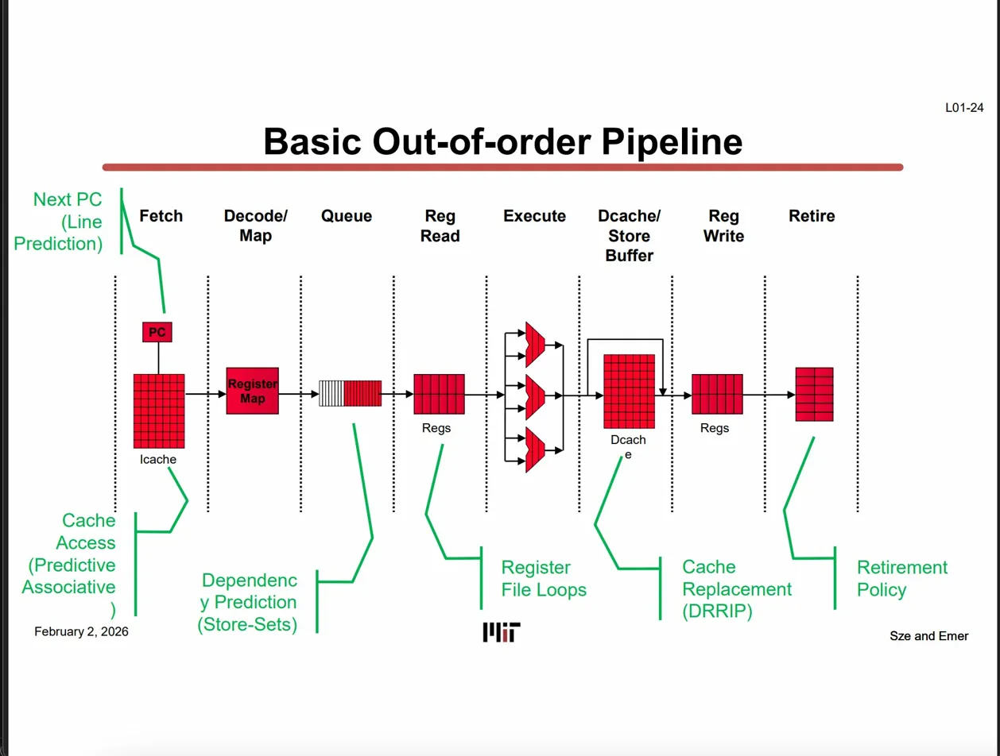

**In-Order → Out-of-Order로 바뀌며 생긴 것:**

In-Order Superscalar의 한계는 명확하다. Functional unit이 3개(width=3)여도 앞 명령어가 캐시 미스로 막히면 뒤 명령어들도 전부 Stall된다. Superscalar width를 아무리 늘려도 Throughput이 증가하지 않는다.

OoO는 이를 해결하기 위해 **Priority Queue(Issue Queue)**를 추가했다. 캐시 미스로 한 명령어가 막혀도 오퍼랜드가 준비된 나머지 명령어들은 순서 무관하게 먼저 Execute로 보내므로 계속 실행 가능하게 됐다.

### SMT — Simultaneous Multi-Threading (L01-25)

> SIMT(GPU)가 아님 주의. SMT ≠ SIMT.

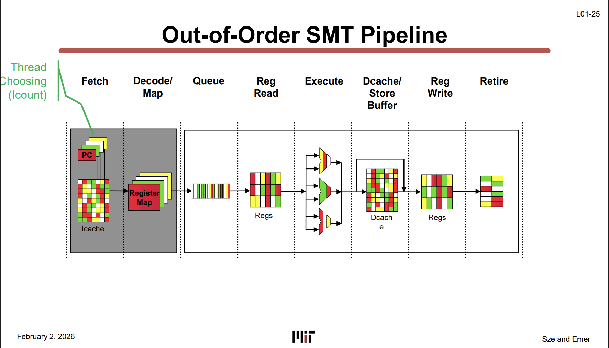

그림에서 보이는 Red/Yellow/Green은 서로 다른 스레드를 의미한다. 핵심은 파이프라인 하드웨어를 복사한 게 아니라 **하나의 파이프라인을 여러 스레드가 나눠 쓴다**는 것이다. (이걸 유별나고 지랄나게 잘 쓰는 곳이 Intel이다 — Hyper-Threading이라고 있다.)

SMT는 어려워 보이지만 Out-of-Order Pipeline에 **Thread Choosing만 추가**하여 여러 스레드가 하나의 파이프라인을 공유해서 빈 슬롯을 채움으로써 Throughput을 늘린다.

**파이프라인 진화 정리:**

| 구조 | 특징 |
|------|------|
| Scalar | 5-stage, width=1, 한 사이클에 명령어 1개 |
| Superscalar (In-Order) | width>1, 한 사이클에 여러 개, **순서대로** |
| OoO + Superscalar | width>1, 한 사이클에 여러 개, **준비된 것부터** |
| OoO + SMT | 위에 + 여러 스레드가 파이프라인 공유 |

이 모든 제어 로직(Branch Prediction, Register Renaming, Issue Queue, Retire, Thread Choosing...)이 범용성을 위한 오버헤드다. **DNN은 연산 패턴이 규칙적(MatMul의 반복)이라 이런 게 전부 불필요** → Accelerator에서는 이걸 다 빼고 PE array + memory hierarchy만 남긴다.

---

## Every Accelerator is Unique (L01-26)

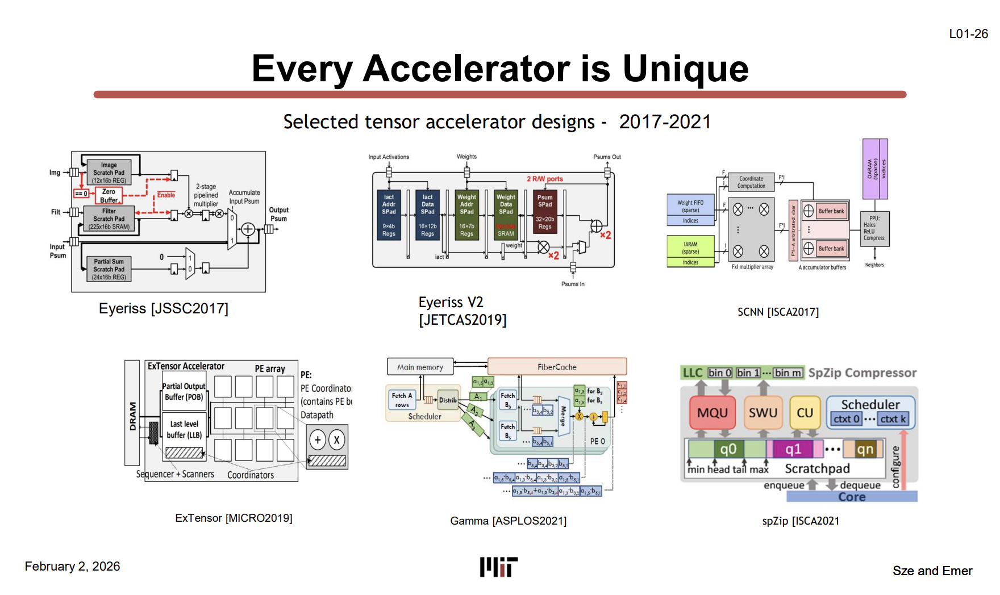

이제 본론이다. CPU는 DNN Accelerator에 쓸모없다는 것을 알게 되었다.

DNN Accelerator에도 여러 종류가 존재한다. 위 사진의 설계들은 전부 텐서 연산 가속기인데 생긴 것이 다 다르다:

- **Eyeriss** [JSSC2017] — CNN inference용, PE마다 local scratchpad 있는 spatial array
- **Eyeriss V2** [JETCAS2019] — Eyeriss 개선판, 유연한 NoC 추가
- **SCNN** [ISCA2017] — sparse CNN 전용, 0인 값 건너뛰는 구조
- **ExTensor** [MICRO2019] — sparse tensor 연산 가속
- **Gamma** [ASPLOS2021] — sparse matrix 곱셈 특화
- **spZip** [ISCA2021] — sparse 데이터 압축/해제 특화

결론은 하나다: **모든 Accelerator는 다 다르게 설계된다.** CPU는 파이프라인 구조가 표준화되어 있지만, DNN Accelerator는 타겟 워크로드(dense/sparse, CNN/Transformer 등)에 따라 PE 배치, 메모리 계층, 데이터 흐름이 전부 다르다. 이 수업에서 이런 설계 차이를 분석하는 프레임워크를 배운다.

> **PE(Processing Element)** = 연산 유닛 하나. CPU에서 ALU가 하는 역할을 DNN Accelerator에서는 PE라고 부른다. 안에 곱셈기 + 덧셈기 + 작은 레지스터 파일이 들어있어서 MAC(Multiply-Accumulate) 연산을 수행한다.

---

## TeAAL Pyramid of Concerns & FuseMax (L01-28 ~ L01-34)

> 여기서부터 생소한 용어가 남발된다. 그냥 넘어가도 좋다 — 다음 강의에서 자세하게 다룬다.

### TeAAL Pyramid of Concerns (L01-28)

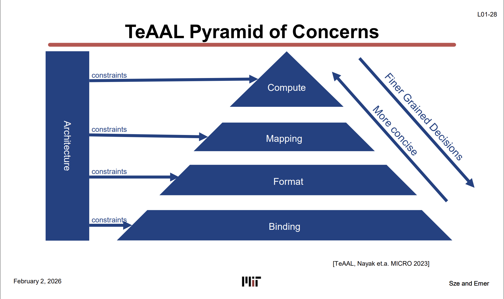

Accelerator 설계를 4개 계층으로 분해하는 프레임워크다. 왼쪽의 Architecture가 각 계층에 constraint를 걸고, 위로 갈수록 결정이 세밀해진다(Finer Grained). OSI 7 Layer가 네트워크를 계층별로 분리한 것처럼, 이 피라미드도 accelerator 설계 결정을 계층별로 분리한다.

| 계층 | 의미 | 수업 연결 |
|------|------|----------|
| Compute (꼭대기) | 어떤 연산을 하느냐 (MatMul, Attention) | Lab 1: Einsum |
| Mapping | 연산을 HW에 어떻게 배치 (tiling, dataflow) | Lab 2, 3 |
| Format | 데이터 저장 형태 (dense, sparse 등) | Lab 4: Sparsity |
| Binding (바닥) | 물리적 HW에 할당 (PE, Buffer) | Lab 2, 3 |

이 피라미드가 **수업 전체를 관통하는 프레임워크**다.

### FuseMax — 피라미드 실제 적용 사례 (L01-29)

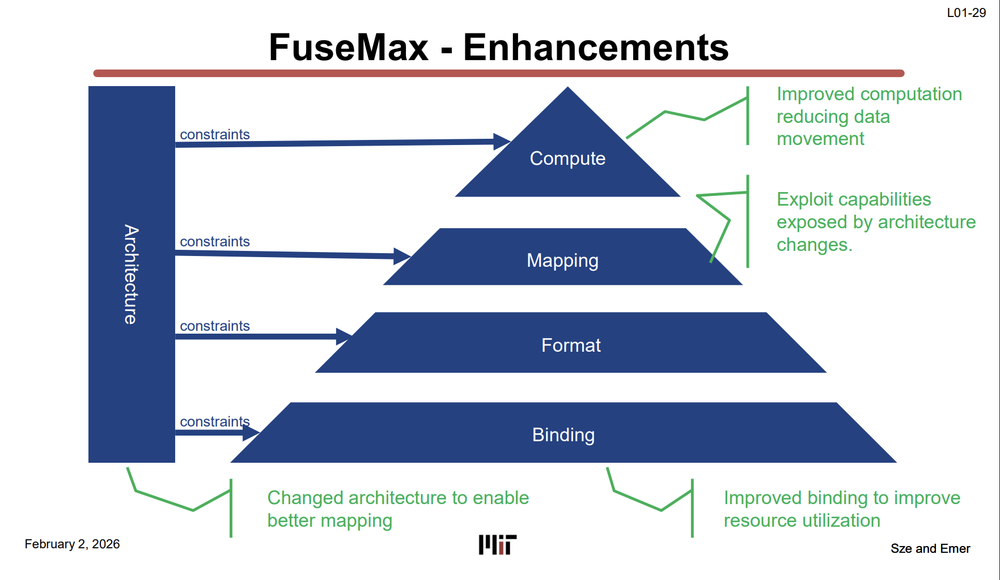

FuseMax [Nayak et al., MICRO 2024]는 Transformer Attention 가속 설계다. 각 계층에서 하나씩 개선하여 PE utilization을 **0% → ~90%**로 끌어올렸다.

| 단계 | 계층 | 개선 내용 | 결과 |
|------|------|----------|------|
| Cascade | Compute | MatMul+Softmax fuse, data movement 제거 | util 소폭 상승 |
| Arch 변경 | Architecture → Mapping | 새로운 mapping 가능하게 아키텍처 수정 | util 유의미 상승 |
| Binding 개선 | Binding | PE에 효율적 할당, 자원 활용 극대화 | util ~90% |

> **용어 정리:**
> - **Unfused** = Attention의 각 단계(Q×K → Softmax → ×V)를 따로따로 실행. 매번 중간 결과를 메모리에 쓰고 다시 읽음.
> - **FLAT** = 기존의 부분적 fuse 방식 (prior work).
> - **Cascade** = FuseMax의 완전한 fuse. 중간 결과를 메모리에 안 쓰게 만듦.

**Takeaway:** Accelerator 성능은 단일 요소가 아니라 피라미드의 모든 계층이 함께 최적화되어야 나온다.

### PE Utilization 변화 (L01-30 ~ L01-34)

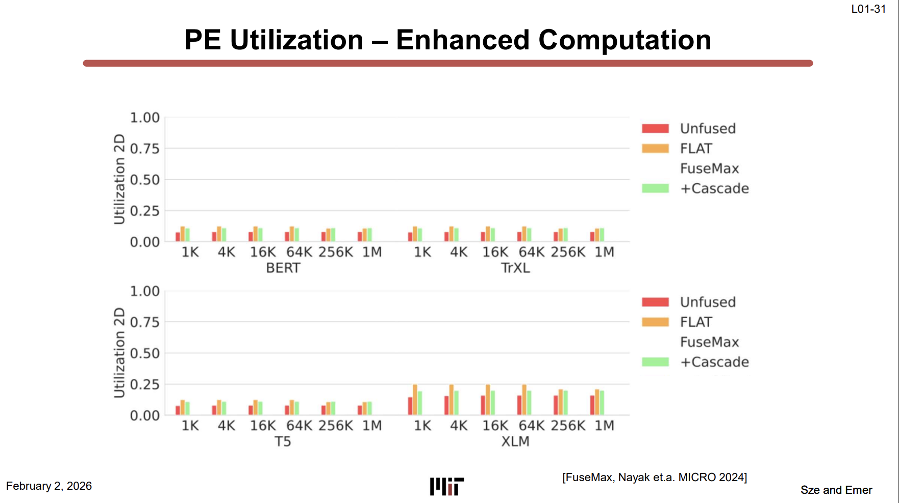

L01-30 그래프: Baseline 상태에서 BERT, TrXL, T5, XLM **모든 모델, 모든 시퀀스 길이(1K~1M)에서 PE utilization이 전부 0.25 이하**다. PE 수백 개 깔아놨는데 대부분이 놀고 있다는 뜻.

- x축 = 시퀀스 길이 (1K ~ 1M)
- y축 = PE utilization (0 ~ 1.0)
- 빨간색 = Unfused (연산 분리), 주황색 = FLAT (기존 fused 방식). **둘 다 처참.**

이후 L01-31~33에서 Cascade → Architecture → Binding 개선을 순차 적용하면서 utilization이 **~90%까지** 올라간다.

## L01-43

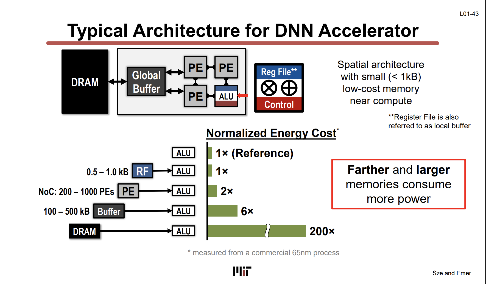

DNN Accelerator의 전형적인 구조다. CPU의 복잡한 파이프라인(Branch Prediction, OoO, SMT...)을 전부 걷어내고, **PE array + memory hierarchy**만 남긴 구조.

**구조 (왼쪽 → 오른쪽):**

DRAM → Global Buffer(100~500kB) → PE array(200~1000개) → 각 PE 안에 Reg File(<1kB) + ALU + Control

각 PE는 MAC(Multiply-Accumulate) 연산만 하는 작고 단순한 유닛이다. CPU처럼 Branch Prediction이나 Register Renaming 같은 제어 로직이 없어서 같은 칩 면적에 연산 유닛을 훨씬 많이 깔 수 있다.

**핵심: Normalized Energy Cost (65nm 기준)**

| 데이터를 어디서 가져오냐 | 에너지 비용 |
|---|---|
| ALU 연산 자체 | 1× (기준) |
| Reg File(0.5~1kB) → ALU | 1× |
| PE간 NoC → ALU | 2× |
| Global Buffer(100~500kB) → ALU | 6× |
| DRAM → ALU | **200×** |

DRAM에서 데이터 한 번 가져오는 에너지 = 실제 연산의 **200배**. 이게 L01-8에서 말한 "data movement > computation"의 구체적 숫자다.

**그래서 accelerator 설계의 핵심 목표:** 데이터를 최대한 PE 가까이(Reg File, Global Buffer)에 두고, DRAM 접근 횟수를 최소화한다. FlashAttention이 HBM 대신 SRAM에서 tiling하는 것도, Cerebras가 18GB SRAM을 박은 것도 전부 이 원리.

> **"Farther and larger memories consume more power"** — 이 한 줄이 이 수업의 핵심 원리이다.

## L01-44 Aceelerator 설계 시 결정해야 할 것들 (L01-44)

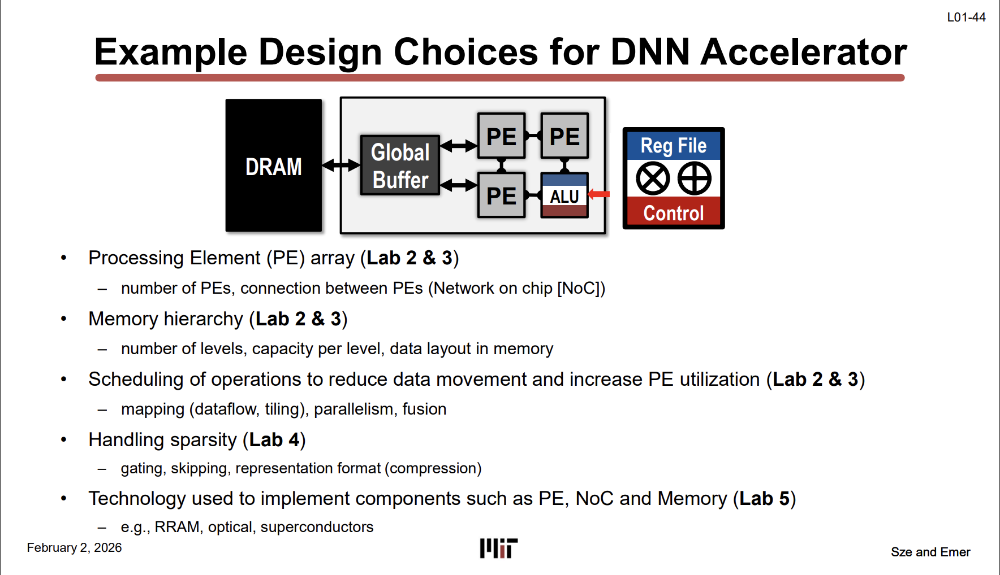

위 구조에서 설계자가 결정해야 하는 항목들이고, 각각이 이 수업의 Lab에 직접 매핑된다:

| 설계 결정 | 구체적 내용 | Lab |
|----------|----------|-----|
| PE array | PE 개수, PE 간 연결 방식 (NoC) | Lab 2, 3 |
| Memory hierarchy | 몇 단계, 각 단계 용량, 데이터 배치 | Lab 2, 3 |
| Scheduling | mapping(dataflow, tiling), parallelism, fusion | Lab 2, 3 |
| Sparsity 처리 | gating, skipping, 압축 포맷 | Lab 4 |
| 구현 기술 | RRAM, optical, superconductors 등 | Lab 5 |

TeAAL Pyramid의 각 계층(Compute, Mapping, Format, Binding)이 여기서 구체적인 설계 결정으로 내려온다고 보면 된다.

---

## Roofline Model로 Accelerator 비효율 분석하기 (L01-45)

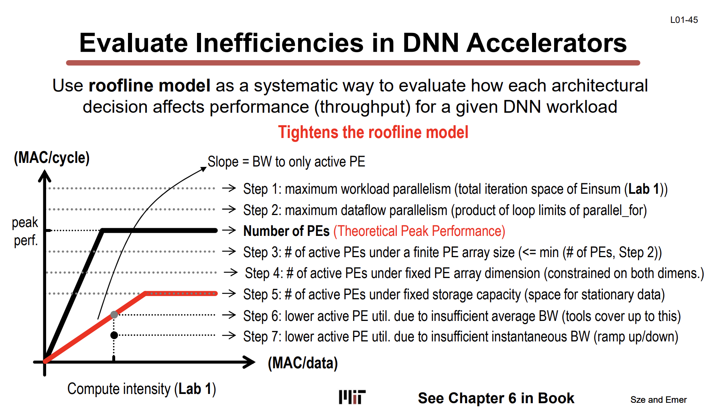

Roofline Model은 accelerator의 성능 bottleneck이 **compute-bound인지 memory-bound인지** 판별하는 프레임워크다. Lab 1부터 직접 쓴다.

**축 해석:**
- x축 = **Compute Intensity** (MAC/data) — 데이터 1개당 몇 번 연산하느냐. 높을수록 compute-heavy.
- y축 = **성능** (MAC/cycle) — 사이클당 실제 처리한 연산 수.
- 기울기 = 메모리 bandwidth

**그래프의 핵심:**
- 왼쪽 경사면에 있으면 → **memory-bound** (데이터를 가져오는 게 병목)
- 오른쪽 평탄면에 있으면 → **compute-bound** (연산 유닛이 병목)

**Step 1~7은 "이론적 peak에서 실제 성능까지 왜 떨어지는가"를 계단식으로 보여준다:**

| Step | 제약 요인 | Lab |
|------|---------|-----|
| Step 1 | 워크로드 자체의 최대 병렬성 (Einsum 전체 iteration space) | Lab 1 |
| Step 2 | dataflow가 허용하는 최대 병렬성 (parallel_for 한계) | Lab 2, 3 |
| **PE 개수** | **Theoretical Peak Performance (하드웨어 한계)** | — |
| Step 3 | 유한한 PE array 크기 | Lab 2, 3 |
| Step 4 | PE array 차원 제약 (2D array면 양쪽 다 제한) | Lab 2, 3 |
| Step 5 | 유한한 storage 용량 (stationary data 공간) | Lab 2, 3 |
| Step 6 | 평균 bandwidth 부족 | Lab 2, 3 |
| Step 7 | 순간 bandwidth 부족 (ramp up/down) | — |

위에서 아래로 갈수록 roofline이 **조여진다(tightens)**. 이론적 peak에서 시작해서 현실적 제약을 하나씩 반영하면 실제 달성 가능한 성능이 나온다.

### 실제 Roofline — Nsight Compute에서 본 모습

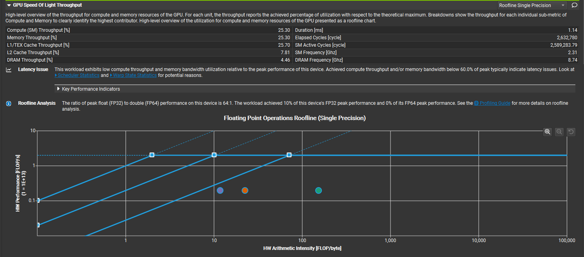

위는 FlashAttention forward 커널을 Nsight Compute로 프로파일링한 roofline이다. L01-45의 개념이 실제 GPU에서 이렇게 보인다:

- x축 = **HW Arithmetic Intensity** (FLOP/byte)
- y축 = **HW Performance** (FLOP/s)
- 파란 선들 = 각 메모리 계층(DRAM, L2, L1)의 bandwidth roofline
- 파란 점선(수평) = compute peak (이 HW의 이론적 최대 연산 성능)
- **색깔 점 = 실제 커널의 측정값**. roofline 아래에 있으면 그만큼 비효율이 있다는 뜻.

Compute (SM) Throughput 25.30%, DRAM Throughput 4.46%로 둘 다 낮은 건 아직 최적화 여지가 많다는 의미다. 이 수업에서 배우는 Step 1~7 분석이 정확히 "왜 peak 대비 이렇게 낮은지"를 체계적으로 진단하는 도구인 거다.

> **L01-45와 Nsight Compute의 차이:** L01-45는 DNN Accelerator(PE array) 관점이고, Nsight Compute는 GPU(SM/warp) 관점이다. 프레임워크는 같지만 하드웨어 용어가 다르다 — PE ↔ SM, Reg File ↔ Shared Memory, Global Buffer ↔ L2 Cache, DRAM ↔ HBM.