> Source: MIT 6.5930/1 Spring 2026, [L02 - Overview of Deep Neural Network Components](https://csg.csail.mit.edu/6.5930/lectures/L02-Overview_on_DNN_components.pdf)

L01 established that data movement is expensive. L02 turns that statement into actual numbers. It takes one matrix-vector multiplication and calculates the operation count, minimum memory traffic, and traffic generated by a particular loop order. The best-case compute intensity is 0.99, while a simple implementation reaches only 0.33. Both compute the same expression, but one moves nearly three times as much data.

The second half of the lecture covers CNNs and fully connected layers. This is not the usual deep learning introduction about model accuracy or training methods. Each layer is written as a tensor expression, labeled with ranks and shapes, and eventually lowered to a seven-deep loop nest and matrix multiplication. Accelerator mapping needs the workload in this form before it can begin.

The PDF has 102 slides, many of which are animation frames that advance a dot or partial sum one step at a time. I consolidated each such sequence into its completed frame. The notes still cover the full conceptual range from L02-1 through L02-102.

## Accelerator Design Methodology

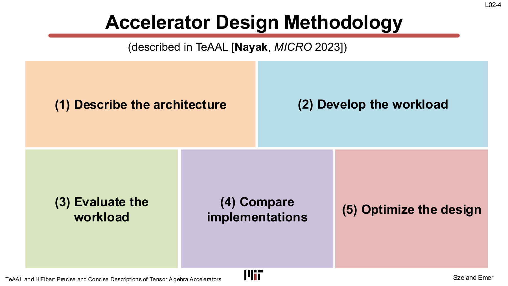

TeAAL divides the design process into five stages.

1. Architecture description
2. Workload development
3. Workload evaluation
4. Implementation comparison
5. Design optimization

The sequence looks ordinary, but most of this course fits between stages 2 and 3. Saying that an accelerator "handles matrix multiplication" is not enough to calculate either traffic or throughput. Hardware behavior appears only after deciding the tensor traversal order, where values are stored, and which PE owns each iteration.

The lecture deliberately starts with a very small architecture.

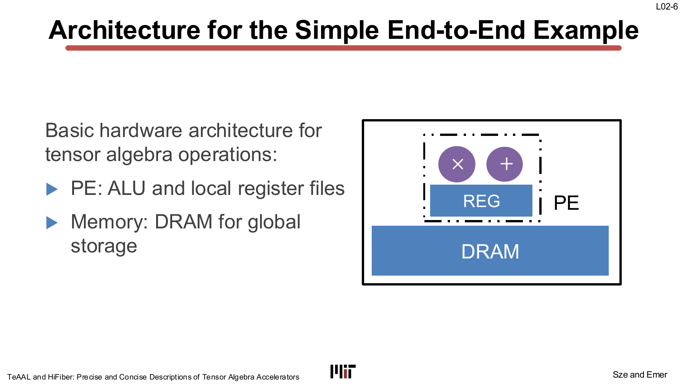
*One PE with an ALU and local register, plus DRAM as global storage.*

The PE has a multiplier, an adder, and a register, with DRAM outside it. There is no cache, global buffer, or NoC. This is less a realistic accelerator than a minimal model that exposes the effect of one mapping on traffic.

Once the architecture is fixed, the workload receives four kinds of specifications.

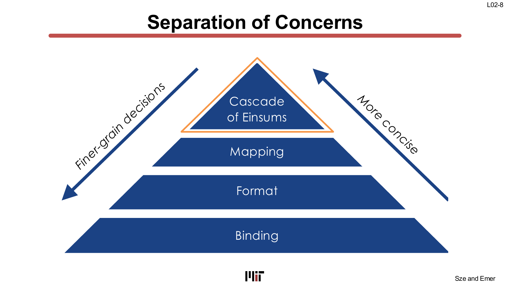

- **Cascade of Einsums**: which tensor operations run and how they depend on one another
- **Mapping**: in what order the iteration space is traversed and how it is tiled and parallelized
- **Format**: how tensors are represented, such as dense, CSR, or COO
- **Binding**: where computation and data are assigned among the physical PEs, registers, buffers, and networks

Descriptions are shorter near the top and accumulate implementation decisions toward the bottom. An Einsum defines only the computation. It says nothing yet about loop order or dataflow.

The evaluation stage derives compute count, memory traffic, and compute intensity. Comparisons between implementations must hold hardware conditions such as PE count, storage capacity, and bit width constant. Only the specification responsible for a bottleneck is then changed before evaluating again. This iterative process is what TeAAL targets. Instead of comparing complete accelerator diagrams as indivisible objects, it isolates whether a difference came from computation, mapping, format, or binding.

## Tensor Terminology

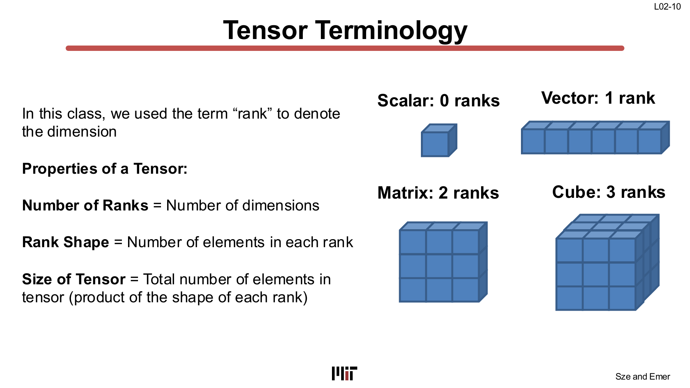

A tensor is a multidimensional array. A scalar is zero-dimensional, a vector is one-dimensional, a matrix is two-dimensional, and a cube is three-dimensional.

This course calls each dimension a `rank`. This use is different from matrix rank in linear algebra.

- **Number of ranks**: the number of dimensions
- **Rank shape**: the number of elements along each dimension
- **Tensor shape**: the ordered list of rank shapes
- **Tensor size**: the product of all rank shapes, or the total number of elements

For example, \(B[N,K]\) is a rank-2 tensor. Its rank names are \(N,K\), its shape is \([N,K]\), and its size is \(NK\). Rank names carry more meaning than numeric positions alone. Within a workload, \(N\) can identify the batch rank and \(C\) the input-channel rank.

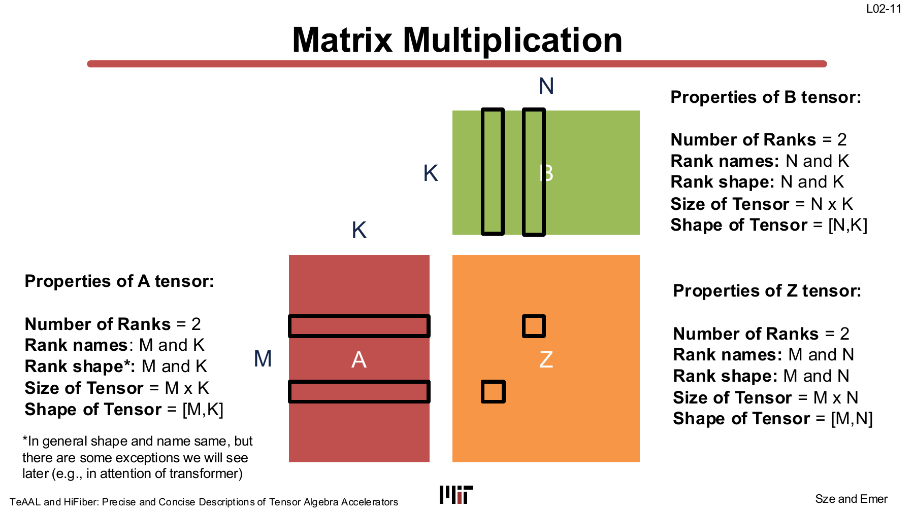

The lecture's matrix multiplication diagram labels the tensor shapes as \(A[M,K]\), \(B[N,K]\), and \(Z[M,N]\). The following Einsum places \(k\), the reduction rank, first and writes the operation as

$$
Z_{m,n} = \sum_k A_{k,m} B_{k,n}.
$$

\(K\) is the rank shared and reduced by both inputs. \(M,N\) remain in the output. The order of subscripts in an Einsum should not be read directly as the physical memory layout. Matching rank names define the contraction in an Einsum; the physical rank order and storage representation are separate format and mapping decisions.

## Einsum and Operational Definition

Einstein summation notation implies reductions from the indices on each side.

$$
Z_{m,n} = A_{k,m} B_{k,n}
$$

The \(k\) that appears only on the right is summed. The expression means the same thing without writing \(\sum_k\) explicitly. Reducing it to matrix-vector multiplication makes the notation simpler.

$$
Z_m = A_{k,m} B_k
$$

This one line specifies the input tensors \(A,B\), the output tensor \(Z\), and the multiplication and reduction performed at each point. One thing is missing: the **execution order**.

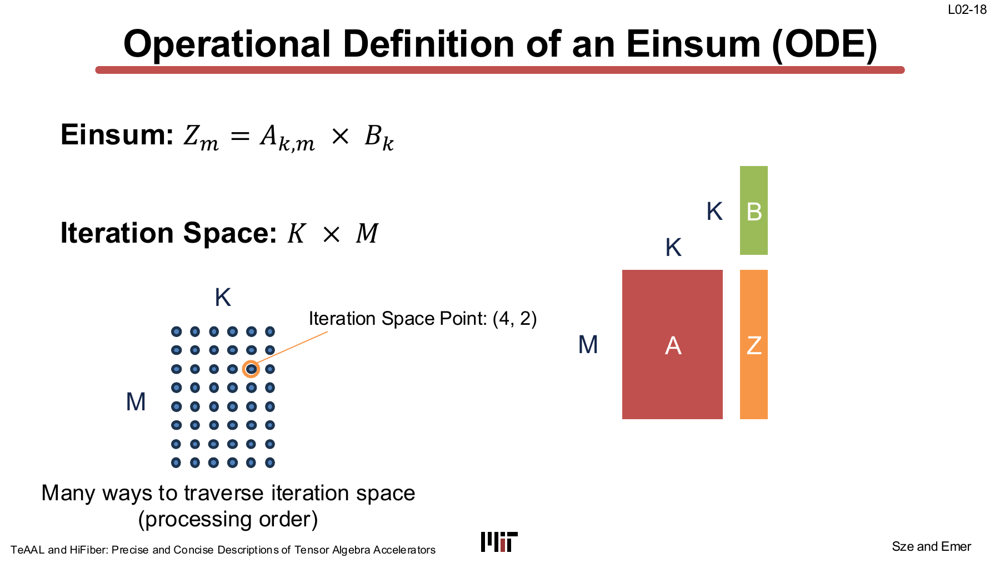

TeAAL's Operational Definition of an Einsum reads the expression in three parts.

1. The input and output tensors and their ranks
2. The iteration space, defined as the Cartesian product of every legal coordinate
3. The operation performed at each iteration point

The iteration space of the matrix-vector multiplication above is \(K \times M\). With \(K=8\) and \(M=6\), it contains 48 points. Point \((4,2)\) represents one operation: multiply \(A_{4,2}\) by \(B_4\) and add the result to \(Z_2\).

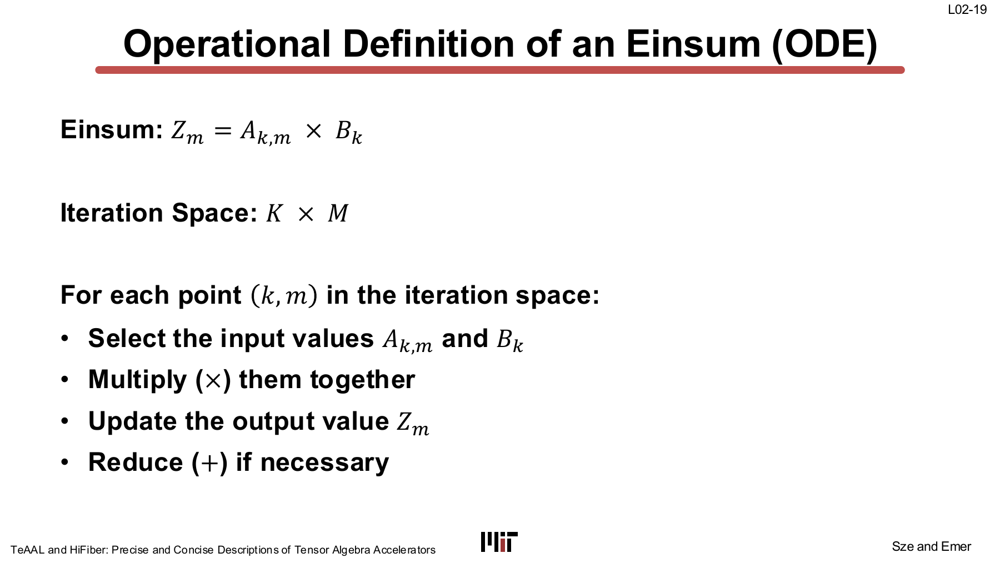

The work at each point is fixed.

1. Select \(A_{k,m}\) and \(B_k\)
2. Multiply the two values
3. Update \(Z_m\)
4. Reduce by addition because multiple \(k\) values contribute to the same \(m\)

Every point in the iteration space must be visited. The expression does not say whether to traverse \(k\) or \(m\) first, how many points to group into a tile, or which rank to distribute across PEs.

Keeping the distinction between the Einsum as the algorithm and the mapping as its execution order makes the later dataflows easier to follow.

## Workload Analysis

### Operation Count

Each of the \(K \times M\) points performs one multiplication, so

$$
N_{\text{mul}} = KM.
$$

Each output \(Z_m\) is the sum of \(K\) products. The exact number of additions is

$$
N_{\text{add}} = (K-1)M.
$$

The first product initializes an empty partial sum, while the remaining \(K-1\) products require additions.

These counts do not depend on processing order. Unless an algorithmic optimization such as zero skipping is applied to dense inputs, no mapping can avoid the \(KM\) useful multiplications.

### Best-case Memory Traffic

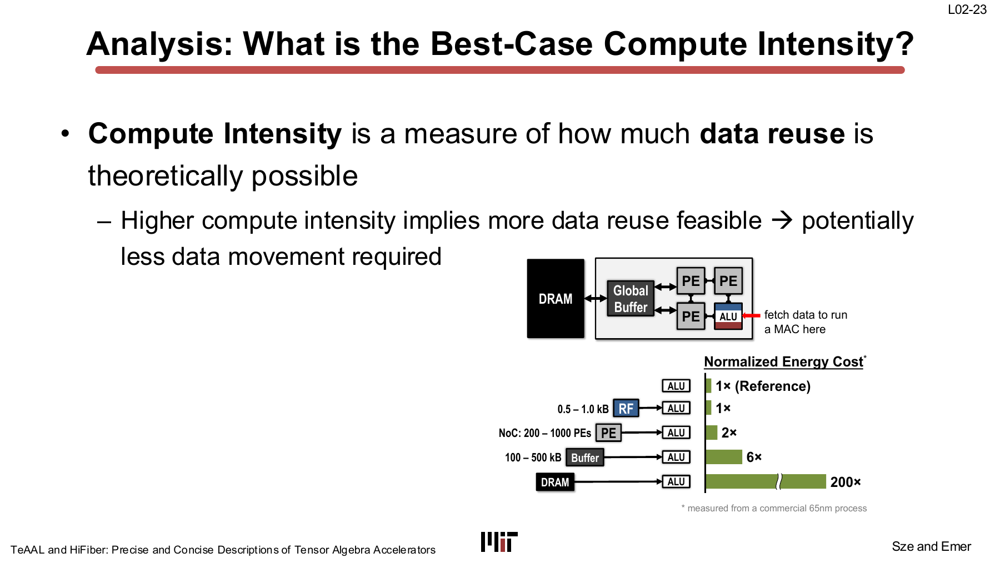

The lecture defines compute intensity in units of `multiplications/value`:

$$
\text{CI} =
\frac{\text{number of multiplications}}
{\text{number of values moved}}.
$$

The conventional Roofline model uses FLOPs/byte. The lecture's definition temporarily removes differences caused by whether a MAC counts as one or two operations and whether each value is FP32 or INT8. This makes workload reuse easier to isolate.

If every tensor element moves from DRAM only the minimum number of times required, the traffic is

- \(A\): \(KM\) value loads
- \(B\): \(K\) value loads
- \(Z\): \(M\) value stores

$$
T_{\text{best}} = KM + K + M
$$

and

$$
\text{CI}_{\text{best}} =
\frac{KM}{KM+K+M}.
$$

Each \(A_{k,m}\) is unique to one iteration point, so it has no reuse in this expression. Each \(B_k\) is reused \(M\) times across all \(m\). Each \(Z_m\) has to remain in local storage until the reduction over all \(k\) is complete.

The best case assumes that all of this reuse can be retained. It is a workload-level upper bound that does not yet account for register count or processing order.

## Mapping and Data Reuse

The iteration space can be traversed in several directions. The most direct loop nest places \(k\) outside.

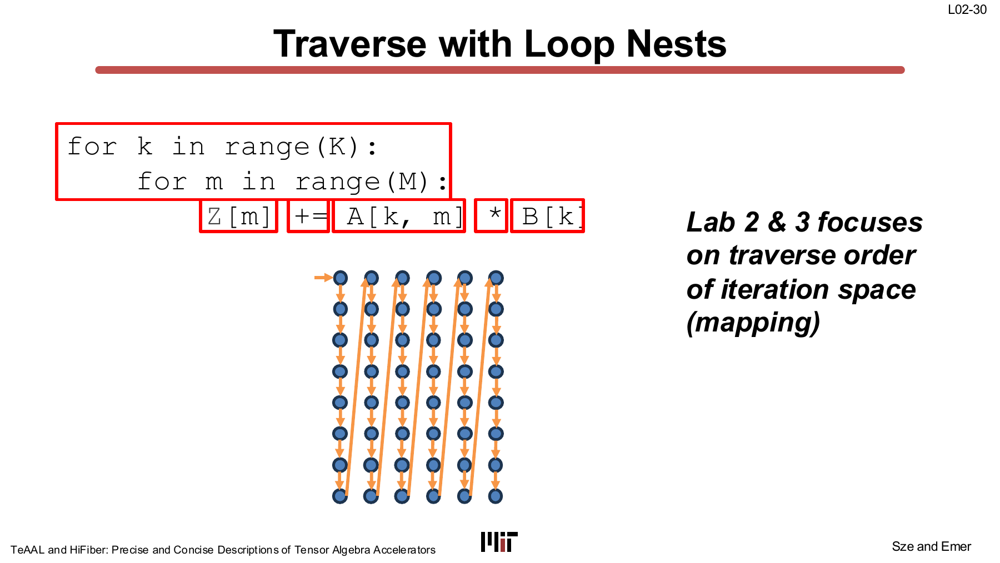

```python
for k in range(K):
    for m in range(M):
        Z[m] += A[k, m] * B[k]
```

The simple architecture has only one register. Making its loads and stores explicit gives

```python
for k in range(K):
    b_reg = B[k]
    for m in range(M):
        a_reg = A[k, m]
        z_reg = Z[m]
        z_reg += a_reg * b_reg
        Z[m] = z_reg
```

\(B_k\) is loaded once when the outer loop advances, then used \(M\) times by the inner \(m\) loop. \(B\) is stationary. In contrast, \(Z_m\) returns to DRAM after the update for the current \(k\). A single register cannot carry all \(M\) partial sums forward to the next \(k\).

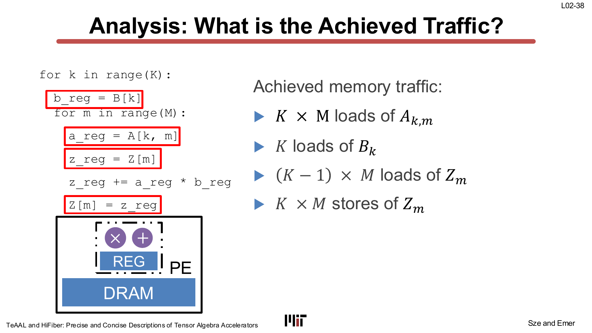

The traffic for this mapping is

$$
\begin{aligned}
A\text{ loads} &= KM \\
B\text{ loads} &= K \\
Z\text{ loads} &= (K-1)M \\
Z\text{ stores} &= KM.
\end{aligned}
$$

For the first \(k\), \(Z\) starts at zero and does not need to be loaded. This is why the number of \(Z\) loads is \((K-1)M\), not \(KM\).

$$
T_{\text{achieved}} = 3KM-M+K
$$

and

$$
\text{CI}_{\text{achieved}} =
\frac{KM}{3KM-M+K}.
$$

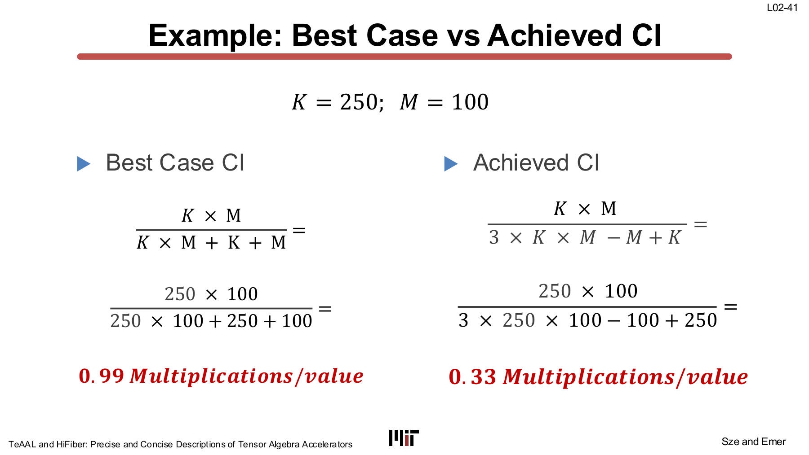

For \(K=250\) and \(M=100\),

$$
\text{CI}_{\text{best}} =
\frac{250 \times 100}
{250 \times 100 + 250 + 100}
\approx 0.99,
$$

while

$$
\text{CI}_{\text{achieved}} =
\frac{250 \times 100}
{3(250 \times 100)-100+250}
\approx 0.33.
$$

Both perform 25,000 multiplications. The difference comes from repeatedly writing the \(Z\) partial sums to DRAM and loading them back.

Reversing the loops and placing \(m\) outside keeps \(Z_m\) in a register.

```python
for m in range(M):
    z_reg = 0
    for k in range(K):
        z_reg += A[k, m] * B[k]
    Z[m] = z_reg
```

This mapping is close to output-stationary. Without a cache or separate buffer, however, it reads \(B_k\) again for every \(m\). One small register cannot preserve reuse of both \(B\) and \(Z\) at the same time.

Preserving both requires more storage. Several \(Z\) tiles can reside in a local buffer, a \(B\) tile can be multicast to several PEs, or \(K\) and \(M\) can be blocked to create a region where the two kinds of reuse overlap. Mapping is not merely loop reordering. It selects the reuse that the architecture's storage and network can support.

## Roofline Model

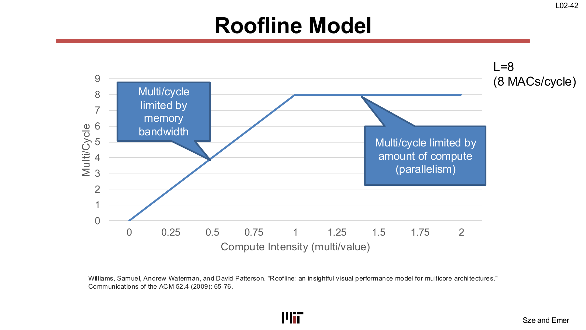

Roofline expresses the throughput ceiling as the smaller of two terms:

$$
\text{Throughput}
\le
\min(P_{\text{peak}}, BW \times \text{CI}).
$$

- \(P_{\text{peak}}\): maximum throughput of the compute hardware
- \(BW\): memory bandwidth
- \(\text{CI}\): multiplications performed per value moved

At low CI, \(BW \times \text{CI}\) is the limiting term. This is the sloped, memory-bound region of the graph. Once CI is high enough to reach the horizontal line at \(P_{\text{peak}}\), the implementation becomes compute-bound.

The compute roof in the slide's example is 8 MACs/cycle. Increasing the lane count from 8 to 16 does not improve the current throughput of a memory-bound point; it only raises the horizontal roof. Increasing reuse so that CI moves from 0.33 to 0.99, on the other hand, raises throughput at the same bandwidth.

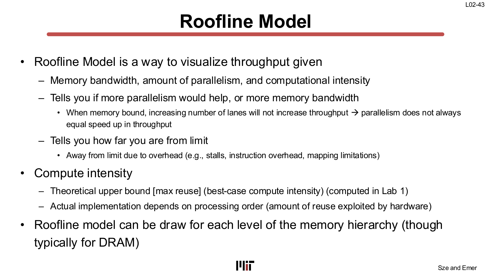

Roofline answers three questions.

1. Is the current implementation limited by compute or memory?
2. Should parallelism or bandwidth be increased?
3. How far is the current point from the applicable roof?

A point well below the roof indicates losses beyond peak compute and memory bandwidth. Possible causes include pipeline stalls, instruction overhead, mapping limitations, and load imbalance.

This completes the design loop in the first half of the lecture: calculate the workload's best-case CI, calculate the mapping's achieved CI, and locate the bottleneck on the Roofline chart. Change the architecture or mapping, then repeat the same analysis.

## CNN Workload Overview

CNNs are used not only for image classification but also for speech spectrograms, medical imaging, and game play. Although their inputs differ, they share the structure of scanning for local patterns with filters and building a hierarchy of features.

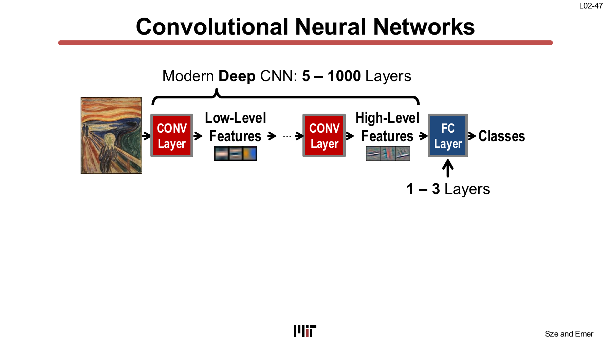

Early convolution layers detect low-level features such as edges and textures. In deeper layers, multiple pixels and features from preceding layers combine into representations closer to object parts or classes. Modern CNNs range from tens to hundreds of layers, with some approaching 1,000 layers.

The basic block applies an activation after convolution. The activation is a nonlinear function such as ReLU. A fully connected layer similarly applies an activation after a linear operation. Normalization and pooling may appear between these blocks.

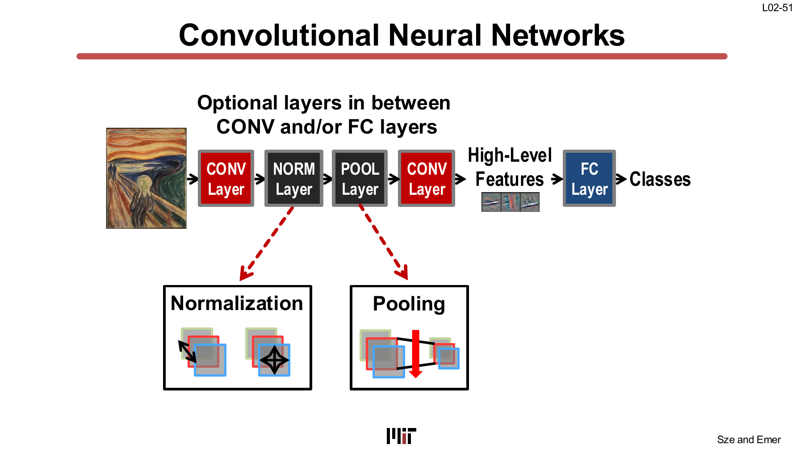

- **Convolution**: a weighted sum over a local receptive field
- **Activation**: an element-wise nonlinearity
- **Normalization**: adjustment of the activation distribution or scales across channels
- **Pooling**: spatial downsampling and local aggregation
- **Fully connected**: dense connections between every input activation and output neuron

In classical deep CNNs, convolution often accounts for more than 90% of all operations.

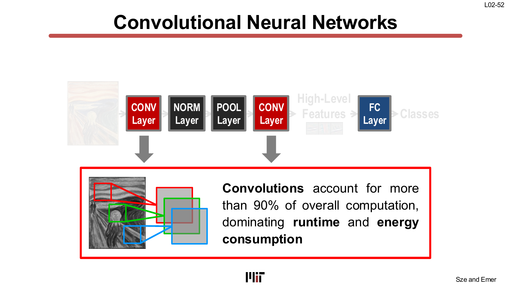

Pooling and activation still have to run, but CONV dominates multiplication count, runtime, and energy. This is why L02 spends much more time on convolution than on the other layers.

## 2D Convolution

### Element-wise Product and Partial Sum

In the smallest case, there is one input feature map and one filter. The input is \(H \times W\), and the filter is \(R \times S\).

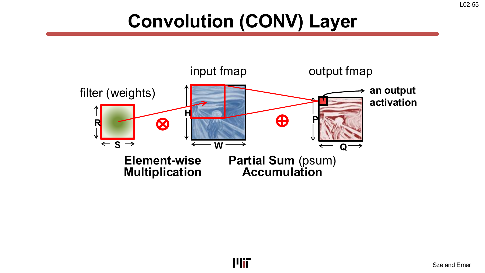

Place the filter over one input position and multiply corresponding elements. Summing the \(RS\) products produces one output activation. The intermediate value being accumulated is the partial sum, usually written as `psum`.

Moving the filter window horizontally and vertically fills the output feature map. The \(R \times S\) region covered by the filter is that output activation's receptive field.

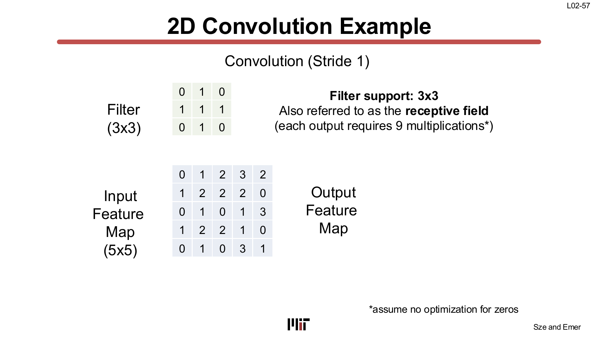

The slide example uses a 5×5 input and a 3×3 filter. With stride 1 and padding 0, the output is 3×3.

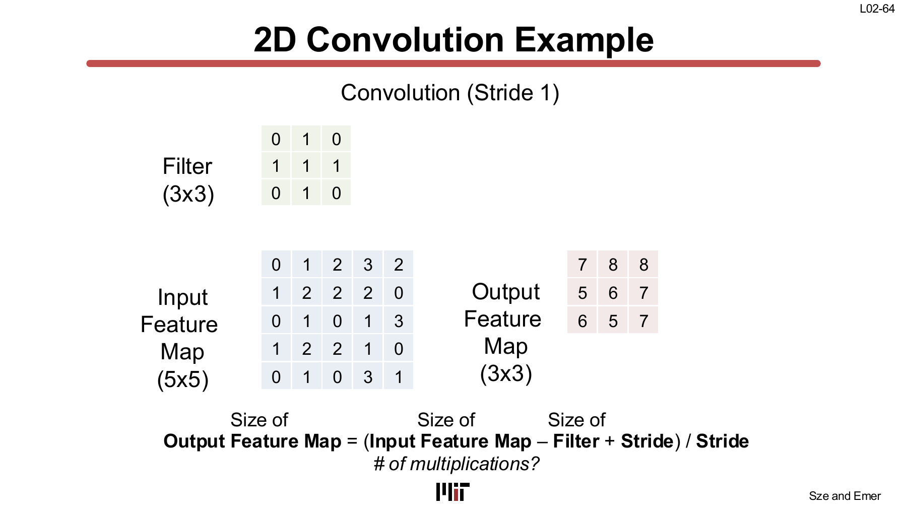

The output shape is

$$
P =
\left\lfloor
\frac{H-R}{U}
\right\rfloor + 1,
\qquad
Q =
\left\lfloor
\frac{W-S}{U}
\right\rfloor + 1,
$$

where \(U\) is the stride.

Each output point uses \(RS=9\) multiplications, and there are \(PQ=9\) output points. The total number of multiplications is therefore

$$
PQRS = 3 \times 3 \times 3 \times 3 = 81.
$$

Zeros in the filter still count as multiplications unless the hardware supports sparse zero skipping.

Slides L02-58 through L02-63 animate the window moving one position at a time to fill the 3×3 output. The completed L02-64 image above is the result of those six frames.

### Stride

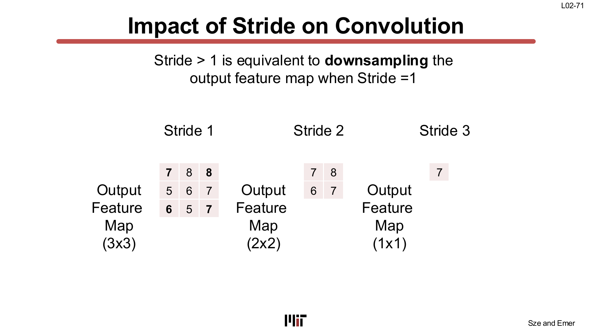

Stride is the number of positions by which the filter window moves at each step.

- \(U=1\): 3×3 output, 81 multiplications
- \(U=2\): 2×2 output, 36 multiplications
- \(U=3\): 1×1 output, 9 multiplications

The stride-2 and stride-3 results are equivalent to sampling the stride-1 output every two and three positions, respectively. Slides L02-65 through L02-70 animate these window movements.

A larger stride reduces the number of output activations and the amount of computation, but it also samples spatial information more coarsely. From the hardware perspective, the smaller \(P,Q\) change both the iteration space and the input reuse pattern.

### Zero Padding

Without padding, each convolution reduces the spatial dimensions.

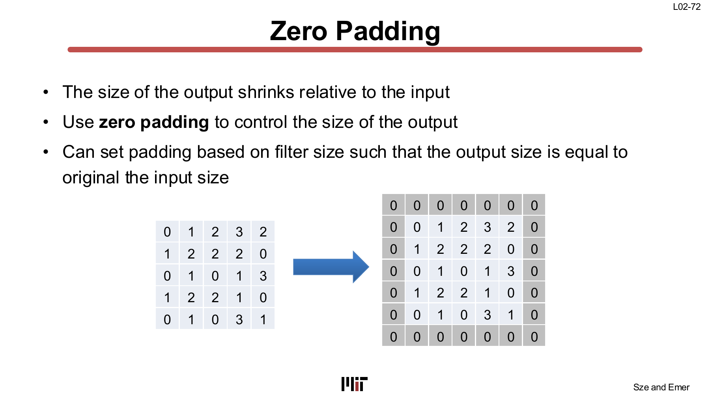

Adding \(D\) positions of zero padding around the input gives the output shape

$$
P =
\left\lfloor
\frac{H+2D-R}{U}
\right\rfloor + 1,
\qquad
Q =
\left\lfloor
\frac{W+2D-S}{U}
\right\rfloor + 1.
$$

With a 3×3 filter, stride 1, and \(D=1\), the input and output have the same \(H,W\). PyTorch's `Conv2d` defaults to padding 0. An integer applies the same padding on all sides, while a tuple specifies the height and width directions separately.

A dense implementation may read and compute padded zeros just like ordinary input values. Handling the boundary separately or generating zeros implicitly can avoid that memory traffic at the cost of more complex control.

### Receptive Field

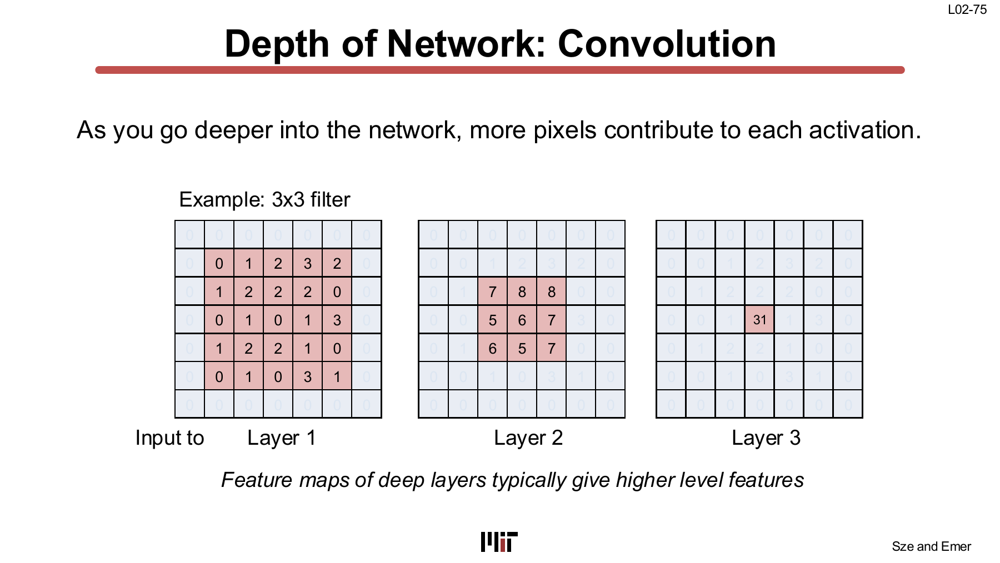

As the network grows deeper, each output activation depends on a larger region of the original input. With only 3×3 filters, stride 1, and dilation 1, the receptive-field width grows by two per layer:

$$
r_L = 1 + 2L.
$$

Layer 1 sees a 3×3 region, layer 2 sees 5×5, and layer 3 sees 7×7. With stride or dilation, the increment must also account for the sampling jump inherited from preceding layers.

This is the spatial basis for the usual explanation that CNNs progress from low-level to high-level features. For an accelerator, it also creates opportunities to reuse one input activation across neighboring outputs and multiple layers.

Operations called `convolution` in deep learning libraries are usually cross-correlations that do not flip the filter. The slide's index expression and naive loop follow this convention. A learned filter makes the distinction irrelevant to model behavior, but it matters when comparing the code with the signal-processing definition of convolution.

## Multi-channel Convolution

### Tensor Shapes

A real CNN input is not a single feature map. Even an RGB image has three channels, and intermediate layers can have tens to thousands of channels.

To produce one output channel, a filter spans all \(C\) input channels. If there are \(M\) output channels, there are \(M\) such filters.

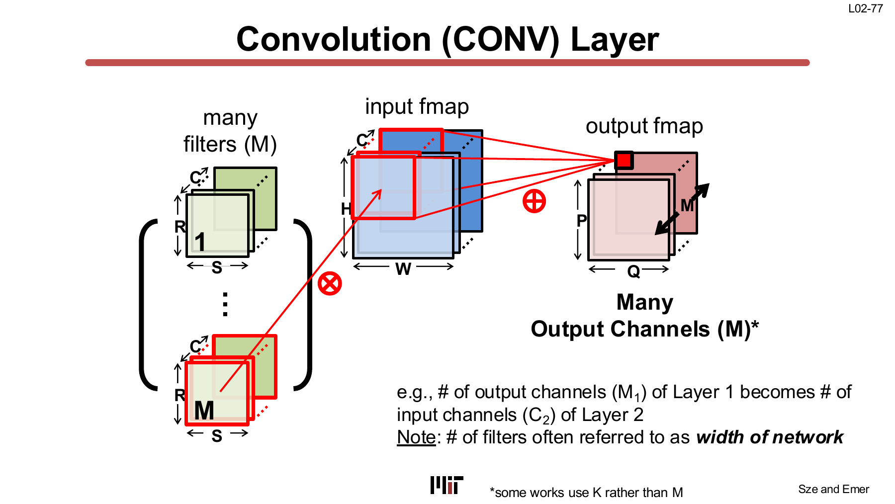

Adding a batch applies the same filter set to \(N\) input feature maps.

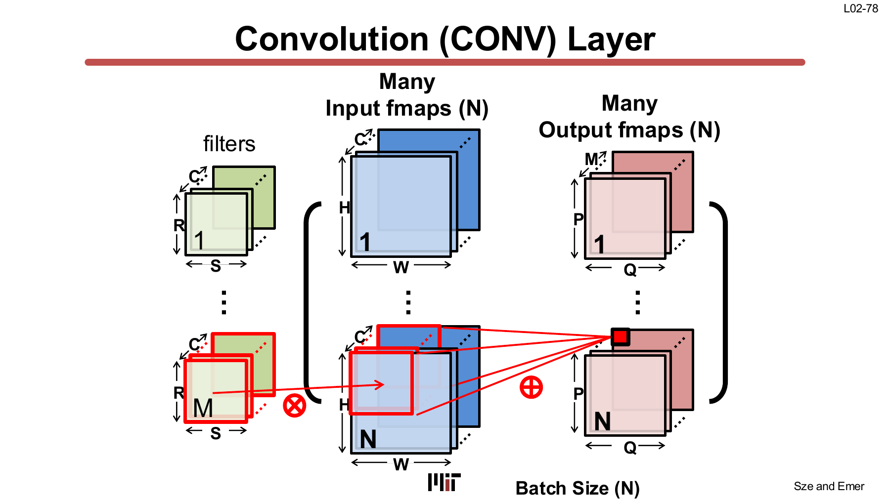

The lecture uses the following symbols.

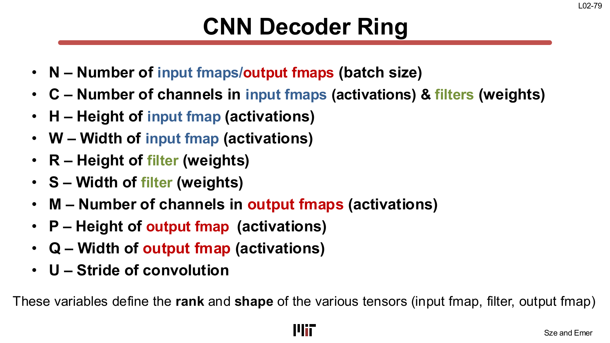

| Symbol | Rank shape |
| --- | --- |
| \(N\) | Batch size |
| \(C\) | Input channels |
| \(H,W\) | Input height, width |
| \(R,S\) | Filter height, width |
| \(M\) | Output channels, number of filters |
| \(P,Q\) | Output height, width |
| \(U\) | Stride |

Grouped into tensor shapes, these are

$$
I[N,C,H,W],
$$

$$
F[M,C,R,S],
$$

$$
O[N,M,P,Q],
$$

and

$$
B[M].
$$

\(I\) contains the input activations, \(F\) the filter weights, \(O\) the output activations, and \(B\) one bias value for each output channel.

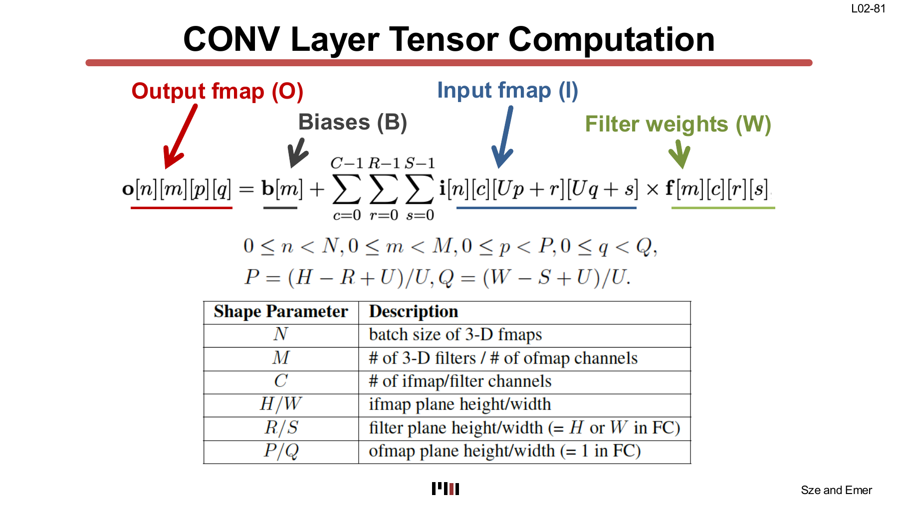

The weight size is \(MCRS\), the input-activation size is \(NCHW\), and the output-activation size is \(NMPQ\). In addition to computation, these three quantities determine the capacity required at each memory level.

### Convolution Einsum

The complete convolution can be written in one expression:

$$
O_{n,m,p,q} =
B_m +
I_{n,c,Up+r,Uq+s}
F_{m,c,r,s}.
$$

The \(n,m,p,q\) ranks remain in the output, while \(c,r,s\) are reduced. Stride and the sliding window appear in the input's spatial coordinates, \(Up+r,Uq+s\), rather than simply \(p,q\).

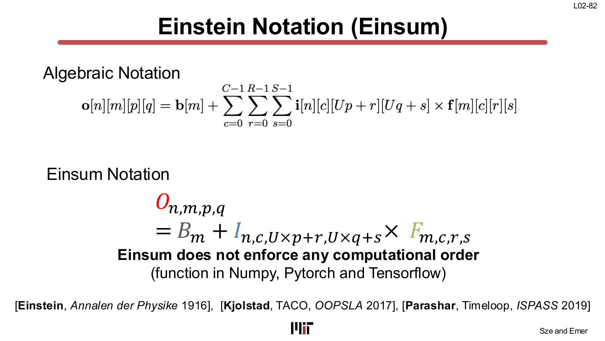

The multiplication count equals the size of the iteration space:

$$
N_{\text{mul}} = NMPQCRS.
$$

Each output reduces \(CRS\) products, and there are \(NMPQ\) outputs.

The reuse direction of each tensor can also be read from the expression.

- Filter \(F_{m,c,r,s}\): reused along \(n,p,q\)
- Input \(I_{n,c,Up+r,Uq+s}\): reused across multiple \(m\) values and overlapping windows
- Output \(O_{n,m,p,q}\): reused as a partial sum during the \(c,r,s\) reduction
- Bias \(B_m\): reused across all \(n,p,q\)

The dataflow determines which kinds of reuse are preserved in local registers and buffers.

### Seven-loop Implementation

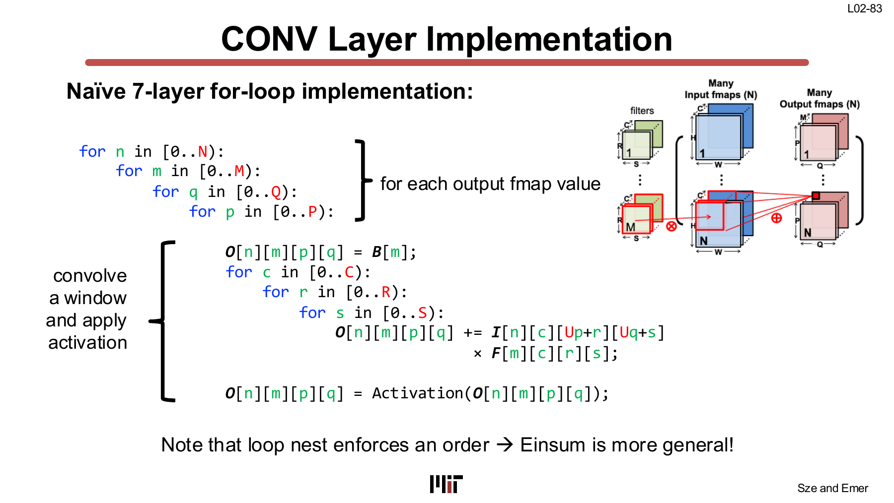

```python
for n in range(N):
    for m in range(M):
        for q in range(Q):
            for p in range(P):
                O[n, m, p, q] = B[m]
                for c in range(C):
                    for r in range(R):
                        for s in range(S):
                            O[n, m, p, q] += (
                                I[n, c, U*p+r, U*q+s]
                                * F[m, c, r, s]
                            )
                O[n, m, p, q] = activation(O[n, m, p, q])
```

This loop enforces the order \(s \rightarrow r \rightarrow c \rightarrow p \rightarrow q \rightarrow m \rightarrow n\). \(O\) remains stationary through the inner \(c,r,s\) loops, which makes it easy to reduce partial-sum traffic. Without a cache or explicit tiling, however, it misses the longer-range reuse of filters and inputs.

The Einsum imposes none of this order. The mapping stage can apply loop interchange, tiling, and spatial unrolling. This is where weight-stationary, output-stationary, and row-stationary dataflows diverge from the same CONV expression.

## Fully Connected Layer

### Connectivity

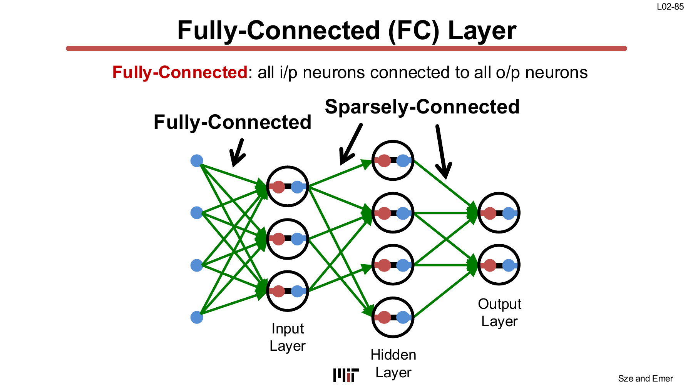

In a fully connected layer, a weight connects every input neuron to every output neuron. With \(K\) inputs and \(M\) outputs, the layer has \(MK\) weights.

The sparsely connected variant in the figure retains only some of the edges. A pruned FC layer can take this form. Its actual benefit must include the indexing and control costs of storing sparse weights and skipping zeros.

### FC as Convolution

From the CONV perspective, FC is the case in which a filter covers the entire input feature map.

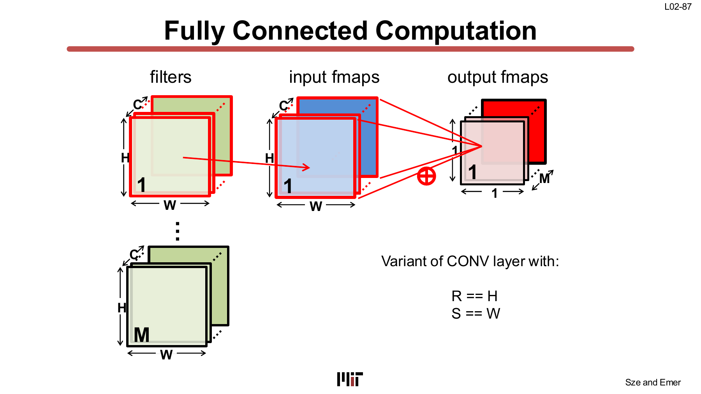

$$
R=H,\qquad S=W,\qquad P=Q=1.
$$

For a batch size of one, the expression becomes

$$
O_m = I_{c,h,w} F_{m,c,h,w}.
$$

All of \(c,h,w\) are reduction ranks. Each output \(m\) is the dot product of the entire input feature map and its corresponding filter.

### Flattening

The three ranks \(C,H,W\) can be flattened into one \(CHW\) rank.

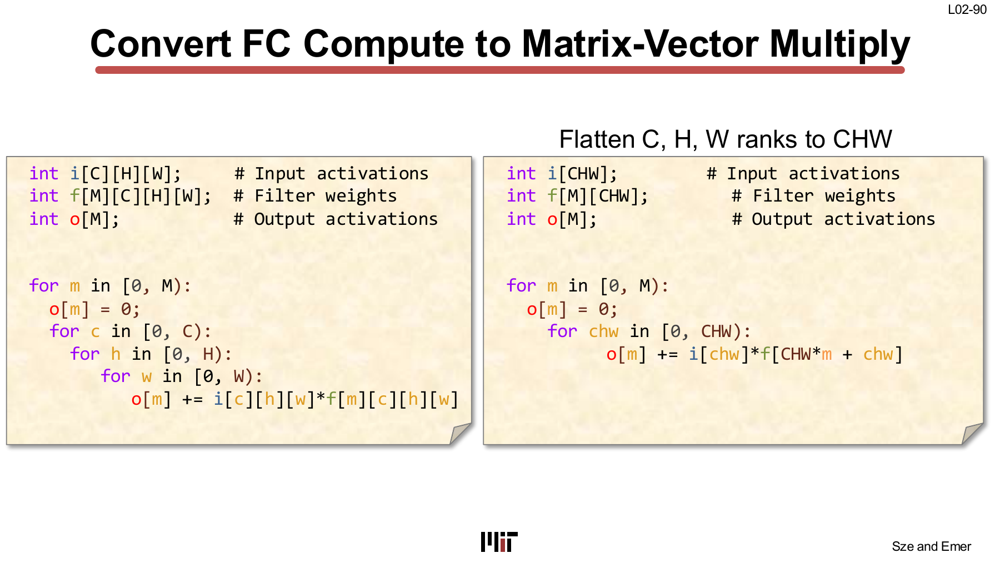

For a row-major layout, the coordinate transformation is

$$
chw = H W c + W h + w.
$$

Thus

$$
I_{c,h,w} \rightarrow I_{chw}
$$

and

$$
F_{m,c,h,w} \rightarrow F_{m,chw}.
$$

The FC Einsum becomes

$$
O_m = I_{chw} F_{m,chw}.
$$

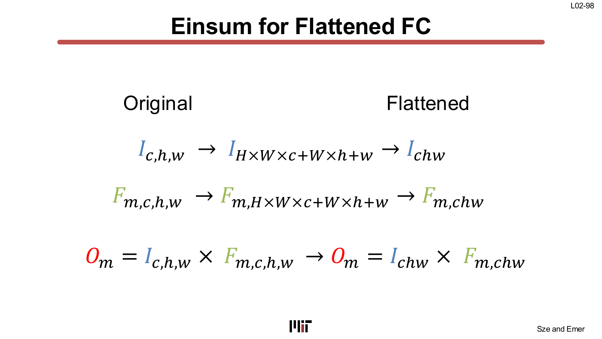

Flattening does not change the operation count. It reindexes three nested reduction loops as one linear loop. If the memory layout matches this flattening order, accesses are contiguous; otherwise a transpose or strided accesses are required.

### GEMV and GEMM

An FC layer with a batch size of one is a matrix-vector multiplication:

$$
\underbrace{F[M,CHW]}_{\text{matrix}}
\times
\underbrace{I[CHW]}_{\text{vector}} =
\underbrace{O[M]}_{\text{vector}}.
$$

Slides L02-92 through L02-97 animate the partial sum as \(chw\) advances, then change \(m\) to compute the next output.

With a batch of \(N\), an \(n\) rank is added to the input and output:

$$
O_{n,m} = I_{n,chw} F_{m,chw}.
$$

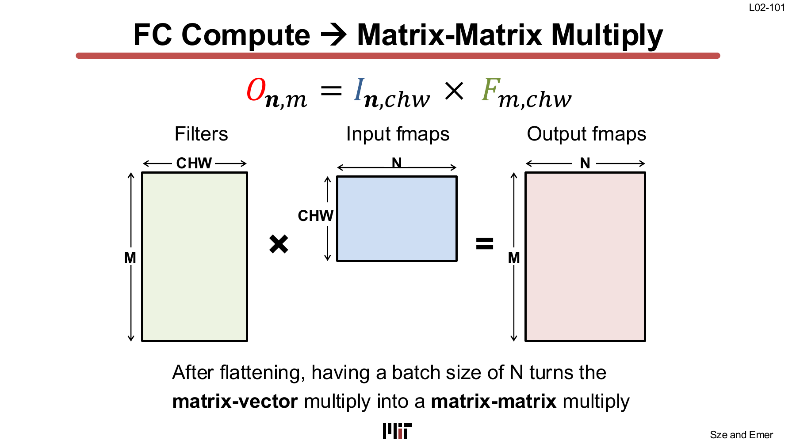

This is now matrix-matrix multiplication:

$$
F[M,K] \times I[K,N] = O[M,N],
$$

where \(K=CHW\).

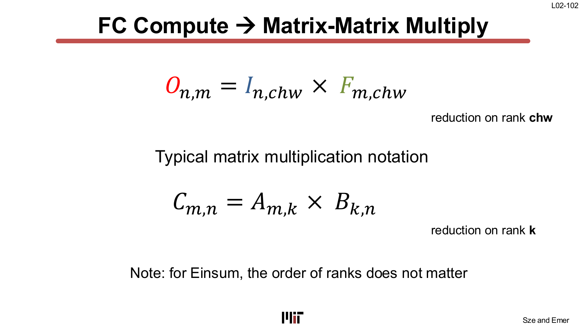

The lecture writes the FC expression as \(O_{n,m}\), while conventional matrix multiplication writes \(C_{m,n}=A_{m,k}B_{k,n}\), so the rank orders look different. In an Einsum, the computational relationship is unchanged as long as matching rank names connect and the reduction rank agrees. Which of \(N\) and \(M\) is contiguous in the physical memory layout is a separate question.

Batch size also affects hardware efficiency. GEMV reads a weight matrix, applies it to one vector, and finishes, so it has little weight reuse and is often memory-bound. GEMM can reuse the same weight tile across \(N\) inputs and therefore reaches higher compute intensity.

CONV can likewise be transformed into GEMM by expanding its input windows with `im2col`. Materializing a large im2col matrix increases the memory footprint because activations are duplicated. This is why high-performance libraries use implicit GEMM or dedicated convolution kernels.

## Slide Coverage

| Slides | Content |
| --- | --- |
| L02-1 ~ 3 | Lecture scope and workload-to-hardware framing |
| L02-4 ~ 8 | Design methodology, architecture/workload separation, TeAAL concerns |
| L02-9 ~ 14 | Tensor rank, shape, size, matrix multiplication, and Einsum |
| L02-15 ~ 20 | Matrix-vector ODE, iteration space, and reduction |
| L02-21 ~ 26 | Operation count, best-case traffic, and CI |
| L02-27 ~ 41 | Loop traversal, stationarity, achieved traffic, and CI |
| L02-42 ~ 44 | Roofline, implementation comparison, and optimization loop |
| L02-45 ~ 52 | CNN applications, depth, and CONV/FC/NORM/POOL |
| L02-53 ~ 64 | 2D convolution and stride-1 animation |
| L02-65 ~ 71 | Stride-2/3 animation and downsampling |
| L02-72 ~ 75 | Zero padding, PyTorch convention, and receptive field |
| L02-76 ~ 83 | Channel and batch tensors, decoder ring, CONV Einsum, and seven-loop nest |
| L02-84 ~ 91 | FC connectivity, CONV interpretation, and flattening |
| L02-92 ~ 99 | GEMV partial-sum animation and flattened FC Einsum |
| L02-100 ~ 102 | Batched FC, GEMM, and conventional matmul notation |

## References

- [MIT 6.5930/1 Spring 2026 L02 slides](https://csg.csail.mit.edu/6.5930/lectures/L02-Overview_on_DNN_components.pdf)
- [TeAAL: A Declarative Framework for Modeling Sparse Tensor Accelerators, MICRO 2023](https://people.csail.mit.edu/emer/media/papers/2023.10.micro.teaal.pdf)
- [TeAAL and HiFiber tutorial](https://teaal.csail.mit.edu/tutorials/2024.micro-teaal/index.html)
- [Roofline: An Insightful Visual Performance Model for Multicore Architectures](https://doi.org/10.1145/1498765.1498785)
- [Efficient Processing of Deep Neural Networks, Sze et al.](https://doi.org/10.1007/978-3-031-01766-7)
