> 기준 자료: MIT 6.5930/1 Spring 2026, [L02 - Overview of Deep Neural Network Components](https://csg.csail.mit.edu/6.5930/lectures/L02-Overview_on_DNN_components.pdf)

L01은 data movement가 비싸다는 얘기까지 갔다. L02에서는 그 말을 실제 숫자로 바꾼다. Matrix-vector multiply 하나를 잡고 연산 수, 최소 memory traffic, 특정 loop order에서 발생하는 traffic을 차례로 계산한다. Best-case compute intensity는 0.99인데 간단한 구현은 0.33밖에 못 얻는다. 같은 식을 계산하면서 데이터를 세 배 가까이 옮긴 셈이다.

강의 후반은 CNN과 fully connected layer를 다룬다. 일반적인 딥러닝 입문처럼 모델 정확도나 학습법을 설명하려는 구간은 아니다. Layer를 tensor 식으로 쓰고, rank와 shape를 붙이고, 마지막에는 7중 loop와 matrix multiplication으로 내린다. 앞으로 accelerator mapping을 이야기하려면 workload가 먼저 이 모양이어야 한다.

PDF는 102장이지만 화면의 점이나 partial sum이 한 단계씩 진행되는 animation frame이 많이 포함돼 있다. 그런 연속 프레임은 완성된 한 장으로 묶었다. 개념 범위는 L02-1부터 L02-102까지 전부 따라간다.

## Accelerator Design Methodology

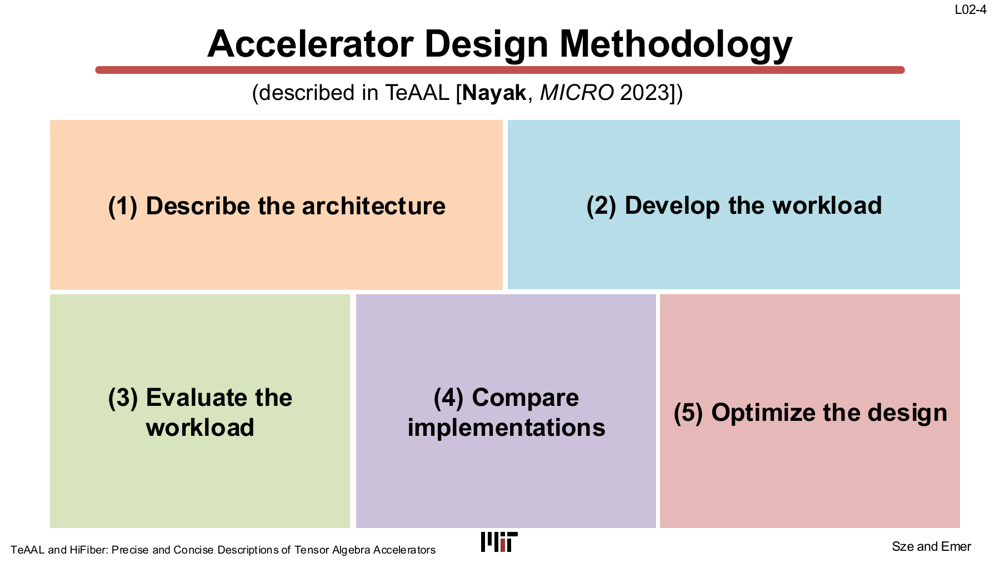

TeAAL이 제시하는 설계 절차는 다섯 단계다.

1. Architecture description
2. Workload development
3. Workload evaluation
4. Implementation comparison
5. Design optimization

순서가 평범해 보이지만, 2번과 3번 사이에 이 수업의 대부분이 들어간다. `matrix multiplication을 처리한다`는 설명만으로는 traffic도 throughput도 계산할 수 없다. Tensor를 어떤 순서로 순회하는지, 어디에 보관하는지, 어떤 PE가 어느 iteration을 맡는지까지 정해야 hardware 동작이 생긴다.

강의는 일부러 아주 작은 architecture부터 시작한다.

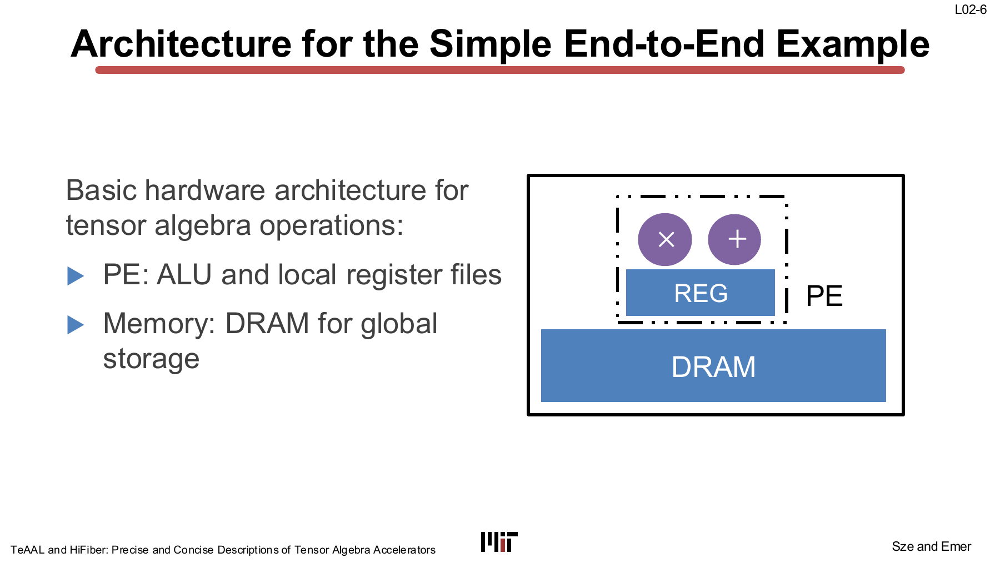
*ALU와 local register를 가진 PE 하나, global storage인 DRAM 하나.*

PE에는 multiplier, adder, register가 있고 바깥에 DRAM이 있다. Cache도 global buffer도 NoC도 없다. 현실적인 accelerator라기보다 mapping 하나가 traffic에 미치는 영향을 숨김없이 보기 위한 최소 모델이다.

Architecture를 정한 뒤 workload 쪽에는 네 종류의 specification이 붙는다.

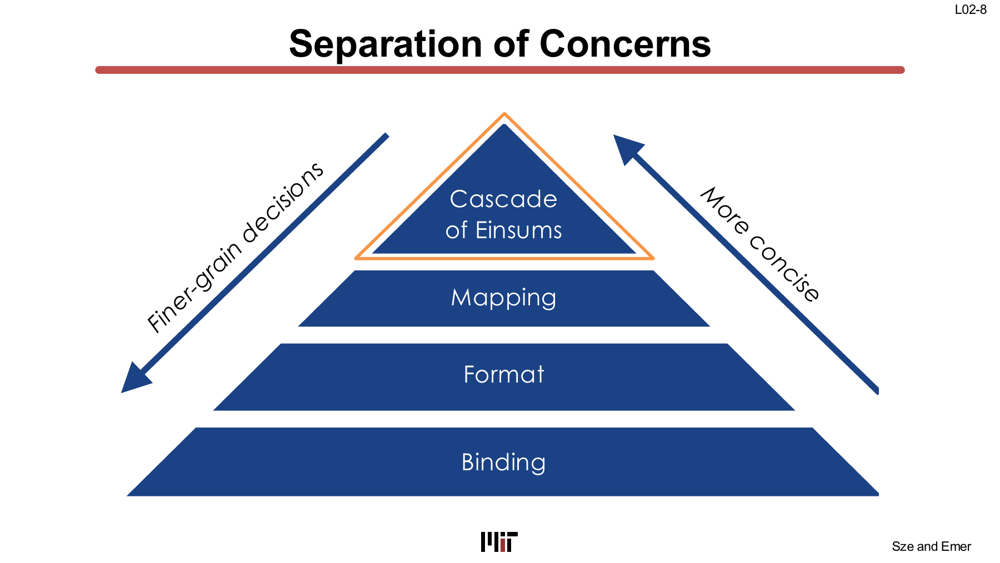

- **Cascade of Einsums**: 어떤 tensor 연산들을 어떤 의존관계로 실행하는가
- **Mapping**: iteration space를 어떤 순서로 순회하고 어떻게 tile·parallelize하는가
- **Format**: dense, CSR, COO 같은 어떤 표현으로 tensor를 저장하는가
- **Binding**: 계산과 데이터를 실제 PE, register, buffer, network 어디에 할당하는가

위로 갈수록 설명이 짧고, 아래로 갈수록 구현 결정이 많다. Einsum은 계산 내용만 정한다. Loop order나 dataflow는 아직 없다.

평가 단계에서는 compute count, memory traffic, compute intensity를 뽑는다. 다른 구현과 비교할 때는 PE 수, storage 용량, bitwidth 같은 hardware 조건을 맞춰야 한다. 그다음 병목이 있는 specification만 바꾸고 다시 평가한다. TeAAL이 노리는 것도 이 반복 작업이다. 완성된 accelerator 그림을 통째로 비교하지 않고, 차이가 compute·mapping·format·binding 중 어디서 생겼는지 분리한다.

## Tensor Terminology

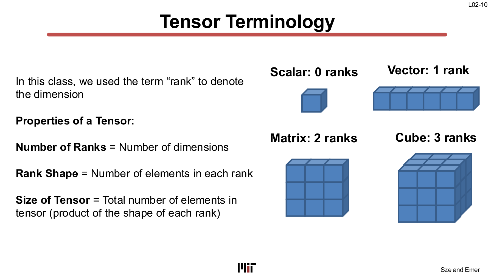

Tensor는 다차원 배열이다. Scalar는 0차원, vector는 1차원, matrix는 2차원, cube는 3차원이다.

이 수업은 dimension을 `rank`라고 부른다. 선형대수의 matrix rank와는 다른 용법이다.

- **Number of ranks**: dimension 개수
- **Rank shape**: 각 dimension의 원소 수
- **Tensor shape**: rank shape를 순서대로 적은 목록
- **Tensor size**: 모든 rank shape의 곱, 즉 전체 원소 수

예를 들어 \(B[N,K]\)는 rank-2 tensor다. Rank 이름은 \(N,K\), shape는 \([N,K]\), size는 \(NK\)다. Rank 이름은 단순한 숫자 위치보다 의미를 더 많이 담는다. \(N\)은 batch, \(C\)는 input channel처럼 workload 안에서 역할을 가진다.

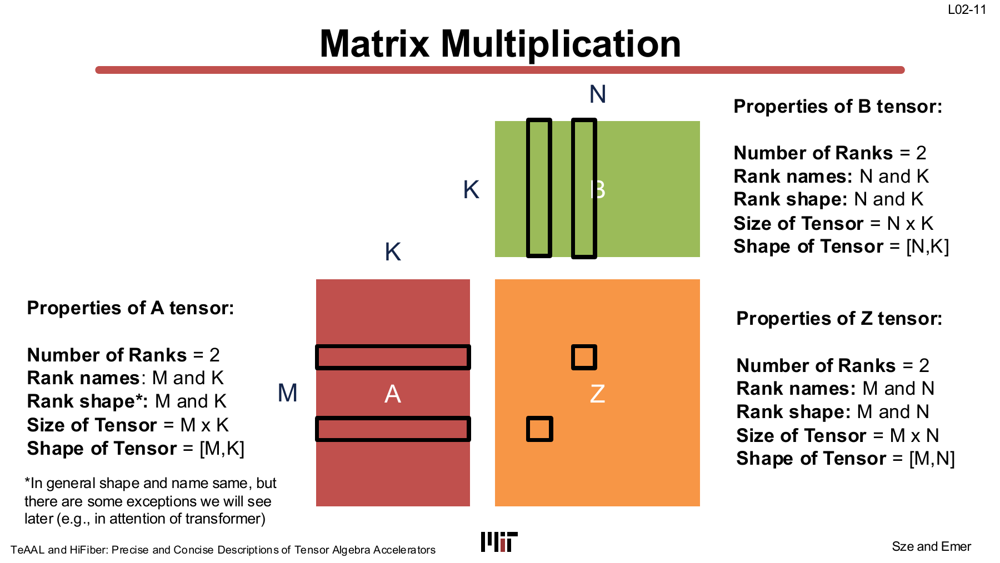

강의의 matrix multiplication 그림은 tensor shape를 \(A[M,K]\), \(B[N,K]\), \(Z[M,N]\)로 적는다. 이어지는 Einsum에서는 \(k\)를 reduction rank로 앞에 써서 다음처럼 표현한다.

$$
Z_{m,n} = \sum_k A_{k,m} B_{k,n}
$$

\(K\)는 두 input이 공유하고 reduction되는 rank다. \(M,N\)은 output에 남는다. 여기서 Einsum의 아래첨자 나열을 곧바로 physical memory layout으로 읽으면 안 된다. Einsum에서는 같은 rank 이름이 contraction 관계를 정하고, 실제 rank 순서와 저장 형식은 format·mapping에서 따로 정한다.

## Einsum and Operational Definition

Einstein summation notation은 양변의 index를 보고 reduction을 암시한다.

$$
Z_{m,n} = A_{k,m} B_{k,n}
$$

오른쪽에만 있는 \(k\)는 합쳐진다. \(\sum_k\)를 쓰지 않아도 같은 뜻이다. Matrix-vector multiply로 줄이면 식이 더 단순해진다.

$$
Z_m = A_{k,m} B_k
$$

이 한 줄에는 input tensor \(A,B\), output tensor \(Z\), point마다 실행할 multiplication과 reduction이 들어 있다. 빠진 것도 있다. **계산 순서**다.

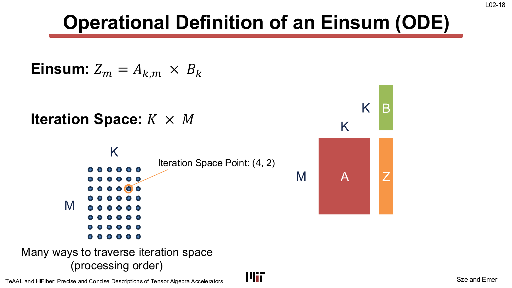

TeAAL의 Operational Definition of an Einsum은 식을 세 부분으로 읽는다.

1. Input·output tensor와 rank
2. 모든 합법적인 coordinate의 Cartesian product인 iteration space
3. 각 iteration point에서 실행하는 operation

위 matrix-vector multiply의 iteration space는 \(K \times M\)이다. \(K=8\), \(M=6\)이면 48개의 점이 생긴다. 점 \((4,2)\)는 \(A_{4,2}\)와 \(B_4\)를 곱해 \(Z_2\)에 더하는 작업 하나다.

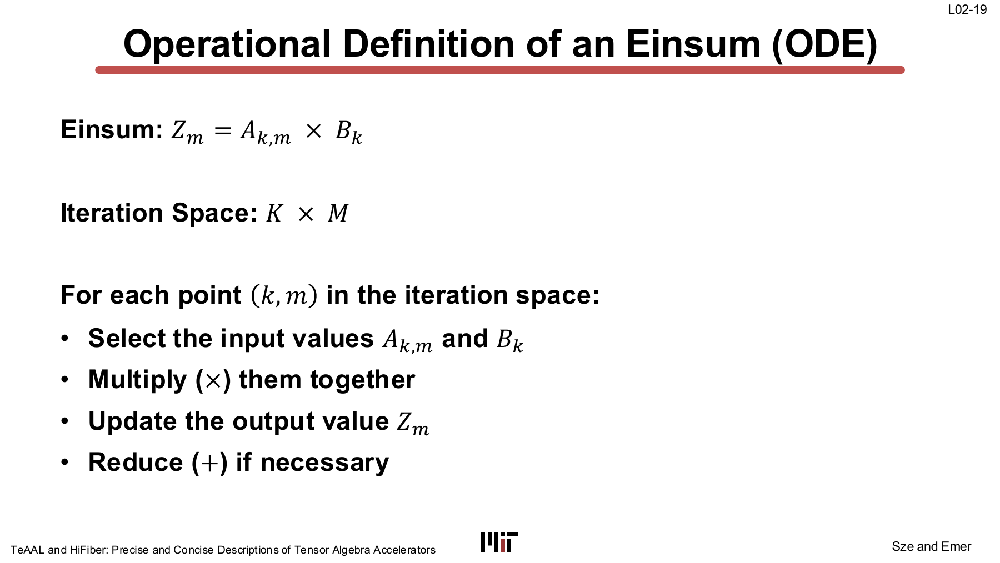

각 point에서 하는 일은 고정돼 있다.

1. \(A_{k,m}\)과 \(B_k\) 선택
2. 두 값 multiplication
3. \(Z_m\) update
4. 같은 \(m\)에 여러 \(k\)가 들어오므로 addition reduction

Iteration space의 모든 점을 방문해야 한다. 하지만 \(k\)를 먼저 훑을지 \(m\)을 먼저 훑을지, 몇 개씩 tile로 묶을지, 서로 다른 PE에 어느 rank를 펼칠지는 식에 없다.

Einsum이 algorithm이고 mapping이 execution order라는 구분을 여기서 잡아두면 뒤의 dataflow가 덜 헷갈린다.

## Workload Analysis

### Operation Count

\(K \times M\)개의 point마다 multiplication이 한 번 있으므로

$$
N_{\text{mul}} = KM
$$

이다. Output \(Z_m\) 하나는 \(K\)개 product의 합이다. 정확한 addition 수는

$$
N_{\text{add}} = (K-1)M
$$

이다. 첫 product는 빈 partial sum에 들어가고 나머지 \(K-1\)개가 addition을 만든다고 센 결과다.

이 숫자는 processing order와 무관하다. Dense input에서 zero skipping 같은 algorithmic optimization을 하지 않는 한 어느 mapping도 \(KM\)개의 유효 multiplication을 피할 수 없다.

### Best-case Memory Traffic

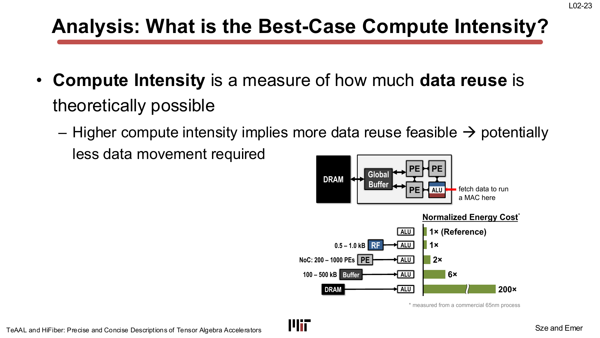

강의는 compute intensity를 `multiplications/value`로 정의한다.

$$
\text{CI} =
\frac{\text{number of multiplications}}
{\text{number of values moved}}
$$

일반적인 Roofline은 FLOPs/byte를 쓴다. 여기서는 MAC을 operation 하나로 셀지 둘로 셀지, value가 FP32인지 INT8인지에 따른 단위 차이를 잠시 없앤다. Workload reuse만 보기 좋은 정의다.

각 tensor 원소를 DRAM에서 필요한 최소 횟수만 가져온다면 traffic은 다음과 같다.

- \(A\): \(KM\) values load
- \(B\): \(K\) values load
- \(Z\): \(M\) values store

$$
T_{\text{best}} = KM + K + M
$$

$$
\text{CI}_{\text{best}} =
\frac{KM}{KM+K+M}
$$

\(A_{k,m}\)는 iteration point마다 다른 원소라 이 식 안에서 reuse가 없다. \(B_k\)는 모든 \(m\)에 걸쳐 \(M\)번 재사용된다. \(Z_m\)은 모든 \(k\)의 reduction이 끝날 때까지 local storage에 남아 있어야 한다.

Best case는 이 reuse를 전부 살릴 수 있다고 가정한다. 아직 register 수나 처리 순서를 넣지 않은 workload 상한이다.

## Mapping and Data Reuse

Iteration space는 여러 방향으로 순회할 수 있다. 가장 직접적인 loop nest는 \(k\)를 바깥에 두는 형태다.

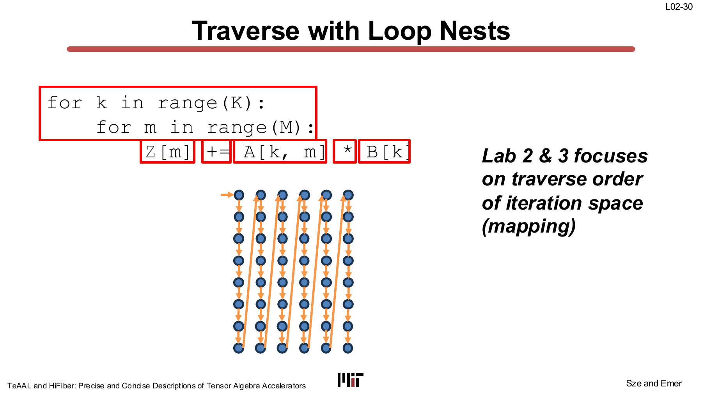

```python
for k in range(K):
    for m in range(M):
        Z[m] += A[k, m] * B[k]
```

Simple architecture에는 register 하나만 있다. 실제 load와 store를 드러내면 아래처럼 된다.

```python
for k in range(K):
    b_reg = B[k]
    for m in range(M):
        a_reg = A[k, m]
        z_reg = Z[m]
        z_reg += a_reg * b_reg
        Z[m] = z_reg
```

\(B_k\)는 outer loop가 바뀔 때 한 번 load하고 inner \(m\) loop에서 \(M\)번 쓴다. \(B\) stationary다. 반면 \(Z_m\)은 현재 \(k\)의 update가 끝나면 DRAM으로 돌아간다. Register 하나로 \(M\)개의 partial sum을 다음 \(k\)까지 들고 갈 수 없어서다.

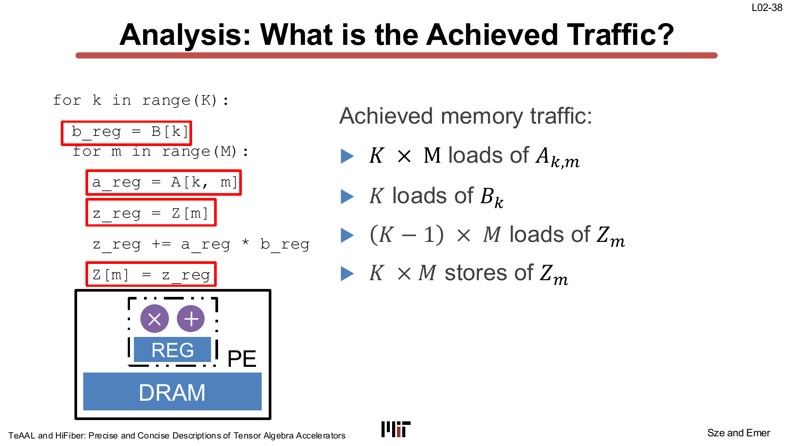

이 mapping의 traffic은 다음과 같다.

$$
\begin{aligned}
A\text{ loads} &= KM \\
B\text{ loads} &= K \\
Z\text{ loads} &= (K-1)M \\
Z\text{ stores} &= KM
\end{aligned}
$$

첫 \(k\)에서는 \(Z\)를 0으로 시작한다고 놓아 load를 생략한다. 그래서 \(Z\) load가 \(KM\)이 아니라 \((K-1)M\)이다.

$$
T_{\text{achieved}} = 3KM-M+K
$$

$$
\text{CI}_{\text{achieved}} =
\frac{KM}{3KM-M+K}
$$

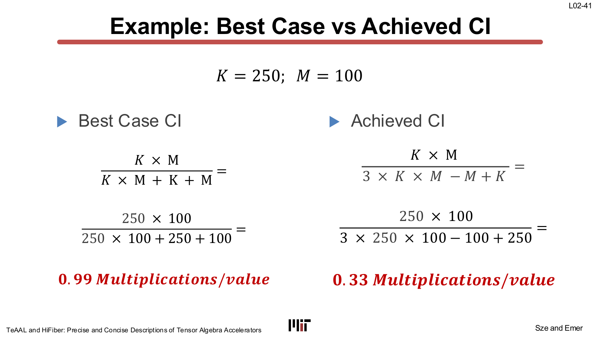

\(K=250\), \(M=100\)이면

$$
\text{CI}_{\text{best}} =
\frac{250 \times 100}
{250 \times 100 + 250 + 100}
\approx 0.99
$$

이고,

$$
\text{CI}_{\text{achieved}} =
\frac{250 \times 100}
{3(250 \times 100)-100+250}
\approx 0.33
$$

이다. 25,000번의 multiplication은 양쪽이 같다. 차이는 \(Z\) partial sum을 계속 DRAM에 내보냈다가 가져오는 traffic이다.

Loop를 바꿔 \(m\)을 outer에 두면 \(Z_m\)은 register에 유지할 수 있다.

```python
for m in range(M):
    z_reg = 0
    for k in range(K):
        z_reg += A[k, m] * B[k]
    Z[m] = z_reg
```

이번에는 output-stationary에 가깝다. 대신 cache나 별도 buffer가 없다면 \(B_k\)를 \(m\)마다 다시 읽는다. 하나의 작은 register로 \(B\) reuse와 \(Z\) reuse를 동시에 잡을 수는 없다.

둘 다 잡으려면 storage가 더 필요하다. \(Z\) tile 여러 개를 local buffer에 두거나, \(B\) tile을 여러 PE에 multicast하거나, \(K\)와 \(M\)을 block으로 나눠 두 reuse가 만나는 구간을 만든다. Mapping은 단순한 loop reorder가 아니라 architecture의 storage·network 조건 아래에서 가능한 reuse를 고르는 작업이다.

## Roofline Model

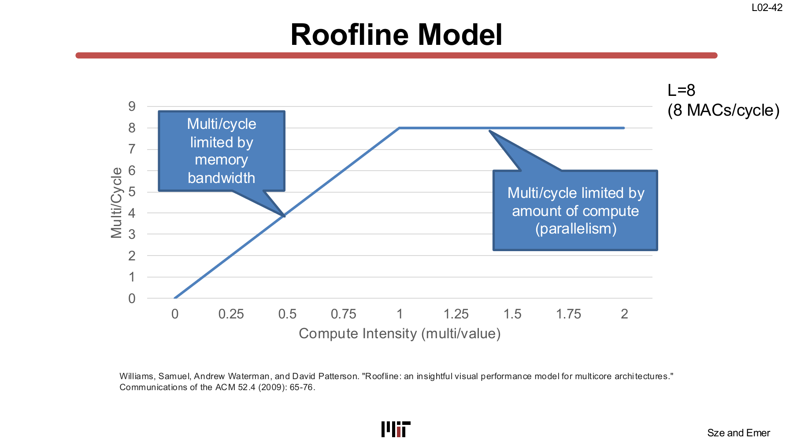

Roofline은 throughput 상한을 두 식의 최솟값으로 쓴다.

$$
\text{Throughput}
\le
\min(P_{\text{peak}}, BW \times \text{CI})
$$

- \(P_{\text{peak}}\): compute hardware가 낼 수 있는 최대 throughput
- \(BW\): memory bandwidth
- \(\text{CI}\): 한 value를 이동할 때 수행하는 multiplication 수

CI가 낮으면 \(BW \times \text{CI}\)가 먼저 걸린다. 그래프의 사선 구간, memory-bound 영역이다. CI가 충분히 높아지면 \(P_{\text{peak}}\)의 수평선에 닿고 compute-bound가 된다.

슬라이드 예시의 compute roof는 8 MACs/cycle이다. Memory-bound인 점에서 lane을 8개에서 16개로 늘려도 현재 throughput은 안 오른다. 수평 roof만 위로 이동한다. 반대로 reuse를 늘려 CI를 0.33에서 0.99로 옮기면 같은 bandwidth에서도 처리량이 올라간다.

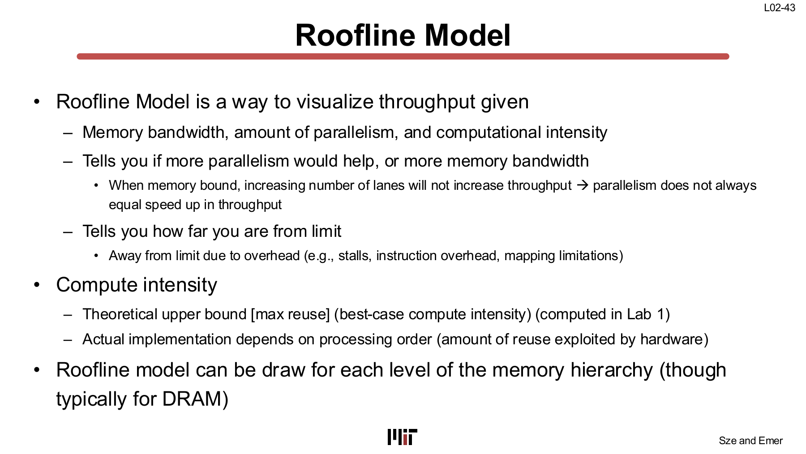

Roofline은 세 질문에 답한다.

1. 현재 구현이 compute와 memory 중 어디에 막혔는가
2. Parallelism과 bandwidth 중 어느 쪽을 늘려야 하는가
3. 현재 점이 주어진 roof에서 얼마나 떨어져 있는가

Roof 아래에 점이 멀리 떨어져 있으면 peak와 bandwidth 외의 손실이 있다는 뜻이다. Pipeline stall, instruction overhead, mapping limitation, load imbalance가 후보가 된다.

여기까지가 강의 앞부분의 설계 loop다. Workload의 best-case CI를 구하고, mapping의 achieved CI를 구하고, Roofline에서 병목을 본다. Architecture나 mapping을 바꾼 뒤 같은 분석을 다시 한다.

## CNN Workload Overview

CNN은 image classification 외에도 speech spectrogram, medical imaging, game play에 쓰인다. Input 형태는 달라도 local pattern을 filter로 훑고 feature hierarchy를 쌓는 구조는 같다.

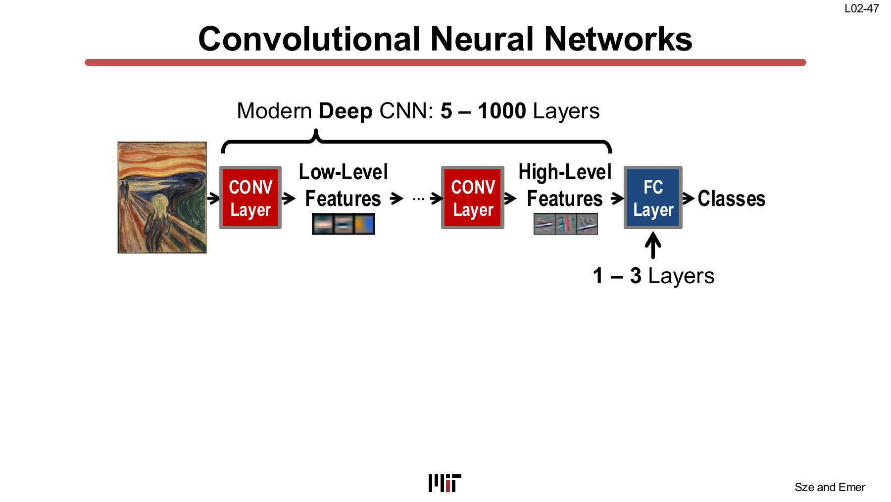

초기 convolution layer는 edge나 texture 같은 low-level feature를 잡는다. 깊은 layer로 갈수록 여러 pixel과 앞 layer의 feature가 합쳐져 object part나 class에 가까운 표현이 된다. 현대 CNN은 수십에서 수백 layer, 일부는 1,000 layer 가까이 깊어진다.

기본 block은 convolution 뒤 activation이다. Activation은 ReLU 같은 비선형 함수다. Fully connected layer도 linear operation 뒤 activation을 붙인다. 중간에는 normalization과 pooling이 선택적으로 들어간다.

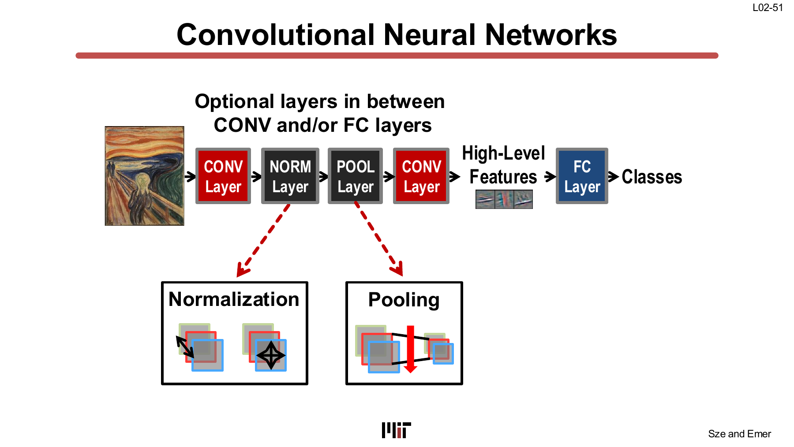

- **Convolution**: local receptive field에서 weighted sum
- **Activation**: element-wise nonlinearity
- **Normalization**: activation distribution 또는 channel 간 scale 조정
- **Pooling**: 공간 해상도 축소와 local aggregation
- **Fully connected**: 모든 input activation과 output neuron 사이의 dense connection

고전적인 deep CNN에서는 convolution이 전체 연산의 90% 이상을 차지하는 경우가 많다.

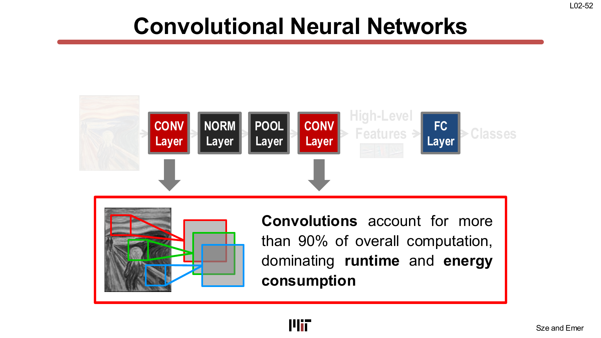

Pooling이나 activation도 실행해야 하지만 multiplication count, runtime, energy를 지배하는 쪽은 CONV다. L02가 convolution을 길게 다루고 나머지 layer를 짧게 넘기는 배경이다.

## 2D Convolution

### Element-wise Product and Partial Sum

가장 작은 경우부터 보면 input feature map 한 장과 filter 한 장이 있다. Input은 \(H \times W\), filter는 \(R \times S\)다.

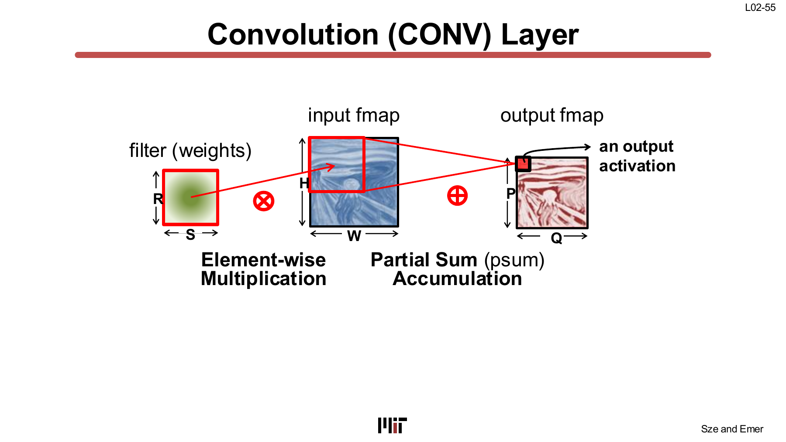

Filter를 input의 한 위치에 겹친 뒤 대응하는 원소끼리 곱한다. \(RS\)개의 product를 더하면 output activation 하나가 나온다. 이때 더해지는 중간값이 partial sum, 보통 `psum`으로 적는 값이다.

Filter window를 가로와 세로로 이동하면 output feature map이 채워진다. Filter가 보는 \(R \times S\) 영역은 그 output activation의 receptive field다.

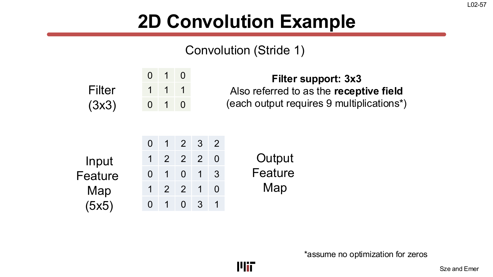

슬라이드 예시는 5×5 input과 3×3 filter를 사용한다. Stride 1, padding 0이면 output은 3×3이다.

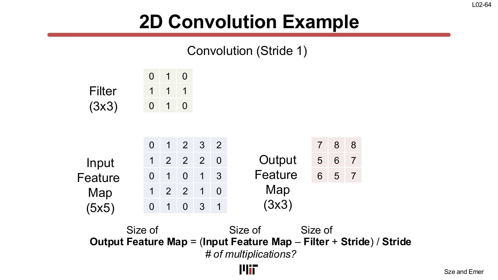

Output shape는

$$
P =
\left\lfloor
\frac{H-R}{U}
\right\rfloor + 1,
\qquad
Q =
\left\lfloor
\frac{W-S}{U}
\right\rfloor + 1
$$

이다. \(U\)는 stride다.

각 output point는 \(RS=9\) multiplications를 사용하고 output point는 \(PQ=9\)개이므로 총 multiplication은

$$
PQRS = 3 \times 3 \times 3 \times 3 = 81
$$

이다. Filter 안에 0이 있어도 hardware가 sparse zero skipping을 지원하지 않으면 multiplication 수에는 그대로 포함된다.

슬라이드 L02-58부터 L02-63은 window가 한 칸씩 움직이며 3×3 output을 채우는 animation이다. 위의 완성된 L02-64가 그 여섯 frame의 결과다.

### Stride

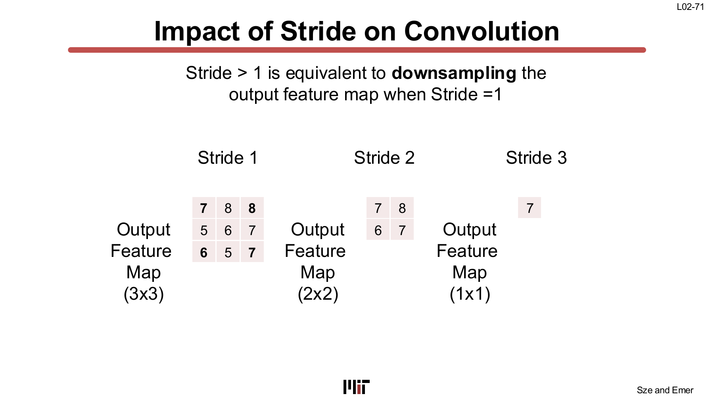

Stride는 filter window가 한 번에 움직이는 칸 수다.

- \(U=1\): output 3×3, 81 multiplications
- \(U=2\): output 2×2, 36 multiplications
- \(U=3\): output 1×1, 9 multiplications

Stride 2와 3의 결과는 stride 1 output을 각각 두 칸, 세 칸 간격으로 downsample한 것과 같다. L02-65부터 L02-70은 이 window 이동을 단계별로 보여주는 animation이다.

Stride가 커지면 output activation 수와 compute가 줄지만 spatial information도 더 거칠게 샘플링한다. Hardware 관점에서는 \(P,Q\)가 작아져 iteration space와 input reuse pattern이 함께 바뀐다.

### Zero Padding

Padding이 없으면 convolution을 지날 때마다 spatial size가 줄어든다.

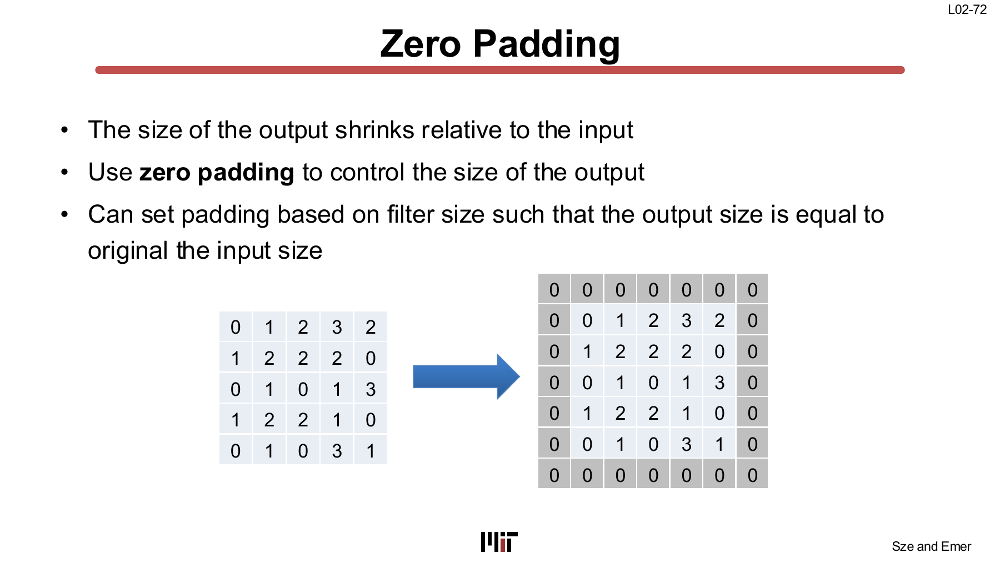

Input 둘레에 \(D\)칸의 zero padding을 넣으면 output shape는

$$
P =
\left\lfloor
\frac{H+2D-R}{U}
\right\rfloor + 1,
\qquad
Q =
\left\lfloor
\frac{W+2D-S}{U}
\right\rfloor + 1
$$

이 된다.

3×3 filter, stride 1에서 \(D=1\)이면 input과 output의 \(H,W\)가 같다. PyTorch의 `Conv2d`는 padding 기본값이 0이다. Integer 하나를 주면 상하좌우에 같은 padding을, tuple을 주면 height와 width 방향 값을 따로 지정한다.

Padding된 0도 dense implementation에서는 일반 input처럼 읽고 계산할 수 있다. Boundary condition을 별도로 처리하거나 zero를 암묵적으로 생성하면 불필요한 memory traffic을 줄일 수 있지만, control이 복잡해진다.

### Receptive Field

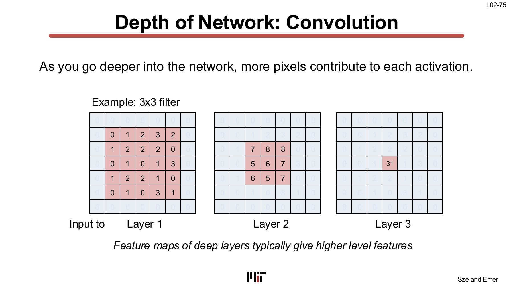

Layer가 깊어질수록 output activation 하나에 영향을 주는 원본 input 영역이 넓어진다. 3×3 filter, stride 1, dilation 1만 쌓으면 receptive field 변은 layer마다 2씩 늘어난다.

$$
r_L = 1 + 2L
$$

Layer 1은 3×3, layer 2는 5×5, layer 3은 7×7 영역을 본다. Stride나 dilation이 들어가면 증가 폭은 앞 layer의 sampling jump까지 곱해 계산해야 한다.

이 구조가 low-level feature에서 high-level feature로 올라가는 CNN 설명의 공간적 근거다. 동시에 accelerator 입장에서는 같은 input activation이 여러 이웃 output과 여러 layer에서 재사용될 가능성을 만든다.

딥러닝 library에서 `convolution`이라고 부르는 연산은 보통 filter를 뒤집지 않는 cross-correlation이다. 슬라이드의 index 식과 naïve loop도 그렇다. Filter가 학습되므로 모델 동작에는 문제가 없지만, 신호처리의 convolution 식과 코드를 비교할 때는 구분해야 한다.

## Multi-channel Convolution

### Tensor Shapes

실제 CNN input은 feature map 한 장이 아니다. RGB image부터 channel이 세 개이고, 중간 layer는 수십에서 수천 channel을 가진다.

한 output channel을 만들 때 filter는 모든 \(C\) input channel을 가로지른다. Output channel이 \(M\)개라면 그런 filter가 \(M\)개 있다.

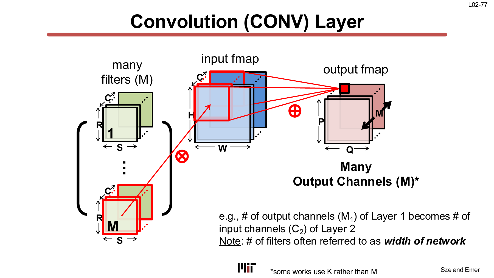

Batch까지 붙으면 같은 filter set을 \(N\)개의 input feature map에 적용한다.

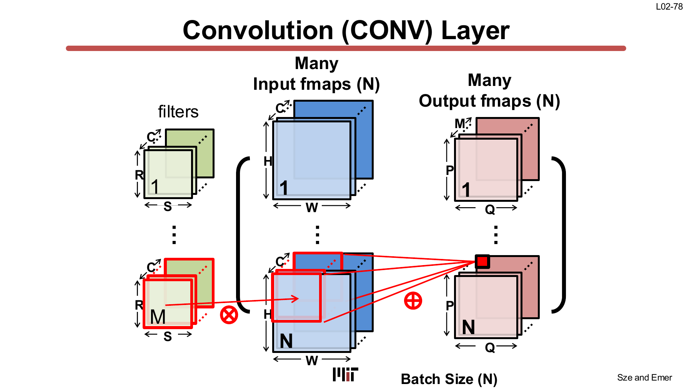

강의의 symbol은 다음과 같다.

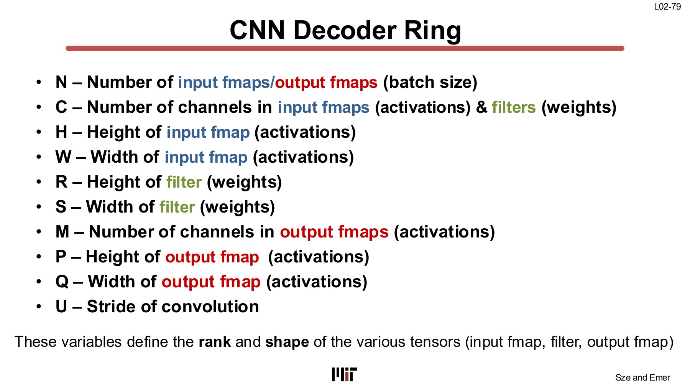

| Symbol | Rank shape |
| --- | --- |
| \(N\) | Batch size |
| \(C\) | Input channels |
| \(H,W\) | Input height, width |
| \(R,S\) | Filter height, width |
| \(M\) | Output channels, filter 수 |
| \(P,Q\) | Output height, width |
| \(U\) | Stride |

Tensor shape로 묶으면

$$
I[N,C,H,W]
$$

$$
F[M,C,R,S]
$$

$$
O[N,M,P,Q]
$$

$$
B[M]
$$

이다. \(I\)는 input activation, \(F\)는 filter weight, \(O\)는 output activation, \(B\)는 output channel마다 하나씩 붙는 bias다.

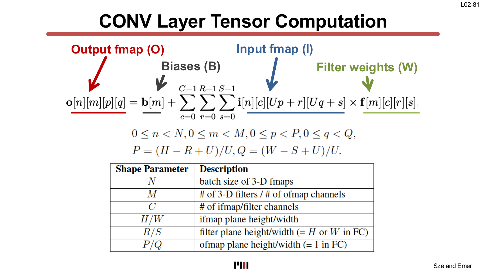

Weight size는 \(MCRS\), input activation size는 \(NCHW\), output activation size는 \(NMPQ\)다. 이 세 크기는 compute뿐 아니라 각 memory level에 필요한 capacity를 정한다.

### Convolution Einsum

전체 convolution은 한 줄로 쓸 수 있다.

$$
O_{n,m,p,q} =
B_m +
I_{n,c,Up+r,Uq+s}
F_{m,c,r,s}
$$

\(n,m,p,q\)는 output에 남고 \(c,r,s\)는 reduction된다. Input의 spatial coordinate가 단순 \(p,q\)가 아니라 \(Up+r,Uq+s\)인 부분에 stride와 sliding window가 들어 있다.

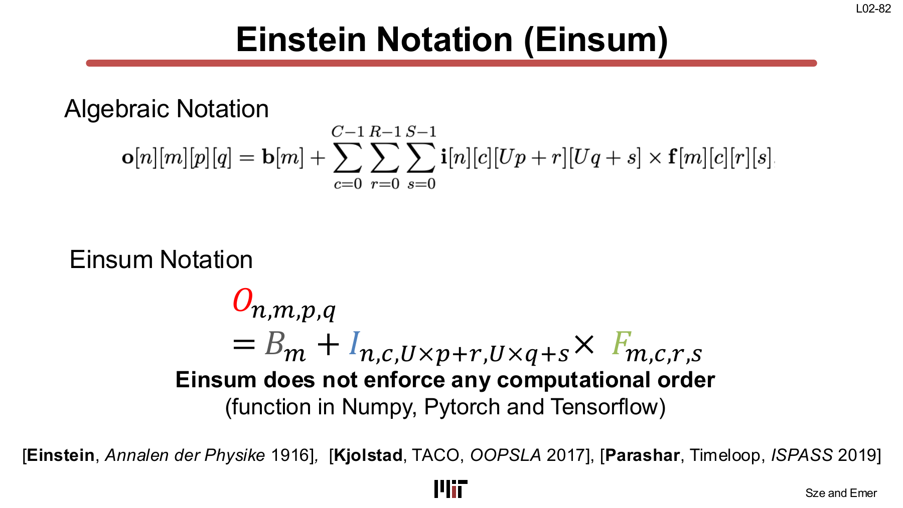

Multiplication count는 iteration space의 크기와 같다.

$$
N_{\text{mul}} = NMPQCRS
$$

Output 하나당 \(CRS\)개의 product가 reduction되고, 그런 output이 \(NMPQ\)개 있다.

각 tensor의 reuse 방향도 식에서 읽을 수 있다.

- Filter \(F_{m,c,r,s}\): \(n,p,q\) 방향으로 재사용
- Input \(I_{n,c,Up+r,Uq+s}\): 여러 \(m\)과 겹치는 window 사이에서 재사용
- Output \(O_{n,m,p,q}\): \(c,r,s\) reduction 동안 partial sum으로 재사용
- Bias \(B_m\): 모든 \(n,p,q\)에 재사용

어느 reuse를 local register와 buffer에서 살릴지가 dataflow다.

### Seven-loop Implementation

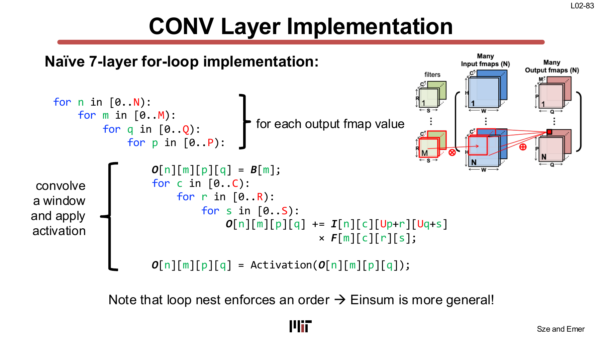

```python
for n in range(N):
    for m in range(M):
        for q in range(Q):
            for p in range(P):
                O[n, m, p, q] = B[m]
                for c in range(C):
                    for r in range(R):
                        for s in range(S):
                            O[n, m, p, q] += (
                                I[n, c, U*p+r, U*q+s]
                                * F[m, c, r, s]
                            )
                O[n, m, p, q] = activation(O[n, m, p, q])
```

이 loop는 \(s \rightarrow r \rightarrow c \rightarrow p \rightarrow q \rightarrow m \rightarrow n\) 순서를 강제한다. \(O\)는 inner \(c,r,s\) 동안 stationary라 partial sum traffic을 줄이기 좋다. 대신 filter와 input의 장거리 reuse는 cache나 별도 tiling이 없으면 놓친다.

Einsum에는 이 순서가 없다. 이후 mapping 단계에서 loop interchange, tiling, spatial unrolling을 적용한다. 같은 CONV 식에서 weight-stationary, output-stationary, row-stationary dataflow가 갈라지는 지점이다.

## Fully Connected Layer

### Connectivity

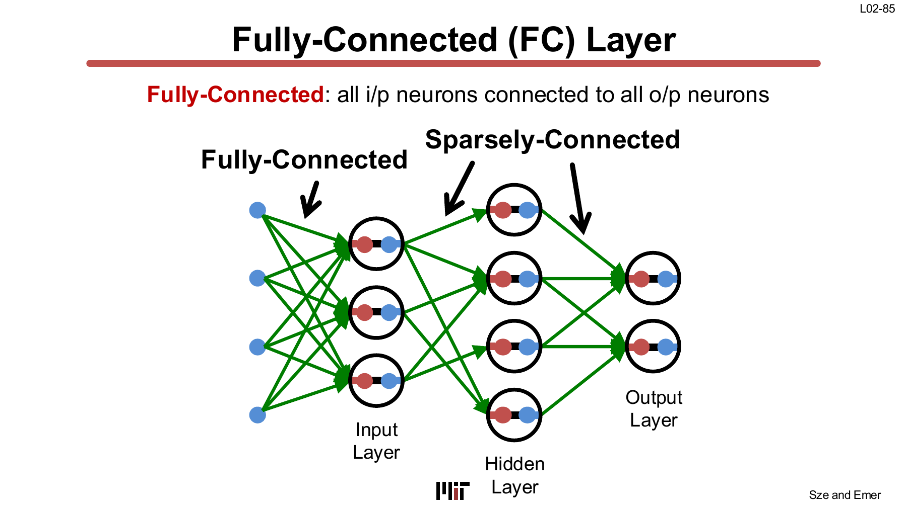

Fully connected layer에서는 모든 input neuron이 모든 output neuron과 weight로 연결된다. Input 수가 \(K\), output 수가 \(M\)이면 weight가 \(MK\)개다.

그림의 sparsely connected variant는 일부 edge만 남긴다. Pruning 뒤의 FC가 이 형태가 될 수 있다. 다만 sparse weight를 저장하고 0을 건너뛰는 index·control cost까지 포함해야 실제 이득을 판단할 수 있다.

### FC as Convolution

CONV 관점에서는 filter가 input feature map 전체를 덮는 경우가 FC다.

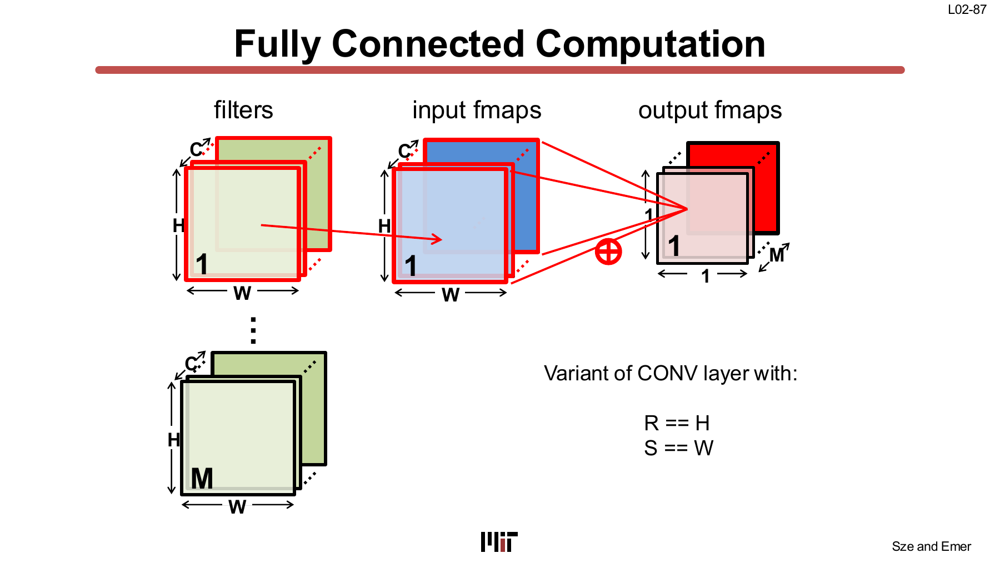

$$
R=H,\qquad S=W,\qquad P=Q=1
$$

Batch가 하나일 때 식은

$$
O_m = I_{c,h,w} F_{m,c,h,w}
$$

다. \(c,h,w\)가 모두 reduction rank다. Output \(m\) 하나는 input feature map 전체와 해당 filter 전체의 dot product다.

### Flattening

\(C,H,W\) 세 rank를 \(CHW\) 하나로 flatten할 수 있다.

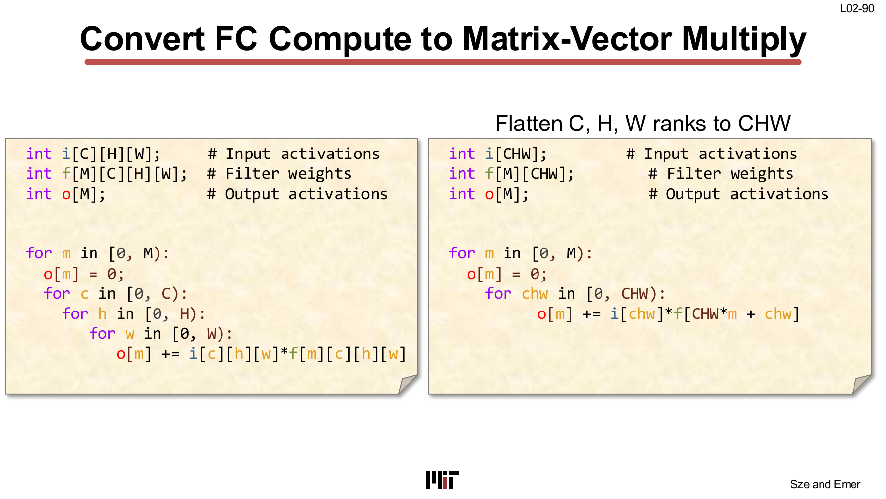

Row-major layout에서 coordinate 변환은

$$
chw = H W c + W h + w
$$

이다.

$$
I_{c,h,w} \rightarrow I_{chw}
$$

$$
F_{m,c,h,w} \rightarrow F_{m,chw}
$$

따라서 FC Einsum은

$$
O_m = I_{chw} F_{m,chw}
$$

로 바뀐다.

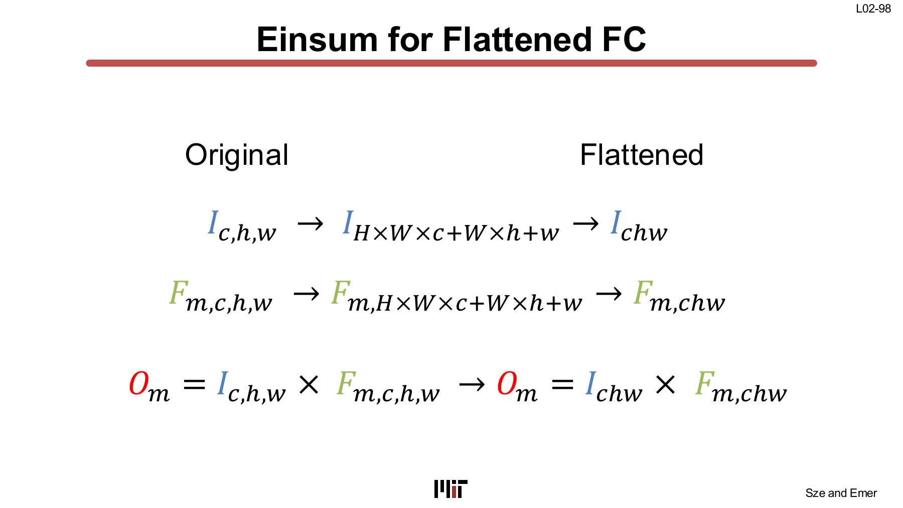

Flattening은 연산 수를 바꾸지 않는다. 세 개의 nested reduction loop를 하나의 linear loop로 다시 index한 것이다. Memory layout이 이 flatten 순서와 맞으면 연속 access가 되고, 맞지 않으면 transpose나 strided access가 필요하다.

### GEMV and GEMM

Batch 하나의 FC는 matrix-vector multiplication이다.

$$
\underbrace{F[M,CHW]}_{\text{matrix}}
\times
\underbrace{I[CHW]}_{\text{vector}} =
\underbrace{O[M]}_{\text{vector}}
$$

슬라이드 L02-92부터 L02-97은 \(chw\)를 증가시키며 partial sum을 만들고, \(m\)을 바꿔 다음 output을 계산하는 과정을 animation으로 보여준다.

Batch \(N\)이 붙으면 input과 output에 \(n\) rank가 추가된다.

$$
O_{n,m} = I_{n,chw} F_{m,chw}
$$

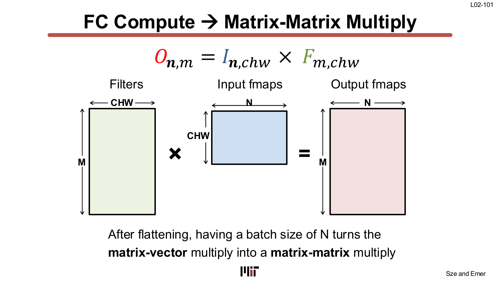

이제 matrix-matrix multiplication이다.

$$
F[M,K] \times I[K,N] = O[M,N]
$$

여기서 \(K=CHW\)다.

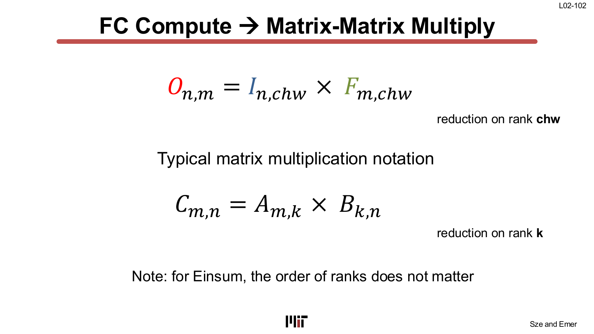

강의의 FC 식은 \(O_{n,m}\), 일반적인 matmul 식은 \(C_{m,n}=A_{m,k}B_{k,n}\)로 rank 순서가 달라 보인다. Einsum에서는 rank 이름이 같게 연결되고 reduction rank가 일치하면 계산 관계는 같다. 실제 memory layout에서 \(N\)과 \(M\) 중 어느 rank가 연속인지는 별도 문제다.

Batch는 hardware 효율에도 영향을 준다. GEMV는 weight matrix를 읽어 vector 하나에 쓰고 끝나므로 weight reuse가 적고 memory-bound가 되기 쉽다. GEMM은 같은 weight tile을 \(N\)개의 input에 재사용할 수 있어 compute intensity가 높아진다.

CONV도 `im2col`로 input window를 펼치면 GEMM 형태로 바꿀 수 있다. 실제로 큰 im2col matrix를 만들면 중복 activation 때문에 memory footprint가 커진다. 고성능 library가 implicit GEMM이나 convolution 전용 kernel을 쓰는 이유다.

## Slide Coverage

| Slides | Content |
| --- | --- |
| L02-1 ~ 3 | 강의 범위, workload-to-hardware framing |
| L02-4 ~ 8 | 설계 방법론, architecture/workload 분리, TeAAL concerns |
| L02-9 ~ 14 | Tensor rank·shape·size, matrix multiplication, Einsum |
| L02-15 ~ 20 | Matrix-vector ODE, iteration space, reduction |
| L02-21 ~ 26 | Operation count, best-case traffic와 CI |
| L02-27 ~ 41 | Loop traversal, stationarity, achieved traffic와 CI |
| L02-42 ~ 44 | Roofline, implementation comparison, optimization loop |
| L02-45 ~ 52 | CNN application, depth, CONV/FC/NORM/POOL |
| L02-53 ~ 64 | 2D convolution과 stride-1 animation |
| L02-65 ~ 71 | Stride-2/3 animation과 downsampling |
| L02-72 ~ 75 | Zero padding, PyTorch convention, receptive field |
| L02-76 ~ 83 | Channel·batch tensor, decoder ring, CONV Einsum과 7중 loop |
| L02-84 ~ 91 | FC connectivity, CONV 관점, flattening |
| L02-92 ~ 99 | GEMV partial-sum animation, flattened FC Einsum |
| L02-100 ~ 102 | Batch FC, GEMM, conventional matmul notation |

## References

- [MIT 6.5930/1 Spring 2026 L02 slides](https://csg.csail.mit.edu/6.5930/lectures/L02-Overview_on_DNN_components.pdf)
- [TeAAL: A Declarative Framework for Modeling Sparse Tensor Accelerators, MICRO 2023](https://people.csail.mit.edu/emer/media/papers/2023.10.micro.teaal.pdf)
- [TeAAL and HiFiber tutorial](https://teaal.csail.mit.edu/tutorials/2024.micro-teaal/index.html)
- [Roofline: An Insightful Visual Performance Model for Multicore Architectures](https://doi.org/10.1145/1498765.1498785)
- [Efficient Processing of Deep Neural Networks, Sze et al.](https://doi.org/10.1007/978-3-031-01766-7)
