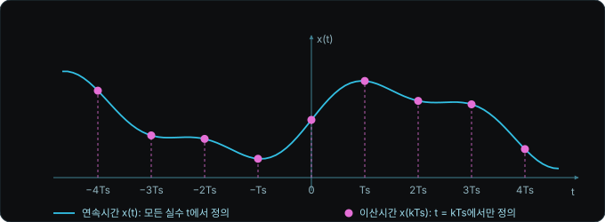
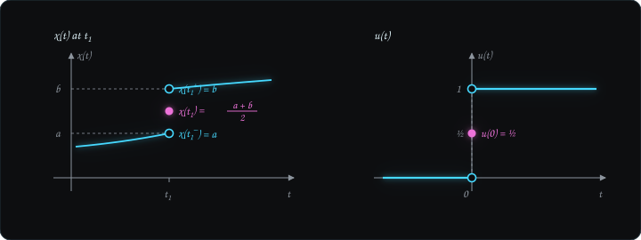
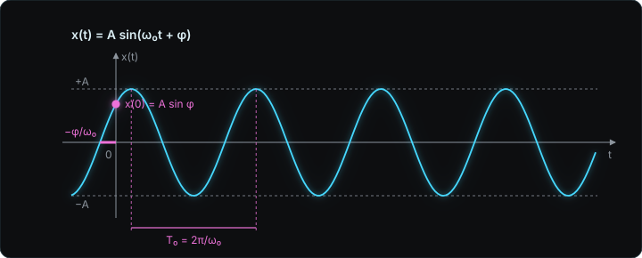
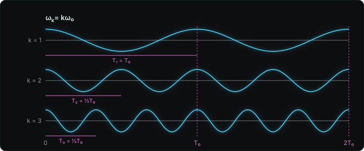
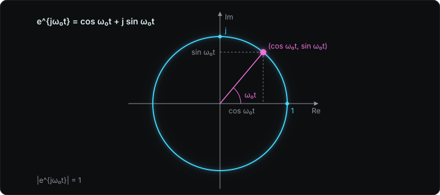

> 기준 자료: Samir S. Soliman, Mandyam D. Srinath, *Continuous and Discrete Signals and Systems*, 2nd ed., Prentice Hall, 1998. 1장 Representing Signals.

이 과목은 독립변수가 시간 하나인 연속시간 신호를 다루고, 이산시간 신호는 DSP[^dsp] 과목으로 넘긴다. 아래는 교재 1.1절부터 1.3절, 강의 슬라이드[^slides] 2번부터 9번에 해당한다.

## 신호의 정의

신호(signal)는 정보를 전달하기 위한, 검출 가능한 물리량이다. 정의를 이루는 조건은 세 가지다.

1. 물리량이거나 물리량을 나타내는 변수다. 음성의 진폭, 화면 픽셀의 밝기, 회로의 전류가 여기에 든다.
2. 검출 가능하다[^detectable]. 수신 측이 그 물리량을 측정할 수 있어야 한다.
3. 정보를 담고 있다. 검출은 되지만 정보가 없는 물리량은 신호로 보지 않는다.

수학적으로 신호는 독립변수(함수의 입력)에 대한 함수로 쓴다. 독립변수의 개수[^variables]는 신호마다 다르다.

| 신호 | 표기 | 독립변수 |
|---|---|---|
| 음성, 회로의 전류 $i(t)$, 전압 $v(t)$ | $A(t)$ | 시간 $t$ 하나 |
| 이미지 | $p(x, y)$ | 좌표 $x, y$ 둘 |
| 전기장 | $E(x, y, z, t)$ | 공간 좌표 셋과 시간 |

이 과목은 독립변수가 시간 $t$ 하나인 신호 $x(t)$만 다룬다. 이미지 $p(x, y)$는 영상처리 과목의 대상이고, 동영상은 $p(x, y, t)$로 시간이 하나 더 붙는다.

## 연속시간 신호와 이산시간 신호

연속시간(continuous-time) 신호는 독립변수가 실수 구간 전체에서 정의된 신호다. 정의문에서 continuous라는 단어는 함수값이 아니라 독립변수를 수식한다[^axis]. 라디오 신호 $v(t)$는 시간 $t$가, 대기압 $p(h)$는 고도 $h$가 독립변수이고, 둘 다 독립변수가 실수 전체를 훑으므로 연속시간 신호다. 고도처럼 시간이 아닌 독립변수라도 연속이면 같은 분류에 든다.

이산시간(discrete-time) 신호는 독립변수가 이산값만 갖는 신호다. 연속시간 신호 $x(t)$에서 $t = kT_s$인 지점의 값만 뽑으면 $x(kT_s)$가 된다. $T_s$[^sampling]는 고정된 양의 실수이고 $k$는 정수($0, \pm 1, \pm 2, \dots$)다. $T_s = 2$면 $t = 0, \pm 2, \pm 4, \dots$에서만 값이 정의된다. 아래 그림에서 cyan 곡선이 모든 실수 $t$에서 값을 갖는 $x(t)$이고, magenta 점이 $t = kT_s$에서만 값을 갖는 $x(kT_s)$다. 두 신호를 구분할 때는 함수값의 높이가 아니라 점이 $t$축의 어디에 찍혀 있는지를 본다.

## 함수의 연속성

신호는 함수이므로 신호의 연속성은 함수의 연속성을 그대로 따른다. $x(t)$가 $t = t_1$에서 연속이려면 두 조건을 순서대로 만족해야 한다.

1. 좌극한 $x(t_1^-)$와 우극한 $x(t_1^+)$가 같다. 이때 $t_1$에서 극한이 존재한다.
2. 그 극한값이 함수값 $x(t_1)$과 같다.

모든 $t$에서 연속이면 continuous 신호다. 불연속점이 유한 개면 piecewise continuous[^piecewise](조각 연속) 신호다. 불연속점의 개수가 무한이면 piecewise continuous가 아니다.

## 불연속점에서의 함수값

일반 수학에서 불연속점의 함수값은 정의하지 않는다. 이 교재는 불연속점 $t_1$에서의 함수값을 좌극한과 우극한의 평균[^average]으로 정의한다.

$$
x(t_1) = \frac{1}{2}\left[x(t_1^+) + x(t_1^-)\right]
$$

단위계단함수(unit step function) $u(t)$는 $t < 0$에서 0, $t > 0$에서 1이다. $t = 0$에서 좌극한 0과 우극한 1이 다르므로 극한이 없고, continuous가 아니라 piecewise continuous다. 평균 정의를 적용하면 $u(0) = 1/2$이다. 아래 그림의 왼쪽에서 빈 원 두 개가 좌극한 $a$와 우극한 $b$이고, 채운 점이 교재가 정의한 함수값 $(a + b)/2$다. 오른쪽에 같은 규칙을 적용하면 $a = 0$, $b = 1$이라 $u(0) = 1/2$이다.

예제로 $x(t) = 2u(t - 1) - u(t - 3)$을 보면 $t < 1$에서 0, $1 < t < 3$에서 2, $t > 3$에서 1이다. 불연속점은 $t = 1, 3$이고, $x(1) = (0 + 2)/2 = 1$, $x(3) = (2 + 1)/2 = 3/2$다. 불연속점이 두 개이므로 piecewise continuous다.

## 사각 펄스와 펄스 트레인

사각 펄스(rectangular pulse) $\mathrm{rect}(t/\tau)$는 $|t| < \tau/2$에서 1, $|t| > \tau/2$에서 0이다.

$$
\mathrm{rect}(t/\tau) =
\begin{cases}
1, & |t| < \tau/2 \\
0, & |t| > \tau/2
\end{cases}
$$

높이는 1로 고정이고 파라미터 $\tau$[^tau]가 밑변의 폭을 정한다. 불연속점은 $t = \pm\tau/2$ 두 개이므로 piecewise continuous이고, $t$가 실수 전체에서 정의되므로 연속시간 신호다.

$\mathrm{rect}(t/\tau)$를 일정한 간격으로 시간 이동시켜 더하면 펄스 트레인(pulse train)[^train]이 된다. 폭 1인 펄스가 간격 2로 반복되는 트레인은 다음과 같고 $n$은 모든 정수다.

$$
x(t) = \sum_{n=-\infty}^{\infty} \mathrm{rect}(t - 2n)
$$

불연속점은 $t = 2n \pm 1/2$에 무한 개 있으므로 continuous도 piecewise continuous도 아니다. $t$는 실수 전체에서 정의되므로 연속시간 신호다. 펄스를 유한 개로 자르면 불연속점이 유한 개가 되어 piecewise continuous가 된다.

## continuous와 continuous-time의 구분

두 용어는 서로 다른 축의 성질을 가리킨다.

| 용어 | 축 | 판정 기준 |
|---|---|---|
| continuous / piecewise continuous | 세로축(함수값 $x$) | 극한 조건이 깨지는 점의 개수 |
| continuous-time / discrete-time | 가로축(독립변수 $t$) | $t$가 실수 구간 전체에서 정의되는가, $t = kT_s$에서만 정의되는가 |

| 신호 | 함수값 성질 | 독립변수 성질 |
|---|---|---|
| $\sin t$ | continuous | continuous-time |
| 사각 펄스, $u(t)$ | piecewise continuous | continuous-time |
| 무한 펄스 트레인 | 불연속점 무한 개, piecewise continuous 아님 | continuous-time |
| $x(kT_s)$ | 함수값 성질은 따지지 않음 | discrete-time |

불연속점이 몇 개든 $t$축이 실수 전체이면 연속시간 신호다. 이 과목의 신호는 전부 연속시간 신호이고, 그 안에서 continuous인지 piecewise continuous인지만 따진다.

## 연습 문제 1

$x(t) = 3\,\mathrm{rect}\!\left(\frac{t - 4}{2}\right)$에 대해 다음을 구한다.

(a) 값이 3인 $t$ 구간
(b) 불연속점
(c) 교재의 정의에 따른 불연속점에서의 함수값
(d) $T_s = 1$로 샘플링한 $x(kT_s)$에서 값이 0이 아닌 정수 $k$ 전부

풀이. $\mathrm{rect}(t/\tau)$의 정의에서 $\tau = 2$이고 $t$가 $t - 4$로 바뀌었으므로 $|t - 4| < 1$, 즉 $3 < t < 5$에서 값이 3이다. 불연속점은 $t = 3, 5$다. 두 점에서 좌극한과 우극한이 0과 3이므로 $x(3) = x(5) = (0 + 3)/2 = 3/2$다. $T_s = 1$이면 $t = k$이고, $k = 3, 4, 5$에서 값이 각각 $3/2, 3, 3/2$이며 나머지 $k$에서는 0이다.

## 주기 신호와 기본 주기

주기(periodic) 신호는 어떤 양수 $T$에 대해 모든 $t$에서 다음을 만족하는 연속시간 신호다.

$$
x(t) = x(t + nT), \qquad n = 1, 2, 3, \dots
$$

조건이 모든 $t$에 대해 성립해야 하므로 신호는 $-\infty$부터 $+\infty$까지 존재한다고 가정한다[^infinite]. $T$가 주기이면 $2T$, $3T$, $4T$도 주기다. 조건을 만족하는 가장 작은 양수 $T$를 기본 주기(fundamental period)[^fundamental]라고 하고 $T_0$로 쓴다. 기본 주기가 2인 신호는 4와 6도 주기로 갖는다. 조건을 만족하는 $T$가 없는 신호는 비주기(aperiodic) 신호다.

## 사인파

실수값 사인파는 세 파라미터로 정해진다.

$$
x(t) = A\sin(\omega_0 t + \phi)
$$

$A$는 진폭이고 $x(t)$는 $-A$와 $A$ 사이에 있다. $\omega_0$는 각주파수(radian frequency)이고 단위는 rad/s다. $\phi$는 초기 위상[^phase]이고 단위는 rad다. 각주파수와 주파수 $f_0$(단위 Hz)[^hertz]의 관계, 그리고 기본 주기는 다음과 같다.

$$
\omega_0 = 2\pi f_0, \qquad T_0 = \frac{1}{f_0} = \frac{2\pi}{\omega_0}
$$

아래 그림에서 $A$는 세로 범위, $T_0$는 같은 위상인 두 점 사이의 가로 거리, $\phi$는 $t = 0$에서 곡선이 시작하는 높이 $A\sin\phi$를 정한다.

## 하모닉

기본 각주파수 $\omega_0$에 대해 $k$번째 하모닉(harmonic)[^harmonic]은 각주파수가 $k\omega_0$인 사인파다. $k$가 하모닉 번호이고 1부터 시작한다.

$$
\omega_k = k\,\omega_0, \qquad f_k = k f_0, \qquad T_k = \frac{2\pi}{k\,\omega_0} = \frac{T_0}{k}
$$

$\omega_0 = 2\pi$이면 첫째, 둘째, 셋째 하모닉의 각주파수는 $2\pi$, $4\pi$, $6\pi$이고 주기는 $1$, $1/2$, $1/3$ s다. 아래 그림에서 $k$가 커질수록 같은 $T_0$ 안에 $k$번 진동하고, $t = T_0$에서 세 곡선이 동시에 출발점으로 돌아온다. 그래서 하모닉을 몇 개 더하든 합의 기본 주기는 $T_0$다.

사인파 여러 개의 합이 주기 신호인지 판정하고 기본 주기를 구할 때는 각주파수만 본다. 합의 기본 각주파수는 각 항 각주파수의 최대공약수[^gcdnote]이고, 각 항의 하모닉 번호는 그 항의 각주파수를 $\omega_0$로 나눈 값이다.

$$
x(t) = \cos(4\pi t) + \sin(6\pi t): \quad \omega_0 = 2\pi, \quad T_0 = 1 \text{ s}, \quad k = 2, 3
$$

각주파수의 비가 무리수이면 최대공약수가 없고 합은 비주기 신호다.

## 조화 관계 복소지수

하모닉을 사인파 대신 복소지수[^complex]로 쓰면 다음 집합이 된다.

$$
\phi_k(t) = e^{\,jk\omega_0 t}, \qquad k = 0, \pm 1, \pm 2, \dots
$$

$k \neq 0$이면 각주파수 $|k|\omega_0$, 기본 주기 $2\pi/(|k|\omega_0)$인 주기 신호다. 절댓값은 $k$가 음수일 때 각주파수와 주기를 양수로 두기 위한 것이고, $k$가 양수이면 하모닉의 식과 같다. 모든 $\phi_k(t)$는 $T_0 = 2\pi/\omega_0$를 공통 주기로 갖는다. $k = 0$[^kzero]이면 $\phi_0(t) = 1$로 상수이고 주기가 정의되지 않는다.

오일러 공식으로 실수부와 허수부를 나누면 복소평면(가로축 실수부, 세로축 허수부) 위의 점이 된다.

$$
e^{\,j\omega_0 t} = \cos\omega_0 t + j\sin\omega_0 t
$$

시각 $t$의 점은 $(\cos\omega_0 t, \sin\omega_0 t)$이고 크기는 $\sqrt{\cos^2 + \sin^2} = 1$이다. $t = 0$에서 $(1, 0)$에서 출발해 $t$가 늘면 반시계 방향으로 돌고, $\omega_0 t = 2\pi$에서 출발점으로 돌아온다. 모든 $t$에서 반지름 1인 단위원 위에 있으므로 극좌표로는 크기 1, 각도 $\omega_0 t$다.

## 연습 문제 2

$x(t) = 2\cos(6\pi t) + \sin(9\pi t)$에 대해 다음을 구한다.

(a) 기본 각주파수 $\omega_0$와 기본 주기 $T_0$
(b) 각 항의 하모닉 번호
(c) 첫째 하모닉의 각주파수 $\omega_1$과 주기 $T_1$

풀이. 각주파수 $6\pi$와 $9\pi$의 최대공약수는 $3\pi$이므로 $\omega_0 = 3\pi$ rad/s, $T_0 = 2\pi/3\pi = 2/3$ s다. $6\pi/3\pi = 2$, $9\pi/3\pi = 3$이므로 $2\cos(6\pi t)$는 둘째, $\sin(9\pi t)$는 셋째 하모닉이다. 첫째 하모닉은 $\omega_1 = \omega_0 = 3\pi$ rad/s, $T_1 = T_0 = 2/3$ s다.

[^dsp]: Digital Signal Processing, 디지털 신호처리. 이산시간 신호의 샘플링, 이산 푸리에 변환, z 변환을 다루는 후속 과목이다.

[^slides]: 슬라이드 번호는 강의 슬라이드 "1. Representing Signals"(임승찬, 홍익대학교 전자전기공학부)의 우측 상단 인쇄 번호다.

[^detectable]: 검출 가능하다는 것은 측정 장치나 감각 기관이 그 양을 읽어낼 수 있다는 뜻이다. 음성은 귀와 마이크가, 화면의 밝기는 눈과 카메라가, 전류는 전류계가 검출한다.

[^variables]: 독립변수의 개수가 신호의 차원이다. 음성은 시간 하나, 이미지는 두 좌표, 동영상은 두 좌표와 시간, 전기장은 공간 세 좌표와 시간이다. 전자기학이 벡터 미적분과 여러 좌표계를 요구하는 이유가 이 독립변수의 수다.

[^axis]: 판정 기준은 가로축이다. 함수값이 세로축에서 아무리 많이 끊겨도 정의역이 실수 전체이면 연속시간이고, 정의역이 $kT_s$처럼 띄엄띄엄이면 이산시간이다.

[^sampling]: $T_s$는 sampling period(샘플링 주기)이고, 역수 $f_s = 1/T_s$가 sampling frequency(샘플링 주파수, 초당 샘플 수)다. 교재는 $T_s$를 "a fixed positive real number"라고만 적는다.

[^piecewise]: 교재 원문은 "piecewise continuous if it has only finite discontinuities"다. 이 수업은 finite를 불연속점의 개수로 읽는다. 수학 문헌에서는 각 불연속점의 점프 크기가 유한하다는 뜻으로도 쓰이고, 그 해석에서는 무한 펄스 트레인도 piecewise continuous에 든다.

[^average]: 일반 해석학은 불연속점의 값을 정의하지 않고 비워 둔다. 좌우극한의 평균으로 정하는 약속은 푸리에 급수가 점프 불연속점에서 수렴하는 값과 같아서, 뒤 장에서 급수와 원 신호가 모든 점에서 일치하게 만든다.

[^tau]: $\tau = 10^8$이면 밑변이 $-5 \times 10^7$부터 $5 \times 10^7$까지이고, $\tau = 10^{-7}$이면 $\pm 5 \times 10^{-8}$이며, 높이는 두 경우 모두 1이다. 폭을 0으로 보내면서 높이를 $1/\tau$로 키워 넓이 1을 유지한 극한이 슬라이드 26번의 단위 임펄스다.

[^train]: 슬라이드 5번의 트레인은 폭 1인 펄스가 간격 2로 반복되어 $t = 0, \pm 1, \pm 2, \dots$에서 불연속이다. 여섯 개까지 그린 그림은 불연속점이 12개라 piecewise continuous이고, 무한히 이어지는 신호는 불연속점이 무한 개라 piecewise continuous가 아니다.

[^infinite]: 유한 구간만 그린 그래프로는 주기 여부를 판정할 수 없다. 그래프 밖에서 같은 모양이 계속된다는 가정이 있어야 $x(t) = x(t + T)$를 모든 $t$에 대해 말할 수 있다.

[^fundamental]: 기본 주기의 역수 $f_0 = 1/T_0$가 기본 주파수(fundamental frequency)이고, $\omega_0 = 2\pi/T_0$가 기본 각주파수다. 아래첨자 0은 하모닉 번호가 아니라 기본이라는 표시이며, 첫째 하모닉의 주기 $T_1$과 $T_0$는 같은 값이다.

[^phase]: $\phi$는 곡선을 시간축에서 $-\phi/\omega_0$만큼 옮긴다. $\phi > 0$이면 왼쪽으로 옮겨져 $t = 0$에서 이미 $A\sin\phi$만큼 올라가 있다.

[^hertz]: Hz는 1/s이고 1초당 반복 횟수다. 각주파수 $\omega_0$는 1초당 진행하는 각도(rad/s)이므로, 한 바퀴 $2\pi$ rad으로 나누면 1초당 바퀴 수 $f_0$가 된다. 두 단위는 $2\pi$를 곱했는지로만 다르다.

[^harmonic]: 정수배로 정의하는 이유는 공통 주기 때문이다. $T_k = T_0/k$는 $T_0$의 약수이므로 하모닉을 어떻게 더해도 $T_0$가 합의 주기가 된다. 2.5배처럼 정수가 아닌 배수는 $T_0$를 공통 주기로 갖지 않는다. 3장 푸리에 급수는 주기 신호를 이 하모닉들의 가중합으로 쓴다.

[^gcdnote]: 각주파수에 $\pi$가 붙어 있으면 $\pi$를 떼고 정수의 최대공약수를 구한 뒤 다시 붙인다. $4\pi$와 $6\pi$는 4와 6의 최대공약수 2에 $\pi$를 붙여 $2\pi$다. 주기 쪽으로 계산하면 두 주기의 최소공배수가 되고 결과는 같다.

[^complex]: 사인파는 함수값이 실수(real-valued)이고 복소지수는 함수값이 복소수(complex-valued)다. 복소지수 하나에 $\cos$과 $\sin$이 실수부와 허수부로 같이 들어 있어서, 3장 푸리에 급수는 $\cos$과 $\sin$ 대신 $e^{jk\omega_0 t}$를 항으로 쓴다. 음수 $k$를 허용하는 이유도 $e^{jk\omega_0 t}$와 $e^{-jk\omega_0 t}$를 더해 실수 $\cos$을 만들기 위해서다.

[^kzero]: $k = 0$을 넣으면 지수가 0이라 $e^0 = 1$이다. 상수는 어떤 $T$에 대해서도 $x(t) = x(t + T)$를 만족하므로 가장 작은 양의 주기를 정할 수 없고, 교재는 주기 성질을 $k \neq 0$에만 적용한다.
